# BuilderGate

**[English](#english) · [한국어](#한국어)**

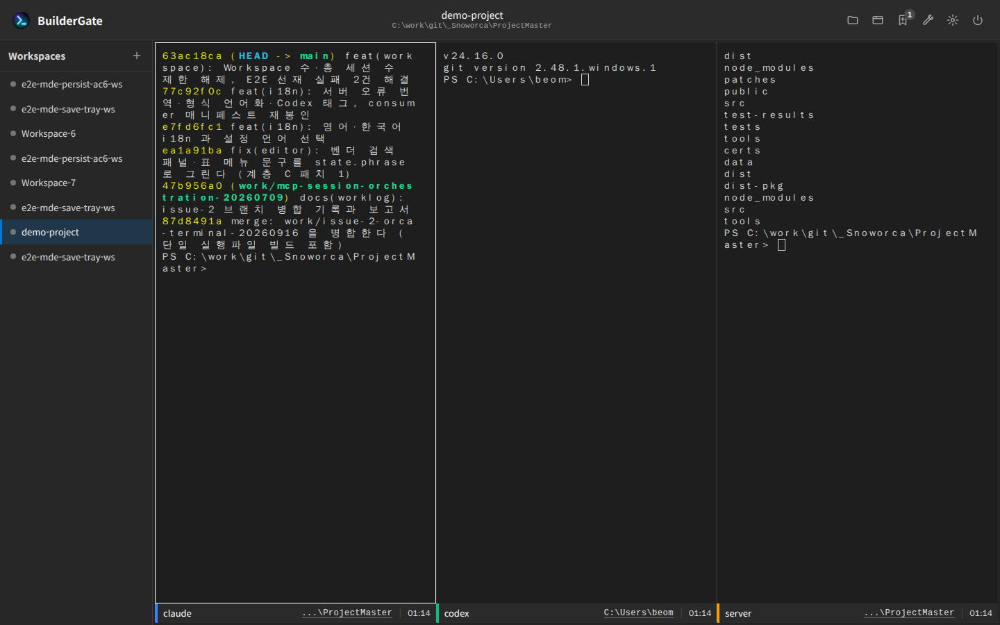

---

<a id="english"></a>

## English

> BuilderGate is under active development. APIs, configuration and UI may change without notice.

BuilderGate is a web-based workspace for running many coding agents (Claude Code, Codex, Hermes, OpenCode, …) in parallel. One browser tab manages many shell sessions, lets agents talk to each other over MCP, and gives you a file explorer and a markdown/code editor next to the terminals.

### Contents

- [Features](#features)
- [Download](#download)
- [Run](#run)
- [Command-line options](#command-line-options)
- [First login and password](#first-login-and-password)
- [Configuration](#configuration)
- [User guide](#user-guide)
  - [Workspaces, tabs and grid](#workspaces-tabs-and-grid)
  - [Terminal context menu](#terminal-context-menu)
  - [Session path menu and editor](#session-path-menu-and-editor)
  - [Tools menu](#tools-menu)
  - [MCP: letting agents work together](#mcp-letting-agents-work-together)
  - [Saving sessions before a restart](#saving-sessions-before-a-restart)
  - [Settings and language](#settings-and-language)
- [Two-factor authentication](#two-factor-authentication)
- [Build](#build)
- [Development environment](#development-environment)
- [macOS notes](#macos-notes)

### Features

- **Web terminal** — many sessions, tabs or a resizable grid, PTY based (xterm.js)
- **Workspaces** — group sessions per project; no limit on the number of Workspaces or total sessions (a per-Workspace tab limit applies, default 8)
- **MCP control plane** — agents can list, search and message each other's sessions, open new agent sessions and reply to a leader
- **Webhooks** — start an agent assignment from outside with a URL key
- **Session save** — save the resume IDs of running AI sessions, restart BuilderGate, and continue the same conversations
- **File explorer and editor** — tree/list explorer, markdown editor, code mode with syntax highlighting, image viewer
- **Security** — HTTPS, JWT, first-run password bootstrap, optional TOTP 2FA
- **English and Korean UI** — follows the browser language; can be switched in Settings
- **Packaged executables** — Windows, Linux and macOS, run as a native daemon

### Download

Release assets (GitHub Releases) each contain one top-level folder. Keep the folder together; do not copy the executable alone.

| Target | Release asset | Executable |
|---|---|---|
| Windows amd64 | `BuilderGate-win-amd64-<version>.zip` | `BuilderGate.exe` |
| Windows ARM64 | `BuilderGate-win-arm64-<version>.zip` | `BuilderGate.exe` |
| Linux amd64 | `BuilderGate-linux-amd64-<version>.tar.gz` | `buildergate` |
| Linux ARM64 | `BuilderGate-linux-arm64-<version>.tar.gz` | `buildergate` |
| macOS ARM64 | `BuilderGate-macos-arm64-<version>.zip` | `buildergate`, `BuilderGate.app` |

The folder contains the launcher, `config.json5` (runtime configuration), `web/` (frontend), `shell-integration/`, `runtime/` (daemon state, logs, TOTP secret, created on first run) and a copy of this README.

### Run

The default mode is the **native daemon**: the launcher starts the BuilderGate app process and a sentinel watchdog in the background and returns the console.

Windows:

```bat
BuilderGate.exe
BuilderGate.exe -p 2002
BuilderGate.exe --foreground -p 2002
BuilderGate.exe stop
```

Linux:

```bash
chmod +x ./buildergate
./buildergate
./buildergate -p 2002
./buildergate --foreground -p 2002
./buildergate stop
```

macOS ARM64:

```bash
chmod +x ./buildergate
./buildergate
./buildergate stop
open ./BuilderGate.app
```

Then open `https://localhost:2002` (the default port). A self-signed certificate is generated on first run, so the browser shows a certificate warning once. Health check:

```bash
curl -k https://localhost:2002/health
```

### Command-line options

| Option | Meaning |
|---|---|
| *(none)* | Start as a native daemon (background app process + sentinel watchdog) |
| `stop` | Stop the running daemon (`BuilderGate.exe stop`, `./buildergate stop`) |
| `-p <port>`, `--port <port>` | HTTPS port. Overrides `server.port` in `config.json5` |
| `--foreground` | Run in the current console instead of daemon mode; stop with `Ctrl+C` |
| `--forground` | Legacy alias for `--foreground` |
| `--reset-password` | Clear `auth.password` in `config.json5` before launch (stop the daemon first) |
| `--bootstrap-allow-ip <ip[,ip]>` | Temporarily allow these IPs to set the first password remotely |
| `-h`, `--help` | Show the options |

Port priority: `-p` / `--port` → `server.port` in `config.json5` → default `2002`. The HTTP redirect port is one below the HTTPS port (2002 → 2001).

`stop` only stops a daemon. A `--foreground` process is stopped with `Ctrl+C` in its own console.

### First login and password

When `auth.password` in `config.json5` is empty, the first visit shows an **initial password** screen instead of the login screen. This is allowed from localhost only; to do it from another device, start with `--bootstrap-allow-ip 192.168.0.50` (comma-separated for several).

Password rules: 4–128 characters of `A-Z a-z 0-9 !@#$%^&*()_+=/-` (no spaces, Hangul or emoji).

To reset the password:

```bat
BuilderGate.exe stop
BuilderGate.exe --reset-password
```

```bash
./buildergate stop
./buildergate --reset-password
```

### Configuration

The executable reads `config.json5` next to it (`BUILDERGATE_CONFIG_PATH` overrides the path). It is JSON5, so comments are allowed. A plain-text password written into the file is encrypted to `enc(...)` on the next start; the key is derived from the machine, so an encrypted file does not decrypt on another machine.

```json5
{
  server: { port: 2002 },
  auth: { password: "", durationMs: 1800000, jwtSecret: "" },
  bootstrap: { allowedIps: [] },
  twoFactor: { enabled: false, externalOnly: false, issuer: "BuilderGate", accountName: "admin" },
  workspace: { maxTabsPerWorkspace: 8 },
}
```

Useful paths: `runtime/buildergate-daemon.log`, `runtime/buildergate-sentinel.log`, `runtime/buildergate.daemon.json` (daemon state), `runtime/totp.secret`, `data/workspaces.json`.

### User guide

#### Workspaces, tabs and grid

The left sidebar lists **Workspaces**; `+` adds one. Each Workspace holds terminal sessions shown as tabs or as a grid (toggle with the grid/tab icon in the header). The status bar under each session shows its name, working directory and elapsed time.

#### Terminal context menu

Right-click inside a terminal:

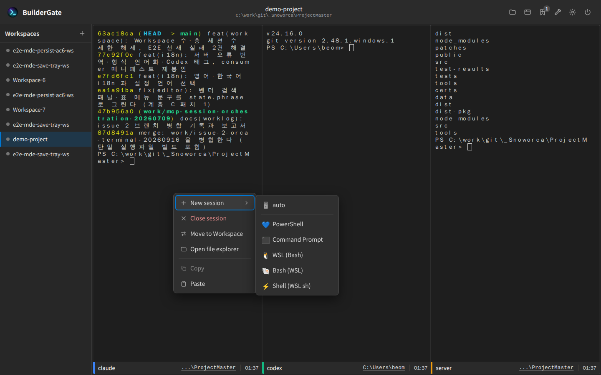

- **New session** — open another terminal next to this one; the submenu picks the shell (PowerShell, Command Prompt, WSL, …) and lists your registered **command lines** (see Tools)
- **Close session**, **Move to Workspace**
- **Open file explorer** — opens the explorer at this session's directory
- **Copy / Paste**

#### Session path menu and editor

Right-click the **path in a session's status bar**:

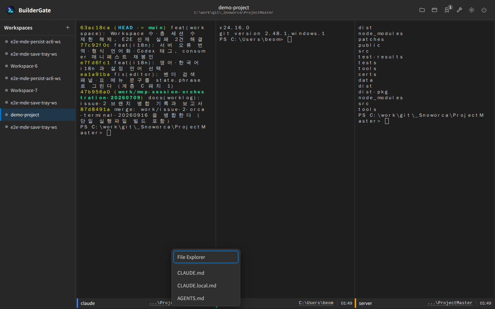

It opens the **File Explorer** at that directory, or opens the agent instruction files of that project — `CLAUDE.md`, `CLAUDE.local.md`, `AGENTS.md` — in the built-in editor. The editor is a modeless window: markdown with live preview, code files in code mode (syntax highlighting, wrap toggle), images read-only. Line endings and BOM are kept on save.

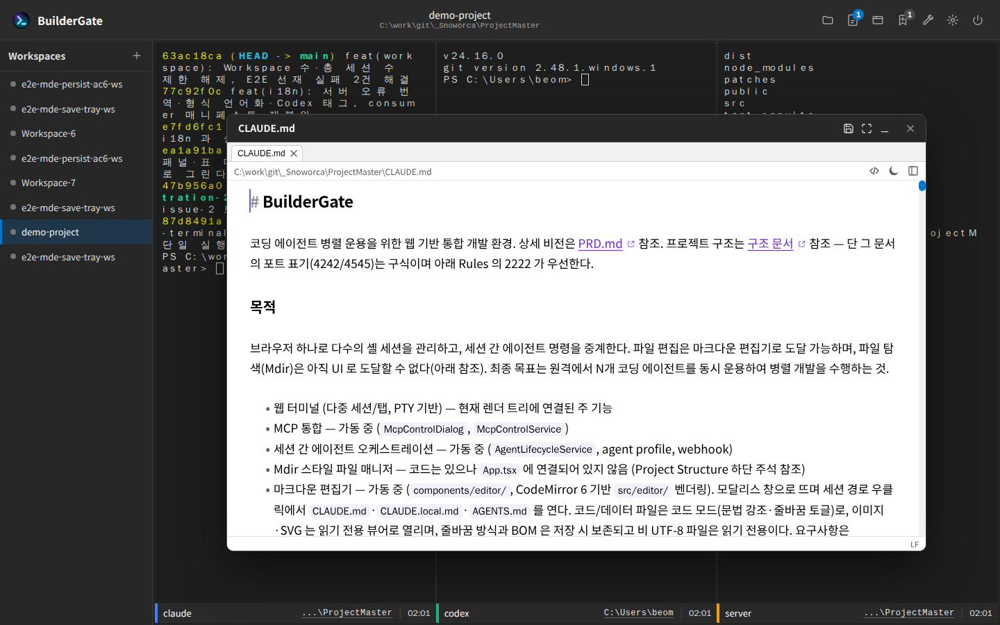

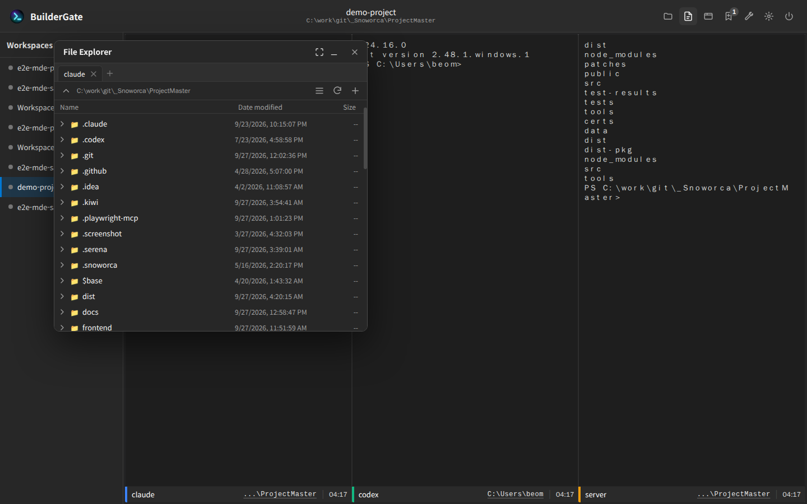

#### Tools menu

The wrench icon in the header:

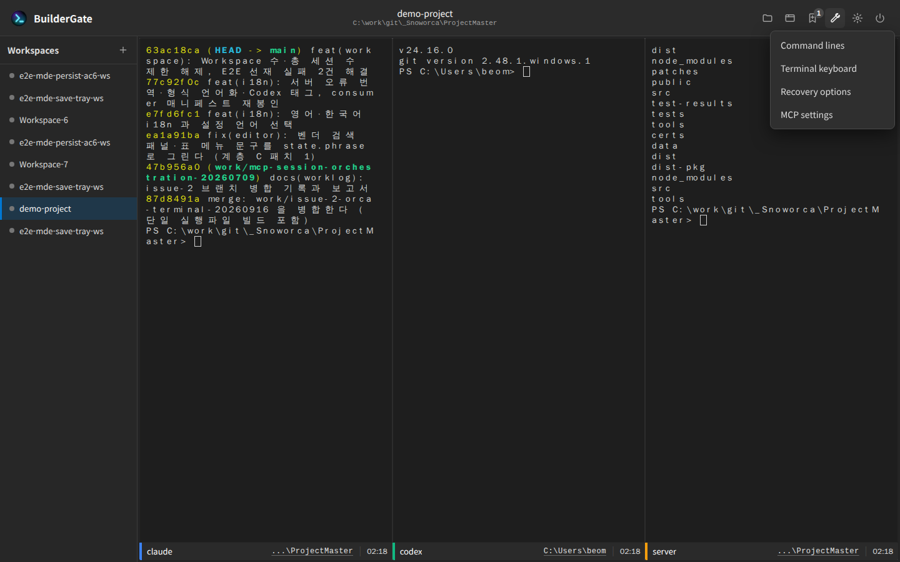

- **Command lines** — saved commands/text you can paste or run in the active terminal, or start as a new session from the context menu
- **Terminal keyboard** — custom key bindings per profile/scope (e.g. send a Codex newline on Shift+Enter)
- **Recovery options** — which commands mark a tab as an AI agent tab, and how to resume it
- **MCP settings** — see below

#### MCP: letting agents work together

BuilderGate runs an **MCP server** (Streamable HTTP) that coding agents connect to. Through it an agent can find other sessions, send them messages, start new agent sessions and report back. Open **Tools → MCP settings**.

**1. Security tab — turn the endpoint on**

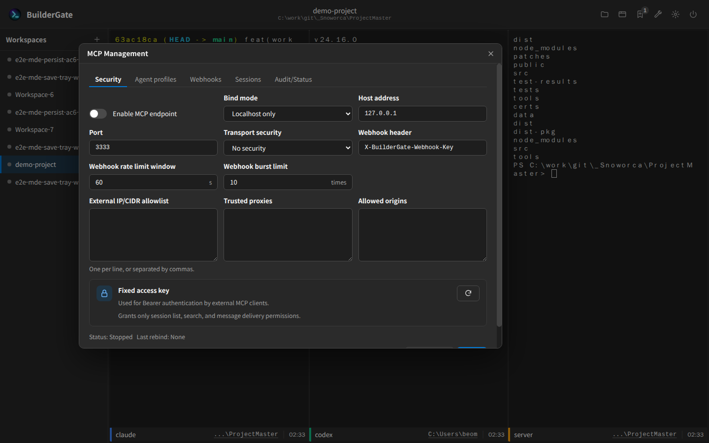

- **Enable MCP endpoint**, choose the **bind mode** (localhost only / allowlist), host and **port** (default `3333`). The endpoint URL is `http://127.0.0.1:3333/mcp`.
- For access from other machines use the allowlist, trusted proxies and TLS options.
- **Fixed access key** — a Bearer key for external MCP clients; it only grants listing, searching and messaging sessions.

**2. Agent profiles tab — agents BuilderGate may launch**

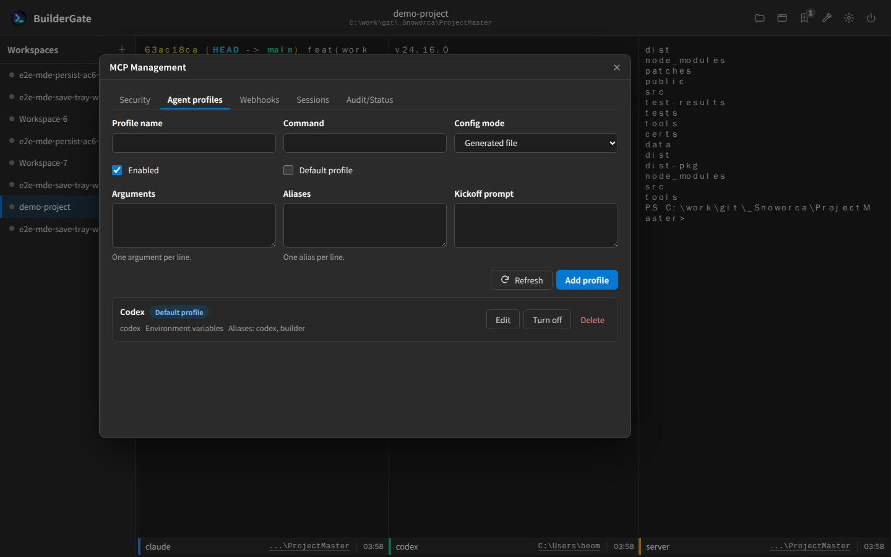

A profile is a name, a command (e.g. `codex`, `claude`), arguments, aliases and an optional kickoff prompt. **Config mode** decides how the launched agent receives its MCP connection (generated file, environment variables, or manual). A leader agent calls `buildergate.session.open_agent` with a profile to open a follower session.

**3. Webhooks tab — start work from outside**

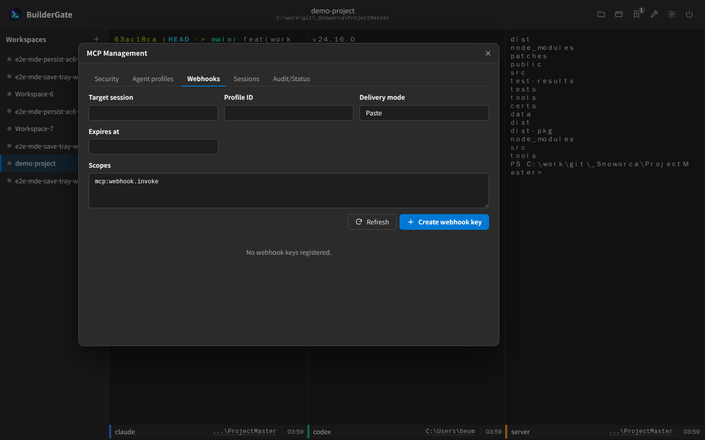

Create a webhook key bound to a target session or profile. An external system then calls:

```bash
curl -k -X POST "https://localhost:2002/webhook/agent?key=<webhook-key>" \
  -H "Content-Type: application/json" -d '{"prompt":"Run the nightly checks"}'
```

The prompt is delivered to the target (paste, send only, or send and press Enter).

**4. Sessions tab** lists live sessions with their stable session key, lets you set an **alias**, **issue a connection code** (an agent running in that terminal claims its identity with `buildergate.session.claim`), send a test message, or close the session. **Audit/Status** shows the listener state and the audit log.

**MCP tools available to agents**

| Tool | Purpose |
|---|---|
| `buildergate.session.whoami` / `buildergate.session.claim` | Identify the calling session (claim with a connection code) |
| `buildergate.session.list` / `buildergate.session.search` | Find sessions by name, alias or status |
| `buildergate.message.send` | Deliver a message into another session's terminal |
| `buildergate.message.reply_to_leader` | Report back to the leader session |
| `buildergate.session.open_agent` | Launch a follower agent from a profile |
| `buildergate.session.set_alias` / `buildergate.session.update_status` | Name a session, publish progress |
| `buildergate.session.close` / `buildergate.session.close_self` | Close a follower (confirmation required) or itself |

Typical flow: a leader agent searches for or opens follower agents, sends each a task with `message.send`, and followers answer with `reply_to_leader`.

#### Saving sessions before a restart

The bookmark icon in the header (**Save sessions · Prepare to restart**) saves the resume IDs of running Claude, Codex, Hermes and OpenCode sessions **without stopping the agents**. After BuilderGate restarts, a banner offers to resume exactly those conversations. Save again after starting a new conversation (`/clear`, `/new`).

#### Settings and language

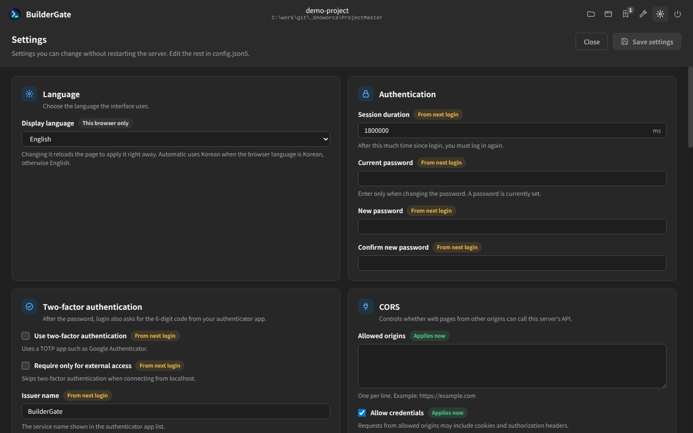

Settings holds everything that can change without a restart (session duration, password change, 2FA, CORS, terminal, resource limits). **Language** switches the UI between Automatic (browser language: Korean if the browser is Korean, otherwise English), English and 한국어; the choice is stored per browser.

### Two-factor authentication

TOTP (Google Authenticator, 1Password, Authy, …). Enable it in Settings or in `config.json5` (`twoFactor.enabled: true`). In daemon mode, when a secret still has to be registered, the parent launcher prints the QR code and manual key to the console once, **before detach**; in `--foreground` mode the server prints the QR itself. `externalOnly: true` asks for the code only for non-localhost access. To re-register, stop the daemon, delete `runtime/totp.secret` and start again.

### Build

Building needs Node.js **22** and npm (running a release does not).

```bash
npm ci
npm ci --prefix server
npm ci --prefix frontend
npm run build                 # all supported targets
npm run build:windows-amd64   # or one target
npm run build:linux-amd64
npm run build:macos-arm64
```

Output goes to `dist/bin/<target>-<version>/`, e.g. `dist/bin/win-amd64-0.10.1/BuilderGate.exe`. Pushing a `v*.*.*` tag runs the GitHub Actions release workflow, which builds every target and publishes the release.

### Development environment

- Node.js 22+, npm, Git. Windows: PowerShell; node-pty uses prebuilt binaries.
- Repository layout: `server/` (Express + TypeScript, node-pty, WebSocket), `frontend/` (React 19, Vite 7, xterm.js 6), `tools/` (launcher, daemon, build scripts), `docs/spec/` (requirements, SpecKiwi SRS).
- Run from source (builds what is missing, then starts the server):

  ```bat
  start.bat --port 2222
  start.bat stop
  ```

  ```bash
  ./start.sh --port 2222
  ./start.sh stop
  ```

- Tests:

  ```bash
  cd server && npx tsx src/test-runner.ts                         # server runner
  cd server && npx tsx --test src/services/SessionManager.test.ts # one node:test file
  cd frontend && node --experimental-strip-types --test tests/unit/*.test.ts
  cd frontend && npx playwright test                              # E2E against https://localhost:2222
  npm run test:release-pipeline                                   # release guards
  ```

- UI text lives in `frontend/public/locales/messages.{en,ko}.json`; add a language by adding `messages.<lang>.json` and a line in `languages.json`.

### macOS notes

A ZIP downloaded from the internet may carry the Gatekeeper quarantine flag. For a release you trust: `xattr -dr com.apple.quarantine .` in the extracted folder. An unsigned local build can be ad-hoc signed with `codesign --force --deep --sign - ./BuilderGate.app`.

---

<a id="한국어"></a>

## 한국어

> BuilderGate 는 활발히 개발 중입니다. API, 설정 구조, UI 가 예고 없이 바뀔 수 있습니다.

BuilderGate 는 여러 코딩 에이전트(Claude Code, Codex, Hermes, OpenCode 등)를 병렬로 운용하기 위한 웹 기반 작업 환경입니다. 브라우저 탭 하나로 여러 셸 세션을 관리하고, MCP 로 에이전트끼리 대화하게 하며, 터미널 옆에서 파일 탐색기와 마크다운·코드 편집기를 씁니다.

### 목차

- [주요 기능](#주요-기능)
- [내려받기](#내려받기)
- [실행](#실행)
- [실행 옵션](#실행-옵션)
- [최초 로그인과 비밀번호](#최초-로그인과-비밀번호)
- [설정 파일](#설정-파일)
- [사용 설명서](#사용-설명서)
  - [Workspace·탭·그리드](#workspace탭그리드)
  - [터미널 컨텍스트 메뉴](#터미널-컨텍스트-메뉴)
  - [세션 경로 메뉴와 편집기](#세션-경로-메뉴와-편집기)
  - [도구 메뉴](#도구-메뉴)
  - [MCP: 에이전트끼리 일하게 하기](#mcp-에이전트끼리-일하게-하기)
  - [재시작 전에 세션 저장](#재시작-전에-세션-저장)
  - [설정과 언어](#설정과-언어)
- [2단계 인증](#2단계-인증)
- [빌드](#빌드)
- [개발 환경](#개발-환경)
- [macOS 참고](#macos-참고)


### 주요 기능

- **웹 터미널** — 다중 세션, 탭 또는 크기 조절 가능한 그리드, PTY 기반(xterm.js)
- **Workspace** — 프로젝트별로 세션을 묶습니다. Workspace 개수와 전체 세션 수 제한은 없고, Workspace 당 탭 제한(기본 8개)만 있습니다
- **MCP 제어** — 에이전트가 다른 세션을 목록·검색하고 메시지를 보내고, 새 에이전트 세션을 열고, 리더에게 회신합니다
- **웹훅** — URL 키로 외부에서 에이전트 작업을 시작합니다
- **세션 저장** — 실행 중인 AI 세션의 이어하기 ID 를 저장하고, 재시작 뒤 같은 대화로 이어갑니다
- **파일 탐색기와 편집기** — 트리·목록 탐색기, 마크다운 편집기, 문법 강조 코드 모드, 이미지 뷰어
- **보안** — HTTPS, JWT, 최초 비밀번호 설정, 선택적 TOTP 2단계 인증
- **영어·한국어 UI** — 브라우저 언어를 따르며 설정에서 바꿀 수 있습니다
- **배포 실행 파일** — Windows, Linux, macOS 용 네이티브 데몬

### 내려받기

GitHub Release 의 각 파일에는 최상위 폴더 하나가 들어 있습니다. 폴더를 통째로 두고 쓰며, 실행 파일만 따로 복사하지 않습니다.

| 대상 | Release 파일 | 실행 파일 |
|---|---|---|
| Windows amd64 | `BuilderGate-win-amd64-<version>.zip` | `BuilderGate.exe` |
| Windows ARM64 | `BuilderGate-win-arm64-<version>.zip` | `BuilderGate.exe` |
| Linux amd64 | `BuilderGate-linux-amd64-<version>.tar.gz` | `buildergate` |
| Linux ARM64 | `BuilderGate-linux-arm64-<version>.tar.gz` | `buildergate` |
| macOS ARM64 | `BuilderGate-macos-arm64-<version>.zip` | `buildergate`, `BuilderGate.app` |

폴더에는 런처, `config.json5`(실행 설정), `web/`(프런트엔드), `shell-integration/`, `runtime/`(데몬 상태·로그·TOTP secret, 첫 실행 때 생성), 이 README 복사본이 들어 있습니다.

### 실행

기본 모드는 **네이티브 데몬**입니다. 런처가 BuilderGate 앱 프로세스와 sentinel watchdog 을 백그라운드로 띄우고 콘솔을 돌려줍니다.

Windows:

```bat
BuilderGate.exe
BuilderGate.exe -p 2002
BuilderGate.exe --foreground -p 2002
BuilderGate.exe stop
```

Linux:

```bash
chmod +x ./buildergate
./buildergate
./buildergate -p 2002
./buildergate --foreground -p 2002
./buildergate stop
```

macOS ARM64:

```bash
chmod +x ./buildergate
./buildergate
./buildergate stop
open ./BuilderGate.app
```

브라우저로 `https://localhost:2002`(기본 포트)에 접속합니다. 첫 실행 때 자체 서명 인증서를 만들므로 인증서 경고가 한 번 뜹니다. 상태 확인:

```bash
curl -k https://localhost:2002/health
```

### 실행 옵션

| 옵션 | 뜻 |
|---|---|
| *(없음)* | 네이티브 데몬으로 시작(백그라운드 앱 프로세스 + sentinel watchdog) |
| `stop` | 실행 중인 데몬 종료(`BuilderGate.exe stop`, `./buildergate stop`) |
| `-p <port>`, `--port <port>` | HTTPS 포트. `config.json5` 의 `server.port` 보다 우선 |
| `--foreground` | 데몬 대신 현재 콘솔에서 실행. `Ctrl+C` 로 종료 |
| `--forground` | `--foreground` 의 옛 오타 호환 별칭 |
| `--reset-password` | 시작 전에 `config.json5` 의 `auth.password` 를 비움(먼저 데몬 종료) |
| `--bootstrap-allow-ip <ip[,ip]>` | 최초 비밀번호를 원격에서 설정할 IP 를 임시로 허용 |
| `-h`, `--help` | 옵션 출력 |

포트 우선순위: `-p`/`--port` → `config.json5` 의 `server.port` → 기본값 `2002`. HTTP 리다이렉트 포트는 HTTPS 포트보다 1 작습니다(2002 → 2001).

`stop` 은 데몬만 종료합니다. `--foreground` 로 띄운 프로세스는 그 콘솔에서 `Ctrl+C` 로 종료합니다.

### 최초 로그인과 비밀번호

`config.json5` 의 `auth.password` 가 비어 있으면 첫 접속 때 로그인 화면 대신 **초기 비밀번호 설정** 화면이 뜹니다. 이 설정은 localhost 에서만 허용되며, 다른 장치에서 해야 한다면 `--bootstrap-allow-ip 192.168.0.50` 으로 시작합니다(여러 개는 쉼표로 구분).

비밀번호 규칙: `A-Z a-z 0-9 !@#$%^&*()_+=/-` 중 4~128자(공백·한글·이모지 불가).

비밀번호 초기화:

```bat
BuilderGate.exe stop
BuilderGate.exe --reset-password
```

```bash
./buildergate stop
./buildergate --reset-password
```

### 설정 파일

실행 파일은 같은 폴더의 `config.json5` 를 읽습니다(`BUILDERGATE_CONFIG_PATH` 가 있으면 그 경로가 우선). JSON5 라서 주석을 쓸 수 있습니다. 평문 비밀번호를 적으면 다음 시작 때 `enc(...)` 로 암호화됩니다. 키는 실행 머신에서 유도하므로 암호화된 파일은 다른 머신에서 복호화되지 않습니다.

```json5
{
  server: { port: 2002 },
  auth: { password: "", durationMs: 1800000, jwtSecret: "" },
  bootstrap: { allowedIps: [] },
  twoFactor: { enabled: false, externalOnly: false, issuer: "BuilderGate", accountName: "admin" },
  workspace: { maxTabsPerWorkspace: 8 },
}
```

주요 경로: `runtime/buildergate-daemon.log`, `runtime/buildergate-sentinel.log`, `runtime/buildergate.daemon.json`(데몬 상태), `runtime/totp.secret`, `data/workspaces.json`.

### 사용 설명서

#### Workspace·탭·그리드

왼쪽 사이드바에 **Workspace** 목록이 있고 `+` 로 추가합니다. Workspace 마다 터미널 세션을 탭이나 그리드로 보여 줍니다(헤더의 그리드/탭 아이콘으로 전환). 세션 아래 상태 표시줄에는 이름, 작업 디렉터리, 경과 시간이 나옵니다.

#### 터미널 컨텍스트 메뉴

터미널 안에서 마우스 오른쪽 버튼:

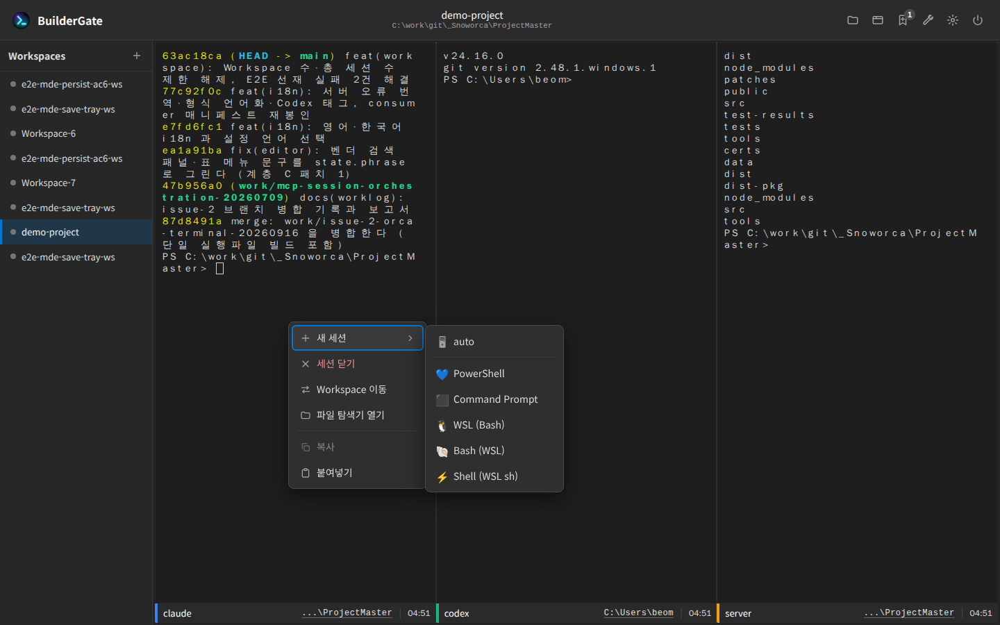

- **새 세션** — 옆에 터미널을 하나 더 엽니다. 하위 메뉴에서 셸(PowerShell, 명령 프롬프트, WSL 등)을 고르고, 등록해 둔 **명령줄**(도구 메뉴 참고)도 여기서 고릅니다
- **세션 닫기**, **Workspace 이동**
- **파일 탐색기 열기** — 이 세션의 디렉터리에서 탐색기를 엽니다
- **복사 / 붙여넣기**

#### 세션 경로 메뉴와 편집기

세션 상태 표시줄의 **경로**를 마우스 오른쪽 버튼으로 누릅니다:


그 디렉터리에서 **파일 탐색기**를 열거나, 그 프로젝트의 에이전트 지침 파일 `CLAUDE.md`, `CLAUDE.local.md`, `AGENTS.md` 를 내장 편집기로 엽니다. 편집기는 다른 작업을 막지 않는 창이며, 마크다운은 미리보기와 함께, 코드 파일은 코드 모드(문법 강조, 줄바꿈 토글)로, 이미지는 읽기 전용으로 엽니다. 저장할 때 줄바꿈 방식과 BOM 을 보존합니다.

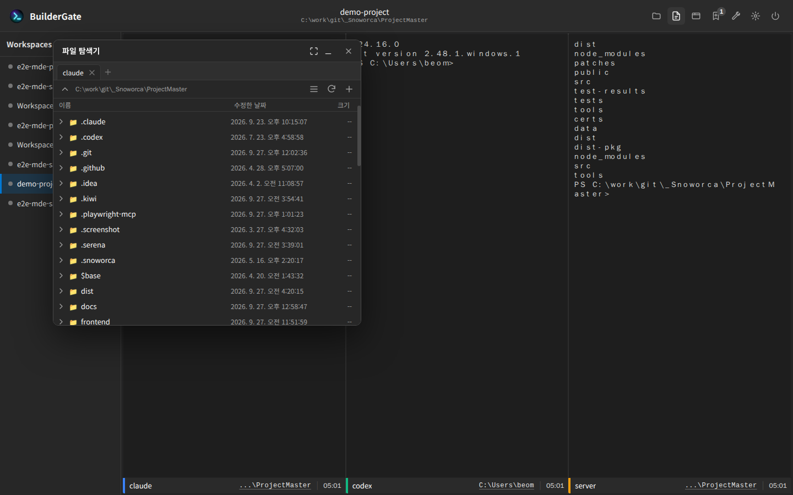

#### 도구 메뉴

헤더의 렌치 아이콘:

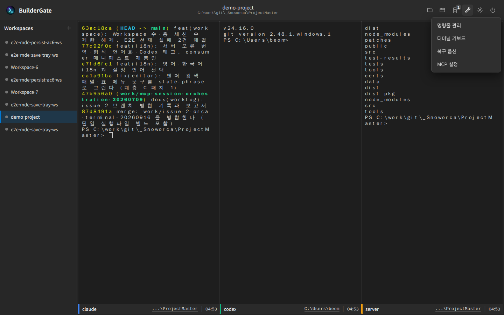

- **명령줄** — 저장해 둔 명령·문구를 활성 터미널에 붙여넣거나 실행하고, 컨텍스트 메뉴에서 새 세션으로 시작합니다
- **터미널 키보드** — 프로필·범위별 단축키(예: Shift+Enter 로 Codex 줄바꿈 보내기)
- **복구 옵션** — 어떤 명령을 AI 에이전트 탭으로 볼지, 어떻게 이어할지
- **MCP 설정** — 아래 참고

#### MCP: 에이전트끼리 일하게 하기

BuilderGate 는 코딩 에이전트가 접속하는 **MCP 서버**(Streamable HTTP)를 띄웁니다. 에이전트는 이를 통해 다른 세션을 찾고, 메시지를 보내고, 새 에이전트 세션을 열고, 결과를 회신합니다. **도구 → MCP 설정**을 엽니다.

**1. 보안 탭 — 엔드포인트 켜기**

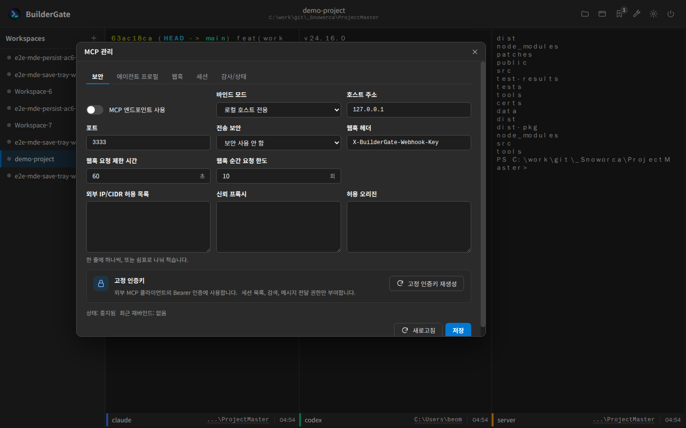

- **MCP 엔드포인트 사용**을 켜고 **바인드 방식**(로컬 호스트 전용 / 허용 목록), 호스트, **포트**(기본 `3333`)를 고릅니다. 엔드포인트 주소는 `http://127.0.0.1:3333/mcp` 입니다.
- 다른 머신에서 접속하려면 허용 목록, 신뢰 프록시, TLS 옵션을 씁니다.
- **고정 인증키** — 외부 MCP 클라이언트용 Bearer 키입니다. 세션 목록·검색·메시지 전달 권한만 줍니다.

**2. 에이전트 프로필 탭 — BuilderGate 가 띄울 수 있는 에이전트**

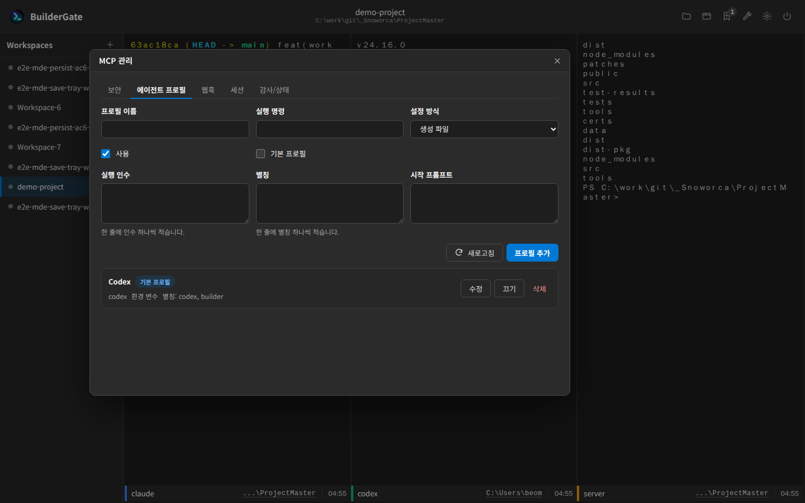

프로필은 이름, 실행 명령(예: `codex`, `claude`), 인수, 별칭, 시작 프롬프트로 이루어집니다. **설정 방식**은 띄운 에이전트가 MCP 연결 정보를 받는 방법(생성 파일, 환경 변수, 수동)을 정합니다. 리더 에이전트가 프로필을 지정해 `buildergate.session.open_agent` 를 부르면 팔로워 세션이 열립니다.

**3. 웹훅 탭 — 외부에서 작업 시작**

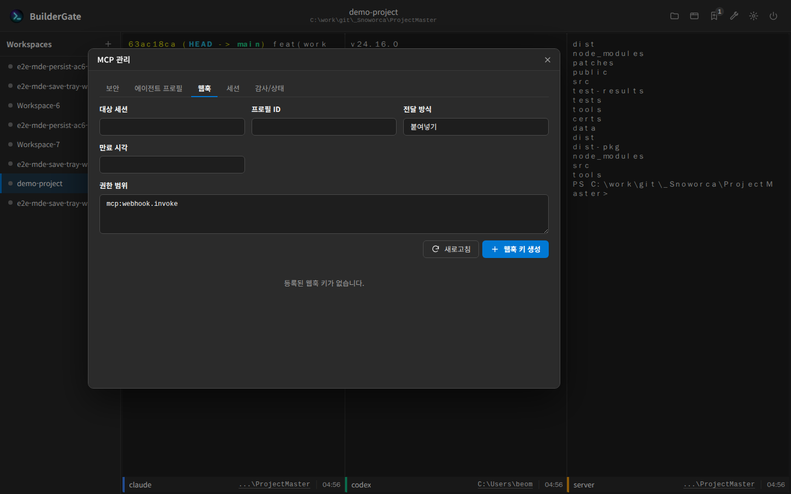

대상 세션이나 프로필에 묶인 웹훅 키를 만듭니다. 외부 시스템은 다음처럼 호출합니다:

```bash
curl -k -X POST "https://localhost:2002/webhook/agent?key=<webhook-key>" \
  -H "Content-Type: application/json" -d '{"prompt":"야간 점검을 실행해"}'
```

프롬프트가 대상에 전달됩니다(붙여넣기, 전송 전용, 전송 후 엔터 중 선택).

**4. 세션 탭**은 실행 중인 세션을 고정 세션 키와 함께 보여 줍니다. **별칭**을 정하고, **연결 코드 발급**(그 터미널에서 도는 에이전트가 `buildergate.session.claim` 으로 자기 신원을 확인)을 하고, 테스트 메시지를 보내거나 세션을 닫습니다. **감사/상태** 탭은 리스너 상태와 감사 기록을 보여 줍니다.

**에이전트가 쓰는 MCP 도구**

| 도구 | 용도 |
|---|---|
| `buildergate.session.whoami` / `buildergate.session.claim` | 호출한 세션 확인(연결 코드로 claim) |
| `buildergate.session.list` / `buildergate.session.search` | 이름·별칭·상태로 세션 찾기 |
| `buildergate.message.send` | 다른 세션의 터미널로 메시지 전달 |
| `buildergate.message.reply_to_leader` | 리더 세션에 회신 |
| `buildergate.session.open_agent` | 프로필로 팔로워 에이전트 실행 |
| `buildergate.session.set_alias` / `buildergate.session.update_status` | 세션 이름 붙이기, 진행 상태 알리기 |
| `buildergate.session.close` / `buildergate.session.close_self` | 팔로워 닫기(확인 필요) 또는 자기 자신 닫기 |

보통의 흐름: 리더 에이전트가 팔로워를 찾거나 열고, `message.send` 로 각자에게 일을 주고, 팔로워는 `reply_to_leader` 로 답합니다.

#### 재시작 전에 세션 저장

헤더의 책갈피 아이콘(**세션 저장 · 재시작 준비**)은 실행 중인 Claude·Codex·Hermes·OpenCode 세션의 이어하기 ID 를 **에이전트를 멈추지 않고** 저장합니다. BuilderGate 를 재시작하면 배너가 바로 그 대화들을 이어할지 묻습니다. 새 대화를 시작했다면(`/clear`, `/new`) 다시 저장합니다.

#### 설정과 언어

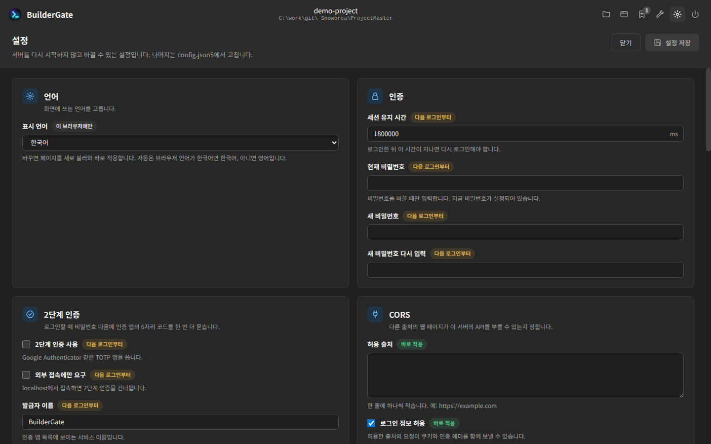

설정 화면에는 재시작 없이 바꿀 수 있는 항목(세션 유지 시간, 비밀번호 변경, 2단계 인증, CORS, 터미널, 자원 한도)이 있습니다. **언어**는 자동(브라우저 언어가 한국어면 한국어, 아니면 영어), English, 한국어 중에서 고르며, 선택은 브라우저별로 저장됩니다.

### 2단계 인증

TOTP(Google Authenticator, 1Password, Authy 등)를 지원합니다. 설정 화면이나 `config.json5`(`twoFactor.enabled: true`)에서 켭니다. 데몬 모드에서 secret 등록이 필요하면 부모 런처가 **detach 전**에 QR 코드와 수동 입력 키를 콘솔에 한 번 출력하고, `--foreground` 모드에서는 서버가 직접 QR 을 출력합니다. `externalOnly: true` 면 localhost 가 아닌 접속에만 코드를 요구합니다. 다시 등록하려면 데몬을 종료하고 `runtime/totp.secret` 을 지운 뒤 다시 시작합니다.

### 빌드

빌드에는 Node.js **22** 와 npm 이 필요합니다(배포본 실행에는 필요 없음).

```bash
npm ci
npm ci --prefix server
npm ci --prefix frontend
npm run build                 # 지원하는 모든 대상
npm run build:windows-amd64   # 또는 대상 하나
npm run build:linux-amd64
npm run build:macos-arm64
```

결과는 `dist/bin/<target>-<version>/` 에 생깁니다(예: `dist/bin/win-amd64-0.10.1/BuilderGate.exe`). `v*.*.*` 태그를 푸시하면 GitHub Actions 릴리즈 워크플로가 모든 대상을 빌드해 릴리즈에 올립니다.

### 개발 환경

- Node.js 22 이상, npm, Git. Windows 는 PowerShell 을 쓰며 node-pty 는 미리 빌드된 바이너리를 씁니다.
- 저장소 구조: `server/`(Express + TypeScript, node-pty, WebSocket), `frontend/`(React 19, Vite 7, xterm.js 6), `tools/`(런처·데몬·빌드 스크립트), `docs/spec/`(요구사항, SpecKiwi SRS).
- 소스에서 실행(없는 빌드를 만든 뒤 서버 시작):

  ```bat
  start.bat --port 2222
  start.bat stop
  ```

  ```bash
  ./start.sh --port 2222
  ./start.sh stop
  ```

- 테스트:

  ```bash
  cd server && npx tsx src/test-runner.ts                         # 서버 러너
  cd server && npx tsx --test src/services/SessionManager.test.ts # node:test 파일 하나
  cd frontend && node --experimental-strip-types --test tests/unit/*.test.ts
  cd frontend && npx playwright test                              # https://localhost:2222 대상 E2E
  npm run test:release-pipeline                                   # 릴리즈 가드
  ```

- UI 문구는 `frontend/public/locales/messages.{en,ko}.json` 에 있습니다. `messages.<lang>.json` 을 추가하고 `languages.json` 에 한 줄을 넣으면 언어가 늘어납니다.

### macOS 참고

인터넷에서 받은 ZIP 에는 Gatekeeper quarantine 이 붙을 수 있습니다. 신뢰하는 배포본이면 압축을 푼 폴더에서 `xattr -dr com.apple.quarantine .` 로 지웁니다. 서명되지 않은 로컬 빌드는 `codesign --force --deep --sign - ./BuilderGate.app` 으로 ad-hoc 서명합니다.
