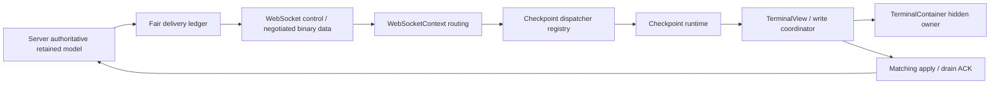

# Existing architecture and ownership

Requirements: REL-BGSTAB-012, PERF-BGSTAB-010/011, IR-BGSTAB-001/002, FR-BGSTAB-024, MIG-BGSTAB-004. Read the actual SRS blocks through MCP before edits.



The diagram is the integration target, not a claim that all arrows are implemented. Context-to-gap-admission and runtime-to-View-to-Container admission/completion remain to be connected.

| Owner | Existing authority | Do not move into this owner |
|---|---|---|
| Server retained model | Full retained state and terminal facts | Browser snapshot as server truth |
| FairTerminalDeliveryScheduler | Client/session ordering, byte ledger, ACK credit | Semantic idle/running inference |
| WebSocketContext | Actual socket/connection, routing, visibility publication | New checkpoint epoch allocation or independent input readiness |
| Checkpoint runtime | Accepted identity, failure floor, apply/drain ACK, readiness | Entire Container lifecycle |
| Write coordinator | Ordered apply/write/drain and actual write completion | Treating reception as completed write |
| TerminalView | Installed xterm generation and runtime/coordinator instances | Treating requested registration as installed state |
| TerminalContainer | This mounted view's hidden replay/barrier ownership | Releasing another session/view's barrier |

## Reuse these existing symbols

In frontend/src/utils/terminalCheckpointRuntime.ts:

- TerminalHiddenGapContext: trusted session/connection/installed view/visibility snapshot, separate from message data.
- TerminalHiddenGapResult: accepted+duplicate or rejected+reason.
- admitHiddenDataGap: existing admission checks, owner notification, failClosed recovery.
- onHiddenDataGapAdmitted: production callback not wired yet. Never turn absence into successful no-op.
- failSession.recoveryAccepted: recovery request acceptance only; distinct from handled and successful restoration.
- checkpointApplied/checkpointDrained/matchesLifecycle/matchesDrainedLifecycle: existing identity and successful ACK authority.

```mermaid
sequenceDiagram
  participant C as Context
  participant R as Runtime
  participant O as View/Container owner
  C->>R: gap + trusted current context
  R->>R: identity / visibility / failure floor admission
  R->>O: admitted gap; install owner barrier
  R->>C: existing fresh recovery request
  C->>R: accepted fresh checkpoint start
  R->>O: bind start to current owner
  R->>R: apply ACK success
  R->>R: matching drain ACK success
  R->>O: release only the same owner/instance/identity
```

The lifecycle notifications and actual UI wiring are planned work. Do not activate gap stale state without its valid completion path. A fake immediately-successful observer is not integration evidence.

## Dependencies and parallel work

Hidden ownership is the current integration critical path. Read-only work or settings checks with disjoint files, requirements and fixtures may run in parallel. Do not give simultaneous write ownership of runtime, Context, View or Container to different agents. One writer owns a complete integration slice; a separate reviewer validates RED and final changes. A single owner serializes canonical HEAD transitions and actual port2222 runtime work.
