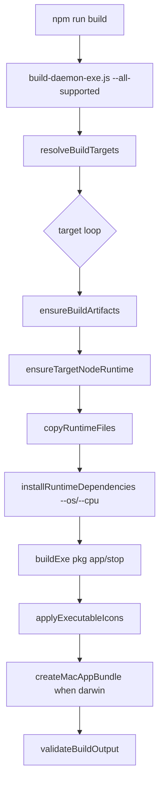

# 전체 지원 대상 빌드 아키텍처

## 컴포넌트

| 컴포넌트 | 파일 | 책임 |
|---|---|---|
| npm script entry | `package.json` | 사용자-facing build command 제공 |
| target resolver | `tools/build-daemon-exe.js` | profile name, pkg target, platform, arch, output dir 결정 |
| runtime packager | `tools/build-daemon-exe.js` | frontend/server build, runtime copy, dependency install, pkg executable 생성 |
| output validator | `tools/build-daemon-exe.js` | target output 구조, bundled Node, PM2 부재, icon/app bundle 검증 |
| icon helper | `tools/daemon/icon-assets.js` | SVG 기반 ICO/ICNS asset 생성/복사 |
| docs policy | `tools/daemon/docs-policy.js`, `tools/daemon/docs.test.js` | root/packaged README required/forbidden pattern 검증 |
| build tests | `tools/daemon/build-daemon-exe.test.js` | resolver, scripts, output validation 회귀 테스트 |

## 대상 모델

| profile | pkg target | platform | arch | 지원 성격 |
|---|---|---|---|---|
| `win-amd64` | `node18-win-x64` | `win32` | `x64` | 필수 |
| `linux-amd64` | `node18-linux-x64` | `linux` | `x64` | 필수 |
| `win-arm64` | `node18-win-arm64` | `win32` | `arm64` | 추가 |
| `linux-arm64` | `node18-linux-arm64` | `linux` | `arm64` | 추가 |
| `macos-arm64` | `node18-macos-arm64` | `darwin` | `arm64` | 추가, macOS 유일 지원 대상 |

## 빌드 흐름



## 산출물 구조

```text
dist/bin/
  win-amd64/
    BuilderGate.exe
    BuilderGateStop.exe
    server/dist/public/index.html
    server/node_modules/.bin/node.exe
    config.json5
    config.json5.example
    README.md
    BuilderGate.svg
    BuilderGate.ico
  linux-amd64/
    buildergate
    buildergate-stop
    server/dist/public/index.html
    server/node_modules/.bin/node
    config.json5
    config.json5.example
    README.md
    BuilderGate.svg
  win-arm64/
  linux-arm64/
  macos-arm64/
    buildergate
    buildergate-stop
    BuilderGate.app/
```

## 기존 코드 재사용

- `resolveBuildTargets()`의 복수 target output subdir 정책을 그대로 사용한다.
- `assertSafeOutputDir()`와 `assertSafeOutputRoot()`를 유지해 `dist` root 삭제를 방지한다.
- `ensureTargetNodeRuntime()`와 `installRuntimeDependencies()`의 `platform`/`arch` 주입 구조를 재사용한다.
- `createMacAppBundle()`은 macOS ARM64 `.app` 필수 산출물 검증의 기준 구현이다.
- `validateReadmeFile()`과 docs policy는 README 정책 검증에 재사용한다.

## 비범위

- native daemon start/stop 동작 변경 없음.
- 서버/프런트엔드 기능 변경 없음.
- macOS amd64 지원 추가 없음.
- 빌드 캐시 디렉터리 구조의 대규모 변경 없음.
