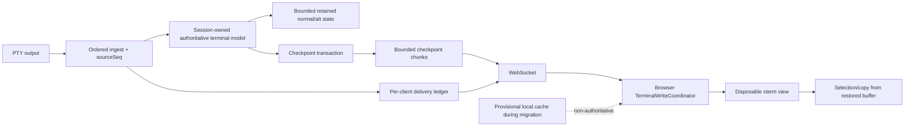

# Orca식 새로고침 retained-state 복구 연구 및 전면 리팩토링 계획

날짜: 2026-07-15

BuilderGate 기준선: `ca111fef3b5a5a25d3aa488415c929e90ade46fd`

Orca 기준선: `e0edc8ef76d341f7ab8083a006f785322bcaeb23`

SpecKiwi Active Target: `0.5.5-buildergate-stability`

연구 run-id: `2026-07-15.projectmaster.orca-refresh-state-refactor.s01`

상위 계획: [Orca 터미널 스택 흡수 연구 및 BuilderGate 최종 구현 계획](./2026-07-15.orca-terminal-stack-absorption-research-and-implementation-plan.ko.md)

문서 성격: 코드·Orca source·위험 대안을 분리 조사한 후속 연구와 구현 로드맵. 이 문서 자체는 runtime 또는 SRS를 변경하지 않는다.

---

## 1. 판정

새로고침 후 화면과 scrollback이 잘리는 현상은 단순한 우발적 렌더링 버그가 아니다. 현재 BuilderGate는 **서버 snapshot과 브라우저 local snapshot을 모두 viewport-only로 만들고, E2E도 오래된 행이 사라지는 것을 성공으로 판정한다.** 복구 계약 자체가 scrollback 폐기를 허용한다.

따라서 G1이 architectural migration을 선택한 분기의 최종 목표는 다음과 같이 잡는다.

1. 서버의 session-owned headless terminal을 유일한 terminal state authority로 만든다.
2. 브라우저 xterm은 새로고침·crash·parking 때 폐기하고 서버 상태로 다시 만드는 view가 된다.
3. 새로고침은 현재 viewport만이 아니라 **서버가 보존하기로 계약한 범위 전체**를 복구한다.
4. snapshot frame 크기, queue cap, browser write budget은 retention과 분리한다. 성능 한도 때문에 state를 empty 성공으로 바꾸지 않는다.
5. 새 authority가 동등성을 입증한 뒤 browser local snapshot, viewport-only server snapshot, tail replay와 중복 복구 로직을 물리 삭제한다.

사용자가 말한 “기존 구현을 전부 적출”은 **최종 상태**로는 타당하다. 그러나 구현은 big-bang이 아니라 `재현·계약 → shadow → canary → authority promotion → local cache 제거 → legacy 삭제` 순서여야 한다. 최종 삭제 목표와 안전한 migration 방법은 서로 모순되지 않는다.

다만 이 문서의 목표 상태가 각 release의 migration을 자동 승인하지는 않는다. Phase 0-R G1이 특정 신고를 국소 결함으로 재현하고 architecture replacement의 추가 이득을 입증하지 못하면 먼저 confirmed-bug-only fix를 적용하고 shadow/promotion은 보류한다. 구조적 migration 분기를 선택했다는 evidence가 있을 때만 이후 authority 단계를 연다.

### 1.1 여기서 `full`의 정확한 뜻

`full retained-state`는 무제한 transcript가 아니다. 다음 상태 중 서버의 명시된 retention policy 안에 남아 있는 전부를 뜻한다.

- normal buffer의 retained scrollback과 viewport
- alternate buffer와 현재 active buffer 종류
- cursor와 saved cursor
- terminal modes, wrap-pending, tab stop, charset/Unicode width에 필요한 상태
- geometry와 resize generation
- OSC link 등 복구 후 선택·복사 의미에 영향을 주는 metadata
- partial escape/pending parser tail
- snapshot이 포함한 마지막 `sourceSeq`

Retention 밖으로 정상 eviction된 오래된 행은 복구 대상이 아니다. 반대로 브라우저가 현재 사용자에게 보여 주는 history 범위 안의 행을 서버가 복구하지 못하는 상태는 허용하지 않는다.

> 목표 불변식: `browser visible history promise <= server authoritative retained history`.

현재 브라우저 runtime cap은 10,000줄이고 서버 authority cap은 1,000줄이다. 둘 다 구현 경계이자 characterization seed이며 아직 SRS의 사용자 약속이나 최종 기본값이 아니다. Phase 0-R에서 제품의 retained-history 범위와 aggregate memory budget을 승인하되, 선택된 browser retained range와 server authoritative range는 반드시 일치시킨다.

---

## 2. 조사 방법

`kiwi-srs-research`의 고정 5-role 토폴로지로 조사했다.

| 역할 | 범위 |
| --- | --- |
| Triage | 데이터 손실, retention, serialization, replay, resize/view 문제 분리 |
| Researcher A | BuilderGate refresh·snapshot·replay·local cache와 기존 test 코드 감사 |
| Researcher B | `C:\Work\git-none\orca` daemon model, renderer attach, snapshot, retention source 감사 |
| Researcher C | full cutover, 단계 전환, WAN, multi-client, rollback 위험 독립 분석 |
| Synthesizer | A/B/C raw만 사용해 합의·이견·gate 종합 |

유효 core role은 5개이며, 초기 Researcher A timeout과 불필요해진 예비 A 실행은 결과에서 제외했다. Orca 저장소는 읽기 전용으로 조사했다. 상세 manifest와 raw output은 다음 경로에 있다.

`docs/analysis/kiwi-srs-research-2026-07-15.projectmaster.orca-refresh-state-refactor.s01/`

정적 코드로 절단 메커니즘은 확정했지만, 사용자가 경험한 특정 순간에 어느 경계가 발화했는지는 아직 runtime event correlation이 없다. 아래 원인 후보를 한 session의 sequence로 묶어 재현해야 한다.

---

## 3. BuilderGate에서 확인된 절단 경로

### 3.1 서버 snapshot은 의도적으로 viewport-only다

`server/src/utils/headlessTerminal.ts:95,138`은 기본 serialize option을 `{ scrollback: 0 }`으로 고정한다. Headless terminal이 scrollback을 가지고 있어도 refresh payload에는 현재 viewport만 들어간다.

`server/src/services/SessionManager.ts:100-102`도 payload scope를 `viewport-only`로 선언한다.

기본값은 다음처럼 서로 어긋난다.

| 계층 | 현재 기본값 | 새로고침 결과 |
| --- | ---: | --- |
| server headless retention | 1,000 logical lines | model에는 최대 1,000줄만 남음 |
| server snapshot serialization | `scrollback: 0` | 보존된 1,000줄조차 전송하지 않음 |
| browser live xterm scrollback | literal 10,000 lines | 새로고침 전에는 최대 10,000줄처럼 보임 |
| browser local snapshot | `scrollback: 0` | 새로고침 fallback도 viewport만 복원 |

사용자가 새로고침 전 10,000줄 범위 안에서 읽고 복사할 수 있었더라도, 새로고침 후에는 현재 viewport를 제외한 모든 history가 사라질 수 있다.

### 3.2 기존 E2E가 이 절단을 성공으로 고정한다

`frontend/tests/e2e/header-context-menu-regression.spec.ts:439-481`의 `TC-7004`는 700줄을 출력한 뒤 다음을 요구한다.

- snapshot payload가 `viewport-only`
- 첫 줄 `oldMarker`가 local snapshot에 없음
- 새로고침 후 마지막 `latestMarker`는 보임
- 새로고침 후 `oldMarker`는 계속 없음

즉 기존 test는 “현재 화면이 보이면 성공”만 검증하고 “새로고침 전 retained scrollback과 같은가”를 검증하지 않는다. 이 test는 characterization으로 보존하되, 목표 contract test는 pre/post xterm buffer의 retained range와 cell hash를 비교하도록 바꿔야 한다.

### 3.3 큰 viewport는 전체 payload가 empty fallback이 된다

`server/src/utils/headlessTerminal.ts:138-143`은 serialize 결과가 `maxSnapshotBytes`를 넘으면 온전한 payload를 잘라 보내지 않고 `data: ''`, `truncated: true`를 반환한다. 기본 cap은 2MiB다.

브라우저는 이 경우 stale하거나 없는 local viewport snapshot을 시도하고, 그것도 실패하면 placeholder 또는 empty recovery로 수렴한다. 한글·emoji 등 multibyte 출력은 서버 byte cap과 브라우저 character cap의 경계가 달라 더 일찍 이 경로에 들어갈 수 있다.

### 3.4 snapshot ACK fence도 폭주 때 tail loss가 있다

일반 subscribe 순서는 snapshot 이전에 replay pending state를 설치하고, snapshot ACK 뒤 queued output을 보낸다는 점에서 올바르다. 그러나 queue는 `min(maxSnapshotBytes, 262,144 bytes)`까지만 유지하고 초과분은 UTF-8-safe tail만 남긴다.

`queuedOutputTruncated`는 관측용일 뿐, ACK 또는 5초 timeout 뒤에는 retained tail만 flush된다. ANSI sequence의 prefix나 repaint 시작 구간이 사라지면 최신 plain text가 보여도 terminal state는 깨질 수 있다.

### 3.5 remount·hidden·visible overflow도 viewport repair로 끝난다

- React remount grace 동안 output을 무제한 buffer하다가 snapshot 수신 시 이전 output을 모두 지운다. Empty fallback이 그 output을 cover하지 않으면 loss가 될 수 있다.
- hidden default는 xterm write를 건너뛰고 reveal 때 viewport-only repair를 요청한다. Hidden 동안의 scrollback은 browser model에 들어오지 않는다.
- visible output queue overflow도 stale 표시 후 viewport-only screen repair를 요청한다. 잃은 scrollback은 복구하지 못한다.
- headless queue overflow는 cached viewport와 pending output을 합친 뒤 `maxSnapshotBytes` tail로 degrade한다. 이것은 terminal-state-equivalent snapshot이 아니다.

### 3.6 원인 판정

| 질문 | 판정 |
| --- | --- |
| refresh 뒤 scrollback이 잘리는 구조가 실제로 있는가? | **확정** |
| 그 구조가 test에서 의도된 동작인가? | **확정** |
| 사용자가 본 한 번의 현상이 정확히 어느 경계 때문인가? | **미확정** — runtime correlation 필요 |
| 단순히 snapshot cap을 크게 하면 해결되는가? | **아님** — viewport-only, replay tail, authority mismatch가 남음 |
| renderer만 Orca처럼 바꾸면 해결되는가? | **아님** — state ownership과 restore contract 문제 |

---

## 4. Orca가 실제로 하는 일

### 4.1 local terminal model은 renderer보다 오래 산다

Orca는 daemon `Session`의 headless xterm을 local terminal authority로 둔다. Renderer가 reload되거나 view가 다시 attach되어도 PTY process와 daemon model은 유지되고, 새 renderer는 snapshot 뒤 live bytes를 이어 받는다.

근거:

- `C:/Work/git-none/orca/src/main/daemon/session.ts:102-163`
- `C:/Work/git-none/orca/src/main/daemon/terminal-host.ts:61-81`
- `C:/Work/git-none/orca/src/renderer/src/components/terminal-pane/pty-connection.ts:6588-6605`

Snapshot은 normal scrollback, active screen, alternate screen, mode, dimension, cwd/title, OSC link와 pending escape tail처럼 viewport보다 풍부한 상태를 가진다.

### 4.2 Orca도 무제한 scrollback을 보존하지 않는다

Orca desktop 설정은 1,000~50,000줄 범위를 제공하지만 daemon create contract는 그 값을 전달하지 않아 headless emulator의 실효 기본은 약 5,000줄이다. 따라서 local renderer가 더 오래 가진 history도 daemon snapshot 범위 밖이면 reload 후 복구되지 않는다.

더구나 remote desktop의 최초 subscribe와 frame-gap recovery는 `scrollbackRows=0`으로 현재 screen만 복구하고 renderer scrollback을 clear한다.

근거:

- `C:/Work/git-none/orca/src/shared/terminal-scrollback-policy.ts:1-4`
- `C:/Work/git-none/orca/src/main/daemon/terminal-host-create-contract.ts:5-22`
- `C:/Work/git-none/orca/src/main/daemon/headless-emulator.ts:58-101`
- `C:/Work/git-none/orca/src/main/runtime/rpc/methods/terminal.ts:622-631`
- `C:/Work/git-none/orca/src/renderer/src/runtime/remote-runtime-terminal-multiplexer.ts:525-530`

따라서 Orca의 코드를 그대로 복사하면 BuilderGate의 현재 10,000줄 browser runtime capacity와 refresh 복구 범위 불일치는 해결되지 않을 수 있다. 가져올 것은 **model/view 구조와 순서 불변식**이며, 실제 제품 retention 값은 BuilderGate가 SRS와 benchmark로 결정해야 한다.

### 4.3 가져올 불변식

1. PTY output은 view 전달보다 먼저 authoritative model에 반영한다.
2. Snapshot과 live output은 같은 absolute sequence/high-water domain을 사용한다.
3. 새 view는 listener를 먼저 붙이고, snapshot이 cover한 live bytes를 sequence로 제거한다.
4. 죽은 renderer의 ACK debt와 delivery backlog는 버리고 새 handshake와 snapshot으로 시작한다.
5. Hidden/slow view 때문에 PTY producer나 다른 client를 멈추지 않는다.
6. Queue loss는 silent tail continuation이 아니라 `dataGap` 또는 state replacement로 표시한다.
7. Resize, detach, reconnect, session termination을 서로 다른 lifecycle로 취급한다.
8. View는 cache이며 model이 정본이다.

### 4.4 그대로 가져오지 않을 것

| Orca 요소 | BuilderGate 처리 |
| --- | --- |
| Electron `webContents`/`ipcMain` lifecycle | WebSocket connection/view generation으로 번역 |
| local daemon 5,000줄 default | benchmark seed일 뿐 복사 금지 |
| remote `scrollbackRows=0` | 사용자의 refresh 보존 목표와 충돌하므로 복사 금지 |
| 현 BuilderGate/Orca의 legacy 2MiB snapshot cap | characterization/regression seed로만 사용; 실제 chunk/in-flight budget은 Phase 0-R stable SRS에서 결정 |
| single renderer 전제 | multi-client driver lease와 client별 delivery state 추가 |
| Electron userData disk checkpoint | server restart 보존 범위를 별도 계약으로 설계 |

---

## 5. 목표 아키텍처



### 5.1 Server authority

Session model은 connection이 끊겨도 PTY session이 살아 있는 동안 유지한다. 다음 정보를 하나의 checkpoint generation으로 고정한다.

```ts
interface RetainedTerminalCheckpoint {
  protocolVersion: number;
  sessionId: string;
  streamEpoch: number;
  snapshotEpoch: number;
  snapshotSeq: bigint;
  oldestRetainedSeq: bigint;
  retentionPolicyId: string;
  sourceCols: number;
  sourceRows: number;
  activeBuffer: 'normal' | 'alternate';
  normalBuffer: TerminalBufferState;
  alternateBuffer: TerminalBufferState;
  modes: TerminalModeState;
  parserTail: Uint8Array;
  contentDigest: string;
}
```

정확한 wire representation은 Phase 0-R/4A에서 결정한다. 핵심은 한 giant JSON 문자열이 아니라 bounded chunk transaction이며, `maxSnapshotBytes` 초과가 empty success가 되지 않는 것이다.

### 5.2 Refresh attach transaction

1. Browser가 새 `viewGeneration`과 geometry로 attach를 요청한다.
2. Server가 해당 client/session delivery listener와 bounded hold queue를 먼저 설치한다.
3. Model write chain이 현재 ingest까지 commit될 때까지 기다린다.
4. `snapshotSeq`와 retained-state checkpoint를 고정한다.
5. Checkpoint start, ordered chunks, digest/end marker를 전송한다.
6. Browser sole writer가 parser reset 후 checkpoint를 적용한다.
7. Browser가 digest·apply·drain ACK를 보낸다.
8. Server가 `sourceSeq <= snapshotSeq`인 held output을 제거하고 이후 output만 전송한다.
9. Browser drain 뒤에만 `session:ready`와 input gate를 연다.

Old epoch frame, duplicate chunk, missing chunk, digest mismatch, hold overflow는 모두 새 epoch의 fresh checkpoint로 수렴한다. 이전 tail을 새 checkpoint 뒤에 임의로 이어 붙이지 않는다.

### 5.3 Retention과 transport budget 분리

현재 `maxSnapshotBytes`는 retention과 transport admission을 섞는다. 목표 policy는 다음을 분리한다.

- `retainedRows` 또는 의미 기반 history profile: model이 보존할 사용자 의미 범위
- aggregate model memory budget: 모든 session의 server memory 안전 한도
- checkpoint chunk size: WebSocket 한 frame/write의 크기
- checkpoint transaction in-flight budget: client별 ACK 전송량
- browser write slice/frame CPU budget: main-thread latency 한도

Checkpoint가 한 frame cap을 넘으면 chunk로 보낸다. Aggregate memory 때문에 eviction이 필요하면 complete logical row 경계에서 수행하고 `oldestRetainedSeq`를 갱신한다. Configured retained range 안의 state를 transport cap 때문에 조용히 버리면 안 된다.

### 5.4 Browser view와 local cache

최종 browser xterm은 server checkpoint만으로 다시 만들 수 있어야 한다. Browser local snapshot은 migration 동안 다음 조건으로만 남긴다.

- `provisional=true`
- server authority와 별도 generation
- authoritative checkpoint 성공 전 ready/dirty를 완료하지 않음
- stale/poisoned cache가 server state를 이길 수 없음
- correctness test는 local cache를 완전히 비운 상태로 통과

Offline/server-restart recovery 범위를 별도 계약으로 대체하고 실제 rollback drill을 통과한 뒤 local snapshot path를 독립 PR로 삭제한다.

---

## 6. 최종 적출 대상과 보존 대상

### 6.1 최종 삭제 대상

- server `VIEWPORT_ONLY_SERIALIZE_OPTIONS`를 refresh authority로 쓰는 경로
- `SnapshotPayloadScope = 'viewport-only'` 복구 계약
- `terminal_snapshot_*` localStorage가 correctness authority 또는 성공 판정에 참여하는 경로
- local snapshot 성공만으로 hidden dirty/ready를 완료하는 경로
- oversized snapshot을 empty fallback 성공으로 바꾸는 경로
- replay ACK 대기 중 silent tail truncation과 giant concat/flush
- remount grace의 unbounded output buffer와 snapshot 수신 시 무조건 clear
- visible/hidden overflow를 viewport-only repair로만 끝내는 경로
- browser literal 10,000과 server 1,000처럼 중복·불일치한 scrollback 설정
- coordinator 밖 recovery `term.write()`
- parity 완료 뒤 legacy snapshot/replay token/fallback placeholder state machine
- 목표 authority 이후 불필요한 local tombstone·quota·snapshot compatibility code

### 6.2 유지·재사용할 기반

- PTY session과 headless xterm 기반
- 정상 subscribe의 listener-before-snapshot replay fence 원칙
- bounded queue와 UTF-8-safe slicing
- screen sequence·replay token에서 얻은 ordering 경험
- frontend single-in-flight output scheduler 기반
- stale generation no-op, visible recovery, runtime residency 기반
- safe-send, client 격리와 observability hook

기존 코드를 모두 버리는 것이 목적이 아니라, 새 authority 아래에서 중복되거나 잘못된 ownership을 가진 경로를 모두 제거하는 것이 목적이다.

---

## 7. SpecKiwi 영향과 선행 결정

현재 관련 Requirement는 다음과 같다.

| Requirement | 현재 의미 | 필요한 처리 |
| --- | --- | --- |
| FR-BGSTAB-004 | browser local snapshot budget/tombstone, stable implemented | migration 동안 유지; cache 제거 전에 supersede/deprecate 결정 |
| FR-BGSTAB-014 | bounded residency와 snapshot-restore default, stable implemented | retained-state authority 계약으로 확장 또는 supersede |
| FR-BGSTAB-017 | 모든 recovery write를 bounded gate로 통합, evolving planned | checkpoint sole-writer에 재사용 |
| FR-BGSTAB-018 | empty fallback non-destructive recovery, evolving planned | empty success 제거와 explicit resync로 강화 |
| REL-BGSTAB-003 | replay/repair queue bound, evolving planned | silent tail 대신 gap/checkpoint 수렴으로 강화 |
| REL-BGSTAB-004 | bounded fallback preservation, stable implemented | migration compatibility로 유지 후 legacy 삭제 결정 |

새 코드·test·protocol 변경 전 다음 SRS 계약이 필요하다.

1. Browser refresh가 configured retained-state 전체를 복구한다.
2. Browser visible history 범위는 server authoritative range를 넘지 않는다.
3. Snapshot/delta는 epoch·sequence·digest·ACK transaction이다.
4. Transport cap과 retention cap은 분리된다.
5. Retention eviction, gap, fallback 실패는 observable하다.
6. Local cache는 provisional이고 제거 조건이 명시된다.
7. Multi-client resize/input/query owner가 하나다.
8. Server restart와 offline 보존 범위를 별도 정의한다.

Stable Requirement의 의미를 바꾸거나 제거해야 하므로 적절한 SpecKiwi supersede/change-control과 사용자 승인을 먼저 거친다. 이 연구 문서만으로 구현을 시작하지 않는다.

특히 신규·superseding refresh authority Requirement는 exact ID와 승인된 AC를 받은 뒤 `Stability=stable`이 되어야 한다. #23이 그 ID를 downstream issue에 기록하기 전에는 retained-state 동작 구현을 시작하지 않는다.

---

## 8. 구현 계획

각 단계는 `SRS gate → failing regression test → 최소 구현 → 관련 전체 test → 까칠한 reviewer → 수정 → No findings 재리뷰`를 통과해야 완료된다.

### Phase 0-R — refresh 절단 재현과 보존 계약

목표: 특정 신고의 발화 경계를 찾고, “보존해야 하는 전체”를 수치와 상태로 고정한다.

작업:

- 기존 `TC-7004`를 current-behavior characterization으로 남긴다.
- 새 target test는 pre-refresh/post-refresh xterm buffer의 retained logical lines, cell attributes, cursor, modes, active buffer와 geometry를 비교한다.
- 24/1,000/10,000행 경계, legacy 2MiB 전후, ASCII/CJK/emoji, ANSI split, normal/alternate, active/hidden을 characterization으로 재현한다.
- local cache normal/absent/poisoned/oversized 조합을 분리한다.
- `snapshot_truncated`, replay-tail truncation, remount handoff, visible/hidden overflow와 최종 buffer hash를 같은 session/epoch/sequence로 기록한다.
- `NO_LOCAL_CACHE`, `NO_RENDER`, `NO_NETWORK` 변형으로 원인 계층을 분리한다.
- retained rows, aggregate memory, checkpoint payload와 recovery SLO를 확정한다.

종료 조건:

- 사용자가 본 현상을 최소 한 경로에서 deterministic하게 재현한다.
- G1 evidence로 confirmed-bug-only와 architectural migration 중 구현 분기를 선택하고 decision record를 남긴다.
- retention 밖 expected eviction과 retention 안 loss를 test에서 구분한다.
- 신규·superseding refresh authority Requirement의 exact ID, 승인 AC와 `Stability=stable`, 기존 stable Requirement 처리 방식이 확정된다.
- Server/browser에 적용할 유한 retained-history 값을 제품 결정과 stable SRS AC로 확정하고 두 runtime이 같은 effective policy를 사용한다. 현재 literal 10,000은 test corpus이지 자동 채택되는 약속이 아니다.

### Phase 1-C — 현 경로의 비파괴 안전화

이 단계는 legacy를 장기 보존하려는 것이 아니라 새 authority 전까지 데이터 손상을 줄이는 임시 안전막이다.

- oversized server snapshot을 empty 성공으로 판정하지 않는다.
- remount/restore buffer에 byte/chunk cap을 두고 overflow는 explicit stale/resync로 수렴한다.
- 현 단계의 repair가 viewport-only이면 retained-history 복구 완료로 판정하지 않고 `restore-needed`를 유지한다. Full retained checkpoint 수렴은 Phase 4-A/4-B와 hidden recovery가 소유한다.
- snapshot → write drain → ready/input release 순서를 고정한다.
- replay tail truncation과 fallback mode를 observable하게 한다.
- 새 local snapshot 기능을 추가하거나 기존 local cache 의미를 확대하지 않는다.

### Phase 3 — Browser TerminalWriteCoordinator

- live, provisional local cache, server checkpoint, repair와 recovery를 하나의 per-terminal ordered state machine으로 통합한다.
- terminal당 `term.write()` 하나만 in-flight로 둔다.
- checkpoint chunk digest, generation, sourceSeq, stale callback, timeout을 sole writer가 판정한다.
- user scroll/selection은 stable source/buffer identity로 재매핑할 수 있을 때만 보존하고 아니면 명시적으로 clear한다.

### Phase 4-A — full retained-state authority shadow

- 현 headless model을 확장하거나 Orca식 model adapter를 추가하되 read-only shadow로 시작한다.
- 기존 viewport snapshot과 새 retained checkpoint를 동시에 만들고 normal/alt buffer, logical line hash, attributes, cursor, modes, Unicode width, parser tail을 비교한다.
- Shadow는 delivery, query reply, resize 또는 side effect authority를 바꾸지 않는다.
- Session별 retained bytes/rows, serialize latency, delta lag, mismatch reason을 수집한다.

### Phase 4-B — model-backed refresh canary와 promotion

- 먼저 local cache를 비운 canary session/client에서 hard reload를 수행한다.
- server checkpoint + post-snapshot delta만으로 pre-refresh retained-state와 cell hash가 같음을 증명한다.
- WAN 20/100/300/1,000ms, slow client, simultaneous client와 resize owner를 검증한다.
- Legacy 2MiB보다 큰 regression payload와 stable-SRS-approved checkpoint budget 경계를 별도로 시험한다. 실제 chunk/in-flight threshold는 승인된 effective policy에서 파생하고 browser long task 없이 ordered apply한다.
- Promotion은 session/client flag로 제한하며 legacy authority는 passive fallback으로만 남긴다.
- Reverse drill은 new authority revoke → new epoch → legacy fresh snapshot 순서로 수행한다.

### Phase 5/6 — fair delivery와 hidden recovery

- Client/session별 queue, shallow socket gate, ACK/credit ledger를 도입한다.
- Hidden delivery는 model commit 뒤에만 drop한다.
- Reveal, visible overflow, replay overflow는 모두 retained checkpoint transaction으로 수렴한다.
- Dropped delivery는 `dataGap` 또는 `restore-needed`로 표시하고 silent tail을 금지한다.
- 한 slow client가 model, PTY, 다른 client의 echo를 멈추지 못하게 한다.

### Phase 7 — renderer·selection·copy 검증

- DOM/WebGL 모두 같은 restored buffer를 사용한다.
- Refresh 뒤 retained history로 scroll하고 선택·복사할 수 있음을 검증한다.
- Selection 자체를 refresh 사이에 보존하지 못하면 stale text를 복사하지 않고 명시적으로 clear한다.
- 한글, wide char, combining mark, emoji ZWJ, OSC link와 alternate screen golden test를 통과한다.

### Phase 10-A — 기본값 전환

- Model-backed refresh를 기본으로 바꾸되 capability downgrade와 legacy fallback을 유지한다.
- 두 release 동안 current/hidden/WAN/multi-client/large-history soak를 수행한다.
- Local cache disabled cohort를 별도로 관찰한다.
- Offline/server-restart recovery equivalence와 자동 rollback drill을 통과한다.

### Phase 10-B — physical deletion

- Browser local snapshot authority와 storage/tombstone consumer를 제거한다.
- Viewport-only server snapshot/replay/fallback state machine을 제거한다.
- Literal scrollback와 사용자 저수준 buffer 설정을 compatibility facade 뒤에서 제거한다.
- Legacy test를 target retained-state test로 교체한다.
- Support 기간의 schema adapter만 별도 compatibility package로 유지한다.
- Legacy producer 제거 뒤 새 build에서 retained-state를 생성하고, 이전 supported signed release 또는 versioned compatibility reader/down-converter로 같은 session의 contracted retained-state와 승인된 restart/offline 범위를 복구하는 post-deletion downgrade drill을 수행한다.
- Checkpoint/state/protocol down-converter와 schema adapter는 physical deletion 후 최소 두 supported release 동안 유지한다. Drill이 불가능하면 삭제를 진행하지 않는다.
- Large deletion은 Tier 3 blast-radius와 두 independent reviewer의 `No findings`가 필요하다.

---

## 9. 필수 검증 matrix

### 9.1 Content/state corpus

- 24, 999, 1,000, 1,001, 9,999, 10,000, 10,001 logical lines
- legacy snapshot 2MiB 직전/직후와 8MiB 이상 characterization payload, 별도로 stable-SRS-approved chunk/in-flight budget 경계
- ASCII, 한글, CJK wide, combining mark, emoji surrogate/ZWJ
- 모든 byte/chunk 경계에서 분할된 CSI/OSC/DCS/APC
- normal ↔ alternate 전환, saved cursor, wrap-pending
- synchronized output와 application redraw
- resize/reflow와 snapshot 동시 발생
- user-scrolled history와 selection/copy

### 9.2 Lifecycle/topology

- browser reload, renderer crash, WebSocket reconnect, token refresh
- active/visible/hidden/suspended/parked view
- local cache valid/absent/poisoned/oversized
- 1/8/32/54 sessions
- 1/2/8 clients, 한 client만 slow
- server process 생존 refresh와 server restart를 별도 test

### 9.3 Correctness gate

| Gate | 합격 기준 |
| --- | --- |
| retained content | policy 안의 logical line/cell loss·duplicate·reorder 0 |
| current screen | cursor, active buffer, modes, geometry와 cell hash 일치 |
| snapshot/delta | snapshot-covered frame의 후행 적용 0, post-snapshot loss 0 |
| overflow | empty success·silent tail 0, explicit gap/resync 100% |
| local cache independence | cache absent/poisoned에서도 같은 authoritative 결과 |
| multi-client | slow client/resize conflict가 다른 client와 model을 정지시키지 않음 |
| copy | restored retained line 선택·복사 정확, stale selection copy 0 |
| lifecycle | disconnect/view dispose/session terminate별 owner resource 완전 해제 |

### 9.4 성능 gate

정확한 SLO는 Phase 0-R baseline 후 확정한다. 시작값은 다음과 같다.

- LAN refresh retained-state ready p95 500ms 이하 또는 legacy current-screen ready 대비 합의된 budget 이내
- Checkpoint apply 중 50ms 초과 browser long task 반복 0
- 7개 hidden flood 중 active input echo p95 50ms 이하 또는 idle baseline 1.5배 이하
- Client/session queue가 세 관측 구간 연속 증가하지 않음
- 10,000줄 checkpoint에서 server event-loop p99와 browser heap이 합의된 cap 안에 수렴
- 한 slow WAN client가 다른 client의 ready/control/input을 starvation시키지 않음

성능 gate를 못 맞추면 retained state를 조용히 줄이는 대신 chunking, compression, scheduler, view apply 방식을 개선하거나 명시적 제품 결정을 요청한다.

---

## 10. GitHub 작업 분해

기존 epic `Snoworca/BuilderGate#2` 아래 다음 구조로 반영한다.

| Wave | 작업 | 기존/신규 |
| --- | --- | --- |
| 0 | refresh 절단 재현·retained-state/SRS 계약·baseline | #23 |
| 1 | oversized/remount/replay legacy 안전막 | #5, #6 보강 |
| 2 | sole browser writer와 checkpoint fence | #10 보강 |
| 2 | full retained-state model shadow | #11 보강 |
| 2 | hard reload/no-local-cache canary와 authority promotion | #12 보강 |
| 2 | hidden/overflow retained checkpoint recovery | #14 보강 |
| 3 | restored history selection/copy correctness | #16 보강 |
| 4 | local cache·viewport snapshot·legacy replay 물리 삭제 | #22 보강 |

의존성은 다음과 같다.

```text
#3 contract/benchmark foundation
  -> #23 P0-R refresh characterization + SRS decision
       -> #5/#6 interim safety
       -> #10 sole writer
            -> #11 retained-state shadow
                 -> #12 no-local-cache canary/promotion
                      -> #13 fair delivery
                           -> #14 hidden/overflow authority recovery
                                -> #16/#17 renderer/selection/residency

all correctness + WAN + recovery equivalence
  -> #21 reversible default
       -> two-release soak
            -> #22 local-cache/viewport/replay physical deletion
```

---

## 11. 위험과 rollback

| 위험 | 예방 | Rollback |
| --- | --- | --- |
| 10,000줄 workload 또는 선택된 deep-history policy로 server memory 증가 | per-session/aggregate telemetry와 canary cap | 새 admission 중단, legacy authority 유지 |
| 큰 checkpoint로 refresh 지연 | chunk, ACK window, sole writer frame budget | canary off, new epoch legacy snapshot |
| snapshot/delta 중복·누락 | listener-first, sourceSeq, digest, apply ACK | transaction abort 후 fresh epoch |
| dual authority drift | shadow는 read-only, promotion 시 owner 한 개 | new owner revoke 후 legacy enable |
| local cache 조기 삭제 | 별도 G9 recovery-equivalence gate | cache deprecation 중단 |
| multi-client resize 충돌 | driver lease와 ordered resize | lease revoke, canonical geometry 재협상 |
| server restart에서 history 손실 | runtime refresh와 restart persistence 분리 계약 | local cache 유지 또는 server checkpoint 복원 |
| big deletion 회귀 | 두 release soak, post-deletion state downgrade drill과 versioned checkpoint converter | 이전 build+compatibility reader로 retained-state 복구; drill 불가 시 삭제 차단 |

---

## 12. 최종 결론

현재 새로고침 절단은 구조적으로 확인됐다.

```text
server model 1,000 lines
  -> serialize viewport only
browser live view 10,000 lines
  -> local cache viewport only
refresh
  -> old scrollback intentionally absent
```

Orca가 주는 답은 “Electron으로 바꾸기”나 “무제한 buffer”가 아니다.

```text
session-owned bounded model
model first, delivery second
disposable view
snapshot + shared sequence + live delta
explicit gap/resync
dead renderer debt reset
```

G1이 architectural migration을 선택한 분기의 최종 상태는 Orca보다 한 단계 더 명확해야 한다. 선택된 browser history와 server recovery range를 같은 의미 설정으로 맞추고, transport 성능 한도가 state 보존 범위를 몰래 줄이지 못하게 해야 한다.

따라서 최종 권고는 다음 한 문장이다.

> G1이 architectural migration을 선택하면 기존 viewport-only/local-cache/replay 복구 스택을 최종적으로 전부 제거하되, 먼저 full retained-state server authority를 shadow와 no-local-cache canary로 증명하고 두 release soak 뒤 물리 삭제한다. G1이 confirmed-bug-only를 선택하면 국소 수정 뒤 이 migration roadmap을 종료한다.
