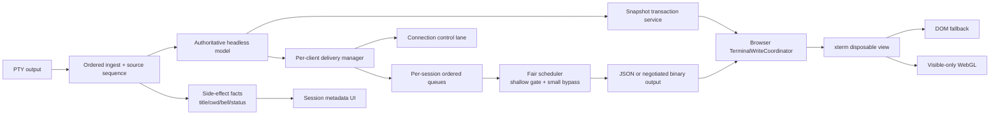

# Orca 터미널 스택 흡수 연구 및 BuilderGate 최종 구현 계획

날짜: 2026-07-15

BuilderGate 기준선: `ca111fef3b5a5a25d3aa488415c929e90ade46fd`

Orca 기준선: `e0edc8ef76d341f7ab8083a006f785322bcaeb23`

SpecKiwi Active Target: `0.5.5-buildergate-stability`

연구 run-id: `2026-07-15.projectmaster.orca-terminal-absorption.s01`

선행 문서: [Orca 대비 BuilderGate 다중 세션 성능 주장 검증 및 개선 계획](./2026-07-15.orca-buildergate-multisession-performance-fact-check-and-plan.ko.md)

후속 refresh 연구: [Orca식 새로고침 retained-state 복구 연구 및 전면 리팩토링 계획](./2026-07-15.orca-refresh-retained-state-refactor-research-and-plan.ko.md)

문서 성격: 후속 연구와 구현 로드맵. 이 문서 자체는 SRS나 실행 코드를 변경하지 않는다.

---

## 1. 최종 결론

BuilderGate는 Electron으로 다시 만들 필요가 없다. 다만 Orca의 수치와 파일을 그대로 복사하는 것이 아니라, Orca가 오랜 터미널 회귀를 해결하며 확립한 **권위·순서·공정성·복구 불변식**을 BuilderGate의 WebSocket/WAN·다중 client 환경에 맞게 흡수해야 한다.

G1이 architectural migration을 선택한 분기의 최종 방향은 다음과 같다. Confirmed-bug-only이면 이 목록을 활성화하지 않고 국소 fix에서 종료한다.

1. 사용자가 직접 조절하는 저수준 buffer 숫자는 없애거나 고급 호환 계층으로 내린다.
2. queue cap 자체는 없애지 않는다. Orca도 여러 단계의 bounded queue를 사용한다.
3. 서버의 headless terminal을 권위 있는 model로 만들고 브라우저 xterm은 폐기 가능한 view로 취급한다.
   브라우저가 사용자에게 제공하는 history 범위는 server authoritative retained range를 넘지 않으며, 새로고침은 그 범위의 normal scrollback·active/alternate screen·cursor/mode·geometry를 복구한다.
4. 한 client의 한 세션이 출력 폭주를 일으켜도 다른 세션의 echo와 control이 묻히지 않도록 client별·session별 공정한 delivery scheduler를 둔다.
5. 숨겨진 view에는 model 반영 후의 전달 byte만 버리고, silent loss 대신 `dataGap` 또는 authoritative snapshot transaction을 사용한다.
6. live output, local snapshot, server snapshot, repair를 하나의 bounded browser write coordinator로 통합한다.
7. WebGL은 `auto + DOM fallback + context-loss recovery`로 도입하고, hidden view는 renderer suspension을 먼저 적용한 뒤 필요할 때만 cold parking한다.
8. copy/paste/IME/OSC52는 여러 UI 경로가 PTY에 직접 쓰지 못하게 단일 coordinator로 통합한다.
9. binary output은 **무조건 도입한다** (2026-08-16 오너 결정, `docs/research/binary-comms/00-decision-record.md`). capability negotiation과 rollback 계약은 그대로 필수다. 물리적 split WebSocket 은 별도 판단 대상으로 남는다.
10. 새 경로가 parity·soak·rollback gate를 통과한 뒤에만 기존 로직을 제거한다.

2026-07-15 후속 refresh 연구에서 server/local snapshot과 기존 E2E가 모두 viewport-only를 정상 계약으로 고정한다는 사실을 확인했다. 따라서 G1이 architectural migration을 선택하면 local cache 성공을 recovery 완료로 보는 현재 경로와 viewport-only snapshot/replay는 최종 삭제 대상이다. 단, 사용자가 경험한 개별 사고가 oversized empty fallback, replay tail, remount handoff 중 어느 경계에서 발화했는지는 Phase 0-R runtime correlation으로 확정한다.

사용자가 허용한 것처럼 G1 architectural-migration 분기의 최종 상태에서는 기존 로직을 크게 걷어낼 수 있다. 그러나 big-bang 교체는 화면 깨짐의 원인을 더 찾기 어렵게 만들고 lossy rollout을 되돌릴 수 없게 하므로 **shadow → authority 전환 → canary → legacy 삭제** 순서로 교체한다. G1이 confirmed-bug-only를 선택하면 국소 수정과 회귀 검증 뒤 migration Phase 3~10을 시작하지 않는다.

---

## 2. 조사 방법과 한계

`kiwi-srs-research`의 고정 5-role 토폴로지를 사용했다. 격리 검증에서 초기 Triage audit-only 실행과 CODE_PATH를 본 초기 Researcher C가 역할 계약을 충족하지 못해 raw에서 폐기됐고, `fork_turns=none` clean-room Triage/C로 교체했다. 따라서 실행된 고유 subagent는 7개이고, 최종 synthesis에 들어간 유효 core 역할은 아래 5개다. 폐기·대체 이력은 agent manifest에 남긴다.

| 역할 | 조사 범위 |
| --- | --- |
| Triage (`/root/research_triage_isolated`) | buffer, protocol, model/view, renderer, clipboard, SRS 질문의 clean-room 분해 |
| Researcher A (`/root/buildergate_code_research`) | BuilderGate 설정 consumer, PTY→WebSocket→xterm 경로, 복구·clipboard 코드 감사 |
| Researcher B (`/root/orca_external_source_audit`) | `C:\Work\git-none\orca`의 daemon, model/view, WebGL, paste·IME 소스 감사 |
| Researcher C (`/root/transplant_risk_research_isolated`) | risk package만 사용한 WAN·다중 client 위험, 대안, rollback·검증 matrix |
| Synthesizer (`/root/orca_research_synthesizer`) | 합의와 이견 분리, 증거 결합, 최종 권고 및 Tier 2 재리뷰 |

두 저장소는 UTF-8로 읽었고 Orca는 수정하지 않았다. BuilderGate와 Orca의 HEAD를 위 커밋으로 고정했다.

현재 BuilderGate 기준선의 자동 검증 결과는 다음과 같다.

| 검사 | 결과 | 해석 |
| --- | --- | --- |
| server TypeScript `--noEmit` | 통과 | 연구 중 runtime code 변경 없음 |
| frontend `npm run typecheck` | 통과 | 연구 중 runtime code 변경 없음 |
| safe-send priority + transport parser | 11/11 통과 | 현재 unified safe-send와 split opt-in parser 계약은 살아 있음 |
| terminal output/hidden/recovery/residency/backpressure/IME 관련 unit 표본 | 79/80 통과 | 1건은 함수 본문을 900자로 자르는 정적 test fixture가 실제 `flushTransportOutbox(finishReason)` 호출 직전에 잘리는 기존 취약성이다. production 호출은 존재한다. |
| split handshake·routing suite | 3/16 통과, 13건 실패 | parser/test 자산은 남아 있지만 production `WsRouter`에서 split pairing·routing 구현이 제거되거나 연결되지 않은 drift를 재현한다. |
| SpecKiwi validation | error 0, warning 1 | unrelated draft `REL-BGSTAB-005` 경고이며 이 연구에서 SRS를 변경하지 않았다. |

실패를 이번 문서 작업의 회귀로 보지 않고 숨기지도 않는다. Phase 0은 split suite의 production drift와 고정 길이 source-slice test를 먼저 정상화해야 한다.

정적 코드와 기존 테스트 자산은 확인했지만 동일 장비에서 두 제품의 runtime profile을 직접 비교하지 않았다. 따라서 적정 gate·slice·tail 수치와 예상 개선율은 확정값이 아니다. 특히 Orca의 다음 단위는 서로 다르다.

| Orca 값 | 실제 단위 |
| --- | --- |
| shallow socket gate 128KiB | `socket.writableLength` byte |
| bulk slice 64Ki | JavaScript UTF-16 code unit |
| small-session bypass 4Ki | JavaScript UTF-16 code unit |
| background tail 512Ki/64Ki | JavaScript UTF-16 code unit |
| remote ACK window | encoded payload byte |
| remote output sequence | UTF-16 source high-water |

BuilderGate 계획에서는 `sourceSeq`, `encodedBytes`, `queuedCodeUnits`를 서로 다른 타입과 metric으로 다뤄야 한다.

---

## 3. 현재 BuilderGate에서 확인된 문제

### 3.1 설정과 실제 동작의 drift

| 설정군 | 현재 사실 | 목표 처리 |
| --- | --- | --- |
| `realtime.wsTransportMode` | parser와 public projection은 있으나 production은 `/ws` 하나와 browser socket 하나만 사용한다. | 현재 SRS·테스트·runtime drift를 먼저 해소하고 operator/internal capability로 이동한다. |
| `stabilityModes.headlessQueueMode` | `observe`와 `bounded` 모두 같은 bounded queue와 degrade 동작을 사용한다. | legacy alias로 수용한 뒤 제거 후보로 둔다. |
| `headless.writeLagWarnMs`, `writeBatchMaxBytes` | 저장·복제되지만 production write 판단에 쓰이지 않는다. | 구현할 근거가 없으면 제거한다. |
| WS high/hard/output/control/coalesce | safe-send에서 실제 safety 역할을 한다. | 사용자 UI가 아니라 effective policy 내부 값으로 유지한다. |
| visible queue/chunks/flush budget | 실제 scheduler의 memory·latency를 보호한다. | 내부 policy로 유지하고 profile/telemetry로 조정한다. |
| hidden policy/tail | 사용자가 현재 동작을 바꿀 수 있으나 model authority가 완전하지 않다. | authority 완성 후 `automatic restore`로 수렴하고 진단 옵션만 남긴다. |
| input/outbox cap과 TTL | reconnect·pre-ready input의 안전 계약이다. | 내부 safety invariant로 유지한다. |
| `terminal.scrollbackLines` | runtime parser는 보존하지만 xterm은 literal `10000`을 사용한다. | 서버·브라우저 history 보존 범위를 하나의 사용자 의미 설정으로 통합한다. |
| snapshot storage cap | local cache와 tombstone을 실제로 제한한다. | 내부 storage policy로 유지한다. |
| live runtime cap/TTL | hidden xterm residency를 제한한다. | profile-derived policy로 전환한다. |
| telemetry interval/limit | reserved이며 적용되지 않는다. | 관측 시스템과 통합하거나 제거한다. |

핵심은 **설정 UI를 단순화하는 것과 boundedness를 제거하는 것은 전혀 다른 작업**이라는 점이다.

### 3.2 출력·복구 correctness 문제

정적 코드로 확인된 우선 문제는 다음과 같다.

1. `terminalOutputScheduler.ts`는 UTF-8 prefix를 자를 때 code point마다 `TextEncoder.encode()`를 호출한다. 긴 ASCII entry에서는 budget 크기만큼 encode와 임시 allocation이 발생할 수 있다.
2. 300ms remount grace buffer는 output을 상한 없이 문자열로 합치며 `session:ready`를 snapshot보다 먼저 전달한다. input gate가 authoritative 화면 적용 전에 열릴 수 있다.
3. `TerminalView.bufferedOutputRef`는 xterm 부재 또는 restore pending 중 output을 byte/chunk cap 없이 모은 뒤 `join('')`한다.
4. local snapshot 복구가 성공하면 server repair 성공 전에도 hidden dirty/skipped 상태를 지운다. repair가 거절되면 stale local 화면이 완료 상태로 남을 수 있다.
5. local restore, snapshot replacement, screen repair, recovery tail은 bounded visible scheduler를 우회해 `term.write()`한다.
6. screen-repair pending queue가 overflow하면 snapshot refresh로 수렴하지 않고 누적 문자열 전체를 하나의 output으로 flush한다.
7. safe-send는 control과 terminal lane을 나누지만 terminal lane 내부는 session별 공정성이 없는 socket FIFO다.
8. PTY `onData`에는 OSC/title/status/AI TUI 분석이 여전히 직렬로 존재한다. 최근 PERF-BGSTAB-005/006/007로 중복 연산은 줄었지만, analyzer batching의 실제 효과는 profile 전까지 가설이다.

이 중 2~6은 성능 문제이면서 동시에 화면 깨짐·input ordering 문제다. 처리량 최적화보다 먼저 고쳐야 한다.

### 3.3 렌더링·선택·복사·붙여넣기 문제

- BuilderGate는 현재 `@xterm/addon-webgl`을 사용하지 않는다.
- Ctrl+C selection copy는 clipboard promise 성공을 확인하기 전에 selection을 지운다.
- tab·grid context-menu paste는 `pasteInput()`이 아니라 `sendInput()`을 직접 호출한다.
- registered preset paste만 xterm paste와 multiline/bracketed-paste 검증 경로를 사용한다.
- xterm v6 double-paste 방지를 위한 capture `preventDefault`와 IME transaction 방어는 이미 있으며 보존해야 한다.
- right-click 직전 selection을 별도 ref에 저장하는 DOM renderer workaround가 있다. WebGL 도입 시 이 workaround의 필요 여부와 회귀를 분리 검증해야 한다.

따라서 Orca 로직을 흡수한다는 것은 기존 IME 방어를 지우는 것이 아니라, **모든 입력·clipboard 경로의 ownership을 하나로 만들고 기존 방어를 그 아래로 옮기는 것**이다.

### 3.4 새로고침 retained-state 절단

후속 연구에서 다음 계약 수준의 절단을 확인했다.

- server headless는 기본 1,000줄을 보존하지만 refresh snapshot은 `{ scrollback: 0 }`이다.
- browser live xterm은 literal 10,000줄이지만 local snapshot도 `{ scrollback: 0 }`이다.
- `TC-7004`는 700줄 중 첫 marker가 snapshot과 reload 화면에 없는 것을 성공으로 assert한다.
- server snapshot이 2MiB를 넘으면 전체 payload가 empty+truncated fallback이 된다.
- snapshot ACK 대기 queue는 최대 256KiB tail만 남길 수 있고 truncation 뒤에도 retained tail만 flush한다.
- hidden/visible overflow recovery도 viewport-only repair로 끝나 lost scrollback을 복구하지 못한다.

따라서 목표 snapshot은 current screen만 복구하는 payload가 아니라 configured retention 안의 normal scrollback, active/alternate buffer, cursor/mode/geometry와 `snapshotSeq`를 포함하는 full retained-state transaction이어야 한다. Transport frame cap은 checkpoint를 chunking하는 기준이지 history를 empty로 만드는 retention cap이 아니다.

---

## 4. Orca에서 흡수할 핵심

### 4.1 얕은 socket gate와 session 공정성

Orca daemon batcher는 다음을 함께 보장한다.

- 2ms batching
- socket `writableLength` 128KiB gate
- 64Ki UTF-16 code-unit bulk slice
- session pending이 4Ki code-unit 이하이면 small-output bypass
- gate에서 hold된 session의 후속 entry도 같은 pass에서 hold하여 session 내부 순서 보존
- 다른 session의 작은 echo와 control은 먼저 전송 가능
- held memory 32Mi code-unit safety valve
- drain과 no-op sentinel callback을 통한 refill

BuilderGate가 가져올 것은 128Ki라는 상수가 아니라 다음 계약이다.

> 소켓에 이미 기록된 bulk는 추월할 수 없으므로 socket queue를 얕게 유지하고, 나머지는 session별 application queue에 둬서 작은 interactive output이 폭주 session을 추월하게 한다. 단, 같은 session의 data/control 순서는 절대 바꾸지 않는다.

### 4.2 model 반영과 view delivery 분리

Orca의 model/view 계약은 모든 PTY output의 model ingest/write-chain 등록을 renderer delivery 결정보다 먼저 수행하고, snapshot 생성은 그 model chain을 기다리도록 한다. private synchronous parse를 우선하지만 async fallback도 있으므로 모든 parse 완료가 delivery보다 앞선다고 과장해서는 안 된다. hidden delivery gate는 renderer-bound byte만 버리고 title, bell, agent status, query 처리와 model state는 계속 전진시킨다.

Orca 역시 무제한 history를 제공하지 않는다. Local daemon의 실효 headless retention은 약 5,000줄이고, remote initial/gap recovery는 `scrollbackRows=0`으로 current screen만 복구한다. BuilderGate가 흡수할 것은 이 수치나 remote screen-only 정책이 아니라 session-owned model과 disposable view의 lifecycle이다. BuilderGate의 browser-visible history와 server recovery range는 별도 계약으로 일치시킨다.

배경 monitoring queue가 커지면 가장 오래된 delivery를 버리고 다음을 남긴다.

- session tail 최대 512Ki code units
- 최소 tail 64Ki code units
- background 전체 약 2Mi code-unit budget
- `dataGap` ordered control event
- 원본 sequence 진행량과 실제 전달량의 분리
- blocked TUI query의 bounded salvage

BuilderGate에서도 drop은 model ingestion 이후, client/session delivery queue에서만 허용한다. 한 client가 느리다는 이유로 PTY나 다른 client를 멈추면 안 된다.

### 4.3 snapshot은 state replacement transaction

Orca의 remote ACK overflow는 단순 tail flush가 아니다. headless snapshot을 우선하되 renderer snapshot fallback도 허용하고, `SnapshotStart`의 stream ID, sequence, geometry와 snapshot frame을 보낸 뒤 snapshot sequence 이하의 queued live chunk를 제거하고 남은 live output을 flush한다. 다만 현재 Orca protocol에는 explicit epoch나 snapshot-apply ACK가 없고, Output ACK는 output payload byte에만 적용된다.

BuilderGate는 WebSocket/WAN과 다중 client를 고려해 이 원칙보다 강한 다음 목표 transaction을 별도 capability 계약으로 정의한다.

1. authoritative model snapshot 생성
2. negotiated stream epoch와 snapshot sequence/geometry 전송
3. snapshot sequence 이하 queued live chunk 제거
4. client의 snapshot 적용·drain ACK
5. 같은 epoch의 snapshot 이후 live output 재개

Orca의 일반 snapshot model은 normal/alternate buffer, mode, dimension, OSC link, pending escape tail을 구분한다. 그러나 현재 remote ACK-overflow payload는 `oscLinks`와 `pendingEscapeTailAnsi`를 전달하지 않아 일반 snapshot과 완전한 parity가 없다. BuilderGate target transaction에서는 이 상태를 명시적 parity 항목으로 올리고 partial escape, saved cursor, wrap-pending까지 별도 회귀 테스트로 고정한다.

BuilderGate의 screen repair overflow와 hidden reveal도 이 transaction으로 수렴해야 한다.

### 4.4 query와 side-effect authority

hidden byte를 버리면 그 안의 terminal query도 renderer에 도달하지 않는다. Orca는 delivery 결정을 reply ownership 결정으로 사용한다.

- live chunk가 visible view에 전달되면 그 view만 query에 답한다.
- hidden gate가 chunk를 버리면 model responder만 답한다.
- snapshot/replay/seed byte에는 아무도 답하지 않는다.
- 여러 view가 붙어 있으면 driver/responder owner를 하나로 정한다.

현재 Orca는 안정 상태에서 responder 중복을 막지만 visibility 전환 race나 query sequence가 drop/deliver 경계에서 분할되면 reply가 누락될 수 있어 전체 구간 보장은 always-exactly-once가 아니라 at-most-once다. BuilderGate 목표 gate는 query 종류별로 **정확히 1회 또는 정책상 명시적인 0회**를 요구하고 전환 race를 포함한다.

BuilderGate는 다중 browser client가 가능하므로 session별 input/resize/query driver lease가 hidden drop보다 먼저 필요하다.

### 4.5 WebGL과 disposable view

Orca는 WebGL을 무조건 고집하지 않는다.

- platform/GPU auto policy
- addon attach 실패 시 DOM fallback
- context loss 시 즉시 DOM fallback
- hide/suspend 시 addon dispose
- Windows/ANGLE context budget을 위해 `WEBGL_lose_context`
- resume/wake에서 bounded retry
- cold parking 전에 renderer suspension

Orca의 beta addon private patch와 xterm private field 접근은 버전 결합도가 높다. BuilderGate는 stable addon의 public API부터 도입하고, 실제 재현 test로 불가능한 경우에만 pin+patch를 검토한다.

### 4.6 selection, paste, IME, OSC52

Orca에서 흡수할 계약은 다음과 같다.

- Windows/Linux Ctrl+C는 selection이 있을 때만 copy하고, 없으면 SIGINT로 보낸다.
- 모든 paste source는 하나의 coordinator에서 target 유효성, byte cap, chunking, timeout, bracketed paste, backpressure를 처리한다.
- paste는 UTF-8 byte를 기준으로 direct/chunk/total limit을 구분한다.
- ESC가 포함된 bracketed paste가 frame을 조기 종료하지 못하게 sanitize한다.
- clipboard text, image path, keyboard, context menu, right click의 exactly-once owner를 정한다.
- IME composition, candidate-key ownership, post-composition guard를 독립 상태로 취급한다.
- OSC52 clipboard write는 opt-in, query는 무응답, payload는 bounded validation한다.

Orca의 64Ki/16Ki/16MiB/30초 수치는 BuilderGate 기본값이 아니라 benchmark seed다.

---

## 5. 그대로 복사하지 않을 항목

| 항목 | 판단 | 이유 |
| --- | --- | --- |
| Electron/`node:net` control·stream socket 구현 | 원칙만 흡수 | BuilderGate는 HTTPS WebSocket, token 갱신, WAN, proxy, 다중 client가 있다. |
| 128KiB/64Ki/4Ki/512Ki 상수 | 측정 seed | 단위와 transport 조건이 다르다. |
| slow view 때문에 PTY pause | 기본 해법으로 금지 | 한 WAN client가 shell·agent·다른 client까지 멈출 수 있다. authority ingestion 자체가 포화될 때만 별도 검토한다. |
| xterm private `_core`·saved cursor field | 가급적 금지 | xterm version upgrade와 결합된다. |
| beta WebGL addon patch | 조건부 | stable addon+golden test로 재현한 결함이 있을 때만 pinning한다. |
| cold parking 30초/15분/8 worktree/12 tab | 정책만 흡수 | Orca UX와 memory profile에 특화된 값이다. |
| binary protocol 즉시 도입 | **채택** | 2026-08-16 오너 결정으로 측정 게이트 폐기. `docs/research/binary-comms/00-decision-record.md` |
| 기존 BuilderGate IME/double-paste guard 전면 삭제 | 금지 | 이미 재현된 browser/xterm 회귀를 방어한다. coordinator 아래로 이동해 유지한다. |

---

## 6. 목표 설정 모델

### 6.1 사용자가 보게 될 의미 설정

다음 정도만 일반 Settings에 남기는 것이 목표다.

| 설정 | 후보 값 | 의미 |
| --- | --- | --- |
| Terminal 성능 정책 | `자동` / `저지연` / `메모리 절약` / `호환성` | 수십 개 cap 대신 정책 의도를 선택한다. 기본은 `자동`이다. |
| Scrollback/history | 줄 수 또는 작은 preset | 서버 model과 browser view가 복구 후에도 같은 보존 범위를 약속한다. |
| Renderer | `자동` / `DOM` | `자동`은 WebGL+fallback, `DOM`은 문제 해결용이다. 강제 WebGL은 일반 옵션으로 두지 않는다. |
| Copy on select | on/off | clipboard permission과 실패 처리를 포함한다. |
| Right-click | menu / selection-copy-and-paste | 플랫폼 습관에 맞는 의미 동작이다. |
| TUI clipboard write | off/on | OSC52 write opt-in이며 기본 off다. query는 허용하지 않는다. |

Settings UI의 시각·레이아웃 변경은 프로젝트 규칙에 따라 구현 전에 별도 사용자 승인을 받아야 한다.

### 6.2 내부 effective policy

사용자 profile, transport, RTT, drain rate, client 수, visible/hidden session 수, browser capability를 입력으로 받아 다음 내부 값을 계산한다.

- socket soft/hard gate
- client별·session별 pending cap
- output slice와 small-output bypass
- ACK window와 snapshot in-flight budget
- visible frame time/byte budget
- hidden tail/shared budget
- input/outbox cap과 TTL
- snapshot storage budget
- live view count, suspension/parking hysteresis
- paste direct/chunk/total byte cap과 timeout

모든 값에는 `unit`, `source`, `profileVersion`, `effectiveAt`을 붙인다. diagnostics에서는 읽을 수 있지만 일반 사용자가 숫자를 조정하지 않는다.

### 6.3 호환성 migration

1. 기존 키를 계속 읽고 현재 동작을 유지한다.
2. policy compiler를 shadow로 실행해 legacy 값과 derived 값을 비교한다.
3. non-default legacy override를 telemetry와 warning으로 식별한다. 값 자체는 로그에 노출하지 않는다.
4. 일반 Settings에서 저수준 필드를 숨기되 config/API alias는 유지한다.
5. 새 profile이 stable이 된 뒤 legacy 키에 deprecation warning을 낸다.
6. 두 release 이상 사용 증거와 rollback 검증 후 제거한다.
7. 알 수 없는 legacy 값은 다른 경로로 조용히 coerce하지 않고 명시적으로 거부한다.

---

## 7. 목표 아키텍처



### 7.1 서버 불변식

- PTY source order는 session별 `streamEpoch + sourceSeq`로 단조 증가한다.
- model commit 전에는 client delivery/drop을 결정하지 않는다.
- model은 configured retention 안의 normal scrollback, active/alternate buffer, cursor/mode/geometry와 parser tail을 보존하며 browser가 제공하는 history 범위보다 작을 수 없다.
- retention eviction과 checkpoint transport chunk/frame budget을 분리한다. 한 frame cap 초과는 empty snapshot 성공이 아니라 bounded chunk transaction 또는 명시적 failure/resync가 된다.
- side effect는 model/server가 한 번만 추출하고 hidden 여부와 무관하게 전달한다.
- client별 pressure는 해당 client delivery에서만 격리한다.
- 같은 session의 output, gap, snapshot barrier, ready marker는 하나의 ordered domain을 사용한다.
- connection control은 우선할 수 있지만 같은 session의 ordered marker를 앞질러 의미를 바꾸지 않는다.
- lossy drop은 항상 `dataGap` 또는 snapshot replacement로 관측된다.
- query responder와 resize/input driver는 session epoch마다 하나다.

### 7.2 브라우저 불변식

- 한 terminal에는 `term.write()`가 하나만 in-flight다.
- live, local cache, server snapshot, repair 모두 같은 coordinator를 통과한다.
- stale generation의 callback은 현재 view를 변경하지 않는다.
- local snapshot은 provisional cache이며 authoritative repair 성공 전 dirty 상태를 지우지 않는다.
- correctness는 local snapshot이 없거나 poisoned여도 server checkpoint만으로 성립해야 하며, recovery-equivalence와 soak 뒤 local snapshot path를 제거한다.
- `session:ready`와 input release는 snapshot/live drain 이후다.
- queue overflow는 거대한 join/flush가 아니라 stale 전환과 fresh snapshot 요청으로 수렴한다.
- hidden xterm은 cache이며 server model이 권위다.

### 7.3 restore transaction

1. client가 `restore-request(sessionId, viewGeneration, geometry)`를 보낸다.
2. server가 full retained-state checkpoint를 `snapshotEpoch`, `snapshotSeq`, `oldestRetainedSeq`, retention policy, geometry, active/alternate buffer와 mode state와 함께 고정한다.
3. 해당 client/session에 ordered snapshot barrier를 세우고 신규 live output을 bounded hold queue에 둔다. barrier 전에 socket에 기록됐거나 in-flight인 `sourceSeq <= snapshotSeq` frame은 delivery ACK로 drain됨을 확인하거나 새 epoch로 무효화한 뒤에만 snapshot을 보낸다.
4. browser는 snapshot barrier를 수락한 뒤 같은 session의 이전 epoch frame과 현재 epoch의 `sourceSeq <= snapshotSeq` frame을 폐기한다. 이후 browser write coordinator가 parser reset, ordered checkpoint chunks, digest 검증, mode rehydrate, pending escape tail을 순서대로 적용한다.
5. browser가 snapshot apply ACK를 보낸다.
6. server가 hold queue를 sequence 검사 후 이어 붙인다.
7. browser drain ACK 뒤에만 `session:ready`와 input gate를 연다.

overflow나 generation mismatch가 발생하면 같은 transaction을 새 epoch로 다시 시작한다. 이전 queue를 새 epoch에 재해석하지 않는다.

---

## 8. SpecKiwi 영향

Active Target은 `0.5.5-buildergate-stability`이며 50개 Requirement 중 implemented 25, planned 24, discarded 1이다. implemented 25개는 아직 verified가 아니다. draft blocker `REL-BGSTAB-005`는 이번 terminal stack과 직접 관계가 없지만 draft Requirement 구현 금지 규칙은 그대로 적용한다.

### 8.1 재사용할 기존 Requirement

| Requirement | 재사용 범위 |
| --- | --- |
| FR-BGSTAB-001/008/013 | resource config, legacy default, Settings persistence·rollback |
| FR-BGSTAB-002/016 | browser input backpressure, priority-aware safe-send |
| FR-BGSTAB-003, PERF-BGSTAB-001/004 | visible scheduler, frame budget, UTF-8 accounting |
| FR-BGSTAB-004/005/014 | snapshot budget, residency, hidden recovery |
| FR-BGSTAB-006/007 | split handshake/routing. 먼저 runtime·test·SRS drift를 해결해야 한다. |
| FR-BGSTAB-012 | bounded headless와 per-client WebSocket queue |
| REL-BGSTAB-003 → FR-BGSTAB-017 | repair overflow → recovery write/input barrier 순서. FR-BGSTAB-015 계약 교정이 선행돼야 한다. |
| FR-BGSTAB-018, REL-BGSTAB-004 | fallback convergence와 복구 신뢰성 |
| OBS-BGSTAB-001/002/003 | queue, recovery, event-loop/CPU evidence |
| FR-ARCH-004/006 | registered preset paste의 기존 계약 |

### 8.2 새로 만들거나 확장할 계약

ID는 이 문서에서 임의로 만들지 않고 SpecKiwi MCP로 할당한다.

- terminal model/view authority와 side-effect facts
- stream epoch, source sequence 단위, encoded byte credit
- snapshot/live atomic transaction과 pending escape tail
- per-client·per-session fairness와 starvation bound
- hidden delivery interest, dataGap, restore marker
- multi-client input/resize/query driver lease
- unified browser write coordinator와 bounded remount buffer
- renderer auto policy, WebGL context loss, DOM fallback, Unicode width parity
- copy/paste exactly-once ownership, IME compatibility, OSC52 security
- resource profile compiler와 legacy key deprecation
- negotiated binary/version/ACK/downgrade 계약은 도입 결정 시 별도 Requirement
- lossy feature별 rollback transaction
- browser refresh가 configured retained-state 전체를 복구하고 browser-visible history가 server authority 범위를 넘지 않는 계약
- retention eviction과 checkpoint transport chunk/frame budget을 분리하는 계약
- local snapshot을 provisional migration cache로 격하하고 recovery-equivalence 뒤 제거하는 계약

현 BGSTAB 범위는 split WebSocket 기본화와 rendering engine 교체를 범위 밖으로 기록하고 있다. 해당 범위를 바꾸기 전에는 신규 또는 superseding Requirement가 필요하다. 기존 ID나 Markdown을 손으로 수정하지 않는다.

FR-BGSTAB-015는 그대로 재사용할 수 없다. 현재 계약은 active runtime tuning 값을 일반 Settings에서 개별 편집하도록 요구하지만, 이 계획은 저수준 값을 compatibility facade 뒤에 두고 소수 profile로 대체한다. 따라서 Phase 0에서 사용자 승인과 SpecKiwi workflow를 거쳐 FR-BGSTAB-015를 개정하거나 superseding Requirement를 만들고, 최소한 다음 migration AC를 포함해야 한다.

- 기존 설정 파일과 Settings API의 read/write round trip을 보존하고, legacy key별 alias·source·effective value를 노출한다.
- 일반 Settings UI는 별도 사용자 승인 전에는 바꾸지 않으며, 승인 뒤에도 기존 필드에서 profile로 이동하는 명시적 migration과 rollback을 제공한다.
- non-default legacy 값의 우선순위, 충돌 오류, deprecation warning과 최소 두 release의 compatibility 기간을 고정한다.
- profile 선택이 실제 queue consumer에 적용됐다는 evidence와 legacy API/UI 회귀 test를 요구한다.

이 gate가 끝나기 전에는 Phase 2 enforcement나 legacy 설정 제거를 시작하지 않는다.

---

## 9. 최종 구현 계획

각 Phase는 `SRS 확인 → failing regression test → 최소 구현 → 관련 전체 test → 까칠한 reviewer → 수정 → No findings 재리뷰`를 통과해야 완료된다.

### Phase 0 — 계약과 기준선 고정

목표: 현재 drift를 실제로 닫고 이후 성능 수치를 비교할 재현 harness를 만든다.

작업:

1. FR-BGSTAB-006/007의 split handshake test와 production constructor/upgrade/browser socket 경로 불일치를 읽기 전용 진단과 failing test로 재현한다.
2. split 계약을 다음 둘 중 하나로 반드시 닫는다.
   - **Phase 0A — split 계약 복원:** FR-BGSTAB-006/007을 유지한다면 기존 SRS를 trace하는 TDD로 production constructor, upgrade, pairing, browser socket wiring과 fallback을 복원한다.
   - **Phase 0B — split 계약 교정:** split을 현 제품에서 폐기·유예한다면 구현을 진행하지 않고 사용자 승인과 적절한 SpecKiwi workflow를 거쳐 superseding Requirement, Status/Stability, Verification Evidence를 실제 runtime과 일치시킨다.
3. **Phase 0-R — refresh retained-state 계약 (#23):** `TC-7004`의 viewport-only 기대를 current characterization으로 고정하고, pre/post refresh retained buffer hash, 24/1,000/10,000행, legacy 2MiB 경계, active/hidden, local-cache absent/poisoned를 분리 재현한다. FR-BGSTAB-004/014 stable 계약의 확장 또는 supersede 방식과 server/browser history 범위를 사용자 승인으로 닫고, 신규·superseding refresh authority Requirement의 exact ID·승인 AC·`Stability=stable`을 downstream issue에 기록한다.
4. 현재 user-visible, reserved, inert, safety-only 설정의 consumer inventory를 읽기 전용 분석으로 확정한다.
5. 새 동작과 benchmark harness를 포괄하는 SRS 계약을 SpecKiwi로 작성하고 Stability gate를 통과시킨다.
6. SRS를 trace하는 failing test부터 작성한 뒤 machine-readable consumer fixture와 `NO_RENDER`, `NO_ANALYZER`, `NO_NETWORK`, `ONE_CLIENT_SLOW` benchmark mode를 만든다.
7. 고정 seed·payload, warm-up, trial 수와 지속시간, 동일 장비에서 legacy/canary interleaved 실행 순서, outlier·confidence interval 처리, hardware/browser/build/config를 기록하는 machine-readable benchmark manifest와 raw-sample schema를 만든다.
8. 1/8/32/54 session, 1/2/8 client, visible/hidden 조합을 반복 측정하고 raw sample과 p50/p95/p99 및 confidence interval을 함께 보존한다.

1의 원인 분석과 4는 read-only다. 기존 stable 계약을 복원하는 Phase 0A 외의 새 test, fixture, benchmark mode 변경은 5의 SRS gate 전에는 시작하지 않는다. Phase 0B/0-R에서 Requirement ID를 손으로 수정하지 않는다.

필수 지표:

- PTY bytes/code-units·chunks per second
- analyzer ns per source unit
- headless write latency와 event-loop delay
- client/session별 queued·in-flight·socket buffered byte
- input accepted/echo p50/p95/p99
- browser long task와 xterm write callback latency
- snapshot/repair convergence latency
- refresh 전후 oldest retained line, logical line/cell hash, active buffer/cursor/mode parity와 checkpoint encoded byte/chunk 수
- live xterm·WebGL context·DOM node·heap 수

종료 조건: runtime·test·SRS 사이 split drift가 0이고, 재실행 가능한 benchmark manifest·raw sample·요약 통계, SRS trace, 모든 새 동작의 failing test 위치가 확정된다. Refresh는 retention 밖 expected eviction과 retention 안 loss를 구분하고 특정 신고의 발화 경계를 적어도 하나 deterministic하게 재현한다. G1 evidence로 confirmed-bug-only 또는 architectural migration 분기를 선택하며 migration 이득이 입증되지 않으면 Phase 4 shadow/promotion을 열지 않는다. Phase 0A 또는 Phase 0B와 Phase 0-R이 끝나지 않으면 관련 Phase 1/3/4로 진행하지 않는다.

Rollback: Phase 0A는 unified fallback을 보존한 rollout flag와 fresh reconnect로 되돌린다. Phase 0B는 문서·상태 교정이므로 SpecKiwi change note와 별도 superseding 절차로만 재변경한다. benchmark 관측 자체는 runtime 기본값을 바꾸지 않는다.

### Phase 1 — 저위험 correctness와 interaction hot-fix

목표: authority 재설계 전에도 명백한 allocation·ordering·clipboard 결함을 제거한다.

PR 1A — UTF-8 scheduler:

- code point 값으로 UTF-8 width를 계산해 code-point별 `TextEncoder.encode()`를 제거한다.
- coalesce가 하나의 무제한 문자열을 만들지 않도록 segmented deque 또는 bounded rope 형태로 바꾼다.
- surrogate, combining mark, emoji ZWJ, maxBytes 경계 회귀 test를 추가한다.

PR 1B — repair overflow:

- screen-repair overflow가 giant concatenation을 flush하지 않고 fresh snapshot transaction을 요청하게 한다.
- 현 단계의 snapshot이 viewport-only이면 retained-history 복구 성공을 주장하지 않고 stale/restore-needed를 유지한다. Full retained-state convergence는 Phase 4/6 gate로 남긴다.
- FR-BGSTAB-015 계약 교정 뒤 `REL-BGSTAB-003 → FR-BGSTAB-017` 순서를 지킨다.

PR 1C — bounded temporary buffers와 recovery barrier:

- remount grace output과 `bufferedOutputRef`에 byte/chunk cap을 둔다.
- cap 초과 시 stale+authoritative restore로 전환한다.
- grace flush에서 snapshot을 ready보다 먼저 적용하고 ready는 write drain 이후 전달한다.

PR 1D — clipboard ownership 1차 통합:

- keyboard, tab context menu, grid context menu, registered preset가 같은 `pasteInput` facade를 사용한다.
- copy promise 성공 후 selection을 지우고 실패를 observable error로 남긴다.
- selection 없는 Ctrl+C는 계속 SIGINT로 전달한다.
- 기존 IME와 xterm v6 double-paste guard를 회귀 test로 고정한다.

각 PR에는 독립 rollout flag 또는 동등한 adapter boundary와 전환 metric을 포함한다. 1B/1C는 known giant/direct overflow 경로를 rollback 후보로 보존하지 않는다. 새 경로가 불안정하면 새 admission을 끄되 cap과 authoritative recovery barrier는 유지하는 safe degraded adapter를 사용한다.

종료 조건: temporary output memory가 모두 bounded이고, recovery 전에 input이 풀리지 않으며, paste exactly-once test가 통과한다.

Rollback: 1A/1D는 byte drop이 없는 경로이므로 flag 또는 adapter 전환으로 복귀한다. 1B/1C는 새 admission 중단 → affected terminal stale 표시 → parser reset → fresh authoritative snapshot → generation 교체 순으로 수렴하고, cap을 더 보수적으로 낮춘 safe bounded writer 또는 reconnect fallback으로 전환한다. giant concatenation, unbounded buffer, recovery direct write는 복원하지 않는다. 계약상 이를 복원해야 하는 상황이 생기면 구현 대신 Phase 0의 superseding SRS gate로 돌아간다.

### Phase 2 — 설정 policy compiler shadow와 enforcement canary

목표: compatibility와 effective policy를 증명한 뒤, 복잡한 buffer 설정을 실제 의미 profile로 안전하게 전환한다.

#### Phase 2A — observe-only compiler

- `TerminalResourcePolicy` 단일 타입에 단위와 source를 명시한다.
- 기존 raw config를 `legacyPolicy`로 그대로 계산한다.
- 새 `automatic/low-latency/memory-saving/compatibility` compiler를 observe-only로 실행한다.
- 두 정책의 cap, admission, drop/reconnect 결정을 비교하되 legacy 결정만 적용한다.
- inert 키는 사용 경고, non-default 키는 deprecation 후보 count만 기록한다.

#### Phase 2B — 비손실 enforcement canary

- 2A 차이 보고, FR-BGSTAB-015 계약 교정과 SRS gate를 통과한 client/session만 대상으로 삼는다.
- cap 증가는 적용할 수 있고, cap 감소는 기존 entry를 건드리지 않은 채 새 admission 거절 또는 원래 expiry 보존처럼 byte loss·stale·snapshot·reconnect를 유발하지 않는 결정만 적용한다.
- Phase 3 coordinator와 Phase 4 authority 이전에는 기존 reliable output을 drop하거나 stale로 바꾸거나 recovery direct write를 호출하지 않는다. 그런 결정은 shadow telemetry에만 기록한다.
- 기존 queue consumer부터 canary 적용하고, Phase 3~9의 신규 consumer는 생성될 때 모두 `TerminalResourcePolicy`에 등록한다.
- `effectivePolicy`, 원본 source, legacy alias, deprecation warning, cap 전환 결과를 operator telemetry에 노출한다.
- 일반 Settings의 profile UI는 별도 사용자 승인을 받은 뒤에만 활성화하고, 그전에는 기존 UI와 compatibility facade를 유지한다.

#### Phase 2C — consumer별 lossy enforcement canary, 후행 실행

2C는 문서 번호와 무관하게 Phase 3 write coordinator와 Phase 4B single authority를 통과한 뒤 실행한다. hidden drop·dataGap에 관련된 consumer는 Phase 6까지 통과해야 한다.

- cap 감소가 현재 점유량보다 낮으면 silent truncate하지 않고 data class별 transaction을 사용한다.
  - reliable output·snapshot은 새 admission 중단 → drain 또는 stale → fresh snapshot에서 새 generation 적용
  - input/outbox는 기존 entry의 원래 expiry를 보존하고 새 entry부터 새 cap/TTL을 적용하며 거절을 호출자에게 노출
  - socket/protocol mode는 reconnect epoch 경계에서만 전환
- consumer마다 prerequisite, loss semantics, convergence, rollback evidence를 따로 갖추고 canary 범위를 독립 확장한다.

종료 조건: 2A/2B는 representative workload에서 derived policy 차이를 설명하고 비손실 canary의 effective cap·transition·rollback을 재현하면 끝난다. 전체 policy migration은 2C의 대상 consumer가 실제 queue에 적용되고 silent coercion이 0일 때만 완료한다.

Rollback: 2A는 shadow와 telemetry를 끄면 끝난다. 2B는 새 admission을 중단하고 legacy raw config로 다시 compile하되 기존 entry와 cap을 건드리지 않는다. 2C는 affected terminal을 parser reset+fresh snapshot 또는 reconnect epoch로 먼저 수렴시킨 뒤 compatibility policy로 전환하며, unbounded/direct recovery를 복원하지 않는다.

### Phase 3 — Browser TerminalWriteCoordinator

목표: 화면에 쓰는 모든 경로를 한 ordered state machine으로 통합한다.

작업:

- live output, local restore, server snapshot, repair, recovery tail을 하나의 per-terminal deque에 넣는다.
- generation/epoch, source sequence, geometry, write kind를 entry에 포함한다.
- 한 terminal당 write 하나만 in-flight로 둔다.
- frame time/byte budget, input yield, parse-settle timeout을 공통 적용한다.
- local snapshot은 provisional로 표시하고 server ACK 전 dirty를 지우지 않는다.
- stale callback, dispose race, focus, user-scroll, IME-active rejection을 state machine으로 처리한다.

종료 조건: production 코드에서 coordinator 밖의 `term.write()` 복구 경로가 0이고 snapshot/live loss·dup·reorder test가 0건 실패한다.

Rollback: 새 queue generation의 admission을 막고 fresh server snapshot으로 수렴한 뒤, coordinator의 최소 기능만 남긴 safe bounded writer로 전환한다. 이 fallback도 per-terminal single in-flight, byte/chunk cap, recovery drain barrier를 지키며 legacy direct/unbounded writer는 복원하지 않는다. 의도적으로 기존 계약을 바꿔야 한다면 Phase 0의 superseding SRS gate로 돌아간다.

### Phase 4 — Server model authority shadow, 승격 pilot과 driver lease

목표: hidden byte를 버리기 전에 model과 query/side-effect 권위를 완성한다.

#### Phase 4A — authority shadow

- source sequence를 PTY ingest에서 할당하고 model commit 뒤 delivery event를 만든다.
- headless checkpoint에 configured retained normal scrollback, active/alternate buffer, dimensions, modes, cursor, pending escape tail, `oldestRetainedSeq`를 포함한다.
- title/cwd/bell/status를 side-effect facts로 한번만 추출한다.
- 기존 viewport snapshot과 새 retained checkpoint의 current screen을 비교하고, 새 checkpoint 자체는 pre-refresh model의 full retained logical-line/cell hash, cursor, mode, alternate buffer, Unicode width와 shadow 비교한다.
- browser literal history, server retained rows와 checkpoint transport limit의 effective policy를 함께 기록하고 transport cap 초과가 empty success가 되지 않게 한다.
- session별 input/resize/query-reply driver lease와 epoch를 정의한다.
- replay/seed/snapshot byte가 query reply를 발생시키지 않음을 검증한다.

#### Phase 4B — single-authority promotion pilot

- parity gate를 통과한 session만 새 stream epoch에서 신규 model을 snapshot/query/side-effect의 단일 owner로 승격한다.
- 구 responder를 먼저 disable하고 ACK한 뒤 새 responder를 enable한다. 두 responder가 동시에 query에 답하는 구간을 허용하지 않는다.
- input/resize/query driver lease를 같은 epoch barrier에서 이전하고 stale lease의 write를 거부한다.
- title/cwd/bell/status side effect는 `(sessionId, streamEpoch, sourceSeq, sourceOffset 또는 factOrdinal, factType, 필요한 경우 valueHash)`로 식별한다. 한 ingest chunk 안의 동일 type fact 여러 건을 보존하는 회귀 test를 둔다.
- 승격 직후 fresh authoritative snapshot을 적용하되 hidden delivery drop은 아직 켜지 않는다. legacy model은 passive comparer로만 유지한다.
- local snapshot을 삭제·poison 처리한 hard-reload canary에서도 server checkpoint와 post-snapshot delta만으로 pre-refresh retained-state hash를 복구한다.
- Legacy 2MiB 경계를 넘는 regression payload와 stable-SRS-approved checkpoint budget 경계를 각각 시험한다. 실제 chunk/in-flight threshold는 승인된 effective policy에서 파생하고, ordered chunks와 digest/apply ACK 전체 drain 뒤에만 session ready/input을 연다.

주의: AI TUI 사용자 typing, local echo, prompt redraw가 session을 `running`으로 바꾸지 않는 기존 invariant를 보존한다.

종료 조건: shadow parity가 합의된 workload와 platform에서 기준을 충족하고, promotion canary에서 신규 owner 1개·구 responder reply 0·query duplicate reply 0·side-effect duplicate 0을 증명한다. 또한 local cache absent/poisoned, 10,000 logical lines와 large multibyte checkpoint에서 retention 안 loss·duplicate·reorder가 0이어야 한다.

Rollback: 4A는 shadow model과 fact comparison을 끈다. 4B는 새 responder와 lease를 먼저 revoke하고 parser reset+fresh legacy snapshot+새 epoch를 적용한 뒤 legacy responder를 다시 enable한다. side-effect dedup ledger는 rollback epoch가 안정될 때까지 유지한다. delivery drop은 아직 없으므로 원본 PTY 진행량은 보존된다.

### Phase 5 — Per-client fair delivery scheduler

목표: 한 session flood가 다른 session과 control을 매몰시키지 않게 한다.

작업:

- socket별 global terminal FIFO를 client별 session deque로 분리한다.
- 같은 session의 output/gap/barrier 순서는 유지한다.
- shallow socket gate, bounded bulk slice, small pending bypass를 도입한다.
- active driver, visible viewer, hidden viewer는 weight/hint로 사용하되 starvation bound를 둔다.
- control lane도 connection control과 session-ordered control을 구분한다.
- capability 협상된 JSON output에도 `deliverySeq`와 encoded-byte 기준 cumulative ACK/credit을 넣어 binary 전환 전부터 per-client in-flight를 측정하고 제한한다.
- server가 `(connectionEpoch, sessionId, deliverySeq, encodedBytes)` frame ledger를 소유하고 ACK는 같은 epoch/session의 단조 `deliverySeq`까지만 credit을 반환한다. duplicate ACK는 idempotent, stale epoch는 reject, unknown sequence나 over-ACK는 credit을 늘리지 않고 clamp한 뒤 observable protocol error로 남긴다.
- client가 보낸 byte count를 신뢰하지 않으며 cumulative/delta 의미를 혼용하지 않는다. duplicate·stale·out-of-order·over-ACK 회귀 test를 SRS에 포함한다.
- ACK timeout 또는 credit 소진 시 해당 client/session만 `dataGap + fresh snapshot` transaction으로 수렴시키고, 반복 실패는 WebSocket 1013 close로 격리한다.
- ACK capability가 없는 legacy client에는 더 엄격한 application queue와 `bufferedAmount` gate를 적용하되 가짜 ACK나 무한 대기를 만들지 않는다.
- slow client overflow는 해당 client snapshot/reset 또는 1013 close로 격리한다.
- PTY producer pause는 한 client의 delivery pressure에 사용하지 않는다.

알고리즘은 Orca식 hold+bypass 또는 DRR 중 benchmark로 선택한다. SRS에는 algorithm 이름보다 fairness·ordering·memory bound를 명시한다.

종료 조건: 7개 hidden flood 중 active echo/control starvation이 없고 client/session queue가 지속 증가하지 않는다. WAN emulation에서 credit이 음수가 되거나 wedge·무한 ACK 대기가 발생하지 않고, legacy capability fallback도 bounded하게 수렴해야 한다.

Rollback: scheduler admission을 먼저 중단하고 현재 ACK/credit ledger를 bounded drain하거나 명시적으로 abort한다. 이어 `connectionEpoch`를 증가시키고 capability를 재협상하거나 reconnect한 뒤 fresh snapshot을 적용한다. 이 경계가 완료된 client만 legacy safe-send로 복귀시켜 새 ACK frame·credit ledger와 legacy lane이 한 connection에서 섞이지 않게 한다.

### Phase 6 — Hidden delivery gate와 authoritative recovery

목표: hidden xterm을 output 저장소가 아닌 disposable cache로 만든다.

선행조건: Phase 3 write coordinator, Phase 4B single-authority promotion pilot, Phase 5 per-client queue가 모두 통과해야 한다.

작업:

- client/session별 visibility generation과 delivery-interest ref count를 도입한다.
- model commit 이후 hidden renderer delivery만 drop한다.
- 최초 drop latch와 `restore-needed/dataGap` marker를 crash/reconnect 동안 보존한다.
- reveal 시 configured retention 전체를 포함하는 server checkpoint transaction을 실행한다. Viewport-only repair는 dropped scrollback을 복구한 것으로 판정하지 않는다.
- hidden tail은 preview/diagnostic일 뿐 복구 권위로 사용하지 않는다.
- sidecar consumer와 query driver가 필요한 raw byte는 delivery interest로 gate를 억제한다.

종료 조건: hidden flood 중 model·title·status가 계속 진행하고 reveal은 snapshotSeq 이후 output만 정확히 이어 붙인다. silent gap은 0이다.

Rollback: gate를 먼저 닫고, 모든 affected view에 parser reset+fresh snapshot을 적용한 뒤 generation을 교체한다. flag만 끄는 것은 rollback이 아니다.

### Phase 7 — Renderer, Unicode, residency

목표: visible render 처리량과 화면 정확성을 높이고 hidden GPU/DOM 자원을 회수한다.

PR 7A — WebGL auto:

- visible terminal에만 WebGL addon을 attach한다.
- attach 실패/context loss 시 DOM으로 즉시 fallback한다.
- hide/suspend 시 addon과 context를 해제한다.
- wake/resume에서 bounded retry한다.

PR 7B — visual correctness:

- server/browser Unicode width와 ZWJ 정책을 맞춘다.
- emoji table, combining mark, wide CJK, alternate screen, cursor, saved cursor, partial escape golden test를 추가한다.
- selection은 DOM pixel이 아니라 terminal buffer line/cell과 stable source line identity 또는 snapshot/buffer generation에 귀속한다. 같은 stream epoch·geometry만으로는 보존하지 않는다. snapshot/reset/reflow/parking 뒤 두 anchor가 같은 generation 또는 검증 가능한 source sequence·line identity로 재매핑될 때만 보존하고, 그 외에는 명시적으로 clear하여 stale selection copy를 거부한다.
- user-scrolled selection 중 output/reflow, WebGL context loss, DOM fallback, hide/reveal과 fresh snapshot 회귀 test를 추가한다.
- public API로 해결할 수 없는 재현 결함에만 version pin/patch를 검토한다.

PR 7C — residency:

- renderer suspension 효과를 먼저 측정한다.
- snapshot-backed session만 cold parking 후보로 삼는다.
- 최근 hidden view warm 보존과 hysteresis를 benchmark로 정한다.

종료 조건: context loss 후 blank/garble 없이 DOM으로 복귀하고 repeated hide/reveal 후 context·DOM·heap이 기준선으로 수렴한다.

Rollback: WebGL은 dispose하고 DOM renderer를 refresh한다. parked view는 fresh snapshot remount가 필요하다. 7B Unicode width/ZWJ policy는 server와 browser provider/version을 같은 reconnect epoch에서 함께 이전 버전으로 되돌리고, 기존 cell state를 재해석하지 않은 채 fresh authoritative snapshot으로 재동기화한다.

### Phase 8 — Clipboard·paste·IME·OSC52 완성

목표: 모든 입력 source의 exactly-once와 보안을 한 계약으로 완성한다.

작업:

- keyboard, context menu, right click, command preset, programmatic paste를 `TerminalInputCoordinator`로 통합한다.
- UTF-8 total/direct/chunk limit, local/WAN timeout, acceptance ACK를 적용한다.
- server는 `(clientId 또는 connectionEpoch, sessionId, inputOperationId 또는 inputSeqRange)` keyed dedup/result-replay ledger를 갖고 각 entry에 canonical payload의 encoded byte length와 digest를 결합해 PTY write 결과를 멱등 재전송한다. ACK 유실 후 동일 operation·동일 payload 재시도는 다시 쓰지 않으며, 같은 operation ID에 다른 payload가 오면 기존 결과를 replay하거나 새로 쓰지 않고 observable protocol error로 거절한다. reconnect에서는 새 connection epoch와 재사용 가능한 operation ID의 범위를 명시한다.
- dedup ledger eviction은 input TTL과 최대 entry/byte cap 중 먼저 도달한 경계를 따르고, 이미 eviction된 operation의 불확실한 재시도는 silent re-execute하지 않고 `expired` 또는 `unknown`으로 거절한다.
- multiline은 bracketed-paste capability에 따라 명시적으로 처리하고 embedded ESC를 sanitize한다.
- target generation 변경, expired/rejected/unacked 상태를 구분한다.
- copy-on-select는 debounce와 size cap을 둔다.
- OSC52 write는 default deny, opt-in, bounded base64/UTF-8 validation, query deny로 구현한다.
- Windows 한글 IME, Linux candidate key, macOS composition, kitty keyboard chord를 회귀 matrix에 포함한다.

종료 조건: 모든 paste source가 PTY에 정확히 한 번 기록되고 composition duplicate/missing text가 0이며 clipboard 실패가 trace 가능하다. ACK-loss-after-write, duplicate retry, 같은 operation ID의 payload mismatch, reconnect boundary와 ledger eviction 회귀 test가 모두 통과해야 한다.

Rollback: coordinator가 새 paste admission을 멈춘 뒤 pending operation을 명시적으로 reject하고, 기존 `pasteInput`의 multiline/bracketed-paste 검증과 IME guard를 보존한 safe adapter로 전환한다. context-menu direct `sendInput` 우회는 다시 활성화하지 않는다.

### Phase 9 — 차세대 binary data plane (무조건 착수)

Phase 0의 기존 FR-BGSTAB-006/007 drift 해결을 이 단계까지 미뤄서는 안 된다 — 이것은 승인 게이트가 아니라 **기술적 작업 순서**이므로 게이트 폐기와 무관하게 유지된다. Phase 9는 Phase 0A로 기존 split 계약을 복원한 경우의 차세대 output/binary 확장 또는 Phase 0B로 계약을 교정한 뒤 새 Requirement로 다시 도입하는 경우를 다룬다.

도입 gate: **폐기됨 (2026-08-16).** 아래 두 조건은 더 이상 착수 조건이 아니다. 임계값이 어느 것도 숫자로 확정된 적이 없어 판정 불가능한 조건이었다. 근거는 `docs/research/binary-comms/00-decision-record.md`.

- ~~profile에서 JSON stringify/parse/UTF-8 재인코딩이 유의미한 CPU 비중을 차지해야 한다.~~
- ~~fair scheduler만으로 control HOL과 echo SLO를 만족하지 못해야 한다.~~

프로파일 측정 자체는 계속 수행하되, 목적은 도입 판정이 아니라 **전환 전후 비교와 회귀 감시**다.

도입 시 (= 무조건 적용):

- JSON control은 유지한다.
- output/snapshot만 versioned binary frame으로 전환한다.
- `channelId`, `streamEpoch`, `sourceSeq`, payload length, opcode를 명시한다.
- capability handshake와 old/new client downgrade를 구현한다.
- ACK credit은 encoded byte로 하나의 domain을 사용한다.
- split control/output WebSocket은 pair authentication과 독립 reconnect를 포함한다.

종료 조건: mixed-version matrix에서 unsupported frame이 silent drop되지 않고 JSON downgrade 또는 명시적 reconnect로 수렴한다.

Rollback: binary epoch를 종료하고 reconnect+JSON snapshot으로 재동기화한다. binary queue를 JSON으로 재해석하지 않는다.

### Phase 10 — legacy 제거와 기본값 전환

#### Phase 10A — reversible default flip

- 새 path를 기본값으로 바꾸되 compatibility facade, legacy config parser와 mixed-version downgrade를 유지한다.
- migration 전에 원본 config, explicit/non-default key, effective policy와 schema version을 backup artifact로 남긴다.
- 새 client와 이전 client는 capability handshake로 각자의 safe bounded path를 선택하고 unknown 조합은 명시적으로 거부한다.
- release rollback drill에서 default 복귀 → config backup restore → reconnect epoch → fresh authoritative snapshot을 자동화한다.

#### Phase 10B — physical deletion

제거 조건:

- 새 path가 모든 target workload에서 두 release 이상 soak된다.
- rollback drill이 자동화되어 있다.
- non-default legacy key 사용자가 식별·migration되었다.
- split/rendering 관련 SRS 범위 변경이 승인되었다.
- 각 Phase reviewer가 No findings를 판정했다.
- support 중인 이전 release와 protocol downgrade, config restore, forward/backward compatibility test가 통과한다.
- Legacy producer 제거 후 새 build가 생성한 retained-state를 이전 supported signed release 또는 versioned compatibility reader/down-converter가 읽어 같은 contracted state와 승인된 restart/offline 범위를 복구하는 post-deletion drill이 통과한다.

제거 대상 후보:

- code-point별 TextEncoder prefix 경로
- unbounded remount/restore buffer와 giant join/flush
- recovery direct `term.write()` 경로
- local snapshot 성공만으로 dirty를 지우는 경로
- recovery-equivalence와 no-local-cache canary를 통과한 뒤의 `terminal_snapshot_*` storage, parser, tombstone과 local restore correctness 경로
- refresh authority로 사용되는 server viewport-only serialize/scope, oversized empty fallback과 bounded tail을 정상 연속 출력처럼 재생하는 경로
- global terminal FIFO
- inert `headlessQueueMode`, write lag/batch, telemetry 설정
- literal frontend scrollback와 중복 scrollback 계약
- context-menu direct `sendInput` paste
- model authority 이후 필요 없어진 hidden skip grammar/workaround
- parity·soak를 통과한 뒤의 legacy snapshot/replay path

최종적으로 일반 사용자는 의미 설정만 보고, 내부 queue와 protocol은 `effectivePolicy`가 관리한다.

Rollback: 10A는 새 admission을 중단하고 compatibility facade를 재활성화한 뒤 config backup과 이전 effective policy를 복원하고, protocol은 negotiated downgrade 후 reconnect+fresh snapshot으로 수렴한다. 10B는 physical deletion 후 최소 두 supported release 동안 facade·checkpoint/state/protocol down-converter·schema adapter를 별도 compatibility package로 보존한다. 긴급 release rollback은 이전 signed build와 config backup뿐 아니라 post-deletion retained-state downgrade drill을 통과한 compatibility reader를 사용한다. 이 drill이 불가능하면 10B 삭제를 시작하지 않는다. 어느 경우에도 unbounded buffer, giant flush, recovery direct writer 같은 unsafe legacy 동작은 되살리지 않는다.

---

## 10. 검증 matrix

### 10.1 topology와 transport

| 축 | 값 |
| --- | --- |
| client 수 | 1 / 2 / 8, 한 client만 의도적으로 느림 |
| session 수 | 1 / 8 / 32 / 54 |
| view 상태 | active / visible / hidden / suspended / parked / reconnecting |
| RTT | localhost / 20 / 100 / 300 / 1000ms emulation |
| loss·jitter | 0 / 1 / 5%, 가능한 범위의 jitter·disconnect |
| bandwidth | 64Kbit/s / 1Mbit/s / 10Mbit/s |
| renderer | DOM / WebGL / forced context loss |
| terminal | PowerShell / cmd / WSL / SSH / AI TUI |

### 10.2 semantic corpus

- ASCII flood와 1-byte echo
- 24/999/1,000/1,001/9,999/10,000/10,001 logical-line refresh와 legacy 2MiB 직전/직후 characterization payload, stable-SRS-approved budget 경계
- 한글 조합과 candidate selection
- CJK wide character
- combining mark
- emoji surrogate와 ZWJ sequence
- escape sequence를 모든 frame boundary에서 split
- OSC, DCS, APC, OSC52
- normal/alternate screen 전환
- synchronized output와 cursor hide/show
- bracketed paste와 Ctrl+C로 중단된 stale mode
- resize와 snapshot 동시 발생
- user-scrolled scrollback selection/copy
- renderer crash, sleep/wake, reconnect, token 변경

### 10.3 필수 correctness gate

| gate | 합격 기준 |
| --- | --- |
| reliable output | loss·duplicate·reorder 0, snapshot barrier 이전 in-flight frame이 snapshot 뒤에 적용되는 역행 0 |
| lossy hidden delivery | 모든 drop에 gap/restore transaction 존재, silent gap 0 |
| query authority | query당 정책상 정확히 1회 또는 명시적으로 0회 reply |
| input | accepted input exactly-once, ACK-loss 재시도는 payload-bound dedup/result replay, operation ID payload mismatch reject, expired/rejected/unacked/unknown 구분 |
| recovery | stale generation callback이 현재 view를 변경하지 않음 |
| refresh retained-state | policy 안의 logical line/cell, active buffer, cursor/mode/geometry hash가 cache absent/poisoned hard reload 전후 일치; browser-visible history가 server authority 범위를 넘지 않음 |
| slow client isolation | 다른 client의 input, model progress, snapshot sequence를 멈추지 않음 |
| clipboard | paste duplicate 0, OSC52 default deny, oversized payload reject |
| selection | stale generation copy 0, stable source line 또는 snapshot/buffer generation으로 anchor 검증, preserve 불가능한 snapshot/reset/reflow에서 명시적 clear, user-scroll anchor 오염 0 |
| renderer | context loss 후 DOM fallback, hide/reveal 후 resource 수렴 |
| lifecycle | session 종료 후 queue, timer, listener, xterm, context 해제 |

### 10.4 잠정 성능 gate

정확한 SLO는 Phase 0 baseline 뒤 SRS에 확정한다. 비교 시작값은 다음과 같다.

- LAN active input echo p95 50ms 이하 또는 idle baseline의 1.5배 이하 중 더 현실적인 기준
- 7개 hidden flood 동안 session/client queue가 세 관측 구간 연속 증가하지 않음
- hidden reveal p95 500ms 이하
- 50ms 초과 browser long task가 반복되지 않음
- control message starvation 0
- WebGL fallback 뒤 첫 정상 frame 500ms 이내
- 같은 workload에서 CPU, event-loop p99, heap, echo p95가 legacy보다 악화되지 않음

Orca와 BuilderGate의 절대 수치를 비교할 때는 같은 장비·shell·session 수·출력 generator를 사용한다.

### 10.5 실행 안전 규칙

- manual validation과 Playwright는 `https://localhost:2222`만 대상으로 한다. `http://localhost:2221`은 redirect/health 용도다.
- 필요한 경우 `start.bat --port 2222`로 시작하고 `stop.bat`로 종료한다.
- `node.exe` 전체를 종료하거나 재시작하지 않는다.
- TCP 2001/2002의 BuilderGate process를 중단하지 않고 test service도 해당 port에 bind하지 않는다.
- listener가 필요한 임시 MCP·integration test는 TCP 2222만 사용한다.

---

## 11. 위험과 rollback 요약

| 위험 | 방지책 | rollback transaction |
| --- | --- | --- |
| hidden drop 전에 model 불완전 | shadow parity와 query/side-effect authority 선행 | gate close → parser reset → fresh snapshot → generation 교체 |
| slow WAN client가 PTY를 pause | delivery pressure를 client별 격리 | 해당 client queue 폐기·snapshot 또는 close |
| snapshot/live sequence 혼합 | epoch와 단위 명시, 한 ordered coordinator | 새 epoch snapshot으로 전체 재동기화 |
| binary ACK wedge | capability/version handshake | reconnect 후 JSON snapshot |
| WebGL blank/garble | DOM fallback, context-loss golden | context dispose → DOM refresh |
| clipboard 유출/overwrite | OSC52 opt-in, query deny, cap | handler disable, pending operation reject |
| IME·paste 회귀 | 기존 guard 보존, platform E2E | coordinator admission stop 후 검증된 `pasteInput` safe adapter |
| legacy 설정 사용자 손실 | alias·shadow·warning·두 release deprecation | compatibility facade 재활성화 |
| big-bang 원인 불명 | 작은 PR과 Phase별 No findings | 해당 Phase의 명시적 convergence transaction을 실행해 직전 검증 checkpoint로 복귀 |

---

## 12. 최종 우선순위

### P0

1. SRS와 split runtime/test drift 해결
2. refresh viewport-only 계약 재현, full retained-state SRS와 server/browser history 범위 확정
3. UTF-8 prefix allocation 제거
4. screen-repair overflow의 snapshot 수렴
5. remount/restore buffer bounded화와 recovery drain 뒤 ready 순서 수정
6. context-menu paste와 copy ownership 통합
7. browser write coordinator
8. model authority shadow와 sequence 단위 확정
9. no-local-cache hard-reload canary와 per-client·per-session fair scheduler

### P1

1. authoritative snapshot transaction
2. driver/query/side-effect authority
3. hidden delivery gate와 dataGap
4. WebGL auto+DOM fallback
5. Unicode/partial escape/alternate buffer parity
6. renderer suspension과 선택적 parking
7. clipboard·IME·OSC52 완성

### P2

1. profile compiler 기본 전환
2. binary output 도입 (무조건 — 2026-08-16 결정) 과 split WebSocket 의 조건부 도입
3. legacy config·writer·replay·hidden workaround 제거

가장 먼저 구현할 묶음은 `Phase 0A 또는 0B + Phase 0-R → Phase 1A(UTF-8) → Phase 1B(repair overflow) → Phase 1C(bounded recovery) → Phase 1D(clipboard) → Phase 2A/2B → Phase 3 → Phase 4A retained shadow → Phase 4B no-local-cache canary → 해당 consumer의 Phase 2C`다. hidden drop, WebGL, binary와 local snapshot 물리 삭제는 그 뒤다.

---

## 13. 최종 판정

Orca가 빠르고 안정적인 이유를 Electron이라는 실행 환경 하나로 설명할 수 없다. Orca의 실질적인 강점은 다음의 조합이다.

```text
model first
delivery second
shallow socket queue
session-local ordering
cross-session interactive bypass
explicit gap and state replacement
one query/input owner
disposable renderer view
bounded paste and clipboard ownership
```

BuilderGate는 이미 headless terminal, safe-send, hidden recovery, runtime residency의 출발점을 가지고 있다. 그러나 설정과 runtime의 drift, 여러 임시 무제한 buffer, 복구 write 우회, global terminal FIFO, 불완전한 clipboard ownership 때문에 이 기반이 하나의 일관된 terminal architecture가 되지 못했다.

후속 refresh 연구는 여기에 더 직접적인 계약 결함을 추가로 확인했다. Browser는 live 상태에서 10,000줄을 보유하지만 server/local snapshot은 모두 viewport-only이고 기존 test도 reload 뒤 오래된 행 부재를 정상으로 판정한다. 목표 authority는 configured retained-state 전체를 복구해야 하며, transport cap 때문에 이를 empty 또는 silent tail로 축소해서는 안 된다.

따라서 “우리 로직을 다 걷어내고 Orca 로직을 흡수한다”는 목표는 **G1이 architectural migration을 선택한 분기의 최종 상태**로 받아들인다. 구현 방식은 Orca의 최종 코드 덩어리를 복사하는 것이 아니라, 그 코드가 지키는 불변식을 SRS와 회귀 test로 먼저 옮기고, 새 경로가 권위를 획득한 순서대로 기존 경로를 제거하는 것이다. G1이 confirmed-bug-only를 선택하면 국소 수정 완료를 roadmap terminal condition으로 기록하고 이 migration/deletion 결론은 활성화하지 않는다.

이 순서를 지키면 사용자에게 노출된 복잡한 buffer 숫자는 줄이면서도, 내부 memory bound·WAN 격리·terminal correctness는 오히려 강화할 수 있다.

---

## 14. 연구 감사 경로

원시 연구, synthesis, rejected claim, mutation 기록은 다음 경로에 보관한다.

`docs/analysis/kiwi-srs-research-2026-07-15.projectmaster.orca-terminal-absorption.s01/`

자동 source-quote 검증은 연구자의 입력 범위를 벗어난 신규 주장을 막는 보조 수단이다. 100% 무결성을 보장하지 않으므로 핵심 finding과 수치의 표본 검토를 권장한다.
