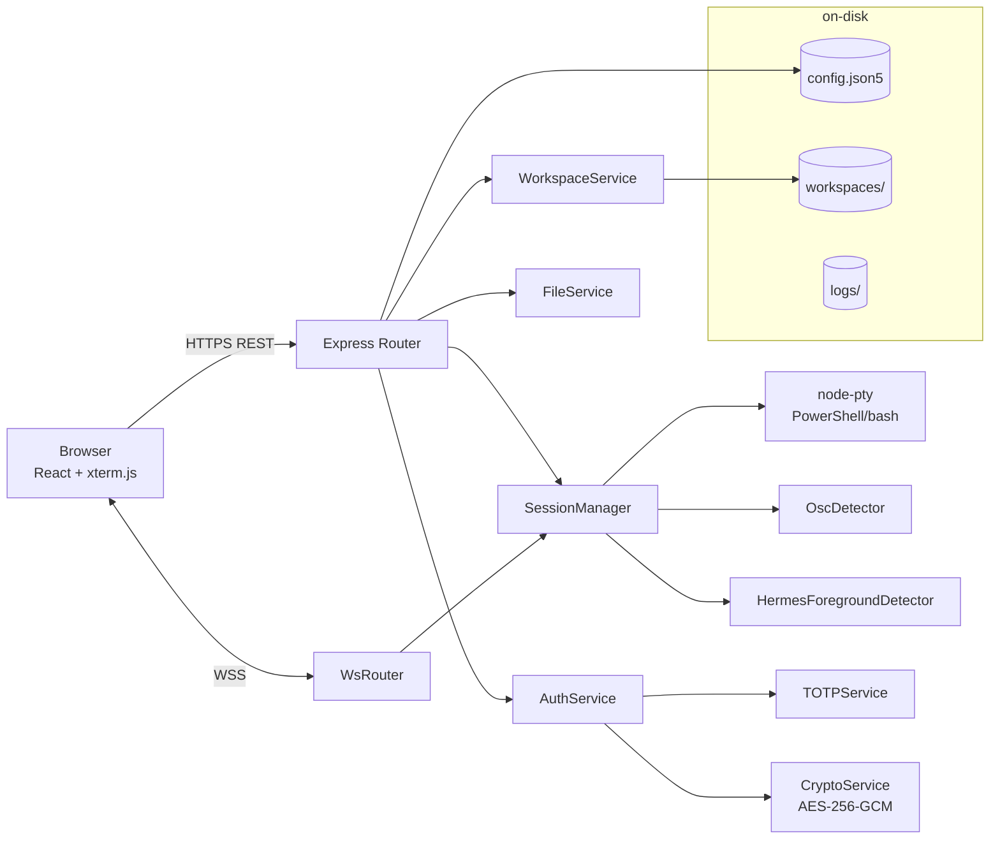
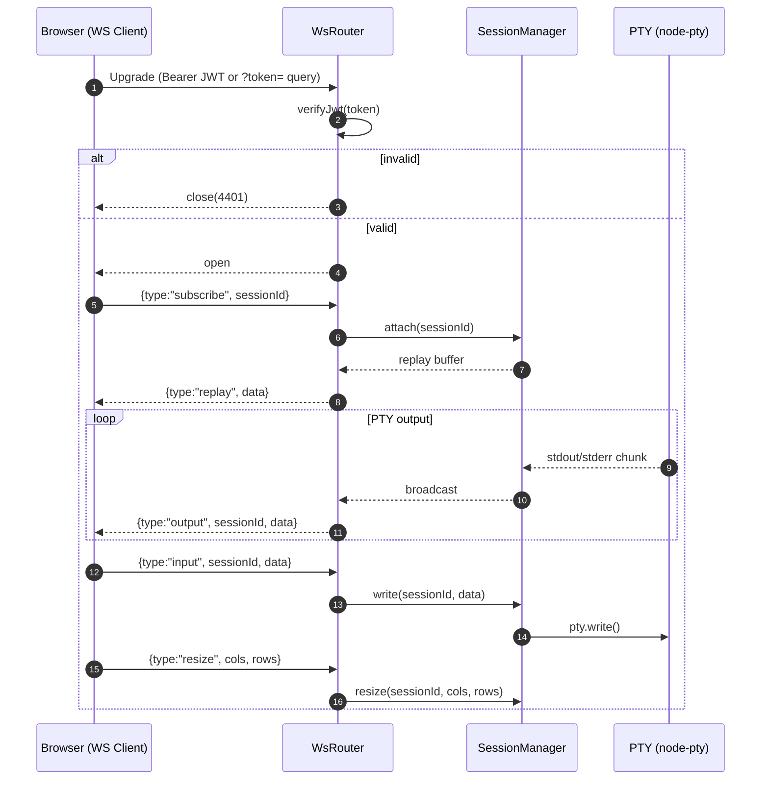
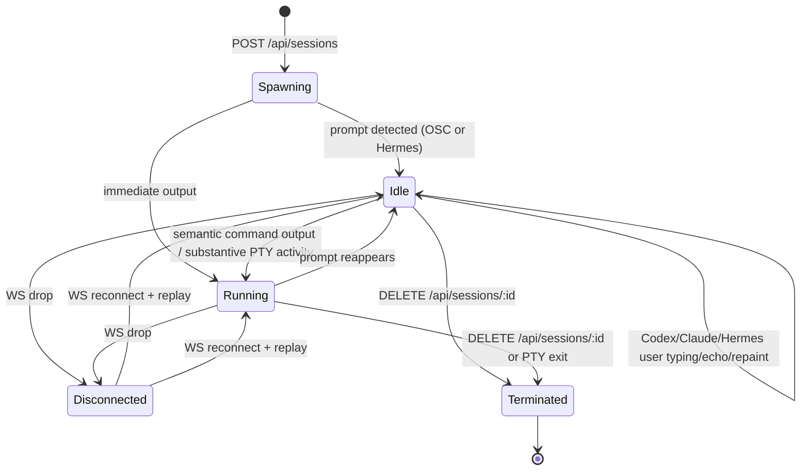
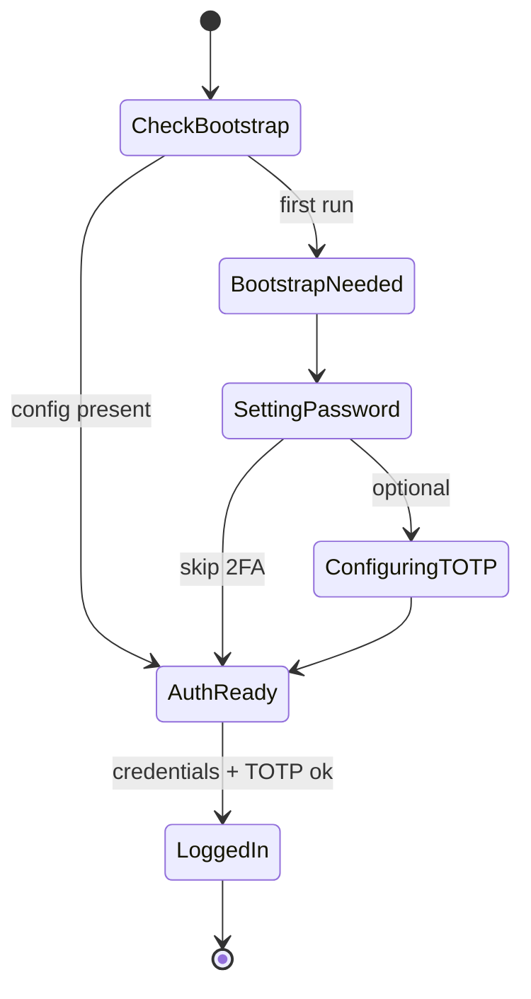

# BuilderGate — Software Requirements Specification

> **ISO/IEC/IEEE 29148:2018 Full Profile**
> 생성일: 2026-04-24 · 프로젝트: BuilderGate · 프로파일: full (점수 10/10)
> 총 요구사항 항목: **378개** (functional 161 · nonfunctional 45 · api 40 · interface 17 · data_model 24 · constraint 23 · business_rule 17 · 기타 51)

## 1. Introduction

### 1.1 Purpose

본 문서는 BuilderGate 시스템에 대한 소프트웨어 요구사항을 ISO/IEC/IEEE 29148:2018에 따라 기술한다. 본 SRS는 현재 소스 코드베이스(역공학 기반)를 1차 사실(single source of truth)로 하고, PRD·README·CLAUDE.md·AGENTS.md·struct 문서를 보조 근거로 삼는다. 대상 독자는 개발자, 아키텍트, QA, 보안 리뷰어, 통합/운영 담당이다.

### 1.2 Scope

BuilderGate는 브라우저에서 실행되는 웹 기반 통합 개발 환경(IDE)으로서 다음을 포함한다.
- Node.js + Express + node-pty 기반 백엔드(HTTPS, WebSocket, REST API 40개)
- React 19 + Vite + xterm.js + react-mosaic-component 기반 프론트엔드
- JWT HS256 인증 + 선택적 TOTP 2FA + AES-256-GCM 암호화
- 다중 PTY 세션(스폰/리사이즈/입출력/리플레이/관찰성) 관리
- Mdir 스타일 파일 매니저, 마크다운/코드 뷰어, 그리드 뷰
- Workspace/Tab/Mosaic 레이아웃 영속화 및 복원

본 SRS는 **현재 코드에 실제로 구현된 동작**을 우선 기술하며, PRD에 존재하지만 미구현인 항목은 §3.6(Out of Scope)에서 별도 표기한다.

### 1.3 Product Overview

BuilderGate는 브라우저 하나로 다수 PTY 셸 세션을 관리하고, Mdir 스타일 파일 매니저와 코드/마크다운 뷰어를 제공하며, 최종 목표는 원격에서 N개 코딩 에이전트를 병렬 운용하는 웹 기반 IDE.

**주요 기술 스택**
- Backend: Node.js + Express + TypeScript, node-pty, JWT, ws
- Frontend: React 19 + Vite, xterm.js, react-mosaic-component, react-dnd, mermaid
- Entry points: `server/src/index.ts`, `frontend/src/main.tsx`, `dev.js`
- Ports: HTTPS 2002, HTTP→HTTPS redirect 2001, Vite 2003
- Key services: `AuthService`, `SessionManager`, `WorkspaceService`, `FileService`, `CryptoService`, `TOTPService`, `ConfigFileRepository`, `BootstrapSetupService`, `SettingsService`, `OscDetector`, `HermesForegroundDetector`, `RuntimeConfigStore`
- Communication: HTTPS REST (35 endpoints), WebSocket (WsRouter), PTY (node-pty)
- Security: JWT HS256, TOTP 2FA, AES-256-GCM, self-signed HTTPS

### 1.4 Definitions, Acronyms, Abbreviations

| 용어 | 정의 | 출처 |
|---|---|---|
| **PTY (Pseudo Terminal)** (GL-INF-001) | 커널이 제공하는 가상 터미널. node-pty 라이브러리가 마스터/슬레이브 FD를 Node.js 프로세스에 노출하여 실제 셸(PowerShell, bash 등)을 호스팅한다. | [`PRD.md:13-17`](../../../../PRD.md#L13-L17), [`server/package.json:21`](../../../../server/package.json#L21) |
| **ConPTY** (GL-INF-002) | Windows 10 1809+ 에서 도입된 현대식 PTY API. pty.useConpty=true 로 사용하며, 레거시 호환을 위해 winpty 로 폴백 가능. | [`server/config.json5:19-24`](../../../../server/config.json5#L19-L24) |
| **winpty** (GL-INF-003) | ConPTY 이전 세대의 Windows PTY 구현. useConpty=false 또는 windowsPowerShellBackend="winpty" 로 강제 사용할 수 있다. | [`server/config.json5:19-24`](../../../../server/config.json5#L19-L24), [`server/config.json5.example:29-33`](../../../../server/config.json5.example#L29-L33) |
| **SSE (Server-Sent Events)** (GL-INF-004) | 서버→클라이언트 단방향 스트리밍. PRD 2.1 및 CLAUDE.md 는 SSE 를 터미널 출력 전송 채널로 기재한다(구 아키텍처). struct 문서는 Step 8 에서 WebSocket 단일 채널로 마이그레이션되었다고 기록한다. | [`PRD.md:15`](../../../../PRD.md#L15), [`CLAUDE.md:17`](../../../../CLAUDE.md#L17), [`docs/struct/2026-04-02/00.index.md:27-30`](../../../../docs/struct/2026-04-02/00.index.md#L27-L30) |
| **WS (WebSocket)** (GL-INF-005) | 양방향 full-duplex 통신 채널. struct 2026-04-02 문서에 따르면 BuilderGate 는 /ws 단일 엔드포인트로 터미널 I/O 와 세션 제어 메시지를 주고받는다 (Step 8 이후). | [`docs/struct/2026-04-02/00.index.md:12-13`](../../../../docs/struct/2026-04-02/00.index.md#L12-L13) |
| **2FA (Two-Factor Authentication)** (GL-INF-006) | 비밀번호(1차) 외에 추가 요소(2차)를 요구하는 인증 방식. BuilderGate 는 TOTP 기반 2FA 를 지원한다. | [`README.md:195-199`](../../../../README.md#L195-L199) |
| **TOTP (Time-based One-Time Password, RFC 6238)** (GL-INF-007) | 시간 동기화 기반 6자리 1회용 비밀번호. Google Authenticator/1Password/Authy 등 표준 인증 앱과 호환되며 otplib 패키지로 구현된다. | [`README.md:197-199`](../../../../README.md#L197-L199), [`server/package.json:23`](../../../../server/package.json#L23) |
| **JWT (JSON Web Token, HS256)** (GL-INF-008) | HMAC-SHA256 서명된 JSON 토큰으로 세션을 표현한다. auth.jwtSecret 으로 서명하며 durationMs 동안 유효하고 maxDurationMs 까지 갱신 가능하다. | [`server/config.json5:80-86`](../../../../server/config.json5#L80-L86), [`PRD.md:39`](../../../../PRD.md#L39) |
| **AES-256-GCM + PBKDF2** (GL-INF-009) | 설정 파일의 민감값(예: auth.password) 을 암호화하는 대칭 암호화(AES-256-GCM) 방식. 키는 머신 고유 정보(hostname + platform + arch)에서 PBKDF2 로 유도된다. | [`README.md:62-67`](../../../../README.md#L62-L67), [`PRD.md:42`](../../../../PRD.md#L42) |
| **Mdir** (GL-INF-010) | Midnight Commander 스타일의 듀얼 패널 파일 매니저 UX. BuilderGate 파일 매니저가 이 UI 패러다임을 차용한다. | [`PRD.md:21-28`](../../../../PRD.md#L21-L28), [`CLAUDE.md:13`](../../../../CLAUDE.md#L13) |
| **CWD (Current Working Directory)** (GL-INF-011) | PTY 세션의 현재 작업 디렉토리. BuilderGate 는 cwdCacheTtlMs 로 캐싱하며, 헤더에 실시간 표시한다(5초 폴링, PRD 2.5). | [`PRD.md:49`](../../../../PRD.md#L49), [`server/config.json5:95`](../../../../server/config.json5#L95) |
| **HMR (Hot Module Replacement)** (GL-INF-012) | Vite dev 서버가 소스 변경 시 브라우저를 리로드하지 않고 변경된 모듈만 교체하는 기능. dev.js 기동 시 자동 활성화된다. | [`dev.js:89-107`](../../../../dev.js#L89-L107), [`README.md:42-44`](../../../../README.md#L42-L44) |
| **pm2** (GL-INF-013) | Node.js 프로덕션 프로세스 매니저. start-runtime.js 가 projectmaster 앱을 백그라운드로 기동/상태 조회/삭제하는 데 사용한다. 미설치 시 npm i -g pm2 로 자동 설치한다. | [`tools/start-runtime.js:353-424`](../../../../tools/start-runtime.js#L353-L424), [`stop.js:3`](../../../../stop.js#L3) |
| **JSON5** (GL-INF-014) | 주석, 후행 쉼표 등 JSON 확장 문법. server/config.json5 는 이 포맷을 사용해 설명 주석을 유지한다. | [`server/config.json5:1-5`](../../../../server/config.json5#L1-L5), [`server/package.json:19`](../../../../server/package.json#L19) |
| **Zod** (GL-INF-015) | TypeScript 스키마 검증 라이브러리. server/config.json5 스키마 검증을 담당한다. | [`server/package.json:29`](../../../../server/package.json#L29), [`PRD.md:113-114`](../../../../PRD.md#L113-L114) |

### 1.5 References

- [PRD.md](../../../../PRD.md) — Product Requirements Document
- [README.md](../../../../README.md) — 개발자 설정 및 실행 가이드
- [CLAUDE.md](../../../../CLAUDE.md) — Claude Code 프로젝트 가이드
- [AGENTS.md](../../../../AGENTS.md) — 에이전트 가이드
- [docs/struct/2026-04-02/](../../../struct/2026-04-02/) — 프로젝트 구조 문서
- ISO/IEC/IEEE 29148:2018 — Systems and software engineering — Life cycle processes — Requirements engineering
- [srs_items.jsonl](./srs_items.jsonl) — 원본 요구사항 항목 데이터 (377건, 본 개정의 수동 보강 항목 1건 제외)
- [intent_context.json](./intent_context.json) — SRS 생성 의도/프로파일 설정

### 1.6 Document Conventions

**REQ-ID 체계**: `{TYPE}-{DOMAIN}-{NNN}` 형식.
- TYPE: `FR`(기능), `NFR`(비기능), `IF`/`IFC`(인터페이스), `API`(REST 계약), `DM`/`DATA`(데이터 모델), `SM`(시스템 모드), `BR`(비즈니스 규칙), `CON`(제약), `ASM`(가정), `OOS`(Out of Scope), `VER`(검증), `UC`(Use Case), `GL`(용어)
- DOMAIN: 하위 모듈/기능 영역 (예: `AUTH`, `SESSION`, `PTY`, `WS`, `FILE` 등)
- NNN: 3자리 순번

**뱃지**
- `[INFERRED]` — 코드에 암시적이거나 문서·패턴으로부터 추론된 요구사항
- `(confidence: med)` / `(confidence: low)` — 확신 수준이 high 미만인 경우에만 표기 (high는 생략)

**출처 표기**: 각 항목 하단에 `출처:` 라인으로 `server/src/index.ts:280-456` 형태의 파일·라인 링크를 제공한다. 링크는 본 문서 기준 상대 경로(`../../../../`)로 리포지토리 루트를 가리킨다.

**내부 앵커**: 각 REQ 항목은 `<a id="REQ-ID">` 앵커를 갖는다. `related:` 라인은 [REQ-ID](#REQ-ID) 형식의 내부 링크를 제공하며, 정의되지 않은 ID는 일반 텍스트로 표기된다.

**언어**: 본문은 한국어로 작성되며, 요구사항 ID·코드 식별자·파일 경로는 원문 그대로 유지한다.

## 2. Stakeholders and Actors

### 2.1 Primary Stakeholders

| 역할 | 관심사 |
|---|---|
| **개발자 본인(1차 사용자)** | 원격/로컬에서 다중 PTY 세션을 운용하며 코딩 에이전트 작업을 병렬로 수행 |
| **코딩 에이전트(외부 시스템)** | BuilderGate를 통해 셸 명령을 실행하고 파일을 편집하는 AI 에이전트 |
| **아키텍트/메인테이너** | 시스템 아키텍처 진화, 보안, 성능 관리 |
| **QA/보안 리뷰어** | 인증·암호화·세션 무결성 검증, 테스트 전략 집행 |
| **운영(DevOps)** | HTTPS 인증서, 포트, 로그, graceful shutdown 관리 |

### 2.2 System Actors

- **ACT-001** — 개발자 사용자: 브라우저로 BuilderGate에 접속하여 셸/파일/뷰어를 사용하는 본인
- **ACT-002** — 코딩 에이전트 (외부 시스템): 향후 오케스트레이션 대상이 되는 외부 AI 코딩 에이전트

## 3. System Overview

### 3.1 Context

BuilderGate는 단일 호스트(localhost 또는 원격 개인 머신)에서 실행되며, 브라우저 클라이언트가 HTTPS(기본 2002)로 접속한다. 내부적으로 다음 컴포넌트가 협력한다.

### 3.2 Major Functions

- **웹 터미널**: 다중 PTY 세션(PowerShell/bash/zsh) 생성·리사이즈·입출력 중계, 세션별 리플레이 버퍼 유지
- **OSC / shell integration detector**: shell integration 프롬프트 감지로 idle/running 상태를 정밀 판정
- **AI TUI idle invariant**: Codex/Claude/Hermes 등 상호 입력형 AI TUI에서 사용자 키보드 입력과 echo는 idle 상태로 유지
- **Hermes foreground detector**: 포그라운드 앱 추적으로 detector 미부착 시에도 idle 유지
- **파일 매니저**: Mdir 스타일 디렉토리 탐색, CRUD, 업/다운로드, 권한 체크
- **뷰어**: 마크다운 렌더링(mermaid 포함), 코드 하이라이팅, 그리드 뷰
- **Workspace**: 탭/레이아웃(mosaic)/cwd 영속화, 재시작 시 복원, orphan tab recovery
- **인증/보안**: JWT HS256 + 선택 TOTP 2FA + bcrypt 비밀번호 + AES-256-GCM 비밀 암호화
- **초기 부트스트랩**: 최초 실행 시 관리자 계정/비밀번호/2FA 세팅 UI
- **WebSocket 게이트웨이**: 세션 출력, cwd 변경, foreground 변화 실시간 push

### 3.3 User Characteristics

- 주 사용자는 **개발자 1인**으로, 셸/Git/Node.js에 숙련되어 있다고 가정.
- 브라우저는 Chromium 계열 최신판(WebSocket + ES2022 + CSS Grid + Clipboard API 가용)을 가정.
- 로컬/원격 자가 호스팅 환경이며, 멀티테넌트는 현재 범위가 아니다(§3.6 참조).

### 3.4 Operating Environment

- **CON-ENV-001** — 환경변수
  PORT: listen 포트 override(config.server.port 기본). DEV_FRONTEND_PORT: Vite dev 서버 포트. dev.js 캐노니컬 실행에서는 2003(serverPort+1)이 자동 주입되며, 서버 단독 실행 시 미지정이면 4545로 폴백(레거시). CON-INF-005 참조. NODE_ENV: production이면 정적 서빙/엄격 CORS. BUILDERGATE_BOOTSTRAP_ALLOWED_IPS: 쉼표 구분 IP 허용 목록(bootstrap).
  출처: [`server/src/index.ts:46-48`](../../../../server/src/index.ts#L46-L48), [`server/src/index.ts:378-399`](../../../../server/src/index.ts#L378-L399), [`server/src/utils/bootstrapAccessPolicy.ts:26-34`](../../../../server/src/utils/bootstrapAccessPolicy.ts#L26-L34)
  related: [CON-INF-005](#CON-INF-005), [FR-BOOT-004](#FR-BOOT-004)
- **CON-FE-002** — react-mosaic-component의 React 18 의존성 충돌을 단일 사본 별칭으로 해결
  react-mosaic-component가 자체 react-dom@18을 번들하므로 Vite `resolve.alias`로 `react`·`react-dom`을 프로젝트의 단일 복사본으로 강제 매핑하고 `dedupe`에 등록한다.
  출처: [`frontend/vite.config.ts:16-24`](../../../../frontend/vite.config.ts#L16-L24)
- **CON-FE-003** — 개발 서버는 HTTPS 백엔드로 프록시한다
  Vite dev 서버는 `/api`·`/health`는 `https://localhost:{serverPort}`로, `/ws`는 `wss://localhost:{serverPort}`로 프록시하며 `secure:false`로 self-signed 인증서를 허용한다. HMR은 WSS 프로토콜로 구성된다.
  출처: [`frontend/vite.config.ts:25-38`](../../../../frontend/vite.config.ts#L25-L38)
- **CON-FE-004** — Dev 서버 포트는 환경변수로 주입된다
  `DEV_SERVER_PORT`(기본 2002), `DEV_FRONTEND_PORT`(기본 2003) 환경변수로 백엔드/프런트엔드 포트를 구성한다.
  출처: [`frontend/vite.config.ts:10-11`](../../../../frontend/vite.config.ts#L10-L11)
- **CON-INF-001** — Node.js 18 이상 런타임 필수
  BuilderGate 서버와 프론트엔드 빌드/실행은 Node.js 18 이상을 요구한다. README에서 Node.js 18+와 npm을 사전 요구사항으로 명시한다.
  출처: [`README.md:30-34`](../../../../README.md#L30-L34)
- **CON-INF-003** — 서버 런타임 의존성 스택
  server/package.json 의 dependencies 로 express(4.18), node-pty(1.x), ws(8.20), jsonwebtoken, otplib, qrcode, nodemailer, selfsigned, helmet, json5, zod, uuid, http-proxy, @xterm/headless, @xterm/addon-serialize, cors 를 요구한다. devDependencies 는 tsx 4.21, typescript 5.3 및 각 @types 를 포함한다.
  출처: [`server/package.json:11-44`](../../../../server/package.json#L11-L44)
  related: [CON-INF-001](#CON-INF-001)
- **CON-INF-004** — 프론트엔드 런타임 의존성 스택
  frontend/package.json 은 React 19, react-dom 19, react-mosaic-component 6.1, react-dnd 16, @xterm/xterm 6, @xterm/addon-fit 0.11, @xterm/addon-serialize 0.14, highlight.js 11, mermaid 10.9, react-markdown 9, rehype-highlight 7, remark-gfm 4 를 요구한다. devDependencies 에 Vite 7, TypeScript 5.9, @playwright/test 1.58, eslint 9 를 포함한다.
  출처: [`frontend/package.json:13-43`](../../../../frontend/package.json#L13-L43)
  related: [CON-INF-001](#CON-INF-001)
- **CON-INF-008** — Windows 전용 자식 프로세스 종료 경로
  dev.js cleanup()은 Windows 에서 taskkill /pid <pid> /T /F 로 자식 트리를 강제 종료하고, 그 외 플랫폼에서는 child.kill() 을 사용한다.
  출처: [`dev.js:54-70`](../../../../dev.js#L54-L70)
- **CON-OPS-001** — node 프로세스 강제 종료 금지
  CLAUDE.md는 kill {pid} 및 taskkill /F /IM node.exe 를 절대 금지한다. dev.js 의 hot reload 메커니즘이 변경 감지 시 자동 재시작하므로 수동 kill 은 개발 루프를 파괴한다.
  출처: [`CLAUDE.md:50-53`](../../../../CLAUDE.md#L50-L53)
  related: [FR-INF-002](#FR-INF-002)
- **CON-OPS-003** — UTF-8 전용 파일 I/O
  모든 파일 읽기/쓰기는 UTF-8 을 전제로 한다. OS 기본 코드페이지나 로케일 의존 인코딩은 프로젝트 파일에 사용하지 않는다.
  출처: [`AGENTS.md:27-31`](../../../../AGENTS.md#L27-L31)
- **CON-PLATFORM-001** — 플랫폼 제약 (Windows 전용 옵션)
  useConpty=true, windowsPowerShellBackend≠'inherit', shell∈{powershell,wsl,cmd}는 Windows에서만 허용. 비Windows에서 설정 PATCH 시 VALIDATION_ERROR. RuntimeConfigStore가 capabilities.available로 안내.
  출처: [`server/src/utils/ptyPlatformPolicy.ts:31-98`](../../../../server/src/utils/ptyPlatformPolicy.ts#L31-L98), [`server/src/services/SettingsService.ts:394-416`](../../../../server/src/services/SettingsService.ts#L394-L416), [`server/src/services/RuntimeConfigStore.ts:223-252`](../../../../server/src/services/RuntimeConfigStore.ts#L223-L252)
- **CON-WINPTY-001** — winpty 가용성 probe
  PowerShell winpty 선택 시 실제 node-pty로 powershell.exe를 winpty 모드로 짧게 기동해 성공 여부를 확인. 실패 시 capability.available=false+reason 기록, PATCH 시 거부.
  출처: [`server/src/services/SessionManager.ts:1514-1555`](../../../../server/src/services/SessionManager.ts#L1514-L1555)

### 3.5 Assumptions

- **ASM-001** — 단일 관리자 계정
  JWTPayload.sub='admin' 고정, password/TOTP accountName 기본 'admin', 멀티테넌트/다중 사용자 미지원.
  출처: [`server/src/services/AuthService.ts:107-127`](../../../../server/src/services/AuthService.ts#L107-L127), [`server/src/services/TOTPService.ts:116-117`](../../../../server/src/services/TOTPService.ts#L116-L117)
- **ASM-002** — 로컬호스트 중심 사용 `(confidence: med)`
  README/코멘트에 'localhost 전용' 명시. CSP/CORS/디버그 캡처/bootstrap 허용이 루프백 IP에 특권을 부여함.
  출처: [`CLAUDE.md:1-200`](../../../../CLAUDE.md#L1-L200), [`server/src/middleware/debugCaptureGuards.ts:7-28`](../../../../server/src/middleware/debugCaptureGuards.ts#L7-L28)
- **ASM-FE-001** — 전체 통신은 동일 Origin이고 백엔드가 프런트엔드 자산을 서빙한다
  getWsUrl은 window.location.host를 그대로 사용해 WS를 연결한다. 개발 환경에서는 Vite proxy로, 프로덕션에서는 동일 호스트로 백엔드가 번들을 서빙한다고 가정.
  출처: [`frontend/src/contexts/WebSocketContext.tsx:79-85`](../../../../frontend/src/contexts/WebSocketContext.tsx#L79-L85)
  related: [CON-FE-003](#CON-FE-003)
- **ASM-FE-002** — 서버는 WS `{type:'connected', clientId}`를 최초 메시지로 보낸다 `[INFERRED]` `(confidence: med)`
  api.setWsClientId는 connected 이벤트 도착 전에는 null이며 이 경우 REST 요청에 x-client-id 헤더가 없다. 서버의 originating client 제외 로직은 이후 요청에만 적용된다.
  출처: [`frontend/src/contexts/WebSocketContext.tsx:177-181`](../../../../frontend/src/contexts/WebSocketContext.tsx#L177-L181), [`frontend/src/services/api.ts:29-61`](../../../../frontend/src/services/api.ts#L29-L61)
  related: [FR-WS-008](#FR-WS-008)
- **ASSUMPTION-INF-001** — 개발자 본인(ACT-001)이 단일 관리자 계정을 사용한다 `[INFERRED]` `(confidence: med)`
  auth.password 는 단일 비밀번호 1개, twoFactor.accountName="admin" 이 기본값으로 세팅되어 있어, 멀티 유저가 아닌 단일 관리자 모델을 가정한다.
  출처: [`server/config.json5:80-113`](../../../../server/config.json5#L80-L113), [`PRD.md:38-40`](../../../../PRD.md#L38-L40)
  related: [NFR-SEC-005](#NFR-SEC-005)
- **ASSUMPTION-INF-002** — 로컬호스트 또는 신뢰 네트워크 배포를 가정한다 `[INFERRED]`
  CORS 기본값(빈 배열=모두 허용), CLAUDE.md 의 localhost 전용 규칙, bootstrap.allowedIps 기본 비어있음(=localhost) 은 인터넷 공개 배포를 가정하지 않는다.
  출처: [`CLAUDE.md:54`](../../../../CLAUDE.md#L54), [`server/config.json5:63-67`](../../../../server/config.json5#L63-L67), [`README.md:116-138`](../../../../README.md#L116-L138)
  related: [NFR-SEC-007](#NFR-SEC-007)

### 3.6 Out of Scope

*PRD·README에는 언급되었으나 본 SRS 작성 시점(2026-04-24) 코드베이스에는 미구현이거나 범위 외인 항목.*

- **CON-MISSING-001** — PTY bufferFilter 옵션 (placeholder, 미구현) `[originally CON-MISSING-001]`
  config.pty.bufferFilter는 config.json5의 주석 설계 문서로 정의된 placeholder이다. 계획값: 'none' | 'minimal'(ED3만) | 'standard'(ED1/2/3+alt screen 제외) | 'aggressive'(standard+ED0). 현재 기본값은 'none'이며, Zod 스키마·런타임 소비자(PTY write/replay 경로)가 존재하지 않아 동작에 영향이 없다. 후속 단계에서 스키마 + terminalPayload/SessionManager 소비자 구현 시 constraint로 승격 예정.
  출처: [`server/config.json5:38-43`](../../../../server/config.json5#L38-L43)
  related: [FR-SNAP-001](#FR-SNAP-001), [FR-MISSING-010](#FR-MISSING-010)
- **IFC-WS-MISSING-001** — WS tab:disconnected 타입 선언 (미구현) `[originally IFC-WS-MISSING-001]` `[INFERRED]`
  ServerWsMessage 유니온에 tab:disconnected 타입이 선언되어 있으나 (server/src/types/ws-protocol.ts:69) 실제 이미터(WsRouter/SessionManager/routes)가 존재하지 않는다. 프런트엔드(useWorkspaceManager.ts:217)에는 핸들러가 등록되어 있으나 서버에서 broadcast되지 않으므로 현재 동작상 dead contract이다. 후속 단계에서 세션 예기치 종료 감지/브로드캐스트 구현 시 normative interface로 승격 예정.
  출처: [`server/src/types/ws-protocol.ts:64-69`](../../../../server/src/types/ws-protocol.ts#L64-L69)
  related: [IFC-WS-001](#IFC-WS-001), [IFC-WS-002](#IFC-WS-002)
- **OOS-001** — Brute-force lockout (미구현) `[INFERRED]` `(confidence: med)`
  BruteForceConfig(rateLimit, lockout, progressiveDelay) 타입/상수는 정의돼 있으나 백엔드 런타임 경로에서 활용되지 않음. 현재 적용되는 rate limit은 bootstrap에 국한.
  출처: [`server/src/types/config.types.ts:130-144`](../../../../server/src/types/config.types.ts#L130-L144), [`server/src/utils/constants.ts:59-74`](../../../../server/src/utils/constants.ts#L59-L74)
- **OOS-002** — 이메일 2FA / SMTP `[INFERRED]` `(confidence: med)`
  TWO_FACTOR_DEFAULTS.SMTP_RETRY_DELAYS, SMTP_ERROR 코드, nodemailer 의존성은 존재하나 현재 라우트/서비스는 TOTP 경로만 사용. email OTP 흐름은 아직 구현되지 않음.
  출처: [`server/src/utils/constants.ts:95-104`](../../../../server/src/utils/constants.ts#L95-L104), [`server/src/routes/authRoutes.ts:220-274`](../../../../server/src/routes/authRoutes.ts#L220-L274), [`server/package.json:22`](../../../../server/package.json#L22)
- **OOS-FE-001** — 코드/마크다운 뷰어 컴포넌트는 현재 프런트엔드 구현에 없음 `[INFERRED]`
  package.json에 react-markdown, rehype-highlight, remark-gfm, mermaid, highlight.js 의존성이 존재하고 useFileContent 훅이 있으나 Viewer UI 컴포넌트는 `frontend/src/components/Viewer/` 부재, App.tsx에서도 렌더되지 않는다. 현 빌드는 뷰어 UI가 비어 있다.
  출처: [`frontend/package.json:13-27`](../../../../frontend/package.json#L13-L27), [`frontend/src/hooks/useFileContent.ts:1-66`](../../../../frontend/src/hooks/useFileContent.ts#L1-L66)
  related: [FR-FILE-009](#FR-FILE-009)
- **OOS-INF-001** — Task Manager (Phase A, 미구현)
  PRD 3장 Phase A 에서 태스크 CRUD, 상태 관리(pending/running/done), 의존성 그래프, 탭/사이드패널 태스크 보드를 예고하지만, 현재 코드베이스(entry points, routes, services)에는 해당 모듈이 존재하지 않아 out-of-scope 로 분류한다.
  출처: [`PRD.md:56-61`](../../../../PRD.md#L56-L61)
- **OOS-INF-002** — MCP (Model Context Protocol) 통합 (Phase B, 미구현)
  PRD 3장 Phase B 는 MCP 서버 등록/관리, 도구 호출 UI, 결과 표시, 마크다운 뷰어/외부 도구 MCP 플러그인 확장을 예고한다. 현재 코드에는 MCP 클라이언트/서버/브리지 모듈이 존재하지 않는다.
  출처: [`PRD.md:63-68`](../../../../PRD.md#L63-L68)
- **OOS-INF-003** — Agent Orchestration / 세션 간 메시지 버스 (Phase C, 미구현)
  PRD 3장 Phase C 의 핵심 비전 — 세션 A 에이전트가 세션 B 에 명령 전송, 결과 수신, 세션 간 메시지 버스, 에이전트 상태 모니터링, 작업 분배, N개 코딩 에이전트 동시 운용 — 은 현재 코드에 미구현이다. 이는 프로젝트의 최종 목표이나 본 SRS 사이클의 구현 범위에서 제외된다.
  출처: [`PRD.md:70-92`](../../../../PRD.md#L70-L92), [`CLAUDE.md:10-14`](../../../../CLAUDE.md#L10-L14)
  related: [OOS-INF-001](#OOS-INF-001), [OOS-INF-002](#OOS-INF-002)
- **OOS-INF-004** — 이메일 OTP 기반 2FA (PRD 기재, 코드는 TOTP 대체) `[INFERRED]` `(confidence: med)`
  PRD 2.4 는 "2FA(선택): 이메일 OTP (6자리, SMTP)" 를 현재 구현으로 명시하지만, 실제 config.json5 와 README 는 TOTP(Google Authenticator) 기반 2FA 를 설명한다. nodemailer 의존성이 존재하나 이메일 OTP 2FA 흐름이 우선순위로 보이지 않으며, 본 infra SRS 에서는 이메일 OTP 2FA 를 out-of-scope 로 분류한다.
  출처: [`PRD.md:40`](../../../../PRD.md#L40), [`README.md:195-238`](../../../../README.md#L195-L238), [`server/package.json:22`](../../../../server/package.json#L22)
  related: [NFR-SEC-005](#NFR-SEC-005)

## 4. System Requirements

### 4.1 Functional Requirements

총 160건. 도메인별로 분류한다.

#### 4.1.1 BOOT — 부팅/초기화 (6건)

- **FR-BOOT-001** — HTTPS 서버 기동 및 HTTP→HTTPS 리다이렉트
  서버 시작 시 SSLService로 TLS 인증서(self-signed 자동 생성 또는 config.ssl 경로 로드)를 준비하고 HTTPS 서버를 config.server.port(기본 2002)에서 listen한다. 동시에 (PORT-1) HTTP 포트에서 수신한 모든 요청을 동일 호스트의 HTTPS로 301 리다이렉트한다. keepAliveTimeout 120s/headersTimeout 125s 적용.
  출처: [`server/src/index.ts:280-498`](../../../../server/src/index.ts#L280-L498)
  related: [NFR-TLS-001](#NFR-TLS-001), [FR-SSL-001](#FR-SSL-001)
- **FR-BOOT-002** — 서비스 초기화 순서
  기동 시 CryptoService → RuntimeConfigStore → ConfigFileRepository → SessionManager(runtime PTY capabilities assert, PowerShell winpty probe warmup) → AuthService → BootstrapSetupService → TOTPService(선택) → FileService → SettingsService → WorkspaceService(+initialize+orphan tab recovery) → 라우트 구성 → SSLService → HTTPS listen → WsRouter 부착 순으로 초기화한다.
  출처: [`server/src/index.ts:280-456`](../../../../server/src/index.ts#L280-L456)
- **FR-BOOT-003** — Graceful Shutdown
  SIGINT/SIGTERM 수신 시 SessionManager.stopAllCwdWatching, WorkspaceService.snapshotAllCwds + forceFlush, 주기 타이머(cwdSnapshotTimer, terminalObservabilityTimer) 정리 후 process.exit(0).
  출처: [`server/src/index.ts:526-546`](../../../../server/src/index.ts#L526-L546)
- **FR-BOOT-004** — 개발 모드 Vite 리버스 프록시
  NODE_ENV !== 'production' 일 때 http-proxy로 Vite dev 서버를 백엔드가 프록시한다. Vite dev 포트는 process.env.DEV_FRONTEND_PORT이며, dev.js 캐노니컬 경로에서는 2003(serverPort+1)이 주입된다. 서버 단독 기동 시 DEV_FRONTEND_PORT 미지정이면 4545로 폴백(레거시 경로). 비 API/비 /ws 경로를 Vite로 전달하며 업그레이드 요청도 WS 아닌 경로는 Vite로 포워딩. 프록시 실패 시 502.
  출처: [`server/src/index.ts:376-456`](../../../../server/src/index.ts#L376-L456)
  related: [CON-ENV-001](#CON-ENV-001), [CON-INF-005](#CON-INF-005)
- **FR-BOOT-005** — 프로덕션 정적 자산 서빙 및 SPA 폴백
  프로덕션 모드에서 `dist/public` 디렉토리를 정적 자산으로 서빙하고, /health, /ws, /api, /api/* 및 확장자 있는 리소스는 제외하고 그 외 GET 요청을 `dist/public/index.html`로 폴백(SPA).
  출처: [`server/src/index.ts:64-82`](../../../../server/src/index.ts#L64-L82), [`server/src/index.ts:400-423`](../../../../server/src/index.ts#L400-L423)
- **FR-BOOT-006** — Observability 스냅샷 주기 로깅
  60초 주기로 SessionManager.getObservabilitySnapshot + WsRouter.getObservabilitySnapshot 을 TerminalObs 태그로 JSON stringify하여 콘솔 출력. 세션 CWD 스냅샷은 30초 주기로 WorkspaceService.snapshotAllCwds + forceFlush 수행.
  출처: [`server/src/index.ts:360-367`](../../../../server/src/index.ts#L360-L367), [`server/src/index.ts:500-508`](../../../../server/src/index.ts#L500-L508)

#### 4.1.2 SSL — TLS/SSL (2건)

- **FR-SSL-001** — self-signed 인증서 생성
  SSLService.generateSelfSigned: certs/self-signed.crt/.key가 있고 유효 기간 내면 로드. 없거나 만료 시 selfsigned 라이브러리로 CN=localhost, O=BuilderGate, SAN(localhost,127.0.0.1,::1), RSA 2048, sha256, 365일짜리 인증서 생성.
  출처: [`server/src/services/SSLService.ts:85-170`](../../../../server/src/services/SSLService.ts#L85-L170), [`server/src/utils/constants.ts:10-23`](../../../../server/src/utils/constants.ts#L10-L23)
- **FR-SSL-002** — 인증서 만료 경고
  checkCertExpiry: X509 인증서 validTo 파싱. 기본 30일 이내 만료면 isExpiringSoon=true. 서버 시작 시 경고 출력. loadCertificates도 인증서-키 매칭을 sign/verify로 검증.
  출처: [`server/src/services/SSLService.ts:34-80`](../../../../server/src/services/SSLService.ts#L34-L80), [`server/src/services/SSLService.ts:172-248`](../../../../server/src/services/SSLService.ts#L172-L248), [`server/src/index.ts:510-517`](../../../../server/src/index.ts#L510-L517)

#### 4.1.3 AUTH — 인증 (로그인/세션 토큰) (6건)

- **FR-AUTH-001** — 비밀번호 검증 (timing-safe)
  AuthService.validatePassword: config.auth.password(암호화된 경우 복호화)와 입력을 CryptoService.timingSafeEqual로 비교. 길이 불일치도 일정 시간 소요. 실패/미설정 시 false.
  출처: [`server/src/services/AuthService.ts:66-98`](../../../../server/src/services/AuthService.ts#L66-L98), [`server/src/services/CryptoService.ts:194-217`](../../../../server/src/services/CryptoService.ts#L194-L217)
  related: [NFR-AUTH-TIMING-001](#NFR-AUTH-TIMING-001)
- **FR-AUTH-002** — JWT 발급/검증/Revoke
  issueToken: HS256, payload {sub:'admin', iat, exp(now+durationMs/1000), jti:uuid}. verifyToken: 서명/만료/revoke(블랙리스트 by jti) 검증, 에러별 코드(TOKEN_EXPIRED/INVALID_SIGNATURE/INVALID_TOKEN/TOKEN_REVOKED). revokeToken: jti → expiresAt 맵에 저장, 5분 주기 cleanup. refreshToken: 기존 revoke + 새 발급.
  출처: [`server/src/services/AuthService.ts:107-228`](../../../../server/src/services/AuthService.ts#L107-L228)
- **FR-AUTH-BOOT-001** — Bootstrap 상태 판정
  BootstrapSetupService.getStatus: AuthService.hasConfiguredPassword()==false이면 setupRequired=true, 요청 IP의 allowPolicy(localhost|allowlist|denied)와 requesterAllowed를 평가. loopback(127.0.0.1/::1/::ffff:127.0.0.1)은 허용, configuredAllowedIps+BUILDERGATE_BOOTSTRAP_ALLOWED_IPS 환경변수와 매칭.
  출처: [`server/src/services/BootstrapSetupService.ts:34-54`](../../../../server/src/services/BootstrapSetupService.ts#L34-L54), [`server/src/utils/bootstrapAccessPolicy.ts:1-72`](../../../../server/src/utils/bootstrapAccessPolicy.ts#L1-L72)
- **FR-AUTH-BOOT-002** — Bootstrap 비밀번호 등록
  bootstrapPassword: 이미 구성됨 → 409, 미허용 IP → 403, 5분당 10회 초과 → 429, 확인 불일치 → 400, 4자 미만 → 400. 통과 시 CryptoService.encrypt → ConfigFileRepository.persistAuthPassword(config.json5 패치) → AuthService.updateRuntimeConfig + 토큰 발급. 레이트리밋은 throttle 맵으로 관리.
  출처: [`server/src/services/BootstrapSetupService.ts:56-112`](../../../../server/src/services/BootstrapSetupService.ts#L56-L112)
  related: [NFR-RATE-001](#NFR-RATE-001)
- **FR-AUTH-LPO-001** — Localhost 전용 패스워드 바이패스
  auth.localhostPasswordOnly=true이면 loopback 요청은 2FA를 건너뛰고 즉시 JWT 발급. twoFactor.externalOnly=true는 loopback에 한해 2FA만 스킵(비밀번호는 여전히 검증).
  출처: [`server/src/routes/authRoutes.ts:155-171`](../../../../server/src/routes/authRoutes.ts#L155-L171), [`server/src/services/AuthService.ts:260-266`](../../../../server/src/services/AuthService.ts#L260-L266)
- **FR-AUTH-MW-001** — authMiddleware
  Authorization: Bearer <token> 또는 쿼리 ?token=...(EventSource 호환)에서 토큰을 추출하여 verifyToken. 실패 시 4xx + createErrorResponse, 성공 시 req.user=payload 부착 후 next. optional 버전은 실패 시 무시.
  출처: [`server/src/middleware/authMiddleware.ts:44-107`](../../../../server/src/middleware/authMiddleware.ts#L44-L107)

#### 4.1.4 TOTP — 2FA (TOTP) (4건)

- **FR-TOTP-001** — TOTP 초기화 및 QR 출력
  TOTPService.initialize: data/totp.secret가 없으면 generateSecret(BASE32) + CryptoService.encrypt로 저장(Linux/Mac은 0o600 chmod) 후 QR 출력. 있으면 복호화+BASE32 검증 후 로드. 손상되면 throw. QR은 qrcode-terminal로 콘솔 출력 + otpauth URI 수동 키 안내.
  출처: [`server/src/services/TOTPService.ts:54-125`](../../../../server/src/services/TOTPService.ts#L54-L125)
  related: [NFR-TOTP-SECRET-001](#NFR-TOTP-SECRET-001)
- **FR-TOTP-002** — TOTP 검증 (replay 방지, 시도 제한)
  verifyTOTP: otplib verifySync with epochTolerance=30s, afterTimeStep=otpData.totpLastUsedStep. 실패 시 attempts++, 3회 초과 시 무효화. 성공 시 totpLastUsedStep=Math.floor(now/30000)로 갱신하여 재사용 방지.
  출처: [`server/src/services/TOTPService.ts:197-234`](../../../../server/src/services/TOTPService.ts#L197-L234)
  related: [NFR-TOTP-REPLAY-001](#NFR-TOTP-REPLAY-001)
- **FR-TOTP-PEND-001** — TOTP pending auth 관리
  createPendingAuth: uuid tempToken, OTPData {expiresAt=now+5min, attempts:0, stage:'totp'} 저장. MAX_PENDING_AUTH=100. cleanupExpiredOTPs로 만료 항목 제거. invalidatePendingAuth로 성공/초과 시 삭제.
  출처: [`server/src/services/TOTPService.ts:144-194`](../../../../server/src/services/TOTPService.ts#L144-L194)
- **FR-TOTP-RUNTIME-001** — TOTP 런타임 재구성
  reconcileTotpRuntime: twoFactor.enabled=false면 기존 서비스 destroy 후 undefined. true면 새 TOTPService 생성+initialize, 실패 시 이전 서비스 유지(가능 시) + warnings 반환. Settings PATCH 시 twoFactor.enabled/issuer/accountName 변경에 한해 재실행.
  출처: [`server/src/services/twoFactorRuntime.ts:19-55`](../../../../server/src/services/twoFactorRuntime.ts#L19-L55), [`server/src/services/SettingsService.ts:251-266`](../../../../server/src/services/SettingsService.ts#L251-L266)

#### 4.1.5 CRYPTO — 암호화 서비스 (2건)

- **FR-CRYPTO-001** — AES-256-GCM 암복호화
  CryptoService.encrypt/decrypt: 마스터키 = PBKDF2(masterKeySource, 'buildergate-master-key-salt-v1', 100000, 32, sha256). 레코드별 랜덤 salt(32B)+iv(12B) 재유도. authTag(16B) 포함. 포맷 `enc(base64(salt|iv|authTag|ciphertext))`. isEncrypted로 포맷 판정.
  출처: [`server/src/services/CryptoService.ts:1-187`](../../../../server/src/services/CryptoService.ts#L1-L187)
- **FR-CRYPTO-002** — 안전한 난수 유틸
  CryptoService.generateSecureRandom(bytes)/generateSecureRandomString(base64url 변형). JWT secret 자동 생성(32B)과 TOTP 임시 상태 등에 사용.
  출처: [`server/src/services/CryptoService.ts:219-247`](../../../../server/src/services/CryptoService.ts#L219-L247)

#### 4.1.6 CFG — 설정 저장소 (config.json5) (6건)

- **FR-CFG-001** — 런타임 설정 PATCH 적용 및 롤백
  SettingsService.savePatch: Zod strict 검증 → password/CORS/platform/capability 검증 → ConfigFileRepository.persistEditableValues(dryRun) → applyRuntimeConfig(runtimeConfigStore, authService.updateRuntimeConfig, sessionManager.updateRuntimeConfig, fileService.updateConfig) → writePreparedResult(config.json5 + .bak). 런타임 실패 시 이전 값으로 롤백, 디스크 쓰기 실패 시 런타임도 역롤백 후 CONFIG_APPLY_FAILED(422).
  출처: [`server/src/services/SettingsService.ts:147-249`](../../../../server/src/services/SettingsService.ts#L147-L249), [`server/src/services/ConfigFileRepository.ts:69-121`](../../../../server/src/services/ConfigFileRepository.ts#L69-L121)
- **FR-CFG-002** — 편집 가능 키/적용 범위
  EditableSettingsKey 집합: auth.password|durationMs, twoFactor.enabled|externalOnly|issuer|accountName, security.cors.allowedOrigins|credentials|maxAge, pty.termName|defaultCols|defaultRows|useConpty|windowsPowerShellBackend|shell, session.idleDelayMs, fileManager.maxFileSize|maxDirectoryEntries|blockedExtensions|blockedPaths|cwdCacheTtlMs. applyScope: immediate|new_logins|new_sessions. 제외 섹션: server.port, ssl.*, logging.*, auth.maxDurationMs, auth.jwtSecret, fileManager.maxCodeFileSize, bruteForce.*. session.runningDelayMs는 config 파일/Zod 스키마 값이며 현재 /api/settings PATCH 편집 대상이 아니다.
  출처: [`server/src/types/settings.types.ts:7-48`](../../../../server/src/types/settings.types.ts#L7-L48), [`server/src/services/RuntimeConfigStore.ts:16-48`](../../../../server/src/services/RuntimeConfigStore.ts#L16-L48)
- **FR-CFG-003** — config.json5 주석 보존 패치 렌더러
  renderPatchedConfig: 원본 JSON5 줄 단위 파싱(stack 기반 경로 추적). 변경 키에 해당하는 라인만 값 치환(trailing comma/주석 보존). auth.password/pty.windowsPowerShellBackend 등은 없으면 parent에 insert. 누락 경로 있으면 CONFIG_PERSIST_FAILED.
  출처: [`server/src/services/ConfigFileRepository.ts:172-373`](../../../../server/src/services/ConfigFileRepository.ts#L172-L373)
- **FR-CFG-004** — 플랫폼별 PTY 설정 정규화
  normalizePtyConfigForPlatform: win32가 아니면 useConpty=false 강제, windowsPowerShellBackend='inherit' 강제, shell이 powershell|wsl|cmd이면 'auto'로 강제. settings shell 옵션도 플랫폼별 차등 제공.
  출처: [`server/src/utils/ptyPlatformPolicy.ts:31-98`](../../../../server/src/utils/ptyPlatformPolicy.ts#L31-L98)
- **FR-CFG-005** — CORS origin 변경 가드
  credentials=true와 allowedOrigins='*' 동시 사용 금지(VALIDATION_ERROR). 현재 요청 origin이 allowedOrigins 미포함이면 CURRENT_ORIGIN_BLOCKED(409). blockedExtensions는 '.'로 시작해야 함, blockedPaths에 공백 금지.
  출처: [`server/src/services/SettingsService.ts:371-392`](../../../../server/src/services/SettingsService.ts#L371-L392)
- **FR-CFG-006** — 비밀번호 변경 정책
  settings PATCH의 auth.currentPassword/newPassword/confirmPassword 세트. currentPassword 미제공 시 400, newPassword≠confirmPassword 시 PASSWORD_CONFIRM_MISMATCH, validatePassword(currentPassword) 실패 시 INVALID_CURRENT_PASSWORD. 통과 시 CryptoService.encrypt로 저장.
  출처: [`server/src/services/SettingsService.ts:343-369`](../../../../server/src/services/SettingsService.ts#L343-L369)

#### 4.1.7 SETTINGS — 사용자 설정 (6건)

- **FR-SETTINGS-001** — Settings 페이지는 Runtime-safe 설정만 노출한다
  SettingsPage는 auth/twoFactor/security.cors/pty/session/fileManager 카드와 Grid Layout 로컬 카드를 렌더한다. 서버 스냅샷 capabilities 기반으로 필드 별 scope(immediate/new_logins/new_sessions) 배지를 표시하고 excludedSections를 chip으로 안내한다.
  출처: [`frontend/src/components/Settings/SettingsPage.tsx:34-476`](../../../../frontend/src/components/Settings/SettingsPage.tsx#L34-L476)
  related: [FR-SETTINGS-002](#FR-SETTINGS-002), [FR-SETTINGS-003](#FR-SETTINGS-003)
- **FR-SETTINGS-002** — Settings 검증: 비밀번호/CORS origin/blocked ext/blocked path/winpty
  validationErrors는 (1) 비밀번호 3필드 모두 입력 + 일치, (2) CORS origin이 `URL.origin === value` 및 http/https, (3) blockedExtensions는 '.'로 시작, (4) blockedPaths는 공백 금지, (5) winpty 불가 환경에서는 useConpty 필요를 검사한다.
  출처: [`frontend/src/components/Settings/SettingsPage.tsx:150-207`](../../../../frontend/src/components/Settings/SettingsPage.tsx#L150-L207), [`frontend/src/components/Settings/SettingsPage.tsx:519-529`](../../../../frontend/src/components/Settings/SettingsPage.tsx#L519-L529)
  related: [FR-SETTINGS-001](#FR-SETTINGS-001)
- **FR-SETTINGS-003** — Settings 저장은 diff 기반 patch를 서버에 PATCH
  buildPatch는 auth/twoFactor/security.cors/pty/session/fileManager를 initial vs draft로 JSON.stringify 비교해 변경된 필드만 전송한다. 응답의 applySummary로 immediate/new_logins/new_sessions 건수와 warnings 배너를 노출한다. 실패 시 스냅샷을 재로드해 winpty 가용성 변화에 적응.
  출처: [`frontend/src/components/Settings/SettingsPage.tsx:228-283`](../../../../frontend/src/components/Settings/SettingsPage.tsx#L228-L283), [`frontend/src/components/Settings/SettingsPage.tsx:532-580`](../../../../frontend/src/components/Settings/SettingsPage.tsx#L532-L580)
  related: [IFC-API-003](#IFC-API-003)
- **FR-SETTINGS-004** — TOTP QR 코드 표시/재로딩
  getTotpQr로 서버에서 dataUrl/uri/registered를 받아 이미지로 렌더(180×180, pixelated), 2FA 관련 필드 저장 후 자동 재로딩. registered=false면 '서버 재시작 안내', enabled=false면 비활성 안내 문구 표시.
  출처: [`frontend/src/components/Settings/SettingsPage.tsx:39-94`](../../../../frontend/src/components/Settings/SettingsPage.tsx#L39-L94), [`frontend/src/components/Settings/SettingsPage.tsx:126-148`](../../../../frontend/src/components/Settings/SettingsPage.tsx#L126-L148), [`frontend/src/components/Settings/SettingsPage.tsx:352-379`](../../../../frontend/src/components/Settings/SettingsPage.tsx#L352-L379), [`frontend/src/services/api.ts:145-152`](../../../../frontend/src/services/api.ts#L145-L152)
  related: [FR-SETTINGS-001](#FR-SETTINGS-001)
- **FR-SETTINGS-005** — Grid Layout 로컬 설정 (autoFocusRatio, focusRatio)
  Grid Layout 카드는 localStorage 전용 설정으로 auto 모드 비율(1.0~3.0, 0.1 step)과 focus 모드 비율(0.1~0.9, 0.05 step)을 조정. 서버 설정과 무관하며 'Local' 뱃지로 구분 표시.
  출처: [`frontend/src/components/Settings/SettingsPage.tsx:44-71`](../../../../frontend/src/components/Settings/SettingsPage.tsx#L44-L71), [`frontend/src/components/Settings/SettingsPage.tsx:418-449`](../../../../frontend/src/components/Settings/SettingsPage.tsx#L418-L449)
  related: [FR-GRID-005](#FR-GRID-005), [FR-GRID-006](#FR-GRID-006)
- **FR-SETTINGS-006** — Dirty 상태에서 Back 시 Discard 확인 모달
  isDirty(snapshot.values vs draft + secrets 비교)이면 Back 클릭 시 ConfirmModal(Discard)로 확인 후 onBack 호출. 저장 후 secrets는 EMPTY_SECRETS로 리셋.
  출처: [`frontend/src/components/Settings/SettingsPage.tsx:190-193`](../../../../frontend/src/components/Settings/SettingsPage.tsx#L190-L193), [`frontend/src/components/Settings/SettingsPage.tsx:220-226`](../../../../frontend/src/components/Settings/SettingsPage.tsx#L220-L226), [`frontend/src/components/Settings/SettingsPage.tsx:461-473`](../../../../frontend/src/components/Settings/SettingsPage.tsx#L461-L473)
  related: [FR-UI-011](#FR-UI-011)

#### 4.1.8 PTY — PTY I/O 및 shell 통합 (9건)

- **FR-PTY-001** — PTY 세션 생성
  uuid 발급 → 셸 해석(resolveShell, 플랫폼별 정규화) → PowerShell/bash/zsh/sh/cmd별 env 구성(BASH_ENV로 OSC 133 주입 등) → CWD 트래킹 파일 경로 할당 → Windows PTY 백엔드 해석(conpty/winpty, PowerShell override) → node-pty spawn(defaultCols/Rows) → SessionData/OscDetector/HeadlessTerminal 초기화 → PTY onData/onExit 핸들러 등록 → CWD 훅 주입 → SessionDTO 반환.
  출처: [`server/src/services/SessionManager.ts:246-467`](../../../../server/src/services/SessionManager.ts#L246-L467)
  related: [FR-PTY-ENV-001](#FR-PTY-ENV-001), [FR-PTY-BKND-001](#FR-PTY-BKND-001), [FR-CWD-001](#FR-CWD-001), [FR-OSC133-001](#FR-OSC133-001)
- **FR-PTY-002** — PTY 세션 종료 리소스 해제
  deleteSession: idleTimer clear → pty.kill → OscDetector.destroy → foreground detector reset → headless dispose + headlessCloseSignal 해소 → snapshotCache null → CWD watch 해제 및 temp 파일 unlink → wsRouter.clearSessionState/clearReplayEvents/disableDebugReplayCapture → pending resize/refresh 상태 제거 → sessions Map 제거.
  출처: [`server/src/services/SessionManager.ts:772-816`](../../../../server/src/services/SessionManager.ts#L772-L816)
- **FR-PTY-BKND-001** — Windows PTY 백엔드 해석
  resolveWindowsPtyBackend: 플랫폼이 win32 아니면 conpty/winpty 무시. shell이 powershell이면 windowsPowerShellBackend(inherit|conpty|winpty)를 우선 적용하고 inherit이면 useConpty에 따름. winpty 선택 시 assertPowerShellWinptyAvailable(동기 node-pty probe 실행) 통과해야 함. 비PowerShell에서 winpty 상속 시에도 동일 검증.
  출처: [`server/src/services/SessionManager.ts:1185-1233`](../../../../server/src/services/SessionManager.ts#L1185-L1233), [`server/src/services/SessionManager.ts:1514-1555`](../../../../server/src/services/SessionManager.ts#L1514-L1555)
- **FR-PTY-CWD-SPAWN-001** — Spawn CWD 해석
  resolveSpawnCwd(cwd,shellType): 없으면 HOME/USERPROFILE/'/'. Windows에서 '/mnt/<drive>/...' 입력이면 Windows 드라이브 경로로 변환. 그 외 Linux 경로는 fallback. 경로 존재 검증 실패 시 fallback.
  출처: [`server/src/services/SessionManager.ts:1279-1309`](../../../../server/src/services/SessionManager.ts#L1279-L1309)
- **FR-PTY-ENV-001** — 셸 통합 환경변수 구성
  buildShellEnv(shellType): bash의 경우 BASH_ENV에 `shell-integration/bash-osc133.sh` 경로 설정(WSL은 /mnt/c/... 변환). zsh(ZDOTDIR 교체 미구현), sh/cmd/powershell은 기본 env 반환.
  출처: [`server/src/services/SessionManager.ts:1148-1174`](../../../../server/src/services/SessionManager.ts#L1148-L1174)
  related: [FR-OSC133-001](#FR-OSC133-001)
- **FR-PTY-EXIT-001** — PTY 종료 이벤트 브로드캐스트
  pty.onExit({exitCode}) 시 session:exited 이벤트를 해당 세션 구독자에게 WS로 전파.
  출처: [`server/src/services/SessionManager.ts:462-465`](../../../../server/src/services/SessionManager.ts#L462-L465)
- **FR-PTY-INPUT-001** — PTY 입력 처리 및 커맨드 버퍼
  writeInput: 입력 특성(byteLength/hasEnter/class) 분석 → inputBuffer 갱신(Backspace/Ctrl-U/제어문자 처리, 최대 512자 tail) → Enter 감지 시 submittedCommand 확정 → shell prompt 상태에서 Codex/Claude/Hermes 실행 명령이면 pendingForegroundAppHint와 aiTuiLaunchAttempt 설정 → AI TUI foreground 상태에서는 같은 문자열도 내부 입력으로 간주해 launch hint 생성을 건너뜀 → echoTracker.lastInputAt/HasEnter 기록 → heuristic 모드에서 일반 명령 Enter는 running, AI TUI 실행/내부 입력은 waiting_input(idle) 전이 → pty.write 후 lastActiveAt 갱신.
  출처: [`server/src/services/SessionManager.ts:847-948`](../../../../server/src/services/SessionManager.ts#L847-L948), [`server/src/services/SessionManager.ts:914-948`](../../../../server/src/services/SessionManager.ts#L914-L948), [`server/src/services/SessionManager.ts:2456-2498`](../../../../server/src/services/SessionManager.ts#L2456-L2498)
  related: [FR-IDLE-001](#FR-IDLE-001), [FR-IDLE-AI-INPUT-001](#FR-IDLE-AI-INPUT-001)
- **FR-PTY-RESIZE-001** — PTY resize
  resize(id,cols,rows): replay 이벤트(resize_requested) 기록 → 동일 크기는 resize_skipped로 no-op → pty.resize + screenSeq 증가 + snapshot dirty 마킹 + headless resize(실패 시 markHeadlessDegraded) + pendingResizeReplay 상태 등록 및 150ms 후 refresh 예약.
  출처: [`server/src/services/SessionManager.ts:952-1057`](../../../../server/src/services/SessionManager.ts#L952-L1057)
- **FR-PTY-SHELL-001** — 사용 가능한 셸 감지 및 캐시
  서버 시작 시 detectAvailableShells(): win32면 PowerShell/Cmd 필수 추가, wsl.exe 존재 시 wsl/bash/sh 및 WSL 내부 zsh 조건부 추가. 비win32면 bash/zsh(각 which 확인)와 sh 추가. 결과는 cachedAvailableShells에 보관.
  출처: [`server/src/services/SessionManager.ts:1083-1144`](../../../../server/src/services/SessionManager.ts#L1083-L1144)

#### 4.1.9 CWD — CWD 스냅샷/감시 (4건)

- **FR-CWD-001** — 세션별 CWD 추적 훅 주입
  injectCwdHook: PowerShell은 spawn args로 -EncodedCommand 프롬프트 훅 주입(Out-File UTF-8 no-BOM으로 $pwd.Path 기록), cmd는 prompt 함수 오버라이드, bash/zsh/sh/wsl은 PROMPT_COMMAND/precmd/PS1로 임시 파일에 $PWD 기록. 경로는 os.tmpdir()/buildergate-cwd-<id>.txt. WSL은 /mnt/ 변환.
  출처: [`server/src/services/SessionManager.ts:1557-1644`](../../../../server/src/services/SessionManager.ts#L1557-L1644)
- **FR-CWD-002** — CWD 파일 변경 감시 및 브로드캐스트
  watchFile(interval=1000ms)로 CWD 파일 변화를 감시. 읽은 값을 sanitizeCwd(길이≤4096, 제어문자 금지, BOM strip, trim)로 검증. foreground_app 상태에서 오래된 파일 갱신은 무시. 변경 시 cwd 이벤트를 WS로 브로드캐스트 + cwdChangeCallback 호출(WorkspaceService가 lastCwd 저장).
  출처: [`server/src/services/SessionManager.ts:179-185`](../../../../server/src/services/SessionManager.ts#L179-L185), [`server/src/services/SessionManager.ts:1601-1624`](../../../../server/src/services/SessionManager.ts#L1601-L1624)
- **FR-CWD-003** — FileService.getCwd 해석 우선순위
  훅 파일 → 프로세스 CWD(리눅스 /proc/<pid>/cwd, macOS lsof, Windows는 초기 CWD 폴백) → SessionManager.getInitialCwd → process.cwd(). WSL 경로는 drive letter로 변환(wsl.exe wslpath -w 사용 시도). cwdCacheTtlMs 캐시.
  출처: [`server/src/services/FileService.ts:79-123`](../../../../server/src/services/FileService.ts#L79-L123), [`server/src/services/FileService.ts:435-493`](../../../../server/src/services/FileService.ts#L435-L493)
- **FR-CWD-REC-001** — CWD 스냅샷 및 복구
  WorkspaceService.snapshotAllCwds: 각 탭의 cwdFilePath를 직접 읽어(+sanitize) tab.lastCwd에 반영, 실패 시 sessionManager.getLastCwd로 폴백. 서버 시작 시 checkOrphanTabs가 고아 탭의 세션을 lastCwd로 재생성. 30초 주기 자동 스냅샷 + graceful shutdown 시 최종 flush.
  출처: [`server/src/services/WorkspaceService.ts:449-495`](../../../../server/src/services/WorkspaceService.ts#L449-L495), [`server/src/index.ts:360-367`](../../../../server/src/index.ts#L360-L367)

#### 4.1.10 WS — WebSocket 게이트웨이 (13건)

- **FR-WS-001** — 단일 WebSocket 채널로 모든 실시간 통신을 수행한다
  WebSocketProvider는 앱 전체에서 하나의 WS 연결을 공유하며 세션 I/O, 워크스페이스 이벤트, 핑/퐁을 이 채널에서 라우팅한다. URL은 `wss://{host}/ws?token={jwt}` 형식으로 동일 Origin을 사용한다.
  출처: [`frontend/src/contexts/WebSocketContext.tsx:79-85`](../../../../frontend/src/contexts/WebSocketContext.tsx#L79-L85), [`frontend/src/contexts/WebSocketContext.tsx:268-314`](../../../../frontend/src/contexts/WebSocketContext.tsx#L268-L314)
  related: [IFC-WS-001](#IFC-WS-001)
- **FR-WS-002** — 연결 상태 머신: disconnected → reconnecting → connected
  `WsConnectionStatus`는 'connected' | 'reconnecting' | 'disconnected' 세 상태를 가지며 onopen/onclose/onerror와 재연결 타이머에 의해 전이된다.
  출처: [`frontend/src/contexts/WebSocketContext.tsx:20`](../../../../frontend/src/contexts/WebSocketContext.tsx#L20), [`frontend/src/contexts/WebSocketContext.tsx:91-98`](../../../../frontend/src/contexts/WebSocketContext.tsx#L91-L98), [`frontend/src/contexts/WebSocketContext.tsx:281-313`](../../../../frontend/src/contexts/WebSocketContext.tsx#L281-L313)
- **FR-WS-003** — 지수 백오프 재연결 (base=1000ms, max=30000ms, 10회 한계)
  `getReconnectDelay`는 `1000 * 2^attempt`을 30000ms로 클램프하며 최대 10회 시도 후 connectionStatus='disconnected' 상태로 고정한다. 10회 초과 후에는 자동 재연결이 중단되며 사용자 수동 개입(페이지 리로드)으로만 WS 재연결이 가능하다. UI는 WebSocketContext.status를 구독하여 disconnected 배지/토스트로 상태를 노출한다.
  출처: [`frontend/src/contexts/WebSocketContext.tsx:70-77`](../../../../frontend/src/contexts/WebSocketContext.tsx#L70-L77), [`frontend/src/contexts/WebSocketContext.tsx:316-334`](../../../../frontend/src/contexts/WebSocketContext.tsx#L316-L334)
  related: [FR-WS-002](#FR-WS-002)
- **FR-WS-004** — 재연결 시 활성 세션 구독을 자동 복원한다
  onopen 시 `activeSubscriptionsRef`에 남아있는 세션 ID 목록으로 `{type:'subscribe'}` 메시지를 전송해 구독을 재수립한다.
  출처: [`frontend/src/contexts/WebSocketContext.tsx:286-292`](../../../../frontend/src/contexts/WebSocketContext.tsx#L286-L292)
  related: [FR-WS-001](#FR-WS-001)
- **FR-WS-005** — StrictMode 이중 마운트 방어 — stale WebSocket 메시지 무시
  onmessage에서 `wsRef.current !== ws`일 때 handleMessage 호출을 건너뛰어 StrictMode 더블 마운트 상황에서 동일 PTY 출력이 이중으로 터미널에 쓰이는 것을 방지한다.
  출처: [`frontend/src/contexts/WebSocketContext.tsx:294-301`](../../../../frontend/src/contexts/WebSocketContext.tsx#L294-L301)
  related: [FR-WS-001](#FR-WS-001)
- **FR-WS-006** — 세션 구독/해지는 핸들러 기반 계약으로 관리되며 300ms grace 버퍼를 가진다
  subscribeSession은 SessionHandlers(onScreenSnapshot, onSubscribed, onSessionReady, onOutput, onStatus, onError, onCwd)를 등록하고 300ms SUBSCRIPTION_GRACE_MS 지연 후 실제 unsubscribe 전송. 이 기간 중 도착한 메시지는 `graceBufferedSessionsRef`에 누적되어 다음 구독 시 flushGraceBuffer로 재전달된다.
  출처: [`frontend/src/contexts/WebSocketContext.tsx:22-30`](../../../../frontend/src/contexts/WebSocketContext.tsx#L22-L30), [`frontend/src/contexts/WebSocketContext.tsx:73-74`](../../../../frontend/src/contexts/WebSocketContext.tsx#L73-L74), [`frontend/src/contexts/WebSocketContext.tsx:106-165`](../../../../frontend/src/contexts/WebSocketContext.tsx#L106-L165), [`frontend/src/contexts/WebSocketContext.tsx:370-420`](../../../../frontend/src/contexts/WebSocketContext.tsx#L370-L420)
  related: [FR-TERM-010](#FR-TERM-010)
- **FR-WS-007** — 워크스페이스/탭/그리드 이벤트는 setWorkspaceHandlers로 라우팅된다
  `workspace:created|updated|deleted|deleting|reordered`, `tab:added|updated|removed|reordered|disconnected`, `grid:updated` 등 sessionId가 없는 메시지는 type을 키로 한 핸들러 맵에서 처리된다.
  출처: [`frontend/src/contexts/WebSocketContext.tsx:261-265`](../../../../frontend/src/contexts/WebSocketContext.tsx#L261-L265), [`frontend/src/contexts/WebSocketContext.tsx:422-424`](../../../../frontend/src/contexts/WebSocketContext.tsx#L422-L424), [`frontend/src/hooks/useWorkspaceManager.ts:143-235`](../../../../frontend/src/hooks/useWorkspaceManager.ts#L143-L235)
  related: [IFC-WS-002](#IFC-WS-002)
- **FR-WS-008** — WS clientId 수신 시 REST 요청에 x-client-id 헤더를 부착한다
  서버가 `{type:'connected', clientId}`를 보내면 setWsClientId로 api 모듈에 저장되고 이후 모든 `getAuthHeaders()`에 `x-client-id`가 포함된다. 서버는 이 헤더로 이벤트 자기 자신 제외를 판정한다.
  출처: [`frontend/src/contexts/WebSocketContext.tsx:177-180`](../../../../frontend/src/contexts/WebSocketContext.tsx#L177-L180), [`frontend/src/services/api.ts:29-61`](../../../../frontend/src/services/api.ts#L29-L61)
  related: [IFC-WS-001](#IFC-WS-001)
- **FR-WS-7000** — WorkspaceManager는 워크스페이스·탭·그리드의 CRUD와 실시간 동기화를 담당
  useWorkspaceManager는 초기 로드(workspaceApi.getAll), WS 이벤트 수신, 낙관적 로컬 상태 갱신, 활성 워크스페이스 localStorage 영속(`active_workspace_id`)을 수행한다. originating client에는 WS 이벤트가 제외되므로 즉시 로컬 반영이 필수다.
  출처: [`frontend/src/hooks/useWorkspaceManager.ts:81-501`](../../../../frontend/src/hooks/useWorkspaceManager.ts#L81-L501)
  related: [FR-WS-008](#FR-WS-008), [FR-WS-007](#FR-WS-007)
- **FR-WS-7100** — 워크스페이스 사이드바: 생성/이름변경/삭제/재정렬/탭추가
  WorkspaceSidebar는 최대 10개 워크스페이스 제한, 장기 누름(long-press) 드래그 재정렬, Add Terminal 시 셸이 2개 이상이면 ContextMenu로 셸 선택, 이름 인라인 편집(최대 32자)을 제공한다.
  출처: [`frontend/src/components/Workspace/WorkspaceSidebar.tsx:23-150`](../../../../frontend/src/components/Workspace/WorkspaceSidebar.tsx#L23-L150), [`frontend/src/components/Workspace/WorkspaceItem.tsx:22-126`](../../../../frontend/src/components/Workspace/WorkspaceItem.tsx#L22-L126), [`frontend/src/App.tsx:387-401`](../../../../frontend/src/App.tsx#L387-L401)
  related: [BR-WS-7205](#BR-WS-7205)
- **FR-WS-7200** — 워크스페이스 탭바: 세션 탭 렌더/선택/닫기/이름변경/재정렬
  WorkspaceTabBar는 최대 8 탭 / 32 전체 세션 제한, 색상 인덱스 기반 상단 테두리, 더블클릭 인라인 편집, 우클릭 ContextMenu(Rename/Close), + 버튼 long-press로 셸 선택 메뉴, 드래그 재정렬을 제공한다.
  출처: [`frontend/src/components/Workspace/WorkspaceTabBar.tsx:25-236`](../../../../frontend/src/components/Workspace/WorkspaceTabBar.tsx#L25-L236), [`frontend/src/App.tsx:436-448`](../../../../frontend/src/App.tsx#L436-L448)
  related: [BR-WS-7205](#BR-WS-7205)
- **FR-WS-7300** — 모바일 드로어 사이드바 (ESC/오버레이 클릭/좌 스와이프 닫힘)
  모바일(< 768px)에서 WorkspaceSidebar는 MobileDrawer로 감싸져 translateX 전환되며 ESC, 오버레이 클릭, 50px 이상 좌측 스와이프로 닫힌다. 이전 포커스 요소 복원을 포함한 포커스 트랩 구현.
  출처: [`frontend/src/components/Workspace/MobileDrawer.tsx:9-83`](../../../../frontend/src/components/Workspace/MobileDrawer.tsx#L9-L83), [`frontend/src/hooks/useResponsive.ts:1-42`](../../../../frontend/src/hooks/useResponsive.ts#L1-L42), [`frontend/src/App.tsx:425-429`](../../../../frontend/src/App.tsx#L425-L429)
  related: [NFR-UX-001](#NFR-UX-001)
- **FR-WS-7400** — LRU 기반 워크스페이스 alive 상한 (MAX_ALIVE_WORKSPACES)
  App.tsx의 MAX_ALIVE_WORKSPACES 상수(현재 하드코딩 0 = LRU 비활성) 값으로 방문 순서를 추적하며 초과 시 현재 활성 워크스페이스를 제외한 가장 오래된 워크스페이스를 aliveSet에서 제거한다. alive 외 탭은 TerminalRuntimeLayer/Tab Mode 렌더에서 제외된다. **현재 상태**: 상수가 0으로 고정되어 있어 LRU 축출이 실행되지 않으며 aliveSet은 모든 방문 워크스페이스를 유지한다. config/env 승격 시 LRU 동작 활성화 예정.
  출처: [`frontend/src/App.tsx:33-34`](../../../../frontend/src/App.tsx#L33-L34), [`frontend/src/App.tsx:90-117`](../../../../frontend/src/App.tsx#L90-L117), [`frontend/src/App.tsx:266-282`](../../../../frontend/src/App.tsx#L266-L282), [`frontend/src/App.tsx:452-487`](../../../../frontend/src/App.tsx#L452-L487)
  related: [FR-TERM-010](#FR-TERM-010)

#### 4.1.11 FILE — 파일 서비스 (CRUD/탐색) (10건)

- **FR-FILE-001** — 디렉토리 나열 정렬 규칙
  listDirectory: ..(상위) 최상단, 그 다음 디렉토리, 그 다음 파일. 같은 타입 내에서는 대소문자 무시 로케일 비교. fs.stat 실패 항목은 건너뜀. maxDirectoryEntries 제한(기본 10000).
  출처: [`server/src/services/FileService.ts:128-207`](../../../../server/src/services/FileService.ts#L128-L207)
- **FR-FILE-002** — 바이너리 판정 및 MIME 매핑
  isBinaryFile: 처음 8192 바이트 중 NUL 비율이 10% 초과면 바이너리. MIME_TYPES 테이블에 .md/.ts/.tsx 등 다수 확장자 매핑, 없으면 text/plain.
  출처: [`server/src/services/FileService.ts:17-50`](../../../../server/src/services/FileService.ts#L17-L50), [`server/src/services/FileService.ts:422-432`](../../../../server/src/services/FileService.ts#L422-L432)
- **FR-FILE-003** — 파일 리스트는 Mdir 규칙으로 렌더(대문자 이름, <DIR>, MM-DD-YY, HH:MM)
  MdirFileList는 이름을 UPPERCASE로 표시, 디렉터리에 `<DIR>`, 파일에 localized 크기와 MM-DD-YY 날짜/HH:MM 시간을 그리드로 렌더. 선택 항목은 자동 scrollIntoView, 더블클릭으로 열기. .md는 `--mdir-md`, 디렉터리는 `--mdir-dir` CSS 변수로 색 구분.
  출처: [`frontend/src/components/FileManager/MdirFileList.tsx:19-120`](../../../../frontend/src/components/FileManager/MdirFileList.tsx#L19-L120)
  related: [FR-FILE-001](#FR-FILE-001)
- **FR-FILE-004** — F-key 및 단축키 기반 파일 조작 (F2 경로복사 ~ F8 삭제)
  F2=경로 복사(Ctrl+Shift+C), F3=View, F5=Copy/Paste, F6=Move/Paste, F7=Mkdir, F8=Delete, Ctrl+C/X/V=copy/move/paste, Ctrl+N=Mkdir, Delete=삭제, Esc=pendingOp 취소 또는 터미널 복귀.
  출처: [`frontend/src/components/FileManager/MdirPanel.tsx:220-281`](../../../../frontend/src/components/FileManager/MdirPanel.tsx#L220-L281), [`frontend/src/components/FileManager/MdirPanel.tsx:306-316`](../../../../frontend/src/components/FileManager/MdirPanel.tsx#L306-L316)
  related: [FR-FILE-005](#FR-FILE-005)
- **FR-FILE-005** — Copy/Move 펜딩 연산은 양 패널 공유 상태로 관리된다
  PendingOp={mode, sourcePath, entryName}는 외부 주입(useTabManager) 또는 로컬 state로 관리된다. 첫 F5/F6 호출 시 설정, 두 번째 호출 시 activePath에 지정된 파일명으로 대상 생성 + refresh.
  출처: [`frontend/src/components/FileManager/MdirPanel.tsx:12-13`](../../../../frontend/src/components/FileManager/MdirPanel.tsx#L12-L13), [`frontend/src/components/FileManager/MdirPanel.tsx:44-48`](../../../../frontend/src/components/FileManager/MdirPanel.tsx#L44-L48), [`frontend/src/components/FileManager/MdirPanel.tsx:184-211`](../../../../frontend/src/components/FileManager/MdirPanel.tsx#L184-L211), [`frontend/src/hooks/useTabManager.ts:3`](../../../../frontend/src/hooks/useTabManager.ts#L3)
  related: [FR-FILE-004](#FR-FILE-004)
- **FR-FILE-006** — FileOperationDialog는 copy/move/delete/mkdir 4모드를 제공
  FileOperationDialog는 key-prop으로 remount되어 상태를 리셋하며 copy/move는 입력에 대상 경로를 초기화(currentPath), `/` 또는 경로 구분자 끝이면 파일명을 자동 이어붙인다. delete는 Yes/No, mkdir는 이름 입력 + 빈 값 검증. Enter/Escape 단축키 지원.
  출처: [`frontend/src/components/FileManager/FileOperationDialog.tsx:6-162`](../../../../frontend/src/components/FileManager/FileOperationDialog.tsx#L6-L162)
  related: [FR-FILE-004](#FR-FILE-004)
- **FR-FILE-007** — 뷰어 가능 확장자 화이트리스트
  isViewableExtension은 .md/.markdown/.mdx, JS/TS/JSX/TSX/MJS/CJS, py/java/c/h/cpp/cc/hpp, go/rs/sh/bash/zsh, html/htm/css/scss, json/json5/yml/yaml/xml/svg/sql를 허용한다. 허용 외 파일은 viewer를 열지 않는다.
  출처: [`frontend/src/utils/viewableExtensions.ts:1-16`](../../../../frontend/src/utils/viewableExtensions.ts#L1-L16), [`frontend/src/components/FileManager/MdirPanel.tsx:83-114`](../../../../frontend/src/components/FileManager/MdirPanel.tsx#L83-L114)
- **FR-FILE-008** — 경로 구분자 자동 판별 (Windows/Unix)
  pathUtils.getPathSeparator는 '/' 포함 시 Unix, 아니면 Windows(\\)로 판정. joinPath/getLastSegment/truncatePathLeft는 이 판별을 사용한다.
  출처: [`frontend/src/utils/pathUtils.ts:10-49`](../../../../frontend/src/utils/pathUtils.ts#L10-L49)
- **FR-FILE-009** — useFileContent: 파일 내용 조회 훅 `(confidence: med)`
  useFileContent는 sessionId/filePath 기반으로 fileApi.readFile을 호출해 content/fileInfo/isLoading/error를 반환한다. filePath=null 시 상태를 초기화. cancelled 가드로 race 방지.
  출처: [`frontend/src/hooks/useFileContent.ts:19-65`](../../../../frontend/src/hooks/useFileContent.ts#L19-L65)
  related: [IFC-API-002](#IFC-API-002)
- **FR-FILE-DISK-001** — 디스크 여유 공간 조회 `(confidence: med)`
  getDiskFreeSpace: win32는 PowerShell Get-PSDrive Free, 그 외 df -B1. 실패 시 0. 5초 timeout.
  출처: [`server/src/services/FileService.ts:398-420`](../../../../server/src/services/FileService.ts#L398-L420)

#### 4.1.12 UI — 프론트엔드 UI (17건)

- **FR-UI-001** — 애플리케이션 부트스트랩은 StrictMode+AuthProvider로 감싼 App을 렌더한다
  `main.tsx`는 `<StrictMode>` 내부에 `<AuthProvider><App/></AuthProvider>`를 마운트한다. App은 `AuthGuard > WebSocketProvider > AppContent` 트리로 구성된다.
  출처: [`frontend/src/main.tsx:1-13`](../../../../frontend/src/main.tsx#L1-L13), [`frontend/src/App.tsx:591-599`](../../../../frontend/src/App.tsx#L591-L599)
  related: [FR-UI-002](#FR-UI-002), [FR-UI-010](#FR-UI-010)
- **FR-UI-002** — AuthGuard가 인증 상태에 따라 로그인 화면을 분기한다
  AuthGuard는 로딩 스피너, 2FA 폼, Bootstrap 비밀번호 폼, Bootstrap 차단 안내, 로그인 폼, 정상 children 5+1 분기를 처리한다. `bootstrapStatus.setupRequired && requesterAllowed=false`이면 localhost/허용 IP 외부에서의 초기 비밀번호 설정을 차단한다.
  출처: [`frontend/src/components/Auth/AuthGuard.tsx:19-67`](../../../../frontend/src/components/Auth/AuthGuard.tsx#L19-L67)
  related: [FR-UI-003](#FR-UI-003), [FR-UI-004](#FR-UI-004), [FR-UI-005](#FR-UI-005)
- **FR-UI-003** — 로그인 폼은 비밀번호를 받고 Enter 키로 제출한다
  LoginForm은 단일 패스워드 입력 + submit 버튼 + 에러/bootstrapError 표시. 비어있으면 제출 불가, 로딩 중 비활성화 및 스피너.
  출처: [`frontend/src/components/Auth/LoginForm.tsx:11-75`](../../../../frontend/src/components/Auth/LoginForm.tsx#L11-L75)
  related: [FR-UI-002](#FR-UI-002)
- **FR-UI-004** — 2FA 폼은 6자리 OTP를 숫자만 허용하고 입력 완료 시 자동 제출한다
  TwoFactorForm은 숫자 외 문자를 제거(`replace(/\D/g, '')`)하고 6자리에 도달하면 자동으로 verify2FA를 호출한다. Cancel 링크로 logout 복귀 제공. inputMode=numeric, autocomplete=one-time-code 접근성 속성 부여.
  출처: [`frontend/src/components/Auth/TwoFactorForm.tsx:11-94`](../../../../frontend/src/components/Auth/TwoFactorForm.tsx#L11-L94)
  related: [FR-UI-002](#FR-UI-002)
- **FR-UI-005** — Bootstrap 비밀번호 폼은 4자 이상 및 확인 일치 검증을 수행한다
  BootstrapPasswordForm은 최소 4자, 비밀번호-확인 일치를 클라이언트에서 검증한 뒤 bootstrapPassword()를 호출한다. 로딩 스피너와 validation/서버 에러 분리 표시.
  출처: [`frontend/src/components/Auth/BootstrapPasswordForm.tsx:6-114`](../../../../frontend/src/components/Auth/BootstrapPasswordForm.tsx#L6-L114)
  related: [FR-UI-002](#FR-UI-002)
- **FR-UI-006** — AuthContext가 로그인/2FA/Bootstrap/로그아웃/refresh를 일원화한다
  AuthContext는 isAuthenticated, isLoading, error, requires2FA, tempToken, nextStage, expiresAt, bootstrapStatus를 상태로 유지하며 login/verify2FA/bootstrapPassword/logout/refreshToken 5개 액션을 제공한다. 마운트 시 tokenStorage를 검사하여 만료 시 clearToken.
  출처: [`frontend/src/contexts/AuthContext.tsx:38-308`](../../../../frontend/src/contexts/AuthContext.tsx#L38-L308)
  related: [FR-UI-007](#FR-UI-007), [FR-UI-008](#FR-UI-008)
- **FR-UI-007** — 401 응답 시 자동 재인증 유도
  `authFetch`는 HTTP 401 수신 시 tokenStorage를 비우고 window에 `auth-expired` 이벤트를 디스패치한다. AuthContext가 이 이벤트를 수신해 상태를 비인증으로 리셋하고 bootstrapStatus를 재조회한다.
  출처: [`frontend/src/services/api.ts:68-75`](../../../../frontend/src/services/api.ts#L68-L75), [`frontend/src/contexts/AuthContext.tsx:131-151`](../../../../frontend/src/contexts/AuthContext.tsx#L131-L151)
  related: [FR-UI-006](#FR-UI-006)
- **FR-UI-008** — JWT 토큰은 localStorage의 `cws_auth_token` 키에 저장한다
  tokenStorage는 토큰과 만료시각을 `cws_auth_token`·`cws_auth_expires` 키로 보존하고 isExpired/getTimeRemaining 헬퍼를 제공한다.
  출처: [`frontend/src/services/tokenStorage.ts:1-43`](../../../../frontend/src/services/tokenStorage.ts#L1-L43)
  related: [FR-UI-006](#FR-UI-006)
- **FR-UI-009** — Heartbeat 훅이 15분마다 토큰을 갱신하고 2회 실패 시 강제 로그아웃
  useHeartbeat는 인증 상태일 때 15분(`sessionDuration/2`) 간격으로 refreshToken을 호출한다. 실패 2회 누적 시 onSessionExpired 콜백과 logout을 발화한다.
  출처: [`frontend/src/hooks/useHeartbeat.ts:1-73`](../../../../frontend/src/hooks/useHeartbeat.ts#L1-L73)
  related: [FR-UI-006](#FR-UI-006)
- **FR-UI-010** — EmptyState: 활성 워크스페이스가 비어 있을 때 터미널 추가 CTA
  활성 워크스페이스의 탭이 0개이면 EmptyState를 렌더해 `+ Add Terminal` 버튼을 제공한다. 버튼 long-press(500ms) 시 셸 2종 이상이면 ContextMenu로 셸 선택.
  출처: [`frontend/src/components/Workspace/EmptyState.tsx:11-70`](../../../../frontend/src/components/Workspace/EmptyState.tsx#L11-L70), [`frontend/src/App.tsx:542-544`](../../../../frontend/src/App.tsx#L542-L544)
- **FR-UI-011** — ConfirmModal/RenameModal/ShellSelectModal 3종 공용 모달
  Confirm(destructive 변종, Esc 취소), Rename(50자 제한, 유니코드 letter/number/공백/-/_ 정규식 검증, Esc/Enter 처리), ShellSelect(Esc 취소, 셸 버튼 목록)은 overlay 클릭 시 cancel, 내용 클릭 stopPropagation으로 통일된다.
  출처: [`frontend/src/components/Modal/ConfirmModal.tsx:14-50`](../../../../frontend/src/components/Modal/ConfirmModal.tsx#L14-L50), [`frontend/src/components/Modal/RenameModal.tsx:4-91`](../../../../frontend/src/components/Modal/RenameModal.tsx#L4-L91), [`frontend/src/components/Modal/ShellSelectModal.tsx:11-43`](../../../../frontend/src/components/Modal/ShellSelectModal.tsx#L11-L43)
- **FR-UI-012** — ContextMenu는 portal + 하위 메뉴 + 뷰포트 경계 보정
  ContextMenu는 document.body로 portal되며 hover 300ms delay로 submenu를 열고 300ms delay로 닫는다. useLayoutEffect에서 뷰포트 경계를 넘으면 좌측/상단으로 이동하여 클리핑을 방지. mousedown outside/Escape로 닫힌다. 아이콘/shortcut/destructive/disabled/separator/children 지원.
  출처: [`frontend/src/components/ContextMenu/ContextMenu.tsx:5-259`](../../../../frontend/src/components/ContextMenu/ContextMenu.tsx#L5-L259)
- **FR-UI-013** — 탭 컨텍스트 메뉴 항목 빌더 (새 세션 서브메뉴, 복사/붙여넣기)
  buildTerminalContextMenuItems는 availableShells가 2개 이상이면 `새 세션` 아래 현재 셸+구분자+나머지 셸 목록을 서브메뉴로 구성한다. 세션 닫기, 복사(선택 필요), 붙여넣기 항목을 기본 제공하며 다른 셸 선택 시 resolveCwd로 CWD 호환성 판정.
  출처: [`frontend/src/utils/contextMenuBuilder.ts:18-81`](../../../../frontend/src/utils/contextMenuBuilder.ts#L18-L81), [`frontend/src/utils/shell.ts:1-18`](../../../../frontend/src/utils/shell.ts#L1-L18)
  related: [FR-UI-012](#FR-UI-012), [FR-FILE-008](#FR-FILE-008)
- **FR-UI-014** — useSession / useTabManager는 현 App.tsx에서 미사용인 레거시 훅 `[INFERRED]` `(confidence: med)`
  useSession(세션 CRUD)과 useTabManager(세션 내 터미널/파일 서브탭 관리)는 파일로 존재하나 App.tsx/주요 컴포넌트는 useWorkspaceManager 기반으로 리팩터되어 해당 훅을 직접 사용하지 않는다. 단, MdirPanel은 PendingOp 타입만 useTabManager에서 import.
  출처: [`frontend/src/hooks/useSession.ts:1-105`](../../../../frontend/src/hooks/useSession.ts#L1-L105), [`frontend/src/hooks/useTabManager.ts:1-325`](../../../../frontend/src/hooks/useTabManager.ts#L1-L325), [`frontend/src/components/FileManager/MdirPanel.tsx:13`](../../../../frontend/src/components/FileManager/MdirPanel.tsx#L13)
- **FR-UI-015** — StatusBar / useLayoutMode는 현재 렌더 트리에서 미사용 `[INFERRED]` `(confidence: med)`
  StatusBar 컴포넌트와 useLayoutMode 훅은 정의되어 있으나 App.tsx/MosaicContainer에서 참조되지 않는다. MosaicContainer는 useMosaicLayout을 직접 사용한다.
  출처: [`frontend/src/components/StatusBar/StatusBar.tsx:1-36`](../../../../frontend/src/components/StatusBar/StatusBar.tsx#L1-L36), [`frontend/src/hooks/useLayoutMode.ts:1-62`](../../../../frontend/src/hooks/useLayoutMode.ts#L1-L62)
- **FR-UI-016** — MetadataRow: 세션명(인라인 편집) + CWD(클릭 복사) + 경과시간
  MetadataRow는 탭 색상 4px 스트립 + 이름(더블클릭 인라인 편집, 32자) + 우측 CWD(30자 truncate, 클릭 시 navigator.clipboard.writeText + 1.5초 '✓ Copied' 피드백) + mm:ss 또는 HH:mm:ss 경과 시간을 1초 간격으로 갱신한다.
  출처: [`frontend/src/components/MetadataBar/MetadataRow.tsx:11-176`](../../../../frontend/src/components/MetadataBar/MetadataRow.tsx#L11-L176)
  related: [FR-UI-017](#FR-UI-017)
- **FR-UI-017** — useInlineRename 공용 훅: Enter confirm / Esc cancel / Blur confirm
  useInlineRename은 start/change/keyDown(Enter→confirm, Esc→cancel, stopPropagation)/blur(confirm) 계약을 제공하며 inputRef 자동 포커스.
  출처: [`frontend/src/hooks/useInlineRename.ts:17-59`](../../../../frontend/src/hooks/useInlineRename.ts#L17-L59)
  related: [FR-UI-016](#FR-UI-016), [FR-WS-7100](#FR-WS-7100), [FR-WS-7200](#FR-WS-7200)

#### 4.1.13 TERM — 터미널 프론트엔드 (19건)

- **FR-TERM-001** — xterm.js 기반 터미널 뷰 렌더링
  TerminalView는 @xterm/xterm v6 + FitAddon + SerializeAddon을 사용해 PTY 세션을 렌더한다. 테마는 VS Code Dark 고정, fontFamily는 Cascadia Code/Fira Code/Consolas 순 폴백, scrollback=10000, cursorBlink=true, convertEol=false로 설정된다.
  출처: [`frontend/src/components/Terminal/TerminalView.tsx:658-694`](../../../../frontend/src/components/Terminal/TerminalView.tsx#L658-L694)
- **FR-TERM-002** — TerminalHandle 명령형 API
  TerminalView는 forwardRef+useImperativeHandle로 write/clear/focus/hasSelection/getSelection/clearSelection/fit/sendInput/restoreSnapshot/replaceWithSnapshot/releasePending/setServerReady/setWindowsPty 13개 메서드를 외부에 노출한다.
  출처: [`frontend/src/components/Terminal/TerminalView.tsx:36-50`](../../../../frontend/src/components/Terminal/TerminalView.tsx#L36-L50), [`frontend/src/components/Terminal/TerminalView.tsx:579-644`](../../../../frontend/src/components/Terminal/TerminalView.tsx#L579-L644)
- **FR-TERM-003** — 키 입력은 xterm.onData로 WS input 메시지로 전달된다
  TerminalView.onData가 입력 데이터를 Props.onInput으로 올리면 TerminalContainer.handleInput이 `{type:'input', sessionId, data}` WS 메시지로 전송한다. 입력 준비 상태(inputReadyRef/sessionReadyRef)가 아니면 입력은 드롭된다.
  출처: [`frontend/src/components/Terminal/TerminalView.tsx:830-850`](../../../../frontend/src/components/Terminal/TerminalView.tsx#L830-L850), [`frontend/src/components/Terminal/TerminalContainer.tsx:348-358`](../../../../frontend/src/components/Terminal/TerminalContainer.tsx#L348-L358)
  related: [IFC-WS-001](#IFC-WS-001)
- **FR-TERM-004** — 터미널 크기 변화는 ResizeObserver + rAF + 100ms 디바운스로 PTY resize를 전송
  ResizeObserver는 container/terminal 양쪽을 관찰하며 rAF throttle로 FitAddon.fit()을 호출, 100ms 디바운스 후 `{type:'resize', sessionId, cols, rows}` WS 메시지를 보낸다. 0-size(비가시) 상태에서는 fit/resize를 스킵한다.
  출처: [`frontend/src/components/Terminal/TerminalView.tsx:897-932`](../../../../frontend/src/components/Terminal/TerminalView.tsx#L897-L932), [`frontend/src/components/Terminal/TerminalContainer.tsx:360-362`](../../../../frontend/src/components/Terminal/TerminalContainer.tsx#L360-L362)
  related: [IFC-WS-001](#IFC-WS-001)
- **FR-TERM-005** — 입력 준비 게이트 (serverReady × geometryReady × !restorePending × visible)
  `syncInputReadiness`는 4조건의 AND로 `disableStdin` 및 helper textarea의 disabled 속성을 제어한다. 조건 미충족 시 xterm 입력이 들어와도 드롭되며 debug 캡처에 `xterm_data_dropped_not_ready` 이벤트로 관측된다. 각 조건 게이트: (1) **serverReady**: source=subscribed/session:ready 수신 시 true, 연결 해제/재연결 시 false. (2) **geometryReady**: source=fitAddon.fit 완료 시 ready 이벤트에서 true, 리사이즈 재측정 시 false→true 재진입. (3) **!restorePending**: source=스냅샷 복원 진행 중 true(입력 차단), 복원 write 완료 후 false. (4) **visible**: source=IntersectionObserver로 tab 활성+뷰포트 노출 시 true, 비활성 탭/숨김 시 false. 4조건 AND가 true인 프레임에만 inputReadyRef=true.
  출처: [`frontend/src/components/Terminal/TerminalView.tsx:121-148`](../../../../frontend/src/components/Terminal/TerminalView.tsx#L121-L148)
  related: [SM-002](#SM-002)
- **FR-TERM-006** — screen-snapshot(authoritative/fallback) 적용 및 ACK
  TerminalContainer는 screen-snapshot 메시지를 받아 seq 단조 증가/중복 검사 후 replaceWithSnapshot으로 터미널을 재구성하고 `{type:'screen-snapshot:ready', sessionId, replayToken}` ACK를 보낸다. fallback 모드에서 data=빈 경우 localStorage 스냅샷 복원을 시도하고 실패 시 안내 문구를 출력한다.
  출처: [`frontend/src/components/Terminal/TerminalContainer.tsx:190-297`](../../../../frontend/src/components/Terminal/TerminalContainer.tsx#L190-L297)
  related: [FR-TERM-007](#FR-TERM-007), [IFC-WS-002](#IFC-WS-002)
- **FR-TERM-007** — 터미널 스냅샷을 localStorage에 2초 디바운스로 저장하고 복원
  SerializeAddon으로 직렬화한 콘텐츠를 `terminal_snapshot_{sessionId}` 키에 schemaVersion=1로 저장한다. 2MB 초과 시 저장 스킵. beforeunload/pagehide에서 즉시 저장. 복원 중에는 restorePending을 세우고 버퍼된 출력은 완료 후 flush한다.
  출처: [`frontend/src/components/Terminal/TerminalView.tsx:26-29`](../../../../frontend/src/components/Terminal/TerminalView.tsx#L26-L29), [`frontend/src/components/Terminal/TerminalView.tsx:367-550`](../../../../frontend/src/components/Terminal/TerminalView.tsx#L367-L550), [`frontend/src/components/Terminal/TerminalView.tsx:1016-1035`](../../../../frontend/src/components/Terminal/TerminalView.tsx#L1016-L1035), [`frontend/src/utils/terminalSnapshot.ts:1-51`](../../../../frontend/src/utils/terminalSnapshot.ts#L1-L51)
  related: [FR-TERM-006](#FR-TERM-006)
- **FR-TERM-008** — Grid 셀에서 idle 전환 후 600ms 조용하면 자동 repair-replay 요청
  isGridSurface 상태이고 running→idle 전환이 관찰되면 IDLE_REPAIR_QUIET_WINDOW_MS(600) 지연 후 `{type:'repair-replay'}`를 전송해 서버에 스냅샷 재전송을 요청한다. 수동 요청은 마우스 중간버튼 클릭으로 트리거된다.
  출처: [`frontend/src/components/Terminal/TerminalContainer.tsx:59`](../../../../frontend/src/components/Terminal/TerminalContainer.tsx#L59), [`frontend/src/components/Terminal/TerminalContainer.tsx:105-161`](../../../../frontend/src/components/Terminal/TerminalContainer.tsx#L105-L161), [`frontend/src/components/Terminal/TerminalContainer.tsx:364-371`](../../../../frontend/src/components/Terminal/TerminalContainer.tsx#L364-L371)
  related: [FR-TERM-006](#FR-TERM-006)
- **FR-TERM-009** — Windows PTY 백엔드 정보(conpty/winpty)를 xterm에 주입한다
  screen-snapshot의 `windowsPty.{backend,buildNumber}`를 TerminalView.setWindowsPty를 통해 `term.options.windowsPty`로 전달한다.
  출처: [`frontend/src/components/Terminal/TerminalView.tsx:639-643`](../../../../frontend/src/components/Terminal/TerminalView.tsx#L639-L643), [`frontend/src/components/Terminal/TerminalContainer.tsx:248`](../../../../frontend/src/components/Terminal/TerminalContainer.tsx#L248)
- **FR-TERM-010** — TerminalRuntime 계층은 탭 이동/그리드 재배치와 xterm 인스턴스 생존을 분리한다
  TerminalRuntimeProvider/Layer/HostSlot 3-layer 설계로 xterm DOM은 runtime 레이어에 고정 배치되고 호스트 슬롯의 bounding rect를 따라 absolute 포지셔닝으로 이동시킨다. 비가시 시 `PARKED_STYLE`로 좌상단 -100000px로 파킹하며 pointer-events:none 처리. 이를 통해 탭/레이아웃 전환에도 xterm과 세션 구독이 재마운트되지 않는다.
  출처: [`frontend/src/components/Terminal/TerminalRuntimeContext.tsx:51-134`](../../../../frontend/src/components/Terminal/TerminalRuntimeContext.tsx#L51-L134), [`frontend/src/components/Terminal/TerminalRuntimeLayer.tsx:1-161`](../../../../frontend/src/components/Terminal/TerminalRuntimeLayer.tsx#L1-L161), [`frontend/src/components/Terminal/TerminalHostSlot.tsx:18-92`](../../../../frontend/src/components/Terminal/TerminalHostSlot.tsx#L18-L92)
  related: [FR-WS-006](#FR-WS-006)
- **FR-TERM-011** — FitAddon/ResizeObserver 기반 레이아웃 invalidation
  MosaicContainer의 레이아웃 변경/뷰모드 토글/스플릿 해제 시 `invalidateHostLayouts`로 layoutVersion을 증가시키고 HostSlot의 useLayoutEffect가 getBoundingClientRect를 재측정한다. 이후 double-rAF로 onFitAll을 호출하여 모든 활성 탭의 xterm.fit()을 수행한다.
  출처: [`frontend/src/components/Terminal/TerminalRuntimeContext.tsx:115-117`](../../../../frontend/src/components/Terminal/TerminalRuntimeContext.tsx#L115-L117), [`frontend/src/components/Terminal/TerminalHostSlot.tsx:58-83`](../../../../frontend/src/components/Terminal/TerminalHostSlot.tsx#L58-L83), [`frontend/src/App.tsx:52-62`](../../../../frontend/src/App.tsx#L52-L62), [`frontend/src/App.tsx:291-297`](../../../../frontend/src/App.tsx#L291-L297)
  related: [FR-TERM-004](#FR-TERM-004)
- **FR-TERM-012** — Ctrl+C는 선택 텍스트가 있을 때 복사, 없으면 SIGINT
  attachCustomKeyEventHandler에서 Ctrl+C가 `term.hasSelection()`이면 navigator.clipboard.writeText 후 선택 해제하고 기본 동작을 차단한다. 선택이 없으면 xterm 기본 경로로 위임되어 PTY로 전송된다.
  출처: [`frontend/src/components/Terminal/TerminalView.tsx:723-728`](../../../../frontend/src/components/Terminal/TerminalView.tsx#L723-L728)
- **FR-TERM-013** — Ctrl+V는 xterm 내부 paste 이벤트에 위임하고 이중 붙여넣기를 방지
  Ctrl+V는 attachCustomKeyEventHandler에서 \x16 전송을 차단하고, paste 이벤트는 capture 단계에서 preventDefault()하여 브라우저의 textarea insertText는 막지만 xterm의 clipboardData 경로는 유지한다.
  출처: [`frontend/src/components/Terminal/TerminalView.tsx:730-735`](../../../../frontend/src/components/Terminal/TerminalView.tsx#L730-L735), [`frontend/src/components/Terminal/TerminalView.tsx:859-866`](../../../../frontend/src/components/Terminal/TerminalView.tsx#L859-L866)
- **FR-TERM-014** — CJK IME 가드 — 조합 중 Space/Enter/Backspace를 네이티브 xterm 경로로 위임
  compositionstart/end로 isComposingRef를 추적하고 compositionend는 setTimeout 0으로 해제를 지연시켜 같은 이벤트 루프의 Space keydown에서도 조합 상태로 간주되게 한다. `ev.isComposing || ev.keyCode===229 || isComposingRef` OR 판정으로 xterm native IME 파이프라인에 위임.
  출처: [`frontend/src/components/Terminal/TerminalView.tsx:737-749`](../../../../frontend/src/components/Terminal/TerminalView.tsx#L737-L749), [`frontend/src/components/Terminal/TerminalView.tsx:868-881`](../../../../frontend/src/components/Terminal/TerminalView.tsx#L868-L881)
- **FR-TERM-015** — 우클릭 mousedown 시점에 선택 텍스트를 보존한다
  DOM 렌더러 모드에서 우클릭이 DOM selection을 collapse하여 xterm이 자체 selection을 clearSelection하기 전에 `savedRightClickSelRef`에 텍스트를 저장해 두고 복사/붙여넣기 메뉴에서 재사용한다.
  출처: [`frontend/src/components/Terminal/TerminalView.tsx:70-72`](../../../../frontend/src/components/Terminal/TerminalView.tsx#L70-L72), [`frontend/src/components/Terminal/TerminalView.tsx:883-893`](../../../../frontend/src/components/Terminal/TerminalView.tsx#L883-L893), [`frontend/src/components/Terminal/TerminalView.tsx:596-602`](../../../../frontend/src/components/Terminal/TerminalView.tsx#L596-L602)
- **FR-TERM-016** — Ctrl+Wheel 폰트 줌 (8~32px, localStorage 영속)
  데스크톱에서 Ctrl+휠 이벤트를 capture 단계로 가로채 폰트 크기를 ±1 조정(FONT_MIN=8, FONT_MAX=32, FONT_DEFAULT=14)하고 `terminal_font_size`에 저장, FontSizeToast로 1.2초 시각 피드백 제공.
  출처: [`frontend/src/components/Terminal/TerminalView.tsx:22-25`](../../../../frontend/src/components/Terminal/TerminalView.tsx#L22-L25), [`frontend/src/components/Terminal/TerminalView.tsx:188-202`](../../../../frontend/src/components/Terminal/TerminalView.tsx#L188-L202), [`frontend/src/components/Terminal/TerminalView.tsx:1038-1057`](../../../../frontend/src/components/Terminal/TerminalView.tsx#L1038-L1057), [`frontend/src/components/Terminal/FontSizeToast.tsx:1-13`](../../../../frontend/src/components/Terminal/FontSizeToast.tsx#L1-L13)
  related: [FR-TERM-017](#FR-TERM-017)
- **FR-TERM-017** — 모바일 핀치 줌 + 한 손가락 팬 스크롤
  모바일에서는 usePinchZoom으로 두 손가락 거리비에 따라 폰트 크기 변경, 한 손가락은 Y 이동이 X보다 크고 12px 임계 초과 시 row-wise scrollLines로 뷰포트 스크롤. 핀치 활성화 시 다음 click을 suppress한다.
  출처: [`frontend/src/components/Terminal/TerminalView.tsx:30`](../../../../frontend/src/components/Terminal/TerminalView.tsx#L30), [`frontend/src/components/Terminal/TerminalView.tsx:204-365`](../../../../frontend/src/components/Terminal/TerminalView.tsx#L204-L365), [`frontend/src/components/Terminal/TerminalView.tsx:1059-1078`](../../../../frontend/src/components/Terminal/TerminalView.tsx#L1059-L1078), [`frontend/src/hooks/usePinchZoom.ts:12-82`](../../../../frontend/src/hooks/usePinchZoom.ts#L12-L82)
  related: [FR-TERM-016](#FR-TERM-016)
- **FR-TERM-018** — 터미널 호버/출력/유저 타이핑 시각 클래스(터미널 브리딩)
  키 입력 시 `user-active` 클래스를 3초 유지해 브리딩 애니메이션을 억제하고, 출력 중에는 `output-active`를 2초 유지, 포커스 시 `terminal-focused` 클래스를 토글한다. running 상태 탭 컨테이너에 `terminal-running` 클래스를 부여한다.
  출처: [`frontend/src/components/Terminal/TerminalView.tsx:710-721`](../../../../frontend/src/components/Terminal/TerminalView.tsx#L710-L721), [`frontend/src/components/Terminal/TerminalView.tsx:456-463`](../../../../frontend/src/components/Terminal/TerminalView.tsx#L456-L463), [`frontend/src/components/Terminal/TerminalView.tsx:853-857`](../../../../frontend/src/components/Terminal/TerminalView.tsx#L853-L857)
- **FR-TERM-019** — 클라이언트 터미널 디버그 캡처 API (window.__buildergateTerminalDebug)
  전역 store를 통해 세션별 key event·snapshot 수신·입력 드롭·fit 등 최대 400개 이벤트를 버퍼링한다. start/stop 호출 시 `POST/DELETE /api/sessions/debug-capture/:id`로 서버 캡처 토글을 동기화한다.
  출처: [`frontend/src/utils/terminalDebugCapture.ts:1-222`](../../../../frontend/src/utils/terminalDebugCapture.ts#L1-L222)

#### 4.1.14 GRID — 그리드 뷰 (9건)

- **FR-GRID-001** — Mosaic 기반 그리드 레이아웃 (react-mosaic-component + react-dnd)
  그리드 모드는 react-mosaic-component의 Mosaic+MosaicWindow로 타일 트리를 렌더하며 react-dnd-html5-backend로 드래그/리사이즈를 구현한다. Mosaic 트리는 `{direction:'row'|'column', first, second, splitPercentage}` 재귀 구조.
  출처: [`frontend/src/components/Grid/MosaicContainer.tsx:1-695`](../../../../frontend/src/components/Grid/MosaicContainer.tsx#L1-L695), [`frontend/src/types/workspace.ts:29-42`](../../../../frontend/src/types/workspace.ts#L29-L42), [`frontend/package.json:20-24`](../../../../frontend/package.json#L20-L24)
  related: [SM-003](#SM-003), [SM-004](#SM-004)
- **FR-GRID-002** — Grid 툴바에서 equal/focus/auto 모드를 토글한다
  MosaicToolbar는 hover 시 3개 모드 버튼을 전개하고(300ms delay-hide) 드래그 핸들(move 아이콘)은 MosaicWindow의 connectDragSource와 연결된다. 같은 모드 재클릭 시 none으로 토글된다.
  출처: [`frontend/src/components/Grid/MosaicToolbar.tsx:59-172`](../../../../frontend/src/components/Grid/MosaicToolbar.tsx#L59-L172), [`frontend/src/components/Grid/MosaicContainer.tsx:385-417`](../../../../frontend/src/components/Grid/MosaicContainer.tsx#L385-L417)
  related: [SM-004](#SM-004)
- **FR-GRID-003** — Mosaic 레이아웃은 localStorage에 per-workspace로 2초 디바운스 저장
  useMosaicLayout은 `mosaic_layout_{workspaceId}`에 schemaVersion=1 구조(tree/mode/focusTarget/savedAt)를 저장한다. 2000ms 디바운스, beforeunload 시 즉시 저장, unmount 시도 저장. 복원 시 isValidMosaicTree 검증 + session recovery 수행.
  출처: [`frontend/src/hooks/useMosaicLayout.ts:14-247`](../../../../frontend/src/hooks/useMosaicLayout.ts#L14-L247)
  related: [SM-004](#SM-004)
- **FR-GRID-004** — 세션 수 기반 최소 페인 크기 제한
  getMinPercentage는 세션 수에 따라 최소 페인 크기를 15/10/8/6/5%로 단계 적용한다. handleMosaicChange에서 clampSplitPercentages로 드래그 리사이즈 시에도 이 하한을 강제한다.
  출처: [`frontend/src/utils/mosaic.ts:9-15`](../../../../frontend/src/utils/mosaic.ts#L9-L15), [`frontend/src/components/Grid/MosaicContainer.tsx:350-367`](../../../../frontend/src/components/Grid/MosaicContainer.tsx#L350-L367)
  related: [FR-GRID-001](#FR-GRID-001)
- **FR-GRID-005** — auto 모드는 idle 세션을 1.5초 지연으로 확대한다
  auto 모드에서 tabStatusKey 변경 후 1500ms 디바운스로 idle 세션 집합을 계산해 applyMultiFocusApprox를 적용한다. ratio는 localStorage(AUTO_FOCUS_RATIO_KEY, 기본값 AUTO_FOCUS_RATIO_DEFAULT, 범위 1~3)에서 읽는다.
  출처: [`frontend/src/components/Grid/MosaicContainer.tsx:99-105`](../../../../frontend/src/components/Grid/MosaicContainer.tsx#L99-L105), [`frontend/src/components/Grid/MosaicContainer.tsx:305-328`](../../../../frontend/src/components/Grid/MosaicContainer.tsx#L305-L328)
  related: [SM-004](#SM-004), [FR-GRID-006](#FR-GRID-006)
- **FR-GRID-006** — focus 모드 비율은 localStorage FOCUS_RATIO_KEY (0.1~0.9)
  focus 모드에서는 선택한 탭이 차지할 비율을 FOCUS_RATIO_KEY로부터 읽으며 범위는 0.1~0.9, 기본값 FOCUS_RATIO_DEFAULT. 설정은 Settings Grid Layout 카드에서 조정 가능(0.05 step).
  출처: [`frontend/src/components/Grid/MosaicContainer.tsx:107-114`](../../../../frontend/src/components/Grid/MosaicContainer.tsx#L107-L114), [`frontend/src/components/Settings/SettingsPage.tsx:59-71`](../../../../frontend/src/components/Settings/SettingsPage.tsx#L59-L71), [`frontend/src/components/Settings/SettingsPage.tsx:418-449`](../../../../frontend/src/components/Settings/SettingsPage.tsx#L418-L449)
  related: [FR-GRID-002](#FR-GRID-002), [FR-SETTINGS-005](#FR-SETTINGS-005)
- **FR-GRID-007** — MosaicTile 포커스 이력과 이전 탭 복귀
  useFocusHistory는 최대 20개 포커스 이력을 유지하며 닫힘 시 `getPrevious(excludeTabId)`로 이전 탭을 반환해 selectTab+focusTerminal을 수행한다.
  출처: [`frontend/src/hooks/useFocusHistory.ts:1-28`](../../../../frontend/src/hooks/useFocusHistory.ts#L1-L28), [`frontend/src/components/Grid/MosaicContainer.tsx:527-538`](../../../../frontend/src/components/Grid/MosaicContainer.tsx#L527-L538)
- **FR-GRID-008** — EmptyCell과 stale tabId 방어 렌더
  tabMap에 없는 leaf id가 있으면 MosaicTile은 빈 placeholder만 렌더하고 EmptyCell(+버튼) 렌더링은 하지 않는다. 동시에 MosaicContainer/useMosaicLayout의 방어 useEffect가 트리를 재빌드하여 불일치를 해소한다.
  출처: [`frontend/src/components/Grid/MosaicTile.tsx:65-84`](../../../../frontend/src/components/Grid/MosaicTile.tsx#L65-L84), [`frontend/src/components/Grid/EmptyCell.tsx:11-60`](../../../../frontend/src/components/Grid/EmptyCell.tsx#L11-L60), [`frontend/src/components/Grid/MosaicContainer.tsx:220-248`](../../../../frontend/src/components/Grid/MosaicContainer.tsx#L220-L248), [`frontend/src/hooks/useMosaicLayout.ts:179-202`](../../../../frontend/src/hooks/useMosaicLayout.ts#L179-L202)
  related: [FR-GRID-001](#FR-GRID-001)
- **FR-GRID-009** — Equal 모드에서 드래그 리사이즈 시 none으로 승격
  handleMosaicRelease에서 layoutMode=='equal'이고 실제 split percentage가 변경되었으면 mode를 'none'으로 persist하여 사용자 커스텀 비율을 유지한다.
  출처: [`frontend/src/components/Grid/MosaicContainer.tsx:428-459`](../../../../frontend/src/components/Grid/MosaicContainer.tsx#L428-L459)
  related: [SM-004](#SM-004)

#### 4.1.15 FE — Frontend Generic (공용 훅/유틸) (2건)

- **FR-FE-FILE-001** — Mdir 스타일 파일 매니저 (단일/듀얼 패널)
  MdirPanel은 480px 미만에서 단일 패널, 이상에서 좌/우 듀얼 패널로 동작한다. 좌측은 primaryBrowser, 우측은 lazy-init rightBrowser로 탐색하며 Tab 키로 패널 전환.
  출처: [`frontend/src/components/FileManager/MdirPanel.tsx:26-450`](../../../../frontend/src/components/FileManager/MdirPanel.tsx#L26-L450)
  related: [FR-FILE-002](#FR-FILE-002), [FR-FILE-003](#FR-FILE-003)
- **FR-FE-FILE-002** — 파일 브라우저 Hook은 세션별 CWD 기반으로 디렉터리를 로드
  useFileBrowser는 initialPath=null일 때 lazy-init 모드로 동작하고, 기본은 `fileApi.getCwd(sessionId)` → `listDirectory` 2단계 초기화. navigate/goUp/refresh/clear/copyFile/moveFile/deleteFile/createDirectory 액션과 파일/디렉터리 수/총 바이트 stats를 제공.
  출처: [`frontend/src/hooks/useFileBrowser.ts:21-149`](../../../../frontend/src/hooks/useFileBrowser.ts#L21-L149)
  related: [IFC-API-002](#IFC-API-002)

#### 4.1.16 INF — 인프라/런타임 (9건)

- **FR-INF-001** — dev.js는 서버와 Vite dev 서버를 순차적으로 기동한다
  dev.js는 먼저 server/ 디렉토리에서 npm run dev 를 spawn 한 뒤 3초 대기 후 frontend/ 디렉토리에서 npx vite --host 를 spawn 한다. 각 자식 프로세스의 stdout/stderr 는 [server]/[frontend] 접두사와 색상으로 구분 출력된다.
  출처: [`dev.js:72-107`](../../../../dev.js#L72-L107)
  related: [FR-INF-002](#FR-INF-002), [CON-INF-005](#CON-INF-005)
- **FR-INF-002** — 개발 서버 hot reload 규약
  server 는 tsx watch src/index.ts 로 hot reload, frontend 는 vite dev 서버의 HMR 로 코드 변경 시 자동 갱신된다. CLAUDE.md 는 이를 이유로 kill {pid} 또는 taskkill /F /IM node.exe 를 금지한다.
  출처: [`server/package.json:6-10`](../../../../server/package.json#L6-L10), [`CLAUDE.md:50-54`](../../../../CLAUDE.md#L50-L54)
  related: [FR-INF-001](#FR-INF-001), [CON-OPS-001](#CON-OPS-001)
- **FR-INF-003** — start.sh/start.bat 프로덕션 부트스트랩
  start.sh(bash)와 start.bat(CMD)는 모두 node tools/start-runtime.js 를 exec 한다. 해당 런타임은 dist 아티팩트 존재 시 빌드를 건너뛰고, 없으면 frontend/server 각각 npm install 후 frontend → server 순으로 빌드하고 frontend/dist 를 server/dist/public 으로 stage 한 뒤 pm2 로 백그라운드 기동한다.
  출처: [`start.sh:1-6`](../../../../start.sh#L1-L6), [`start.bat:1-8`](../../../../start.bat#L1-L8), [`tools/start-runtime.js:318-351`](../../../../tools/start-runtime.js#L318-L351), [`tools/start-runtime.js:396-424`](../../../../tools/start-runtime.js#L396-L424)
  related: [FR-INF-004](#FR-INF-004), [CON-INF-007](#CON-INF-007)
- **FR-INF-004** — pm2 앱 이름은 projectmaster 로 고정
  start-runtime.js와 stop.js 는 모두 APP_NAME="projectmaster" 를 사용한다. pm2 미설치 시 start 는 npm install -g pm2 를 수행하고, stop 은 pm2 미설치 시 아무 작업도 하지 않는다. 재배포 시 기존 projectmaster 앱을 pm2 delete 후 재시작한다.
  출처: [`tools/start-runtime.js:16-17`](../../../../tools/start-runtime.js#L16-L17), [`tools/start-runtime.js:396-424`](../../../../tools/start-runtime.js#L396-L424), [`stop.js:3`](../../../../stop.js#L3)
  related: [FR-INF-003](#FR-INF-003), [FR-INF-005](#FR-INF-005)
- **FR-INF-005** — stop.sh/stop.bat/stop.js 중지 절차
  stop.sh/stop.bat 은 node stop.js 를 exec 한다. stop.js 는 pm2 jlist 로 projectmaster 앱 존재 여부를 확인하고, 존재 시 pm2 stop → pm2 delete 로 중지 및 제거한다.
  출처: [`stop.sh:1-6`](../../../../stop.sh#L1-L6), [`stop.bat:1-8`](../../../../stop.bat#L1-L8), [`stop.js:1`](../../../../stop.js#L1)
  related: [FR-INF-004](#FR-INF-004)
- **FR-INF-006** — --reset-password 옵션은 config.json5의 auth.password 만 비운다
  start-runtime.js --reset-password 플래그는 config.json5 의 auth.password 필드만 빈 문자열로 갱신하고 다른 섹션은 보존한다. auth 섹션이 없으면 새로 추가한다. 이후 서버는 초기 비밀번호 bootstrap 모드로 진입한다.
  출처: [`tools/start-runtime.js:206-277`](../../../../tools/start-runtime.js#L206-L277), [`README.md:326-330`](../../../../README.md#L326-L330)
  related: [UC-INF-001](#UC-INF-001), [FR-INF-007](#FR-INF-007)
- **FR-INF-007** — --bootstrap-allow-ip 는 환경변수로 일회성 허용 IP를 전달한다
  start-runtime.js 는 --bootstrap-allow-ip <ip[,ip]> 로 수집한 IP 목록을 BUILDERGATE_BOOTSTRAP_ALLOWED_IPS 환경변수로 pm2 프로세스에 주입한다. 이는 해당 실행 한정 허용이며 config.json5 에는 쓰이지 않는다.
  출처: [`tools/start-runtime.js:396-404`](../../../../tools/start-runtime.js#L396-L404), [`README.md:329-331`](../../../../README.md#L329-L331)
  related: [UC-INF-001](#UC-INF-001)
- **FR-INF-008** — 자체 서명 HTTPS 인증서 자동 생성
  ssl.certPath/keyPath 가 빈 값이면 서버가 server/certs/ 디렉토리에 자체 서명 인증서를 유효기간 365일로 자동 생성한다 (selfsigned 패키지 사용).
  출처: [`README.md:141-152`](../../../../README.md#L141-L152), [`server/config.json5:55-59`](../../../../server/config.json5#L55-L59), [`server/package.json:26`](../../../../server/package.json#L26)
  related: [NFR-SEC-001](#NFR-SEC-001)
- **FR-INF-009** — frontend build → server/dist/public 스테이징
  프로덕션 빌드 시 frontend/dist 전체를 server/dist/public 으로 재귀 복사하고 index.html 존재 여부를 검증한다. stage 대상 경로는 server 루트 외부로 나가지 못하도록 ensureSafePublicTarget 가드를 통과해야 한다.
  출처: [`tools/start-runtime.js:283-351`](../../../../tools/start-runtime.js#L283-L351)
  related: [FR-INF-003](#FR-INF-003)

#### 4.1.17 DEBUG — DEBUG (2건)

- **FR-DEBUG-001** — 세션 디버그 캡처
  enableDebugCapture로 세션별 recentInputs/snapshot/headless/detector 이벤트(최대 400건)를 수집. 각 이벤트는 eventId/recordedAt/sessionId/source/kind/details/preview(최대 320자, 제어 이스케이프). localhost 전용 GET으로 조회.
  출처: [`server/src/services/SessionManager.ts:821-927`](../../../../server/src/services/SessionManager.ts#L821-L927), [`server/src/services/SessionManager.ts:2369-2399`](../../../../server/src/services/SessionManager.ts#L2369-L2399)
  related: [API-SES-009](#API-SES-009)
- **FR-DEBUG-002** — WS replay 디버그 이벤트
  WsRouter.recordReplayEvent: kind(resize_requested|resize_skipped|snapshot_sent|snapshot_refreshed|ack_ok|ack_stale|input_blocked|output_queued|output_flushed|ready_sent)별로 최대 256 최근 이벤트 유지, 디버그 활성 세션은 별도 저장. /api/sessions/debug-capture/:id에서 함께 반환.
  출처: [`server/src/ws/WsRouter.ts:667-689`](../../../../server/src/ws/WsRouter.ts#L667-L689), [`server/src/types/ws-protocol.ts:101-125`](../../../../server/src/types/ws-protocol.ts#L101-L125)

#### 4.1.18 FG — FG (3건)

- **FR-FG-DETECT-001** — Foreground App Detector Registry
  ForegroundAppDetectorRegistry가 등록된 detector들(현재 HermesForegroundDetector)을 순차 검사. observation이 있으면 applyForegroundObservation으로 derived state 갱신(ownership=foreground_app, activity, appId, detectorId, 시간 마킹). detectors reset은 shell_prompt 복귀 시 수행.
  출처: [`server/src/services/ForegroundAppDetector.ts:50-68`](../../../../server/src/services/ForegroundAppDetector.ts#L50-L68), [`server/src/services/SessionManager.ts:473-714`](../../../../server/src/services/SessionManager.ts#L473-L714)
- **FR-FG-HERMES-001** — Hermes Foreground Detector
  Hermes Agent 출력 특징(배너, Welcome, ✦/? Tip, claude-* 모델 언급, 장식 프레임, CPR 경고, 커서 요청/모션)을 인식하여 attach 여부를 결정. attach 후 semantic output은 busy, repaint-only(ticker/커서 요청)는 repaint_only, 부트스트랩/상호 입력 에코는 waiting_input으로 분류. appHint='hermes'가 있으면 적극 attach.
  출처: [`server/src/services/HermesForegroundDetector.ts:1-286`](../../../../server/src/services/HermesForegroundDetector.ts#L1-L286)
- **FR-FG-HINT-001** — Foreground app pendingForegroundAppHint 라이프사이클 `[INFERRED]` `(confidence: med)`
  shell prompt 상태에서 submittedCommand가 Codex/Claude/Hermes 실행 시그니처와 매칭되면 pendingForegroundAppHint와 aiTuiLaunchAttempt를 설정한다. AI TUI foreground 상태에서는 동일 문자열도 내부 사용자 입력으로 간주해 새 launch hint를 만들지 않는다. 힌트/attempt는 foreground process 시작, 정상 bootstrap/semantic output 관찰, launch failure, shell prompt 복귀 시 명시적으로 정리된다. FR-IDLE-001 및 FR-IDLE-AI-INPUT-001의 상태 판정은 힌트와 foregroundAppId를 함께 고려한다.
  출처: [`server/src/services/SessionManager.ts:560-643`](../../../../server/src/services/SessionManager.ts#L560-L643), [`server/src/services/SessionManager.ts:847-878`](../../../../server/src/services/SessionManager.ts#L847-L878), [`server/src/services/SessionManager.ts:2456-2498`](../../../../server/src/services/SessionManager.ts#L2456-L2498)
  related: [FR-MISSING-005](#FR-MISSING-005), [FR-MISSING-006](#FR-MISSING-006), [FR-IDLE-001](#FR-IDLE-001), [FR-IDLE-AI-INPUT-001](#FR-IDLE-AI-INPUT-001)

#### 4.1.19 HEADER — HEADER (1건)

- **FR-HEADER-001** — 상단 Header: 로고/활성 워크스페이스·CWD/설정·로그아웃·뷰모드 토글
  Header는 활성 워크스페이스명(최대 22/38자)과 CWD(truncatePathLeft로 24/48자)를 가운데 표시하고, 우측에 뷰모드 토글 버튼(⊞/☰, 데스크톱 전용), 설정 톱니, Logout을 배치한다. 모바일에서는 좌측에 햄버거 버튼으로 사이드바 토글.
  출처: [`frontend/src/components/Header/Header.tsx:28-122`](../../../../frontend/src/components/Header/Header.tsx#L28-L122)
  related: [FR-WS-7300](#FR-WS-7300)

#### 4.1.20 IDLE — IDLE (4건)

- **FR-IDLE-001** — Idle 상태 휴리스틱 감지
  detectionMode='heuristic'에서 PTY 출력이 에코가 아니며 PowerShell 프롬프트 재도색이 아닌 경우, foreground app 관찰이 없으면 running 전이 후 idleDelayMs(3000ms 기본) 후 idle로 전이. 일반 셸 명령 실행은 running 전이를 유발할 수 있으나, Codex/Claude/Hermes 등 상호 입력형 AI TUI의 사용자 입력은 FR-IDLE-AI-INPUT-001을 우선 적용한다. AI TUI의 애매한 출력은 runningDelayMs(250ms 기본) 동안 waiting_input/repaint/shell prompt 복귀 신호가 없을 때만 running 으로 승격한다. echoTracker로 50ms 내 입력+Enter 아닌 출력을 에코로 간주.
  출처: [`server/src/services/SessionManager.ts:398-462`](../../../../server/src/services/SessionManager.ts#L398-L462), [`server/src/services/SessionManager.ts:490-528`](../../../../server/src/services/SessionManager.ts#L490-L528), [`server/src/services/SessionManager.ts:1851-2033`](../../../../server/src/services/SessionManager.ts#L1851-L2033)
  related: [FR-STATE-DERIVED-001](#FR-STATE-DERIVED-001)
- **FR-IDLE-AI-INPUT-001** — Codex/Claude/Hermes 사용자 입력은 idle 유지
  Codex, Claude, Hermes 같은 상호 입력형 AI TUI가 포그라운드에 있거나 해당 앱 부트스트랩/입력 대기 상태로 추정되는 세션에서는 사용자의 키보드 입력, 로컬 echo, 프롬프트 재도색, 커서 이동, ticker 출력, waiting-for-input repaint가 세션을 running으로 전환하면 안 된다. running 전이는 명령 실행이 실제로 시작되었거나 에이전트가 의미 있는 작업 출력(semantic output)을 생성할 때만 허용한다. 이 요구사항은 그리드 auto/focus 확대, 상태 배지, repair-replay 트리거의 기준이므로 세션 상태 플로우 변경 시 회귀 테스트 대상이다.
  출처: [`server/src/test-runner.ts:87-105`](../../../../server/src/test-runner.ts#L87-L105), [`server/src/services/SessionManager.ts:398-462`](../../../../server/src/services/SessionManager.ts#L398-L462), [`server/src/services/SessionManager.ts:847-895`](../../../../server/src/services/SessionManager.ts#L847-L895), [`server/src/services/HermesForegroundDetector.ts:1-286`](../../../../server/src/services/HermesForegroundDetector.ts#L1-L286)
  related: [FR-IDLE-001](#FR-IDLE-001), [FR-FG-HERMES-001](#FR-FG-HERMES-001), [SM-IDLE-001](#SM-IDLE-001)
- **FR-IDLE-002** — OSC 133 자동 모드 승격
  PTY 출력에서 OSC 133 마커가 처음 감지되면 detectionMode를 heuristic→osc133으로 승격하고 idleTimer를 해제한다. 승격 이후 상태 전이 세부 규칙은 SM-IDLE-002 참조. 승격은 단방향(일회성)이며 이후 세션 생애 동안 heuristic으로 되돌아가지 않는다.
  출처: [`server/src/services/SessionManager.ts:320-397`](../../../../server/src/services/SessionManager.ts#L320-L397)
  related: [FR-OSC133-001](#FR-OSC133-001), [SM-IDLE-002](#SM-IDLE-002)
- **FR-IDLE-PS-PROMPT-001** — PowerShell 프롬프트 재도색 출력 idle 유지 휴리스틱
  isPowerShellPromptRedrawOutput: PowerShell 세션(shellType='powershell')에서 출력이 stripTerminalControlSequences 후 모든 non-empty 라인이 `PS <lastCwd>>` 프롬프트 리렌더만으로 구성된 경우 true를 반환한다. FR-IDLE-001에서 이 조건이 true이면 running 전이를 억제하여 foreground_app detector 미부착 상태에서의 재도색 깜빡임을 방지하고 shell_prompt(idle) 상태를 유지한다. 관련 커밋: 760be3a.
  출처: [`server/src/services/SessionManager.ts:1831-1849`](../../../../server/src/services/SessionManager.ts#L1831-L1849)
  related: [FR-IDLE-001](#FR-IDLE-001)

#### 4.1.21 MISSING — MISSING (9건)

- **FR-MISSING-001** — useContextMenu 훅으로 전역 컨텍스트 메뉴 상태 관리
  React 훅 useContextMenu는 { isOpen, position{x,y}, targetId, open(x,y,targetId), close() } API를 제공한다. SessionItem, WorkspaceItem, WorkspaceTabBar, MosaicContainer, App에서 우클릭/롱프레스 시 open을 호출하여 ContextMenu 컴포넌트 위치·대상 상태를 단일 출처로 관리. 메뉴 외부 클릭/ESC 시 close로 닫는다.
  출처: [`frontend/src/hooks/useContextMenu.ts:1-26`](../../../../frontend/src/hooks/useContextMenu.ts#L1-L26)
- **FR-MISSING-002** — MdirHeader 경로 표시 컴포넌트
  Mdir 파일 매니저 상단에 현재 경로(currentPath)를 표시한다. isActive=false이면 비활성 스타일(mdir-header-inactive) 적용. 긴 경로는 title 속성으로 풀 경로 툴팁 제공. 듀얼 패널 레이아웃에서 포커스된 패널 강조.
  출처: [`frontend/src/components/FileManager/MdirHeader.tsx:1-17`](../../../../frontend/src/components/FileManager/MdirHeader.tsx#L1-L17)
- **FR-MISSING-003** — MdirFooter 상태바 및 기능키 바
  Mdir 하단 상태바에 '{fileCount} File  {dirCount} Dir  {totalBytes.toLocaleString()} Byte' 형식으로 디렉토리 요약을 표시한다. 아래 줄에 functionKeys 배열({key,label,onClick,active?})을 버튼 바로 렌더링하여 F1~F10 등 단축 조작을 제공. active=true 키는 mdir-fkey-active 클래스로 강조.
  출처: [`frontend/src/components/FileManager/MdirFooter.tsx:1-40`](../../../../frontend/src/components/FileManager/MdirFooter.tsx#L1-L40)
- **FR-MISSING-004** — OSC 133 마커 기반 상태 전환 단축
  OscDetector가 OSC 133 마커(prompt/command/end)를 감지하면 SessionManager는 detectionMode가 'heuristic'이더라도 휴리스틱을 우회하고 즉시 대응 상태 전이를 수행한다(프롬프트 준비 시 idle 타이머 취소/단축). 첫 마커 탐지 시 detectionMode를 'osc133'로 승격한다.
  출처: [`server/src/services/SessionManager.ts:320-397`](../../../../server/src/services/SessionManager.ts#L320-L397), [`server/src/services/OscDetector.ts:65-145`](../../../../server/src/services/OscDetector.ts#L65-L145)
  related: [FR-OSC133-001](#FR-OSC133-001), [FR-IDLE-001](#FR-IDLE-001)
- **FR-MISSING-005** — HermesForegroundDetector 부착/해제 정책
  HermesForegroundDetector는 누적 텍스트에서 Hermes 시그니처(버전 배너, welcome, CPR 경고, 장식 프레임, 티커 등)를 관찰하여 shouldAttach 판정 후에만 inspect를 수행(미부착 시 null 반환). 부착 후 semantic busy/repaint-only/typing-echo를 분류해 ForegroundAppObservation을 발행하며, reset()으로 detector 상태 초기화를 지원한다.
  출처: [`server/src/services/HermesForegroundDetector.ts:20-260`](../../../../server/src/services/HermesForegroundDetector.ts#L20-L260)
- **FR-MISSING-006** — 커맨드 입력 버퍼 추적
  updateCommandInputBuffer: writeInput 데이터를 단일 논리 라인 버퍼에 누적하여 Enter(\r/\n) 수신 시 submittedCommand로 커밋한다. BS(\x7f,\b)는 1자 삭제, NAK(\u0015)는 버퍼 비움, 히스토리 제어 시퀀스는 무시, 인쇄 가능 문자만 추가. 추적된 커맨드는 foreground app 힌트(hermes 등) 결정에 사용.
  출처: [`server/src/services/SessionManager.ts:914-948`](../../../../server/src/services/SessionManager.ts#L914-L948)
- **FR-MISSING-007** — CWD 변경 옵저버 API
  SessionManager.onCwdChange(cb)로 (sessionId, cwd) 콜백을 등록하여 CWD 변경 이벤트 스트림을 수신한다. WorkspaceService가 이를 통해 탭별 lastCwd를 debounce 플러시하고 WS cwd 이벤트를 방송한다. stopAllCwdWatching은 모든 파일 와처를 해제하여 종료 시 누수 방지.
  출처: [`server/src/services/SessionManager.ts:1061-1080`](../../../../server/src/services/SessionManager.ts#L1061-L1080)
  related: [FR-CWD-001](#FR-CWD-001)
- **FR-MISSING-008** — WSL 셸 가용성 감지
  Windows 환경에서 isWslShellAvailable(shell): `wsl.exe which <shell>`을 3초 타임아웃으로 실행, 종료코드 0이면 가용으로 간주. GET /api/sessions/shells 응답 구성 시 WSL bash/zsh 노출 여부 판정에 사용한다.
  출처: [`server/src/services/SessionManager.ts:1087-1144`](../../../../server/src/services/SessionManager.ts#L1087-L1144)
  related: [API-SES-002](#API-SES-002), [CON-PLATFORM-001](#CON-PLATFORM-001)
- **FR-MISSING-010** — terminalPayload 유틸 - 안전 경계 절단 및 미완결 ESC 시퀀스 트리밍
  server/src/utils/terminalPayload.ts는 PTY 스냅샷/리플레이 페이로드의 tail 절단을 수행한다. findSafeTerminalPayloadStart는 ESC 시퀀스(CSI/OSC/DCS/SOS/PM/APC) 경계를 인식하여 start 이전에 걸친 불완전 시퀀스를 건너뛴다. truncateTerminalPayloadTail(data, maxLength)는 data.length > maxLength일 때 안전 경계부터 slice하고 trimTrailingIncompleteEscapeSequence로 말단의 미완결 ESC 시퀀스를 제거한 뒤 { content, truncated:true }를 반환한다. bufferFilter 레벨(none/minimal/standard/aggressive)은 이 파일에 구현되어 있지 않으며, CON-MISSING-001 placeholder 참조(미구현).
  출처: [`server/src/utils/terminalPayload.ts:1-114`](../../../../server/src/utils/terminalPayload.ts#L1-L114)
  related: [FR-SNAP-001](#FR-SNAP-001), [CON-MISSING-001](#CON-MISSING-001)

#### 4.1.22 OSC133 — OSC133 (1건)

- **FR-OSC133-001** — OSC 133 마커 파서 (OscDetector)
  OscDetector.process(data): 정규식 `\x1b\]133;([A-D])(?:;(\d+))?(?:\x07|\x1b\\)`로 프롬프트/커맨드 마커를 파싱한다. 처리 루프는 (1) 마커별 콜백 호출(setCallback으로 등록된 A/B/C/D 핸들러), (2) 첫 탐지 시 detected=true로 승격(isDetected() 조회 가능), (3) 매칭 구간 제거한 stripped 문자열과 foundMarker 플래그 반환이다. 말단 미완결 ESC 시퀀스는 ESC 이후 15자(escIdx > remaining.length - 15) 이내 절단 시 내부 residual 버퍼에 보존하여 다음 청크와 결합한다. 마커 의미: A=prompt-start(idle), B=prompt-end(info), C=command-start(running), D=command-end(+exitCode, idle).
  출처: [`server/src/services/OscDetector.ts:1-146`](../../../../server/src/services/OscDetector.ts#L1-L146), [`server/src/services/OscDetector.ts:65-145`](../../../../server/src/services/OscDetector.ts#L65-L145), [`server/src/services/OscDetector.ts:95-99`](../../../../server/src/services/OscDetector.ts#L95-L99)
  related: [IF-SHELL-OSC-001](#IF-SHELL-OSC-001)

#### 4.1.23 PATH — PATH (1건)

- **FR-PATH-001** — Path traversal 차단 및 realpath 검증
  validatePath: path.resolve + path.relative 기반으로 base 밖으로 벗어나면 PATH_TRAVERSAL. isPathBlocked: 경로 세그먼트 중 blockedPaths 일치 시 차단. resolveAndValidate: realpath로 symlink 해소 후 재검증. 존재하지 않는 대상(ENOENT)은 resolved 그대로 허용.
  출처: [`server/src/utils/pathValidator.ts:17-76`](../../../../server/src/utils/pathValidator.ts#L17-L76)
  related: [NFR-SEC-FILE-001](#NFR-SEC-FILE-001)

#### 4.1.24 SIDEBAR — SIDEBAR (1건)

- **FR-SIDEBAR-001** — 레거시 Sidebar/SessionList/SessionItem 컴포넌트 (현재 WorkspaceSidebar로 대체) `[INFERRED]`
  Sidebar는 세션 기반 구 UI를 제공하며 ContextMenu(Rename F2/Move Up/Move Down/Delete Del) + TerminalBadges(idle/running count) + StatusIndicator를 포함한다. App.tsx는 WorkspaceSidebar를 사용하고 Sidebar를 직접 렌더하지 않는다.
  출처: [`frontend/src/components/Sidebar/Sidebar.tsx:25-132`](../../../../frontend/src/components/Sidebar/Sidebar.tsx#L25-L132), [`frontend/src/components/Sidebar/SessionList.tsx:16-44`](../../../../frontend/src/components/Sidebar/SessionList.tsx#L16-L44), [`frontend/src/components/Sidebar/SessionItem.tsx:24-143`](../../../../frontend/src/components/Sidebar/SessionItem.tsx#L24-L143), [`frontend/src/components/Sidebar/TerminalBadges.tsx:1-26`](../../../../frontend/src/components/Sidebar/TerminalBadges.tsx#L1-L26), [`frontend/src/components/Sidebar/StatusIndicator.tsx:1-16`](../../../../frontend/src/components/Sidebar/StatusIndicator.tsx#L1-L16)

#### 4.1.25 SNAP — SNAP (3건)

- **FR-SNAP-001** — Headless 터미널 스크린 스냅샷
  getScreenSnapshot: healthy이면 @xterm/headless + SerializeAddon으로 직렬화. 캐시 유효(seq/cols/rows 일치, !dirty)면 캐시 반환. 크기 > maxSnapshotBytes 시 truncated=true, data=''. 실패 시 markHeadlessDegraded + degraded snapshot. 관찰성 카운터(snapshotRequests/CacheHits/Fallbacks/SerializeFailures/oversized/bytes/ms) 갱신.
  출처: [`server/src/services/SessionManager.ts:1681-1759`](../../../../server/src/services/SessionManager.ts#L1681-L1759), [`server/src/utils/headlessTerminal.ts:55-76`](../../../../server/src/utils/headlessTerminal.ts#L55-L76)
  related: [NFR-PERF-SNAP-001](#NFR-PERF-SNAP-001)
- **FR-SNAP-002** — Degraded replay 폴백 버퍼
  headless write/resize/serialize 실패 시 healthy→degraded 전이. 이후 출력은 degradedReplayBuffer에 누적(maxSnapshotBytes tail). getReplaySnapshot은 degraded 플레이스홀더 + buffer 반환. truncated 플래그 보존.
  출처: [`server/src/services/SessionManager.ts:2046-2193`](../../../../server/src/services/SessionManager.ts#L2046-L2193), [`server/src/services/SessionManager.ts:1656-1679`](../../../../server/src/services/SessionManager.ts#L1656-L1679)
- **FR-SNAP-003** — Headless 출력 적용 비동기 체인
  queueHeadlessOutput: pendingHeadlessWrites 카운팅 + pendingOutputChunks push → headlessWriteChain에 applyHeadlessOutput(writeHeadlessTerminal) 이어 실행. resolve 시 screenSeq++, unsnapshottedOutput 추가 + markSnapshotDirty, wsRouter.routeSessionOutput 호출. 실패 시 degraded 전환.
  출처: [`server/src/services/SessionManager.ts:2060-2112`](../../../../server/src/services/SessionManager.ts#L2060-L2112)

#### 4.1.26 STATE — STATE (1건)

- **FR-STATE-DERIVED-001** — 파생 상태(ownership/activity) 모델
  SessionDerivedState {ownership:'shell_prompt'|'foreground_app', activity:'busy'|'waiting_input'|'repaint_only'|'unknown', foregroundAppId?, detectorId?, lastObservationAt?, lastSemanticOutputAt?, lastRepaintOnlyAt?}. deriveDisplayStatus: shell_prompt → idle, foreground_app+(waiting_input|repaint_only) → idle, 나머지 → running.
  출처: [`server/src/services/ForegroundAppDetector.ts:1-88`](../../../../server/src/services/ForegroundAppDetector.ts#L1-L88)

#### 4.1.27 WORK — WORK (3건)

- **FR-WORK-001** — 워크스페이스 상태 영속화
  data/workspaces.json(version=1) 로드. 실패 시 .bak 복구, 그것도 실패하면 default 생성. 저장은 flushDebounceMs(5000ms) 디바운스 + 즉시 flush 모드. 원자적 쓰기: tmp 파일 → 백업 → rename. 파일 권한 0o600.
  출처: [`server/src/services/WorkspaceService.ts:47-99`](../../../../server/src/services/WorkspaceService.ts#L47-L99), [`server/src/services/WorkspaceService.ts:379-443`](../../../../server/src/services/WorkspaceService.ts#L379-L443)
- **FR-WORK-002** — 레거시 GridLayout 마이그레이션
  load 시 mosaicTree 필드가 없는 레거시 GridLayout(columns/rows/cellSizes, tabOrder)를 { workspaceId, mosaicTree:null }로 변환(클라이언트가 재구축).
  출처: [`server/src/services/WorkspaceService.ts:341-355`](../../../../server/src/services/WorkspaceService.ts#L341-L355)
- **FR-WORK-003** — Orphan tab 복구
  checkOrphanTabs: tab.sessionId에 대응하는 세션이 없으면 저장된 lastCwd로 재생성 후 tab.sessionId 갱신 + 즉시 flush. 복구 실패는 에러 로그.
  출처: [`server/src/services/WorkspaceService.ts:449-468`](../../../../server/src/services/WorkspaceService.ts#L449-L468)
  related: [FR-CWD-REC-001](#FR-CWD-REC-001)

#### 4.1.28 WSP — WSP (8건)

- **FR-WSP-ACK-001** — Replay ACK 흐름 (screen-snapshot:ready)
  서버는 snapshot 전송 후 replayToken 기준으로 replayPending에 보관(5초 타임아웃). 클라이언트 screen-snapshot:ready(sessionId,replayToken)로 ACK하면 queuedOutput을 flush하고 session:ready 전송. 타임아웃/토큰 불일치 시 session:ready(reason:timeout|ack_stale) 또는 무시.
  출처: [`server/src/ws/WsRouter.ts:229-282`](../../../../server/src/ws/WsRouter.ts#L229-L282), [`server/src/ws/WsRouter.ts:359-435`](../../../../server/src/ws/WsRouter.ts#L359-L435)
- **FR-WSP-BCAST-001** — 전역 브로드캐스트 API
  WsRouter.broadcastAll(event,data,excludeClientId): 모든 열린 WS에 workspace/tab/grid 변경 알림을 전송(출처 클라이언트 제외 가능). HTTP 루트에서 x-client-id 헤더로 자기 자신 제외.
  출처: [`server/src/ws/WsRouter.ts:691-698`](../../../../server/src/ws/WsRouter.ts#L691-L698), [`server/src/routes/workspaceRoutes.ts:19-24`](../../../../server/src/routes/workspaceRoutes.ts#L19-L24)
- **FR-WSP-INPUT-001** — WS input 메시지 라우팅
  input{sessionId,data} 수신 시 해당 세션이 replayPending 상태면 input_blocked 이벤트 기록 후 드랍, 아니면 SessionManager.writeInput으로 PTY에 전달.
  출처: [`server/src/ws/WsRouter.ts:284-300`](../../../../server/src/ws/WsRouter.ts#L284-L300)
- **FR-WSP-OUT-001** — 세션 출력 라우팅 및 큐잉
  routeSessionOutput: 구독자에게 { type:'output', sessionId, data }를 전송하되, replayPending인 구독자에 대해서는 queuedOutput에 누적(최대 getReplayQueueLimit=min(maxSnapshotBytes, 262144) byte까지 tail 유지).
  출처: [`server/src/ws/WsRouter.ts:491-522`](../../../../server/src/ws/WsRouter.ts#L491-L522), [`server/src/ws/WsRouter.ts:437-442`](../../../../server/src/ws/WsRouter.ts#L437-L442)
- **FR-WSP-REFRESH-001** — 리사이즈 후 replay 스냅샷 자동 리프레시
  resize 및 출력 정지 시점 기준으로 MAX_RESIZE_REPLAY_DELAY_MS=400ms 한도/QUIET_WINDOW=120ms 감시 후 refreshReplaySnapshots를 호출하여 구독 중 replayPending에 새 snapshot + 새 replayToken + 5초 타임아웃으로 갱신.
  출처: [`server/src/services/SessionManager.ts:112-114`](../../../../server/src/services/SessionManager.ts#L112-L114), [`server/src/services/SessionManager.ts:2192-2259`](../../../../server/src/services/SessionManager.ts#L2192-L2259), [`server/src/ws/WsRouter.ts:524-599`](../../../../server/src/ws/WsRouter.ts#L524-L599)
- **FR-WSP-REPAIR-001** — WS repair-replay 처리
  repair-replay{sessionId} 수신 시 구독 중이고 replayPending이 아닐 때 현재 snapshot을 다시 전송하여 클라이언트 복구(터미널 재부착 등).
  출처: [`server/src/ws/WsRouter.ts:306-322`](../../../../server/src/ws/WsRouter.ts#L306-L322)
- **FR-WSP-RESIZE-001** — WS resize 메시지 라우팅
  resize{sessionId,cols,rows} 수신 시 SessionManager.resize(cols,rows) 호출. 동일 크기면 no-op. 변경 시 screenSeq 증가 + headless resize + pending replay refresh 예약.
  출처: [`server/src/ws/WsRouter.ts:302-304`](../../../../server/src/ws/WsRouter.ts#L302-L304), [`server/src/services/SessionManager.ts:952-1057`](../../../../server/src/services/SessionManager.ts#L952-L1057)
- **FR-WSP-SUB-001** — 세션 구독 시 screen snapshot 전송
  subscribe 메시지 수신 시 각 sessionId에 대해 기존 미구독이면 SessionManager.getScreenSnapshot(headless xterm 직렬화) → 'screen-snapshot' 메시지(replayToken, seq, cols, rows, mode=authoritative|fallback, data, truncated, source='headless', windowsPty?)로 전송 후 replayPending 등록. subscribed 응답에 { sessionId, status, cwd?, ready } 포함.
  출처: [`server/src/ws/WsRouter.ts:144-208`](../../../../server/src/ws/WsRouter.ts#L144-L208), [`server/src/ws/WsRouter.ts:444-489`](../../../../server/src/ws/WsRouter.ts#L444-L489)

### 4.2 Usability Requirements

- **NFR-DEBUG-001** — 디버그 API localhost 제한
  /api/sessions/debug-capture/* 는 requireLocalDebugCapture 미들웨어로 loopback(127.0.0.1/::1/::ffff:127.0.0.1) IP만 허용. 그 외 403 LOCALHOST_ONLY.
  출처: [`server/src/middleware/debugCaptureGuards.ts:7-28`](../../../../server/src/middleware/debugCaptureGuards.ts#L7-L28)
- **NFR-SEC-005** — 2FA 정책: TOTP 기본 발급자 및 외부 전용 모드
  twoFactor.enabled=true 시 Google Authenticator 호환 TOTP 2FA 가 활성화된다. issuer="BuilderGate", accountName="admin" 이 QR 레이블로 사용된다. externalOnly=true 는 localhost 접속 시 2FA 를 생략하지만 비밀번호는 여전히 요구한다. TOTP 입력 실패는 최대 3회로 제한된다.
  출처: [`server/config.json5:107-113`](../../../../server/config.json5#L107-L113), [`README.md:195-238`](../../../../README.md#L195-L238)
  related: [UC-INF-002](#UC-INF-002)
- **NFR-TOTP-SECRET-001** — TOTP secret 파일 보호
  data/totp.secret는 AES-256-GCM 암호화 저장. Linux/Mac은 0o600 chmod. 손상 시 서버 시작 실패(FR-204).
  출처: [`server/src/services/TOTPService.ts:74-109`](../../../../server/src/services/TOTPService.ts#L74-L109)
- **NFR-UX-001** — 반응형 레이아웃: 모바일 브레이크포인트 768px
  useResponsive는 matchMedia `(max-width: 767px)`로 isMobile을 계산하고 데스크톱 복귀 시 sidebarOpen을 false로 강제 리셋. 모바일에서는 grid가 tab으로 강제, 헤더 뷰모드 토글 숨김, 파일 매니저가 single-pane으로 동작(<480px).
  출처: [`frontend/src/hooks/useResponsive.ts:3-41`](../../../../frontend/src/hooks/useResponsive.ts#L3-L41), [`frontend/src/App.tsx:254-264`](../../../../frontend/src/App.tsx#L254-L264), [`frontend/src/components/FileManager/MdirPanel.tsx:26-39`](../../../../frontend/src/components/FileManager/MdirPanel.tsx#L26-L39)
  related: [FR-WS-7300](#FR-WS-7300)
- **NFR-UX-002** — 롱프레스 500ms + 10px 이동 취소 + 진동 피드백
  useLongPress는 500ms 타이머, 10px 이동 시 취소, navigator.vibrate(50) 호출 지원. touch/pointer 양쪽 경로를 제공하며 wasLongPress로 click과 구분한다. 적용 대상: + Add Terminal 버튼(셸 선택), EmptyCell, MosaicTile(컨텍스트 메뉴), TerminalRuntimeEntry.
  출처: [`frontend/src/hooks/useLongPress.ts:1-162`](../../../../frontend/src/hooks/useLongPress.ts#L1-L162), [`frontend/src/components/Terminal/TerminalRuntimeLayer.tsx:64-69`](../../../../frontend/src/components/Terminal/TerminalRuntimeLayer.tsx#L64-L69)
- **NFR-UX-003** — 드래그 재정렬: 300ms 장기 누름 + 5px 이동 시 취소 + 고스트 미리보기
  useDragReorder는 300ms longPress 이후 드래그 모드 진입, 5px 이상 이동 시 longPress 취소. mid-X 기반 drop target 계산, fixed 포지셔닝 고스트 미리보기, pointerup 시 index 보정 후 onReorder 콜백 발화.
  출처: [`frontend/src/hooks/useDragReorder.ts:19-186`](../../../../frontend/src/hooks/useDragReorder.ts#L19-L186)
  related: [FR-WS-7100](#FR-WS-7100), [FR-WS-7200](#FR-WS-7200)
- **NFR-UX-004** — 키보드 접근성: F-key/Arrow/Home/End/PageUp-Down/Enter/Backspace/Esc
  useKeyboardNav는 grid 형태(columns)에서 화살표/Home/End/PageUp/PageDown/Enter/Backspace(`..`)/Escape를 처리하며 columns=1이면 Arrow L/R을 외부 onLeft/onRight로 위임해 패널 전환에 사용한다.
  출처: [`frontend/src/hooks/useKeyboardNav.ts:17-138`](../../../../frontend/src/hooks/useKeyboardNav.ts#L17-L138)
  related: [FR-FILE-004](#FR-FILE-004)
- **NFR-UX-005** — 세션 연결 끊김 시 DisconnectedOverlay + 재시작 CTA
  status='disconnected'일 때 DisconnectedOverlay를 absolute 오버레이로 렌더하여 어두운 배경 + '세션이 종료되었습니다' + 재시작 버튼을 노출한다. 재시작은 restartTab → PATCH /api/workspaces/:id/tabs/:tid/restart.
  출처: [`frontend/src/components/Workspace/DisconnectedOverlay.tsx:1-36`](../../../../frontend/src/components/Workspace/DisconnectedOverlay.tsx#L1-L36), [`frontend/src/hooks/useWorkspaceManager.ts:395-406`](../../../../frontend/src/hooks/useWorkspaceManager.ts#L395-L406)
  related: [SM-002](#SM-002)
- **NFR-UX-006** — Auth textarea aria-label 및 role=alert, autocomplete
  TerminalView helper textarea에 `aria-label='Terminal input'`, Auth form의 에러에 `role='alert'`, 비밀번호/OTP 입력에 autocomplete='current-password'/'new-password'/'one-time-code' 제공.
  출처: [`frontend/src/components/Terminal/TerminalView.tsx:695-699`](../../../../frontend/src/components/Terminal/TerminalView.tsx#L695-L699), [`frontend/src/components/Auth/LoginForm.tsx:46-70`](../../../../frontend/src/components/Auth/LoginForm.tsx#L46-L70), [`frontend/src/components/Auth/TwoFactorForm.tsx:53-77`](../../../../frontend/src/components/Auth/TwoFactorForm.tsx#L53-L77), [`frontend/src/components/Auth/BootstrapPasswordForm.tsx:65-110`](../../../../frontend/src/components/Auth/BootstrapPasswordForm.tsx#L65-L110)
- **NFR-UX-007** — 탭/워크스페이스 role=tab/tablist/option/listbox 접근성 태깅
  WorkspaceTabBar는 role=tablist 및 각 탭 role=tab/aria-selected/aria-controls 부여, WorkspaceSidebar는 role=listbox, WorkspaceItem은 role=option/aria-selected 사용.
  출처: [`frontend/src/components/Workspace/WorkspaceTabBar.tsx:77-93`](../../../../frontend/src/components/Workspace/WorkspaceTabBar.tsx#L77-L93), [`frontend/src/components/Workspace/WorkspaceSidebar.tsx:104-123`](../../../../frontend/src/components/Workspace/WorkspaceSidebar.tsx#L104-L123), [`frontend/src/components/Workspace/WorkspaceItem.tsx:52-58`](../../../../frontend/src/components/Workspace/WorkspaceItem.tsx#L52-L58)

### 4.3 Performance Requirements

- **NFR-INF-004** — 세션 idle 판정 지연
  session.idleDelayMs 는 마지막 PTY 출력 이후 세션 상태를 idle 로 전환하기까지의 대기 시간(ms). session.runningDelayMs 는 Codex/Claude/Hermes 등 AI TUI의 애매한 semantic output 후보가 running 으로 승격되기 전 대기 시간(ms)이며, 기본값은 250ms 이다. 리포지토리 config.json5 기본값은 3000ms, README/예시는 200ms 로 기재되어 있어 idleDelayMs는 환경마다 상이하다.
  출처: [`server/config.json5:48-50`](../../../../server/config.json5#L48-L50), [`server/src/schemas/config.schema.ts:77-80`](../../../../server/src/schemas/config.schema.ts#L77-L80), [`server/config.json5.example:49-53`](../../../../server/config.json5.example#L49-L53), [`README.md:156-162`](../../../../README.md#L156-L162)
- **NFR-MISSING-001** — HTTP 연결 Keep-Alive 헤더 전역 부착
  모든 응답에 Connection: keep-alive, Keep-Alive: timeout=120, max=1000 헤더를 전역 미들웨어로 부착한다. 또한 HTTPS 서버 인스턴스의 keepAliveTimeout=120s/headersTimeout=125s를 설정하여 느슨한 클라이언트 대응 및 PTY 스트리밍/SSE 장기 연결 안정성을 확보한다.
  출처: [`server/src/index.ts:170-175`](../../../../server/src/index.ts#L170-L175), [`server/src/index.ts:437-438`](../../../../server/src/index.ts#L437-L438)
  related: [FR-BOOT-001](#FR-BOOT-001)
- **NFR-PERF-001** — Large write(>10000B) 시 viewport 동기화 요청
  writeOutput은 LARGE_WRITE_THRESHOLD(10000) 이상 데이터일 때 requestViewportSync를 호출해 스크롤 바닥 정렬을 보장한다. 그렇지 않으면 비용을 피함.
  출처: [`frontend/src/components/Terminal/TerminalView.tsx:29`](../../../../frontend/src/components/Terminal/TerminalView.tsx#L29), [`frontend/src/components/Terminal/TerminalView.tsx:445-464`](../../../../frontend/src/components/Terminal/TerminalView.tsx#L445-L464)
  related: [FR-TERM-001](#FR-TERM-001)
- **NFR-PERF-002** — Snapshot 저장 2초 디바운스 + beforeunload/pagehide 즉시 저장
  SNAPSHOT_SAVE_DEBOUNCE_MS=2000 idle 이후 저장. beforeunload/pagehide 이벤트에서는 pending 타이머를 즉시 취소하고 동기적으로 saveSnapshot 또는 persistBufferedOutput 수행. useMosaicLayout도 동일 패턴 2000ms 디바운스.
  출처: [`frontend/src/components/Terminal/TerminalView.tsx:27`](../../../../frontend/src/components/Terminal/TerminalView.tsx#L27), [`frontend/src/components/Terminal/TerminalView.tsx:437-443`](../../../../frontend/src/components/Terminal/TerminalView.tsx#L437-L443), [`frontend/src/components/Terminal/TerminalView.tsx:1016-1035`](../../../../frontend/src/components/Terminal/TerminalView.tsx#L1016-L1035), [`frontend/src/hooks/useMosaicLayout.ts:204-236`](../../../../frontend/src/hooks/useMosaicLayout.ts#L204-L236)
  related: [FR-TERM-007](#FR-TERM-007), [FR-GRID-003](#FR-GRID-003)
- **NFR-PERF-003** — 5초 주기 active session CWD 폴링
  useCwd는 활성 세션에 한해 5000ms 주기로 `fileApi.getCwd`를 호출하고 변경된 경우만 setCwdMap으로 업데이트해 불필요한 리렌더를 피한다. 세션 목록 변경 시 삭제된 세션 엔트리를 정리.
  출처: [`frontend/src/hooks/useCwd.ts:18-84`](../../../../frontend/src/hooks/useCwd.ts#L18-L84)
- **NFR-PERF-004** — TerminalContainer는 memo+propsAreEqual로 재렌더 억제
  TerminalContainer는 React.memo + sessionId/isVisible/isGridSurface 3필드 얕은 비교로 재렌더를 최소화한다. 콜백은 React 19 useEffectEvent로 최신 클로저를 안전하게 참조.
  출처: [`frontend/src/components/Terminal/TerminalContainer.tsx:1-25`](../../../../frontend/src/components/Terminal/TerminalContainer.tsx#L1-L25), [`frontend/src/components/Terminal/TerminalContainer.tsx:38-42`](../../../../frontend/src/components/Terminal/TerminalContainer.tsx#L38-L42), [`frontend/src/components/Terminal/TerminalContainer.tsx:385-389`](../../../../frontend/src/components/Terminal/TerminalContainer.tsx#L385-L389)
- **NFR-PERF-SNAP-001** — 스냅샷 캐시 및 관찰성
  getScreenSnapshot 호출 시 (seq,cols,rows) 키로 캐시 재사용. SessionManagerObservability{totalSessions, healthy/degraded, snapshotRequests, cacheHits, serializeFailures, fallbacks, oversizedSnapshots, totalBytes, maxBytesObserved, totalSerializeMs, maxSerializeMs}.
  출처: [`server/src/services/SessionManager.ts:79-92`](../../../../server/src/services/SessionManager.ts#L79-L92), [`server/src/services/SessionManager.ts:1681-1762`](../../../../server/src/services/SessionManager.ts#L1681-L1762)
- **NFR-SEC-001** — Transport Security: HTTPS + TLS 1.2/1.3
  전 트래픽이 HTTPS 위에서 동작하며 기본적으로 자체 서명 인증서로 부트스트랩된다. 사용자 정의 인증서는 ssl.certPath/keyPath/caPath 에 PEM 경로로 지정한다.
  출처: [`PRD.md:37-42`](../../../../PRD.md#L37-L42), [`README.md:141-152`](../../../../README.md#L141-L152), [`server/config.json5:55-59`](../../../../server/config.json5#L55-L59)
  related: [FR-INF-008](#FR-INF-008)
- **NFR-TLS-001** — TLS 1.2~1.3 + 강화 cipher
  모든 HTTP 트래픽은 HTTPS로 강제. minVersion=TLSv1.2, maxVersion=TLSv1.3, 강화 cipher 5종(ECDHE-RSA-AES256-GCM-SHA384 등) 순위 고정(honorCipherOrder:true). HSTS max-age=31536000+includeSubDomains.
  출처: [`server/src/utils/constants.ts:25-53`](../../../../server/src/utils/constants.ts#L25-L53), [`server/src/services/SSLService.ts:205-222`](../../../../server/src/services/SSLService.ts#L205-L222)

### 4.4 System Interface Requirements

#### 4.4.1 REST API

총 40개 엔드포인트. HTTP method + path 순으로 정렬.

| API-ID | Method | Path | 설명 | 출처 |
|---|---|---|---|---|
| **API-SES-005** | `DELETE` | `/api/sessions/:id` | 세션 삭제(PTY kill + OSC/detector 정리 + headless 해제 + CWD watch 해제 + WS state clear). 성공 시 204, 없으면 404. | [`server/src/routes/sessionRoutes.ts:54-61`](../../../../server/src/routes/sessionRoutes.ts#L54-L61), [`server/src/services/SessionManager.ts:772-816`](../../../../server/src/services/SessionManager.ts#L772-L816) |
| **API-FILE-006** | `DELETE` | `/api/sessions/:id/files` | 파일/디렉토리 삭제(재귀). path 쿼리 필수. EACCES 시 PERMISSION_DENIED(403). | [`server/src/routes/fileRoutes.ts:81-92`](../../../../server/src/routes/fileRoutes.ts#L81-L92), [`server/src/services/FileService.ts:339-363`](../../../../server/src/services/FileService.ts#L339-L363) |
| **API-SES-011** | `DELETE` | `/api/sessions/debug-capture/:id` | 디버그 캡처 비활성화 및 캡처 이벤트 삭제. 204. localhost 전용. | [`server/src/index.ts:233-240`](../../../../server/src/index.ts#L233-L240) |
| **API-WS-005** | `DELETE` | `/api/workspaces/:id` | 워크스페이스 삭제. 마지막 1개는 LAST_WORKSPACE(409). 내부 모든 탭의 PTY 세션도 종료. workspace:deleting → workspace:deleted 브로드캐스트. | [`server/src/routes/workspaceRoutes.ts:81-91`](../../../../server/src/routes/workspaceRoutes.ts#L81-L91), [`server/src/services/WorkspaceService.ts:178-196`](../../../../server/src/services/WorkspaceService.ts#L178-L196) |
| **API-WS-009** | `DELETE` | `/api/workspaces/:wid/tabs/:tid` | 탭 삭제 및 PTY 세션 종료. tab:removed 브로드캐스트. 삭제된 탭이 active면 다음 탭을 active로 설정. | [`server/src/routes/workspaceRoutes.ts:136-145`](../../../../server/src/routes/workspaceRoutes.ts#L136-L145), [`server/src/services/WorkspaceService.ts:271-292`](../../../../server/src/services/WorkspaceService.ts#L271-L292) |
| **API-AUTH-001** | `GET` | `/api/auth/bootstrap-status` | 초기 관리자 비밀번호 설정 필요 여부와 요청 IP의 허용 여부, allowPolicy(localhost\|allowlist\|denied\|configured)를 반환. | [`server/src/routes/authRoutes.ts:84-94`](../../../../server/src/routes/authRoutes.ts#L84-L94) |
| **API-AUTH-007** | `GET` | `/api/auth/status` | authMiddleware 통과 시 { authenticated:true, user: sub, expiresAt(ISO) } 반환. | [`server/src/routes/authRoutes.ts:303-309`](../../../../server/src/routes/authRoutes.ts#L303-L309) |
| **API-AUTH-008** | `GET` | `/api/auth/totp-qr` | TOTP가 활성+등록된 경우 Google Authenticator용 otpauth URI와 PNG dataUrl 반환. authMiddleware 필요. 비활성 시 404. | [`server/src/routes/authRoutes.ts:316-329`](../../../../server/src/routes/authRoutes.ts#L316-L329), [`server/src/services/TOTPService.ts:128-141`](../../../../server/src/services/TOTPService.ts#L128-L141) |
| **API-SES-001** | `GET` | `/api/sessions` | 모든 PTY 세션 DTO 목록 반환. authMiddleware 필요. | [`server/src/routes/sessionRoutes.ts:9-12`](../../../../server/src/routes/sessionRoutes.ts#L9-L12) |
| **API-SES-004** | `GET` | `/api/sessions/:id` | 해당 세션의 SessionDTO 반환. 없으면 404. | [`server/src/routes/sessionRoutes.ts:44-51`](../../../../server/src/routes/sessionRoutes.ts#L44-L51) |
| **API-FILE-001** | `GET` | `/api/sessions/:id/cwd` | 세션 PTY의 현재 CWD를 반환 { cwd }. CWD 훅 temp 파일 → 프로세스 CWD 조회 → initialCwd 폴백, cwdCacheTtlMs 캐시. | [`server/src/routes/fileRoutes.ts:17-25`](../../../../server/src/routes/fileRoutes.ts#L17-L25), [`server/src/services/FileService.ts:79-123`](../../../../server/src/services/FileService.ts#L79-L123) |
| **API-FILE-002** | `GET` | `/api/sessions/:id/files` | 디렉토리 목록. 쿼리 path(상대/선택). 경로 검증(traversal 차단)+blockedPaths 차단. 결과: cwd, path, entries(이름/type/size/ext/modified), totalEntries, '..' 포함(루트 아닐 때). | [`server/src/routes/fileRoutes.ts:28-36`](../../../../server/src/routes/fileRoutes.ts#L28-L36), [`server/src/services/FileService.ts:128-207`](../../../../server/src/services/FileService.ts#L128-L207) |
| **API-FILE-003** | `GET` | `/api/sessions/:id/files/read` | 파일 내용 반환. path 쿼리 필수. 확장자 blockedExtensions 검사, size > maxFileSize(1MB) 시 FILE_TOO_LARGE(413), 바이너리(>10% NUL) 시 BINARY_FILE(415). MIME 매핑 포함 FileContent 반환. | [`server/src/routes/fileRoutes.ts:39-50`](../../../../server/src/routes/fileRoutes.ts#L39-L50), [`server/src/services/FileService.ts:211-251`](../../../../server/src/services/FileService.ts#L211-L251) |
| **API-SES-009** | `GET` | `/api/sessions/debug-capture/:id` | 세션의 디버그 캡처 이벤트(서버+replay)를 limit(1~500, 기본 200)만큼 반환. authMiddleware + localhost 전용 + 세션 존재 확인. | [`server/src/index.ts:213-226`](../../../../server/src/index.ts#L213-L226) |
| **API-SES-002** | `GET` | `/api/sessions/shells` | 해당 호스트에서 사용 가능한 셸 목록(ShellInfo[])을 반환(시작 시 캐싱). | [`server/src/routes/sessionRoutes.ts:15-18`](../../../../server/src/routes/sessionRoutes.ts#L15-L18), [`server/src/services/SessionManager.ts:1083-1144`](../../../../server/src/services/SessionManager.ts#L1083-L1144) |
| **API-SES-008** | `GET` | `/api/sessions/telemetry` | SessionManager + WsRouter 관찰성 스냅샷을 반환. authMiddleware 필요. | [`server/src/index.ts:206-212`](../../../../server/src/index.ts#L206-L212) |
| **API-SET-001** | `GET` | `/api/settings` | 현재 편집 가능한 설정 스냅샷(values+capabilities+secretState+excludedSections) 반환. 셸 목록과 winpty 가용성이 capability에 반영. | [`server/src/routes/settingsRoutes.ts:8-10`](../../../../server/src/routes/settingsRoutes.ts#L8-L10), [`server/src/services/SettingsService.ts:92-123`](../../../../server/src/services/SettingsService.ts#L92-L123) |
| **API-WS-001** | `GET` | `/api/workspaces` | 전체 워크스페이스 상태(workspaces+tabs+gridLayouts) 반환. | [`server/src/routes/workspaceRoutes.ts:33-40`](../../../../server/src/routes/workspaceRoutes.ts#L33-L40) |
| **API-HEALTH-001** | `GET` | `/health` | 공개(인증 불필요) 헬스 체크. no-cache 헤더와 함께 status='ok', timestamp(ISO8601), https=true, authenticated=false JSON 반환. | [`server/src/index.ts:182-190`](../../../../server/src/index.ts#L182-L190) |
| **API-SES-006** | `PATCH` | `/api/sessions/:id` | 세션 이름/정렬 순서 변경. name: 1~50자, Unicode 문자/숫자/공백/-/_ 허용. sortOrder: 음이 아닌 정수. 이름 중복 시 DUPLICATE_SESSION_NAME(409). | [`server/src/routes/sessionRoutes.ts:64-98`](../../../../server/src/routes/sessionRoutes.ts#L64-L98) |
| **API-SET-002** | `PATCH` | `/api/settings` | 설정 부분 업데이트(Zod .strict 검증). 성공 시 SettingsSaveResponse(스냅샷+changedKeys+applySummary{immediate\|new_logins\|new_sessions\|warnings}). 런타임 적용 후 config.json5를 백업과 함께 재작성(dry-run 후 write). | [`server/src/routes/settingsRoutes.ts:12-21`](../../../../server/src/routes/settingsRoutes.ts#L12-L21), [`server/src/services/SettingsService.ts:147-185`](../../../../server/src/services/SettingsService.ts#L147-L185) |
| **API-WS-004** | `PATCH` | `/api/workspaces/:id` | 워크스페이스 업데이트(name/viewMode/activeTabId). workspace:updated 브로드캐스트. | [`server/src/routes/workspaceRoutes.ts:69-78`](../../../../server/src/routes/workspaceRoutes.ts#L69-L78) |
| **API-WS-008** | `PATCH` | `/api/workspaces/:wid/tabs/:tid` | 탭 이름 변경(최대 32자). tab:updated 브로드캐스트. | [`server/src/routes/workspaceRoutes.ts:124-133`](../../../../server/src/routes/workspaceRoutes.ts#L124-L133) |
| **API-AUTH-002** | `POST` | `/api/auth/bootstrap-password` | 최초 1회 관리자 비밀번호 설정. 본문 { password, confirmPassword } (Zod, 최소 4자). 설정 완료 시 JWT 토큰 즉시 발급. 이미 설정된 경우 BOOTSTRAP_NOT_REQUIRED(409), 허용되지 않는 IP는 BOOTSTRAP_NOT_ALLOWED(403). 5분당 10회 레이트리밋. | [`server/src/routes/authRoutes.ts:96-127`](../../../../server/src/routes/authRoutes.ts#L96-L127), [`server/src/services/BootstrapSetupService.ts:56-108`](../../../../server/src/services/BootstrapSetupService.ts#L56-L108) |
| **API-AUTH-003** | `POST` | `/api/auth/login` | 비밀번호로 로그인. TOTP 비활성 또는 localhostPasswordOnly=true이면서 loopback이거나 twoFactor.externalOnly=true이면서 loopback인 경우 즉시 JWT 발급. 그 외 TOTP 활성+미등록=503, 활성+등록 시 tempToken 반환(202, requires2FA=true, nextStage='totp'). | [`server/src/routes/authRoutes.ts:132-197`](../../../../server/src/routes/authRoutes.ts#L132-L197) |
| **API-AUTH-004** | `POST` | `/api/auth/logout` | 현재 JWT의 jti를 블랙리스트에 추가하여 토큰을 즉시 revoke. authMiddleware 필요. | [`server/src/routes/authRoutes.ts:202-215`](../../../../server/src/routes/authRoutes.ts#L202-L215) |
| **API-AUTH-006** | `POST` | `/api/auth/refresh` | 현재 유효한 Bearer 토큰을 검증하고, 기존 jti를 revoke한 뒤 동일 duration으로 새 토큰을 발급(heartbeat). | [`server/src/routes/authRoutes.ts:279-298`](../../../../server/src/routes/authRoutes.ts#L279-L298), [`server/src/services/AuthService.ts:166-177`](../../../../server/src/services/AuthService.ts#L166-L177) |
| **API-AUTH-005** | `POST` | `/api/auth/verify` | 2FA TOTP 코드 검증. 본문 { tempToken(uuid), otpCode(4~8자), stage?='totp' }. tempToken 무효/만료/3회 초과 시 INVALID_TEMP_TOKEN 또는 OTP_EXPIRED/INVALID_OTP(attemptsRemaining 반환). 성공 시 JWT 발급. | [`server/src/routes/authRoutes.ts:220-274`](../../../../server/src/routes/authRoutes.ts#L220-L274) |
| **API-SES-003** | `POST` | `/api/sessions` | 새 PTY 세션 생성. 본문 { name?, shell?, cwd? }. shell이 주어지면 사용 가능한 셸 ID+auto 집합에 포함되어야 한다(400). 생성 성공 시 201 + SessionDTO. | [`server/src/routes/sessionRoutes.ts:21-41`](../../../../server/src/routes/sessionRoutes.ts#L21-L41) |
| **API-FILE-004** | `POST` | `/api/sessions/:id/files/copy` | 파일/디렉토리 복사(재귀). 본문 { source, destination }. 대상 이미 존재 시 409, 원본 없으면 404. | [`server/src/routes/fileRoutes.ts:53-64`](../../../../server/src/routes/fileRoutes.ts#L53-L64), [`server/src/services/FileService.ts:256-293`](../../../../server/src/services/FileService.ts#L256-L293) |
| **API-FILE-007** | `POST` | `/api/sessions/:id/files/mkdir` | 하위 디렉토리 생성. 본문 { path, name }. name에 '/', '\\', '..' 포함 시 PATH_TRAVERSAL(403). 이미 존재 시 409. | [`server/src/routes/fileRoutes.ts:95-106`](../../../../server/src/routes/fileRoutes.ts#L95-L106), [`server/src/services/FileService.ts:368-396`](../../../../server/src/services/FileService.ts#L368-L396) |
| **API-FILE-005** | `POST` | `/api/sessions/:id/files/move` | 이동/이름변경. EXDEV(교차 디바이스) 시 copy+delete 폴백. | [`server/src/routes/fileRoutes.ts:67-78`](../../../../server/src/routes/fileRoutes.ts#L67-L78), [`server/src/services/FileService.ts:298-334`](../../../../server/src/services/FileService.ts#L298-L334) |
| **API-SES-007** | `POST` | `/api/sessions/:id/reorder` | 세션을 'up' 또는 'down'으로 인접 세션과 교환. 성공 204, 세션 없으면 404, 잘못된 방향은 400. | [`server/src/routes/sessionRoutes.ts:101-113`](../../../../server/src/routes/sessionRoutes.ts#L101-L113) |
| **API-SES-010** | `POST` | `/api/sessions/debug-capture/:id/enable` | 디버그 캡처 활성화(SessionManager + WsRouter replay 양쪽). 204. localhost 전용. | [`server/src/index.ts:227-232`](../../../../server/src/index.ts#L227-L232) |
| **API-WS-003** | `POST` | `/api/workspaces` | 새 워크스페이스 생성. maxWorkspaces(기본10) 초과 시 409, 이름 32자 제한. 생성 시 workspace:created 브로드캐스트. | [`server/src/routes/workspaceRoutes.ts:56-66`](../../../../server/src/routes/workspaceRoutes.ts#L56-L66), [`server/src/services/WorkspaceService.ts:133-158`](../../../../server/src/services/WorkspaceService.ts#L133-L158) |
| **API-WS-006** | `POST` | `/api/workspaces/:id/tabs` | 탭 추가 및 PTY 세션 동시 생성. maxTabsPerWorkspace(8)/maxTotalSessions(32) 초과 시 409. 첫 탭 자동 activate. tab:added 브로드캐스트. | [`server/src/routes/workspaceRoutes.ts:97-108`](../../../../server/src/routes/workspaceRoutes.ts#L97-L108), [`server/src/services/WorkspaceService.ts:210-254`](../../../../server/src/services/WorkspaceService.ts#L210-L254) |
| **API-WS-010** | `POST` | `/api/workspaces/:wid/tabs/:tid/restart` | 탭의 PTY 세션을 동일 셸 타입과 마지막 CWD로 재생성. 기존 세션은 삭제. tab:updated(sessionId 변경) 브로드캐스트. | [`server/src/routes/workspaceRoutes.ts:148-157`](../../../../server/src/routes/workspaceRoutes.ts#L148-L157), [`server/src/services/WorkspaceService.ts:302-315`](../../../../server/src/services/WorkspaceService.ts#L302-L315) |
| **API-WS-011** | `PUT` | `/api/workspaces/:id/grid` | 그리드 레이아웃(mosaicTree 저장). grid:updated 브로드캐스트. | [`server/src/routes/workspaceRoutes.ts:164-174`](../../../../server/src/routes/workspaceRoutes.ts#L164-L174) |
| **API-WS-007** | `PUT` | `/api/workspaces/:id/tab-order` | 탭 정렬. 본문 { tabIds }. tab:reordered 브로드캐스트. | [`server/src/routes/workspaceRoutes.ts:111-121`](../../../../server/src/routes/workspaceRoutes.ts#L111-L121) |
| **API-WS-002** | `PUT` | `/api/workspaces/order` | 워크스페이스 순서 재정렬. 본문 { workspaceIds }. 성공 시 workspace:reordered WS 브로드캐스트(exclude x-client-id). | [`server/src/routes/workspaceRoutes.ts:43-53`](../../../../server/src/routes/workspaceRoutes.ts#L43-L53) |

#### 4.4.2 WebSocket Protocol

- **IF-WS-UPGRADE-001** — WebSocket 업그레이드 /ws + JWT 인증
  HTTPS 업그레이드 요청 경로 /ws?token=<JWT>에서 토큰 쿼리 파라미터를 검증(AuthService.verifyToken). 토큰 없거나 실패 시 401 HTTP 응답 후 소켓 destroy. 성공 시 WsRouter가 connection 이벤트로 clientId(uuid) 발행 및 { type:'connected', clientId } 전송.
  출처: [`server/src/ws/WsRouter.ts:54-87`](../../../../server/src/ws/WsRouter.ts#L54-L87), [`server/src/index.ts:447-456`](../../../../server/src/index.ts#L447-L456)
  related: [NFR-AUTH-001](#NFR-AUTH-001)
- **IF-WS-HEARTBEAT-001** — WebSocket Heartbeat (ping/pong)
  30초 주기로 모든 클라이언트에 ws.ping() 전송, 직전 주기에 pong이 없었던 클라이언트는 terminate. 또한 클라이언트의 {type:'ping'} 메시지에 {type:'pong'}로 응답.
  출처: [`server/src/ws/WsRouter.ts:343-357`](../../../../server/src/ws/WsRouter.ts#L343-L357), [`server/src/ws/WsRouter.ts:136-138`](../../../../server/src/ws/WsRouter.ts#L136-L138)
- **IFC-WS-001** — 클라이언트→서버 WS 메시지 프로토콜
  ClientWsMessage union은 subscribe/unsubscribe(sessionIds[]), screen-snapshot:ready(sessionId,replayToken), input(sessionId,data), repair-replay(sessionId), resize(sessionId,cols,rows), ping 6종이다.
  출처: [`frontend/src/types/ws-protocol.ts:11-18`](../../../../frontend/src/types/ws-protocol.ts#L11-L18), [`server/src/types/ws-protocol.ts:11-18`](../../../../server/src/types/ws-protocol.ts#L11-L18), [`server/src/ws/WsRouter.ts:108-142`](../../../../server/src/ws/WsRouter.ts#L108-L142)
  related: [FR-WS-001](#FR-WS-001), [FR-TERM-003](#FR-TERM-003)
- **IFC-WS-002** — 서버→클라이언트 WS 메시지 프로토콜
  ServerWsMessage union은 screen-snapshot, output, status, session:ready, cwd, session:error, session:exited, subscribed, workspace/tab/grid 이벤트, connected, pong을 포함한다. ScreenSnapshotMessage는 mode(authoritative|fallback), seq, cols, rows, data, truncated, source(headless), windowsPty를 가진다.
  출처: [`frontend/src/types/ws-protocol.ts:24-81`](../../../../frontend/src/types/ws-protocol.ts#L24-L81), [`server/src/types/ws-protocol.ts:47-81`](../../../../server/src/types/ws-protocol.ts#L47-L81)
  related: [FR-WS-001](#FR-WS-001), [FR-TERM-006](#FR-TERM-006)

#### 4.4.3 PTY / Shell Integration

- **IF-SHELL-OSC-001** — Shell Integration 스크립트 경로
  SessionManager.getShellIntegrationPath('bash-osc133.sh'): dev(tsx)는 src/shell-integration, 빌드는 dist/shell-integration에서 해석. WSL은 /mnt/<drive>/... 형태로 변환. bash의 BASH_ENV에 자동 주입.
  출처: [`server/src/services/SessionManager.ts:1243-1274`](../../../../server/src/services/SessionManager.ts#L1243-L1274)
  related: [FR-PTY-ENV-001](#FR-PTY-ENV-001)

#### 4.4.4 Other Interfaces (SMTP, HTTPS cert, FS 등)

- **IF-CERT-001** — 외부 통합: selfsigned 라이브러리
  selfsigned.generate로 RSA 2048, SHA256, 365일 유효기간, SAN(localhost, 127.0.0.1, ::1) self-signed 인증서 생성 후 certs/ 디렉토리에 저장.
  출처: [`server/src/services/SSLService.ts:85-169`](../../../../server/src/services/SSLService.ts#L85-L169), [`server/package.json:26`](../../../../server/package.json#L26)
  related: [FR-SSL-001](#FR-SSL-001)
- **IF-LIB-001** — 외부 라이브러리 의존성
  node-pty(PTY), @xterm/headless + @xterm/addon-serialize(서버측 터미널 직렬화), ws(WebSocket), express + cors + helmet, jsonwebtoken(JWT), otplib + qrcode + qrcode-terminal(TOTP), selfsigned(TLS), json5 + zod(config), nodemailer(^7, 미사용 가능성 — SMTP 훅 준비), http-proxy(Vite dev 프록시), uuid.
  출처: [`server/package.json:11-30`](../../../../server/package.json#L11-L30)
- **IFC-API-001** — Auth REST: /api/auth/{bootstrap-status,bootstrap-password,login,verify,refresh,logout,status,totp-qr}
  authApi는 8개 엔드포인트 호출을 제공: getBootstrapStatus(GET), bootstrapPassword(POST {password,confirmPassword}), login(POST {password}), verify(POST {tempToken,otpCode,stage?}), refresh(POST, Bearer), logout(POST, Bearer), getStatus(GET, Bearer), getTotpQr(GET, Bearer, 404→null).
  출처: [`frontend/src/services/api.ts:81-153`](../../../../frontend/src/services/api.ts#L81-L153)
  related: [FR-UI-006](#FR-UI-006)
- **IFC-API-002** — Session/File REST: /api/sessions, /api/sessions/:id/{files,files/read,files/copy,files/move,files/mkdir,cwd,reorder}
  sessionApi(getAll/create/get/delete/patchSession/reorderSession/getShells) + fileApi(getCwd/listDirectory/readFile/copyFile/moveFile/deleteFile/createDirectory)는 keepalive, Bearer, x-client-id 헤더를 부착한다. sendInput/resize는 REST에서 제거되어 WS로 이관됨.
  출처: [`frontend/src/services/api.ts:159-303`](../../../../frontend/src/services/api.ts#L159-L303)
  related: [FR-TERM-003](#FR-TERM-003), [FR-FILE-002](#FR-FILE-002)
- **IFC-API-003** — Workspace/Settings REST: /api/workspaces/*, /api/settings
  workspaceApi: GET/POST/PATCH/DELETE /api/workspaces, PUT /api/workspaces/order, POST/PATCH/DELETE /api/workspaces/:id/tabs[/:tabId], PUT /api/workspaces/:id/tab-order, PUT /api/workspaces/:id/grid, POST /api/workspaces/:id/tabs/:tabId/restart. settingsApi: GET/PATCH /api/settings.
  출처: [`frontend/src/services/api.ts:309-432`](../../../../frontend/src/services/api.ts#L309-L432)
  related: [FR-WS-7000](#FR-WS-7000), [FR-SETTINGS-003](#FR-SETTINGS-003)
- **IFC-API-004** — Debug capture toggle: /api/sessions/debug-capture/:id[/enable]
  terminalDebugCapture.start는 POST `/api/sessions/debug-capture/:id/enable`, stop은 DELETE `/api/sessions/debug-capture/:id`로 서버 디버그 캡처를 토글한다. Authorization: Bearer 토큰 포함.
  출처: [`frontend/src/utils/terminalDebugCapture.ts:131-146`](../../../../frontend/src/utils/terminalDebugCapture.ts#L131-L146)
  related: [FR-TERM-019](#FR-TERM-019)
- **IF-INF-001** — worklog CLI 인터페이스
  node tools/worklog.mjs add --request --analysis --solution --files(콤마 분리) --commit 으로 로그 1건 추가, list [yyyy-mm-dd] 로 당일/특정일 로그 조회. 필수 필드 누락 시 비-영 종료 코드로 실패한다.
  출처: [`tools/worklog.mjs:5-118`](../../../../tools/worklog.mjs#L5-L118), [`CLAUDE.md:105-117`](../../../../CLAUDE.md#L105-L117)
  related: [DM-INF-003](#DM-INF-003)
- **IF-INF-002** — dev.js CLI 인자
  dev.js 는 --port <N>, --fport <N> 두 인자를 받는다. --port 생략 시 2002, --fport 생략 시 serverPort+1 로 계산된다. 범위 외 또는 동일 포트는 즉시 에러 종료한다.
  출처: [`dev.js:8-37`](../../../../dev.js#L8-L37)
  related: [CON-INF-005](#CON-INF-005), [CON-INF-006](#CON-INF-006)
- **IF-INF-003** — start.sh/start.bat CLI 인자
  start 런처는 -p|--port, --reset-password, --bootstrap-allow-ip <ip[,ip]>, --help|-h 를 수락한다. --help 는 사용법을 stdout 으로 출력하고 종료한다.
  출처: [`tools/start-runtime.js:34-83`](../../../../tools/start-runtime.js#L34-L83), [`README.md:283-331`](../../../../README.md#L283-L331)
  related: [FR-INF-003](#FR-INF-003), [FR-INF-006](#FR-INF-006), [FR-INF-007](#FR-INF-007)
- **IF-INF-004** — 배포 진입점 및 정적 자산 경로
  프로덕션 서버 엔트리는 server/dist/index.js 이고, 프론트엔드 정적 자산은 server/dist/public/ 하위에 위치한다. pm2 start 는 dist/index.js 를 --cwd server --time 옵션으로 기동한다.
  출처: [`tools/start-runtime.js:6-17`](../../../../tools/start-runtime.js#L6-L17), [`tools/start-runtime.js:414-418`](../../../../tools/start-runtime.js#L414-L418)
  related: [FR-INF-003](#FR-INF-003), [FR-INF-009](#FR-INF-009)
- **IF-INF-005** — 환경변수 계약: PORT, DEV_FRONTEND_PORT, DEV_SERVER_PORT, BUILDERGATE_BOOTSTRAP_ALLOWED_IPS
  dev.js 는 server 자식에 PORT, DEV_FRONTEND_PORT 를, Vite 자식에 FORCE_COLOR=1, DEV_SERVER_PORT, DEV_FRONTEND_PORT 를 주입한다. start-runtime.js 는 pm2 자식에 NODE_ENV=production, PORT, (옵션) BUILDERGATE_BOOTSTRAP_ALLOWED_IPS 를 주입한다.
  출처: [`dev.js:74-98`](../../../../dev.js#L74-L98), [`tools/start-runtime.js:396-404`](../../../../tools/start-runtime.js#L396-L404)
  related: [FR-INF-001](#FR-INF-001), [FR-INF-007](#FR-INF-007)
- **IFC-API-MISSING-001** — debug-capture 엔드포인트 미들웨어 체인
  GET/POST/DELETE /api/sessions/debug-capture/:id 모두 authMiddleware → requireLocalDebugCapture(로컬 전용 가드) → requireExistingDebugSession(세션 존재) 순 미들웨어 체인을 강제한다. 비로컬 요청은 403, 미존재 세션은 404. 활성화 시 SessionManager가 PTY 입력/출력/상태 이벤트를 링 버퍼에 기록.
  출처: [`server/src/index.ts:214-237`](../../../../server/src/index.ts#L214-L237), [`server/src/middleware/debugCaptureGuards.ts:1-80`](../../../../server/src/middleware/debugCaptureGuards.ts#L1-L80)
  related: [API-SES-008](#API-SES-008), [API-SES-009](#API-SES-009), [API-SES-010](#API-SES-010)

### 4.5 System Operations Requirements

신뢰성·가용성·유지보수·운영 관련 비기능 요구사항.

- **NFR-OBS-WS-001** — WS 관찰성 메트릭
  WsRouterObservabilitySnapshot{connectedClients, subscribedSessionCount, replayPendingCount, replayAckTimeoutCount, replayRefreshCount, maxReplayQueueLengthObserved, recentReplayEvents[]}. 최근 256개 텔레메트리 이벤트 보존.
  출처: [`server/src/ws/WsRouter.ts:650-665`](../../../../server/src/ws/WsRouter.ts#L650-L665), [`server/src/types/ws-protocol.ts:128-136`](../../../../server/src/types/ws-protocol.ts#L128-L136)

**보안 관련 NFR**은 §4.8.1에 별도 기술한다.

### 4.6 System Modes and States

총 7개 모드/상태.

- **SM-002** — 세션별 runtime 상태: running | idle | disconnected
  WorkspaceTabRuntime.status는 running(실행 중), idle(유휴), disconnected(서버에서 끊김) 3상태를 가진다. disconnected는 DisconnectedOverlay + 재시작 버튼을 노출한다.
  출처: [`frontend/src/types/workspace.ts:24-27`](../../../../frontend/src/types/workspace.ts#L24-L27), [`frontend/src/components/Workspace/DisconnectedOverlay.tsx:1-36`](../../../../frontend/src/components/Workspace/DisconnectedOverlay.tsx#L1-L36), [`frontend/src/App.tsx:509-525`](../../../../frontend/src/App.tsx#L509-L525)
  related: [FR-TERM-008](#FR-TERM-008)
- **SM-003** — 워크스페이스 뷰 모드: tab | grid
  Workspace.viewMode는 'tab'(단일 활성 탭 표시)과 'grid'(react-mosaic-component 기반 타일 분할) 중 하나. 모바일에서는 grid가 강제로 tab으로 되돌아간다.
  출처: [`frontend/src/types/workspace.ts:1-10`](../../../../frontend/src/types/workspace.ts#L1-L10), [`frontend/src/App.tsx:254-264`](../../../../frontend/src/App.tsx#L254-L264), [`frontend/src/App.tsx:435-480`](../../../../frontend/src/App.tsx#L435-L480)
  related: [FR-GRID-001](#FR-GRID-001)
- **SM-004** — Mosaic Layout Mode: equal | focus | auto | none
  useMosaicLayout의 LayoutMode는 equal(균등), focus(선택 타일 확대), auto(idle 타일 확대), none(사용자 수동)을 갖는다. persisted + currentTabIdsKey 변경 시 resolveLayoutState로 재해석되며 focus 대상이 사라지면 equal로 강등된다.
  출처: [`frontend/src/hooks/useMosaicLayout.ts:12`](../../../../frontend/src/hooks/useMosaicLayout.ts#L12), [`frontend/src/hooks/useMosaicLayout.ts:42-108`](../../../../frontend/src/hooks/useMosaicLayout.ts#L42-L108), [`frontend/src/components/Grid/MosaicToolbar.tsx:59-172`](../../../../frontend/src/components/Grid/MosaicToolbar.tsx#L59-L172)
  related: [FR-GRID-002](#FR-GRID-002), [FR-GRID-003](#FR-GRID-003)
- **SM-HEADLESS-001** — Headless 터미널 건강성
  SessionData.headlessHealth∈{healthy,degraded}. create/write/resize/serialize 실패 시 degraded 전이(리소스 정리 + degradedReplayBuffer 기동). degraded에서는 snapshot이 fallback으로 구독자에게 전달되고 replay 모드도 'fallback'.
  출처: [`server/src/services/SessionManager.ts:2046-2193`](../../../../server/src/services/SessionManager.ts#L2046-L2193), [`server/src/ws/WsRouter.ts:455-472`](../../../../server/src/ws/WsRouter.ts#L455-L472)
- **SM-IDLE-001** — 세션 상태 머신 (heuristic)
  기본 상태는 idle(shell_prompt/waiting_input). 일반 셸 명령 실행 또는 의미 있는 비에코 출력은 running + idleDelayMs 타이머 예약으로 전이할 수 있다. 단, Codex/Claude/Hermes 같은 상호 입력형 AI TUI에서는 사용자 키보드 입력·echo·프롬프트 재도색·커서/ticker 출력·입력 대기 repaint가 idle을 유지해야 하며, 애매한 semantic output 후보는 runningDelayMs 이후에만 running 전이를 유발한다. PowerShell prompt 재도색 출력→shell_prompt. CWD 파일 갱신→shell_prompt(이 때 foreground_app의 오래된 프롬프트는 무시).
  출처: [`server/src/services/SessionManager.ts:398-462`](../../../../server/src/services/SessionManager.ts#L398-L462), [`server/src/services/SessionManager.ts:490-528`](../../../../server/src/services/SessionManager.ts#L490-L528), [`server/src/services/SessionManager.ts:847-895`](../../../../server/src/services/SessionManager.ts#L847-L895), [`server/src/services/SessionManager.ts:1601-1624`](../../../../server/src/services/SessionManager.ts#L1601-L1624)
  related: [FR-IDLE-001](#FR-IDLE-001), [FR-IDLE-AI-INPUT-001](#FR-IDLE-AI-INPUT-001)
- **SM-IDLE-002** — 세션 상태 머신 (osc133)
  OSC 133 감지 후 승격: A(prompt-start)/D(command-end)→shell_prompt/waiting_input(idle). C(command-start)→foreground_app 활동 시작 또는 shell_prompt/running. B(prompt-end)→정보성. idleTimer 비활성.
  출처: [`server/src/services/SessionManager.ts:320-397`](../../../../server/src/services/SessionManager.ts#L320-L397)
  related: [FR-OSC133-001](#FR-OSC133-001), [FR-IDLE-002](#FR-IDLE-002)
- **SM-REPLAY-001** — 구독 Replay 상태
  클라이언트 구독 → replayPending(queuedOutput, replayToken, snapshotSeq, timer 5s). ACK(ok) → flush + session:ready. timeout/stale → session:ready(reason). resize 후 refreshReplaySnapshots → 새 토큰+타이머로 갱신.
  출처: [`server/src/ws/WsRouter.ts:359-489`](../../../../server/src/ws/WsRouter.ts#L359-L489), [`server/src/ws/WsRouter.ts:524-599`](../../../../server/src/ws/WsRouter.ts#L524-L599)
  related: [FR-WSP-ACK-001](#FR-WSP-ACK-001)

**세션 상태 전이 다이어그램**

**Workspace 부트스트랩 상태**

### 4.7 Physical Requirements

본 시스템의 물리적/인프라 요구사항은 이미 jsonl에 등재된 `CON-INF-*` / `CON-PLATFORM-*` 항목으로 정의된다. 아래 표는 ISO 29148 Physical Requirements 관점에서 재조합한 인덱스이며, 상세는 §4.8 및 §3.4를 참조한다.

| PHY-ID | 기준 REQ-ID | 영역 | 요약 | 출처 |
|---|---|---|---|---|
| **PHY-001** | [CON-INF-001](#CON-INF-001) | 런타임 | Node.js 18 이상 (서버·프론트엔드 공통) | [`README.md:30-34`](../../../../README.md#L30-L34) |
| **PHY-002** | [CON-PLATFORM-001](#CON-PLATFORM-001) | OS | Windows 전용 옵션(conpty/winpty/PowerShell); Linux·macOS에서는 bash/sh/zsh 경로만 지원 | [`server/src/utils/ptyPlatformPolicy.ts:31-98`](../../../../server/src/utils/ptyPlatformPolicy.ts#L31-L98) |
| **PHY-003** | [CON-INF-003](#CON-INF-003) | 서버 의존성 | express 4.18, node-pty 1.x, ws 8.20, otplib, jsonwebtoken, helmet, selfsigned, zod 등 | [`server/package.json:11-44`](../../../../server/package.json#L11-L44) |
| **PHY-004** | [CON-INF-004](#CON-INF-004) | 프론트 의존성 | React 19, Vite 7, @xterm/xterm 6, react-mosaic-component 6.1, mermaid 10, highlight.js 11 | [`frontend/package.json:13-43`](../../../../frontend/package.json#L13-L43) |
| **PHY-005** | [CON-INF-005](#CON-INF-005) | 네트워크 포트 | HTTPS 2002 / Vite 2003 / HTTP redirect 2001 (localhost 기본, 원격은 TLS+방화벽 필수) | [`AGENTS.md:3-7`](../../../../AGENTS.md#L3-L7) |

> 브라우저 계열(Chromium/Firefox/Safari)·디스크 공간 등 일부 물리 요구사항은 §3.3 User Characteristics의 가정에 해당하며, 별도 명시적 REQ-ID로 정의되어 있지 않다. 추후 외부 운영 환경이 확장되면 `CON-HW-*` / `CON-BROW-*` 계열로 보강할 수 있다.

### 4.8 Design and Construction Constraints

기술 스택·라이브러리·빌드·규격·스타일 관련 제약. (§3.4 Operating Environment에 포함된 환경 제약은 본 섹션에서 제외됨)

- **CON-CFG-VAL-001** — config 값 범위(Zod)
  server.port 1~65535(2002). auth.durationMs/maxDurationMs 60000~86400000ms. session.idleDelayMs 50~5000ms, session.runningDelayMs 0~2000ms(250 기본). pty.defaultCols 20~500, defaultRows 5~200. fileManager.maxFileSize 1024~104857600(1MB 기본). maxDirectoryEntries 100~100000. cwdCacheTtlMs 100~60000. pty 섹션 누락은 legacy config로 보아 OS별 기본값을 보강하지만, pty=null/array/non-object는 Zod validation error로 남긴다. settings 패치 스키마는 session.idleDelayMs를 동일 범위로 편집할 수 있으나 session.runningDelayMs는 현재 config 파일/Zod 스키마 값으로만 관리된다.
  출처: [`server/src/schemas/config.schema.ts:48-156`](../../../../server/src/schemas/config.schema.ts#L48-L156), [`server/src/utils/ptyPlatformPolicy.ts:73-104`](../../../../server/src/utils/ptyPlatformPolicy.ts#L73-L104), [`server/src/services/SettingsService.ts:32-70`](../../../../server/src/services/SettingsService.ts#L32-L70)
- **CON-CONFIG-EXCL-001** — 설정 API에서 편집 불가 섹션
  server.port, ssl.*, logging.*, auth.maxDurationMs, auth.jwtSecret, fileManager.maxCodeFileSize, bruteForce.* 은 /api/settings로 변경 불가. 스냅샷의 excludedSections로 표시.
  출처: [`server/src/services/RuntimeConfigStore.ts:16-24`](../../../../server/src/services/RuntimeConfigStore.ts#L16-L24)
- **CON-FE-001** — React 19 + Vite + TypeScript 프런트엔드 스택
  프런트엔드는 React 19, TypeScript 5.9, Vite 7 기반 SPA로 빌드된다. 빌드는 `tsc -b && vite build` 순으로 수행한다.
  출처: [`frontend/package.json:1-44`](../../../../frontend/package.json#L1-L44)
- **CON-INF-002** — 루트 package-lock.json은 빈 워크스페이스 루트
  루트의 package-lock.json은 packages 가 빈 워크스페이스 루트(lockfileVersion 3)로 선언되어 있으며, 실제 의존성은 server/, frontend/ 두 하위 패키지에서 각각 관리된다.
  출처: [`package-lock.json:1-7`](../../../../package-lock.json#L1-L7)
  related: [CON-INF-003](#CON-INF-003), [CON-INF-004](#CON-INF-004)
- **CON-INF-005** — 기본 HTTPS 포트 2002 / Vite 2003 / HTTP 리다이렉트 2001
  AGENTS.md는 Dev/Test 포트를 HTTP redirect 2001, HTTPS 서버 2002, Vite dev 2003 으로 고정한다. dev.js 의 기본값도 serverPort=2002, frontendPort=serverPort+1(=2003) 이다. README 68 라인 및 struct 문서의 4242/4545 는 과거 기본값이며 현재 코드와 불일치한다.
  출처: [`AGENTS.md:3-7`](../../../../AGENTS.md#L3-L7), [`dev.js:10-23`](../../../../dev.js#L10-L23), [`README.md:46-58`](../../../../README.md#L46-L58)
  related: [VER-INF-002](#VER-INF-002)
- **CON-INF-006** — 포트 범위 및 동일 포트 금지
  dev.js는 --port, --fport 인자를 각각 1024~65535 범위에서만 수락하며, 서버 포트와 프론트 포트가 동일하면 오류로 중단된다.
  출처: [`dev.js:25-34`](../../../../dev.js#L25-L34)
  related: [CON-INF-005](#CON-INF-005)
- **CON-INF-007** — tools/start-runtime.js 포트 해석 우선순위
  프로덕션 런처(start.sh/start.bat→tools/start-runtime.js)는 포트를 CLI(-p/--port) → server/config.json5 의 server.port → fallback 2222 순으로 해석한다.
  출처: [`tools/start-runtime.js:86-114`](../../../../tools/start-runtime.js#L86-L114), [`README.md:283-306`](../../../../README.md#L283-L306)
  related: [FR-INF-003](#FR-INF-003)
- **CON-OPS-002** — 스크린샷 저장 위치 고정
  스크린샷은 .playwright-mcp/ 디렉토리에만 저장한다. 루트에 png 파일을 두면 안 된다. 이 디렉토리는 .gitignore 로 배제된다.
  출처: [`CLAUDE.md:52-53`](../../../../CLAUDE.md#L52-L53), [`.gitignore:62-63`](../../../../.gitignore#L62-L63)
  related: [VER-INF-005](#VER-INF-005)
- **CON-OPS-004** — 기존 계약 보존 및 UI 무단 변경 금지
  API 형태, 세션 상태 플로우, WebSocket/SSE 페이로드, UI-facing 동작은 의도된 변경이 문서화되지 않는 한 기본적으로 additive 변경을 선호한다. 기존 UI 비주얼·아이콘·라벨·레이아웃·인터랙션은 개인 판단만으로 변경하지 않는다.
  출처: [`AGENTS.md:33-41`](../../../../AGENTS.md#L33-L41)
- **CON-OPS-005** — 재사용 우선 + 얇은 어댑터
  새 클래스/훅/서비스/유틸/파서/상태 헬퍼 추가 전 기존 구현 재사용 가능성을 먼저 검토해야 한다. 라우트/컨트롤러/컨텍스트/브리지/호환 레이어는 얇게 유지하고, 복잡한 비즈니스 규칙은 서비스/도메인 로직에 위임한다.
  출처: [`AGENTS.md:35-37`](../../../../AGENTS.md#L35-L37)
- **CON-OPS-006** — 민감 파일 VCS 배제 목록
  .gitignore 는 server/config.json5, server/config.json5.bak, server/data/workspaces.json(.bak), server/data/snapshots/, server/data/buffer-dump/, server/data/totp.secret, server/certs/ 등 비밀/런타임 상태를 VCS 에서 배제한다.
  출처: [`.gitignore:29-48`](../../../../.gitignore#L29-L48)
  related: [DM-INF-002](#DM-INF-002), [NFR-SEC-004](#NFR-SEC-004)

#### 4.8.1 Security Constraints and Requirements

- **NFR-AUTH-001** — JWT HS256 + jti 블랙리스트
  알고리즘 HS256 고정. sub='admin' 단일 계정 모델. jwtSecret이 enc(...) 포맷이면 복호화, 비어있으면 32B 난수 자동 생성. 세션 duration 기본 30분, 최대 24시간. 토큰 revoke는 5분 주기로 만료 엔트리 정리.
  출처: [`server/src/services/AuthService.ts:49-228`](../../../../server/src/services/AuthService.ts#L49-L228)
- **NFR-AUTH-TIMING-001** — 타이밍 안전 비교
  비밀번호 비교는 CryptoService.timingSafeEqual(crypto.timingSafeEqual). 길이 불일치 시에도 동일 길이 패딩 비교 후 false 반환하여 길이 누설 방지.
  출처: [`server/src/services/CryptoService.ts:194-217`](../../../../server/src/services/CryptoService.ts#L194-L217)
- **NFR-CORS-001** — 동적 CORS 정책
  RuntimeConfigStore.security.cors(allowedOrigins/credentials/maxAge)에 따라 origin 허용 판정. 목록 비어있고 NODE_ENV!=='production'이면 전부 허용. maxAge 기본 86400s. 런타임 변경 즉시 반영(immediate scope).
  출처: [`server/src/index.ts:133-162`](../../../../server/src/index.ts#L133-L162)
- **NFR-FE-SEC-001** — localStorage 기반 토큰은 XSS에 취약할 수 있음 `[INFERRED]` `(confidence: med)`
  JWT가 localStorage에 평문 저장되며 동일 오리진 스크립트에서 접근 가능하다. XSS 노출 시 토큰 탈취 위험이 존재한다. **현재 완화책**: (1) CSP 기본 헤더(NFR-SEC-HDR-001 참조), (2) 모든 사용자 입력 영역은 textContent/React 기본 escaping 사용, innerHTML 금지. **잔여 리스크**: third-party 의존성 공급망 XSS, DOM sink 실수 도입. **수락 기준**: (a) 신규 코드에서 dangerouslySetInnerHTML / eval / Function 동적 생성 금지, (b) 세션 TTL 24h 이내 유지, (c) 장기적으로 httpOnly 쿠키 + CSRF 토큰 방식 검토(OOS-FE-FUTURE).
  출처: [`frontend/src/services/tokenStorage.ts:1-43`](../../../../frontend/src/services/tokenStorage.ts#L1-L43)
  related: [FR-UI-008](#FR-UI-008)
- **NFR-INF-001** — 로깅 레벨 및 파일 로테이션
  logging.level ∈ {error, warn, info, debug}, logging.audit=true 시 보안 감사 이벤트(인증/접근 제어) 기록. logging.directory 기본값 "logs", maxSize "10m", maxFiles 14 (약 2주 보관).
  출처: [`server/config.json5:71-77`](../../../../server/config.json5#L71-L77), [`README.md:262-274`](../../../../README.md#L262-L274)
- **NFR-INF-002** — CORS 정책 설정
  security.cors.allowedOrigins 빈 배열 시 dev에서 모두 허용, 프로덕션에서는 신뢰 도메인만 열어야 한다. credentials=true, maxAge=86400(24h) 프리플라이트 캐시.
  출처: [`server/config.json5:62-68`](../../../../server/config.json5#L62-L68), [`README.md:246-256`](../../../../README.md#L246-L256)
- **NFR-LIMITS-001** — 리소스 상한
  maxWorkspaces=10(최대50), maxTabsPerWorkspace=8(최대16), maxTotalSessions=32(최대128). 세션 이름 50자, 워크스페이스/탭 이름 32자. PTY defaultCols 20~500, defaultRows 5~200. pendingAuth 최대 100. CWD 훅 경로 4096자, inputBuffer tail 512자.
  출처: [`server/src/schemas/config.schema.ts:137-156`](../../../../server/src/schemas/config.schema.ts#L137-L156), [`server/src/routes/sessionRoutes.ts:64-98`](../../../../server/src/routes/sessionRoutes.ts#L64-L98), [`server/src/services/SessionManager.ts:1061-1064`](../../../../server/src/services/SessionManager.ts#L1061-L1064), [`server/src/services/TOTPService.ts:34`](../../../../server/src/services/TOTPService.ts#L34)
- **NFR-SEC-002** — JWT 세션 수명 정책
  auth.durationMs 기본 30분(1,800,000ms), maxDurationMs 기본 24시간(86,400,000ms). auth.jwtSecret 이 빈 값이면 서버 시작 시마다 새로 생성되어 재시작마다 기존 세션이 무효화된다.
  출처: [`server/config.json5:80-86`](../../../../server/config.json5#L80-L86), [`README.md:113-131`](../../../../README.md#L113-L131)
  related: [NFR-SEC-004](#NFR-SEC-004)
- **NFR-SEC-003** — 민감 파일/경로 접근 차단
  blockedExtensions 와 blockedPaths 로 실행 바이너리 및 민감 홈 디렉토리(.ssh/.gnupg/.aws) 접근을 전면 차단하며, PRD는 경로 탈출 방지와 파일 크기 제한을 보안 요구사항으로 명시한다.
  출처: [`server/config.json5:89-96`](../../../../server/config.json5#L89-L96), [`PRD.md:41`](../../../../PRD.md#L41)
  related: [NFR-INF-005](#NFR-INF-005)
- **NFR-SEC-004** — 비밀번호 자동 암호화 및 머신 기반 마스터 키
  auth.password 에 평문을 입력하면 서버 시작 시 자동으로 enc(...) 형식으로 AES-256-GCM 암호화된다. 마스터 키는 머신 고유 정보(hostname + platform + arch)에서 PBKDF2 로 유도된다.
  출처: [`README.md:62-67`](../../../../README.md#L62-L67), [`PRD.md:42`](../../../../PRD.md#L42), [`server/config.json5:80-82`](../../../../server/config.json5#L80-L82)
  related: [NFR-SEC-002](#NFR-SEC-002)
- **NFR-SEC-FILE-001** — 파일 경로 보안
  모든 파일 API는 세션 CWD를 기준 디렉토리로 하여 traversal 차단. blockedPaths(.ssh,.gnupg,.aws 등 세그먼트 매칭) + blockedExtensions(.exe,.dll,.so,.bin). realpath로 symlink 해소 후 재검증. maxFileSize 1MB(최대 100MB), maxDirectoryEntries 10000.
  출처: [`server/src/utils/pathValidator.ts:1-76`](../../../../server/src/utils/pathValidator.ts#L1-L76), [`server/src/services/FileService.ts:211-251`](../../../../server/src/services/FileService.ts#L211-L251)
- **NFR-SEC-HDR-001** — 보안 헤더 (Helmet)
  helmet으로 CSP(default-src 'self' 등, 개발 모드는 완화된 CSP), X-Content-Type-Options:nosniff, X-Frame-Options:DENY, HSTS(1yr+includeSubDomains), Referrer-Policy:strict-origin-when-cross-origin, X-DNS-Prefetch-Control:off, X-Download-Options:noopen, Cross-Domain-Policies:none, hide X-Powered-By, Origin-Agent-Cluster.
  출처: [`server/src/middleware/securityHeaders.ts:31-109`](../../../../server/src/middleware/securityHeaders.ts#L31-L109), [`server/src/index.ts:102-121`](../../../../server/src/index.ts#L102-L121)
- **NFR-TOTP-001** — TOTP 최대 3회 시도
  tempToken 당 verify 시도 3회 초과 시 즉시 invalidate. 응답에 attemptsRemaining 포함.
  출처: [`server/src/services/TOTPService.ts:207-234`](../../../../server/src/services/TOTPService.ts#L207-L234), [`server/src/routes/authRoutes.ts:253-263`](../../../../server/src/routes/authRoutes.ts#L253-L263)
- **NFR-TOTP-REPLAY-001** — TOTP replay 방지
  OTPData.totpLastUsedStep 기반 afterTimeStep 사용. 성공한 step(이전 30초 구간) 재사용 시 verify 실패. 윈도우 ±30초(TOTP_WINDOW=1).
  출처: [`server/src/services/TOTPService.ts:207-234`](../../../../server/src/services/TOTPService.ts#L207-L234)

#### 4.8.2 Portability Requirements

*(해당 섹션 항목 없음)*

#### 4.8.3 Other Nonfunctional Requirements

- **NFR-CFG-001** — 설정 파일 원자적 쓰기 및 백업
  ConfigFileRepository.writePreparedResult: 기존 config.json5를 .bak으로 복사한 뒤 새 내용을 writeFileSync. 실패 시 CONFIG_PERSIST_FAILED. dryRun 옵션으로 미리 파싱/스키마 검증 후에만 디스크 반영.
  출처: [`server/src/services/ConfigFileRepository.ts:111-121`](../../../../server/src/services/ConfigFileRepository.ts#L111-L121)
- **NFR-INF-003** — PTY 기본 크기 및 스크롤백 상한
  pty.defaultCols=80, defaultRows=24, scrollbackLines=1000 (headless scrollback 논리 라인), maxSnapshotBytes=2097152 (2MB, 최대 256MB).
  출처: [`server/config.json5:10-45`](../../../../server/config.json5#L10-L45)
  related: [FR-PTY-001](#FR-PTY-001)
- **NFR-INF-005** — 파일 매니저 크기 및 차단 정책
  fileManager.maxFileSize=1MB, maxCodeFileSize=500KB, maxDirectoryEntries=10000. blockedExtensions=[".exe",".dll",".so",".bin"], blockedPaths=[".ssh",".gnupg",".aws"]. cwdCacheTtlMs 기본값은 config.json5=100ms, 예시/README=1000ms.
  출처: [`server/config.json5:89-96`](../../../../server/config.json5#L89-L96), [`README.md:164-177`](../../../../README.md#L164-L177)
  related: [NFR-SEC-003](#NFR-SEC-003)
- **NFR-INF-006** — 워크스페이스 상한 및 플러시 디바운스
  workspace.dataPath="./data/workspaces.json", maxWorkspaces=10, maxTabsPerWorkspace=8, maxTotalSessions=32, flushDebounceMs=5000ms.
  출처: [`server/config.json5:98-105`](../../../../server/config.json5#L98-L105)
  related: [FR-PTY-002](#FR-PTY-002)
- **NFR-MISSING-002** — 개발 모드 CSP 완화 정책
  NODE_ENV !== 'production'일 때 Vite HMR을 위해 CSP directives를 완화한다: scriptSrc에 'unsafe-inline' 허용, connectSrc에 wss:/ws: 포함, workerSrc에 blob:, imgSrc에 data:. 프로덕션에서는 엄격 모드(기본 self). 프레임/오브젝트/미디어는 none 고정.
  출처: [`server/src/index.ts:101-121`](../../../../server/src/index.ts#L101-L121)
  related: [NFR-SEC-001](#NFR-SEC-001)
- **NFR-MISSING-003** — SPA 폴백 예약 경로 제외
  isReservedRuntimePath(path)와 isStaticAssetRequest(path)로 /health, /ws, /api, /api/* 및 확장자 있는 정적 리소스 요청을 SPA 폴백에서 제외하여 프로덕션 라우팅 충돌을 방지한다. 그 외 GET은 dist/public/index.html로 폴백.
  출처: [`server/src/index.ts:64-82`](../../../../server/src/index.ts#L64-L82), [`server/src/index.ts:400-423`](../../../../server/src/index.ts#L400-L423)
  related: [FR-BOOT-005](#FR-BOOT-005)
- **NFR-RATE-001** — Bootstrap rate-limit
  Bootstrap 비밀번호 등록 시 요청 IP별 5분 창에서 10회 초과 시 RATE_LIMITED(429).
  출처: [`server/src/services/BootstrapSetupService.ts:26-108`](../../../../server/src/services/BootstrapSetupService.ts#L26-L108)
- **NFR-SEC-006** — Bootstrap IP 화이트리스트
  bootstrap.allowedIps 기본값은 빈 배열 = localhost 만 초기 비밀번호 설정 허용. 원격 장치에서 최초 설정이 필요하면 해당 필드 또는 --bootstrap-allow-ip 로 허용 IP 를 명시한다. 비밀번호가 설정되면 bootstrap API 는 닫힌다.
  출처: [`README.md:116-138`](../../../../README.md#L116-L138), [`server/config.json5.example:80-84`](../../../../server/config.json5.example#L80-L84), [`tools/start-runtime.js:63-72`](../../../../tools/start-runtime.js#L63-L72)
  related: [UC-INF-001](#UC-INF-001), [FR-INF-007](#FR-INF-007)
- **NFR-SEC-007** — localhost 전용 운영 가정
  CLAUDE.md Rules 는 "localhost 전용" 으로 운영 대상 환경을 못박는다. 원격 노출은 bootstrap.allowedIps 또는 네트워크 경로로 명시적으로 허용해야 한다.
  출처: [`CLAUDE.md:54`](../../../../CLAUDE.md#L54)
  related: [NFR-SEC-006](#NFR-SEC-006)
- **NFR-SEC-HDR-002** — Permissions-Policy 제한
  accelerometer/camera/geolocation/microphone/payment/usb 등 30+ 기능을 () 로 차단, fullscreen=(self)만 허용.
  출처: [`server/src/middleware/securityHeaders.ts:126-164`](../../../../server/src/middleware/securityHeaders.ts#L126-L164)
- **NFR-SEC-HDR-003** — 민감 엔드포인트 no-cache
  createNoCacheMiddleware: Cache-Control:'no-store,no-cache,must-revalidate,proxy-revalidate' + Pragma:no-cache + Expires:0 + Surrogate-Control:no-store. /health에 적용.
  출처: [`server/src/middleware/securityHeaders.ts:115-123`](../../../../server/src/middleware/securityHeaders.ts#L115-L123), [`server/src/index.ts:183-190`](../../../../server/src/index.ts#L183-L190)

### 4.9 Precedence and Criticality

다음 우선순위를 적용한다 (P0 최상).

| 우선순위 | 도메인 | 근거 |
|---|---|---|
| **P0 (CRITICAL)** | 인증(AUTH/TOTP/CRYPTO), HTTPS/TLS(SSL/BOOT), WebSocket 인증, PTY 프로세스 격리 | 보안 실패 시 시스템 전체 침해. 감쇠 불가 |
| **P0** | 세션 라이프사이클 무결성(SESSION/PTY), 입출력 손실 방지(REPLAY) | 데이터 유실 → 사용자 작업 손실 |
| **P1 (HIGH)** | Workspace 영속화, orphan tab recovery, graceful shutdown | 재시작 후 상태 복원 필수 |
| **P1** | shell integration detection(OSC/HERMES), foreground idle 판정 | UX 핵심 |
| **P2 (MEDIUM)** | 파일 매니저 CRUD, 뷰어, 그리드 | 핵심 작업 흐름에 필요하나 일부 기능 결함 허용 |
| **P3 (LOW)** | 로그 포맷, 관찰성 메트릭, UI 애니메이션 | 운영 품질 개선 |

**데이터 모델 (§6.2 참조)**: 24개 스키마는 Zod로 검증되며, 스키마 위반 시 부팅 실패 또는 API 400 응답.

### 4.10 Business Rules

비즈니스 규칙은 §4의 기능/비기능 요구사항을 보완하는 정책 제약이다 (29148 표준상 business rule은 functional/nonfunctional 요구사항의 원천 정책).

- **BR-CWD-SANITIZE-001** — CWD 파일 값 검증
  훅이 기록한 CWD 문자열은 BOM 제거 + trim + 제어문자(0x00~0x1f) 포함 거부 + 4096자 이하만 수용. 실패 시 null 반환.
  출처: [`server/src/services/SessionManager.ts:179-188`](../../../../server/src/services/SessionManager.ts#L179-L188), [`server/src/services/WorkspaceService.ts:84-89`](../../../../server/src/services/WorkspaceService.ts#L84-L89)
- **BR-DELWS-CASCADE-001** — 워크스페이스 삭제는 포함된 탭/PTY를 모두 종료
  deleteWorkspace는 내부 탭들의 sessionIds 배열을 SessionManager.deleteMultipleSessions로 일괄 종료 후 탭/그리드/워크스페이스 레코드 제거 + immediate flush.
  출처: [`server/src/services/WorkspaceService.ts:178-196`](../../../../server/src/services/WorkspaceService.ts#L178-L196)
- **BR-ERR-JSON-001** — 에러 응답 포맷 통일
  AppError.toJSON → {error:{code, message, details?, timestamp}}. 라우트별 catch에서 instanceof AppError이면 상태코드/toJSON, 아니면 500 INTERNAL_ERROR. 미들웨어 오류는 'Internal server error' 로깅 후 500 반환.
  출처: [`server/src/utils/errors.ts:207-267`](../../../../server/src/utils/errors.ts#L207-L267), [`server/src/index.ts:271-274`](../../../../server/src/index.ts#L271-L274)
- **BR-FE-001** — CWD 호환성: 다른 셸 계열로 전환 시 CWD 미전달
  resolveCwd는 선택한 셸과 현재 셸의 가족(windows={powershell,cmd} vs unix)이 다르면 undefined를 반환하여 새 탭에 CWD를 주지 않는다. 같은 가족이면 기존 CWD를 상속한다.
  출처: [`frontend/src/utils/shell.ts:1-18`](../../../../frontend/src/utils/shell.ts#L1-L18)
  related: [FR-UI-013](#FR-UI-013)
- **BR-FE-002** — 터미널 스냅샷 제거 마커 2중화 (in-memory + localStorage)
  markTerminalSnapshotForRemoval은 Set + localStorage `terminal_snapshot_remove_{sessionId}` 두 경로로 제거 마커를 기록해 페이지 내 다른 인스턴스/리로드 양쪽에서 감지하도록 한다. 언마운트 시 마커가 설정돼 있으면 snapshot 보존을 건너뛴다.
  출처: [`frontend/src/utils/terminalSnapshot.ts:3-51`](../../../../frontend/src/utils/terminalSnapshot.ts#L3-L51), [`frontend/src/components/Terminal/TerminalView.tsx:952-956`](../../../../frontend/src/components/Terminal/TerminalView.tsx#L952-L956)
  related: [FR-TERM-007](#FR-TERM-007)
- **BR-FE-003** — 탭 생성 색상 인덱스는 workspace.colorCounter에서 증가 `[INFERRED]` `(confidence: med)`
  Workspace.colorCounter로 탭 생성 시 8색 팔레트를 라운드 로빈한다(서버 발급).
  출처: [`frontend/src/types/workspace.ts:1-10`](../../../../frontend/src/types/workspace.ts#L1-L10)
  related: [BR-WS-7210](#BR-WS-7210)
- **BR-FE-004** — 구독 해지 grace 중 도착한 메시지는 재구독 시 재생
  unsubscribe가 300ms delay 동안 pending인 상태에서 handler가 없는 세션 메시지는 graceBufferedSessionsRef에 스냅샷·output·status·cwd·error 카테고리로 누적되고, 동일 세션 재구독 시 flushGraceBuffer로 순서대로 재전달된다.
  출처: [`frontend/src/contexts/WebSocketContext.tsx:32-165`](../../../../frontend/src/contexts/WebSocketContext.tsx#L32-L165), [`frontend/src/contexts/WebSocketContext.tsx:222-266`](../../../../frontend/src/contexts/WebSocketContext.tsx#L222-L266)
  related: [FR-WS-006](#FR-WS-006)
- **BR-FE-005** — activeWorkspaceId와 tab_state는 localStorage에 영속
  `active_workspace_id`, `active_session_id`, `tab_state_{sessionId}`, `mosaic_layout_{workspaceId}`, `terminal_snapshot_{sessionId}`, `terminal_font_size`, AUTO_FOCUS_RATIO_KEY, FOCUS_RATIO_KEY 등 다양한 UI 상태가 localStorage에 저장된다.
  출처: [`frontend/src/hooks/useWorkspaceManager.ts:11-24`](../../../../frontend/src/hooks/useWorkspaceManager.ts#L11-L24), [`frontend/src/hooks/useSession.ts:7-17`](../../../../frontend/src/hooks/useSession.ts#L7-L17), [`frontend/src/hooks/useTabManager.ts:73-85`](../../../../frontend/src/hooks/useTabManager.ts#L73-L85), [`frontend/src/hooks/useMosaicLayout.ts:22`](../../../../frontend/src/hooks/useMosaicLayout.ts#L22), [`frontend/src/utils/terminalSnapshot.ts:1-3`](../../../../frontend/src/utils/terminalSnapshot.ts#L1-L3), [`frontend/src/hooks/usePinchZoom.ts:3`](../../../../frontend/src/hooks/usePinchZoom.ts#L3)
- **BR-INPUT-BLOCK-001** — replay 중 입력 차단
  클라이언트가 아직 screen-snapshot:ready ACK를 보내지 않은 상태(replayPending)에서는 input 메시지를 PTY로 전달하지 않고 input_blocked 이벤트로 기록하여 조기 입력으로 인한 상태 꼬임을 방지.
  출처: [`server/src/ws/WsRouter.ts:284-300`](../../../../server/src/ws/WsRouter.ts#L284-L300)
- **BR-MISSING-001** — 세션 이름 유효성 규칙
  PATCH /api/sessions/:id에서 name 업데이트 시: (1) 빈 문자열 → 400 'Name cannot be empty', (2) 50자 초과 → 400 'Name too long (max 50 characters)', (3) 유니코드 문자/숫자/공백/하이픈/언더스코어 외 문자 포함 시 400 'Name contains invalid characters'. sortOrder는 0 이상 정수만 허용. 정규식: /^[\p{L}\p{N}\s\-_]+$/u.
  출처: [`server/src/routes/sessionRoutes.ts:64-98`](../../../../server/src/routes/sessionRoutes.ts#L64-L98)
  related: [API-SES-006](#API-SES-006)
- **BR-MISSING-002** — Bootstrap 비밀번호 정책
  BootstrapSetupService.bootstrapPassword: (1) 이미 설정 상태면 BOOTSTRAP_NOT_REQUIRED, (2) 요청자 IP가 허용 정책(localhost/allowlist/denied/configured)에 부합하지 않으면 BOOTSTRAP_NOT_ALLOWED, (3) password !== confirmPassword 시 PASSWORD_CONFIRM_MISMATCH, (4) 최소 4자 미만 시 VALIDATION_ERROR, (5) 과도한 시도 시 RATE_LIMITED. 모두 AppError + ErrorCode로 응답.
  출처: [`server/src/services/BootstrapSetupService.ts:55-110`](../../../../server/src/services/BootstrapSetupService.ts#L55-L110)
  related: [API-AUTH-002](#API-AUTH-002)
- **BR-MISSING-003** — 플랫폼 특정 PTY 설정 검증
  SessionManager는 non-Windows 플랫폼에서 useConpty=true 혹은 windowsPowerShellBackend 지정 시 CONFIG_ERROR('ConPTY is only available on Windows' / 'PowerShell backend override is only available on Windows') throw. 설정 저장 시점에 검증하여 부트 실패를 방지한다.
  출처: [`server/src/services/SessionManager.ts:1388-1475`](../../../../server/src/services/SessionManager.ts#L1388-L1475)
  related: [CON-PLATFORM-001](#CON-PLATFORM-001), [CON-WINPTY-001](#CON-WINPTY-001)
- **BR-MISSING-004** — CryptoService 암호문 포맷 검증
  CryptoService.decrypt는 입력이 enc(...) 형식이 아니거나 base64 디코드 길이가 최소 salt(32)+IV(12)+tag(16)+cipher(≥1) = 61 바이트 조건을 충족하지 않으면 'Invalid encrypted format' / 'Invalid encrypted data length'를 throw한다. 저장 포맷 레이아웃은 enc(base64(salt||iv||tag||cipher))이며 salt는 ciphertext마다 독립 랜덤 32바이트로 생성되어 PBKDF2 키 유도에 사용된다. 잘못된 키/태그로 복호화 실패 시 AppError로 래핑하여 상위에 전달.
  출처: [`server/src/services/CryptoService.ts:19-21`](../../../../server/src/services/CryptoService.ts#L19-L21), [`server/src/services/CryptoService.ts:52-75`](../../../../server/src/services/CryptoService.ts#L52-L75), [`server/src/services/CryptoService.ts:100-140`](../../../../server/src/services/CryptoService.ts#L100-L140)
  related: [FR-CRYPTO-001](#FR-CRYPTO-001)
- **BR-SESSION-DUP-001** — 세션 이름 중복 금지
  updateSession에서 동일 이름을 가진 다른 세션이 존재하면 DUPLICATE_SESSION_NAME(409) 에러. createSession은 서버가 기본 이름(Session-N)을 자동 부여하여 중복 회피.
  출처: [`server/src/services/SessionManager.ts:1008-1016`](../../../../server/src/services/SessionManager.ts#L1008-L1016)
- **BR-WORK-LIMITS-001** — 워크스페이스/탭/세션 한도
  maxWorkspaces(10) / maxTabsPerWorkspace(8) / maxTotalSessions(32) 초과 시 각각 WORKSPACE_LIMIT_EXCEEDED, TAB_LIMIT_EXCEEDED, SESSION_LIMIT_EXCEEDED(409). 마지막 워크스페이스는 삭제 불가(LAST_WORKSPACE).
  출처: [`server/src/services/WorkspaceService.ts:133-196`](../../../../server/src/services/WorkspaceService.ts#L133-L196), [`server/src/services/WorkspaceService.ts:210-219`](../../../../server/src/services/WorkspaceService.ts#L210-L219)
- **BR-WS-7205** — 탭 닫기 시 다음 활성 탭 선정 정책 (오른쪽 우선 → 왼쪽)
  closeTab은 삭제 전에 활성 탭이면 sortOrder 기준 오른쪽 인접 → 왼쪽 인접 → null 순으로 nextActiveTabId를 산정한다. 이후 서버 삭제 → 로컬 상태 삭제 → 스냅샷 정리 → activeTabId 갱신 순으로 처리한다.
  출처: [`frontend/src/hooks/useWorkspaceManager.ts:340-371`](../../../../frontend/src/hooks/useWorkspaceManager.ts#L340-L371)
  related: [FR-WS-7200](#FR-WS-7200)
- **BR-WS-7210** — 세션 탭 색상은 8색 팔레트에서 colorIndex로 지정
  TAB_COLORS 8색(blue, emerald, amber, rose, violet, cyan, orange, pink)을 CSS 변수 `--tab-color`로 터미널 호스트에 주입하고 탭바/메타데이터 색 라벨에 사용한다.
  출처: [`frontend/src/types/workspace.ts:50-59`](../../../../frontend/src/types/workspace.ts#L50-L59), [`frontend/src/App.tsx:503-504`](../../../../frontend/src/App.tsx#L503-L504), [`frontend/src/components/Workspace/WorkspaceTabBar.tsx:81-109`](../../../../frontend/src/components/Workspace/WorkspaceTabBar.tsx#L81-L109)

## 5. Verification

### 5.1 Verification Approach

- **VER-BUILD-001** — 빌드 스크립트
  `npm run build`는 tsc 후 src/shell-integration을 dist/shell-integration으로 복사(node -e cpSync). 이는 OSC 133 주입 스크립트의 dist 경로를 보장하기 위함.
  출처: [`server/package.json:7`](../../../../server/package.json#L7)
  related: [IF-SHELL-OSC-001](#IF-SHELL-OSC-001)
- **VER-FE-001** — 검증 — 터미널 입력 게이트
  inputReadyRef가 false인 상태에서 xterm.onData 입력이 서버에 전달되지 않음을 확인한다(Space/Backspace/일반 문자). debug 캡처 켜고 `xterm_data_dropped_not_ready` 이벤트로 관측 가능.
  출처: [`frontend/src/components/Terminal/TerminalView.tsx:830-850`](../../../../frontend/src/components/Terminal/TerminalView.tsx#L830-L850)
  related: [FR-TERM-005](#FR-TERM-005)
- **VER-FE-002** — 검증 — grace buffer 재생
  A 탭에서 세션 구독 → 300ms 내 B 탭으로 전환 후 서버가 output 전송 → 다시 A 탭으로 돌아오면 onOutput으로 해당 데이터가 재생되어 터미널에 기록됨을 확인.
  출처: [`frontend/src/contexts/WebSocketContext.tsx:73-74`](../../../../frontend/src/contexts/WebSocketContext.tsx#L73-L74), [`frontend/src/contexts/WebSocketContext.tsx:137-165`](../../../../frontend/src/contexts/WebSocketContext.tsx#L137-L165)
  related: [BR-FE-004](#BR-FE-004), [FR-WS-006](#FR-WS-006)
- **VER-FE-003** — 검증 — Mosaic 레이아웃 영속 스키마
  각 워크스페이스 저장 키 `mosaic_layout_{id}`의 schemaVersion==1 및 tree/mode/focusTarget/savedAt 존재를 확인, 다른 schemaVersion 또는 invalid tree는 무시되고 equal 트리로 복원됨을 관찰.
  출처: [`frontend/src/hooks/useMosaicLayout.ts:30-108`](../../../../frontend/src/hooks/useMosaicLayout.ts#L30-L108)
  related: [FR-GRID-003](#FR-GRID-003)
- **VER-INF-001** — 작업 완료 시 JSONL 로그 + 수정 완료 보고서 필수
  모든 작업은 완료 시 docs/worklog/{yyyy-mm-dd}.jsonl 엔트리와 docs/report/{yyyy-mm-dd}.{제목}.md 보고서를 함께 기록해야 한다. Haiku 서브에이전트 2개가 각각 보고서/로그를 A+~F 등급으로 검증하며, 모든 등급이 A+ 가 될 때까지 반복 개선한다. snoworca-* 스킬 작업은 스킬 자체의 completion-report 로 대체하되 JSONL 로그는 기록한다.
  출처: [`CLAUDE.md:71-110`](../../../../CLAUDE.md#L71-L110)
  related: [DM-INF-003](#DM-INF-003), [IF-INF-001](#IF-INF-001)
- **VER-INF-002** — 수동 검증 및 Playwright E2E 대상 URL
  수동 검증과 Playwright E2E 테스트는 반드시 https://localhost:2002 를 대상으로 해야 한다. http://localhost:2001 은 HTTPS 리다이렉트 포트, http://localhost:2003 은 HTTPS 역프록시 뒤의 Vite dev 포트다. 헬스 체크 예시는 curl -k https://localhost:2002/health.
  출처: [`AGENTS.md:9-14`](../../../../AGENTS.md#L9-L14)
  related: [CON-INF-005](#CON-INF-005)
- **VER-INF-003** — 버그 픽스는 테스트 동반 필수
  모든 버그 수정은 재현 실패 케이스, 수정 후 성공 케이스, 경계/엣지 케이스 테스트를 반드시 포함해야 하며, 테스트 없이는 완료로 간주하지 않는다. 관련 테스트는 작업 완료 시점에도 재실행해야 한다.
  출처: [`CLAUDE.md:54-70`](../../../../CLAUDE.md#L54-L70), [`AGENTS.md:44-45`](../../../../AGENTS.md#L44-L45)
- **VER-INF-004** — 백엔드 테스트 실행 방식
  백엔드 단위/통합 테스트는 server/src/test-runner.ts 에 작성하고, server 디렉토리에서 npx tsx src/test-runner.ts 로 실행한다. 빌드 배포판에서는 npm test → npm run build 후 node dist/test-runner.js 로 실행된다.
  출처: [`CLAUDE.md:58-65`](../../../../CLAUDE.md#L58-L65), [`server/package.json:9-10`](../../../../server/package.json#L9-L10)
- **VER-INF-005** — 프론트엔드 E2E 는 Playwright
  UI/브라우저 동작에 영향을 주는 버그 픽스는 Playwright E2E 테스트를 필수로 추가한다. 서버가 실행 중(node dev.js)인 상태에서 https://localhost:2002 를 대상으로 실제 사용자 플로우(로그인→기능 확인→로그아웃)를 따른다. 스크린샷은 .playwright-mcp/ 에 저장한다.
  출처: [`CLAUDE.md:66-70`](../../../../CLAUDE.md#L66-L70), [`CLAUDE.md:52-53`](../../../../CLAUDE.md#L52-L53)
  related: [CON-OPS-002](#CON-OPS-002)
- **VER-INF-006** — Phase 완료 시 까칠 리뷰어 필수 루프
  모든 구현 Phase 종료 시 까칠하고 예민한 코드 리뷰어 서브에이전트가 계획 문서를 참고해 리뷰하며, No findings 판정이 나올 때까지 구현→테스트→리뷰→수정→재리뷰 루프를 반복해야 한다. 이 규칙은 강제 사항이며 어떤 Phase 도 이 절차 없이 완료할 수 없다.
  출처: [`AGENTS.md:21-25`](../../../../AGENTS.md#L21-L25)
- **VER-UNIT-001** — 서버 단위 테스트 러너
  server 디렉토리에서 `npx tsx src/test-runner.ts`로 AuthService, FileService, SessionManager, RuntimeConfigStore 테스트를 실행. `npm test`는 build 후 dist/test-runner.js를 실행.
  출처: [`server/package.json:5-10`](../../../../server/package.json#L5-L10), [`server/src/test-runner.ts:1`](../../../../server/src/test-runner.ts#L1)

### 5.2 Test Strategy

CLAUDE.md의 테스트 규칙을 본 SRS의 검증 기준으로 채택한다.

**백엔드 단위/통합 테스트** — 위치: `server/src/test-runner.ts`, 실행: `npx tsx src/test-runner.ts`
- 버그 픽스 시 재현 실패 케이스 → 통과 케이스 → 경계값 케이스 순으로 테스트 추가
- `makeAuthHarness` 등 공용 하네스 확장 시 기존 테스트 호환성 유지

**E2E 테스트** — Playwright MCP, `node dev.js` 기동 후 `https://localhost:2002` 대상
- UI/브라우저 플로우(로그인→기능→로그아웃) 검증
- 스크린샷은 `.playwright-mcp/` 디렉토리에 저장

**정적 검증**
- TypeScript `strict` 모드, Zod 런타임 스키마 검증
- ESLint, 필요 시 `npm run build` 로 타입 오류 없음 확인

## 6. Appendices

### 6.1 Use Cases

- **UC-INF-001** — 초기 관리자 비밀번호 bootstrap 유스케이스
  auth.password 가 비어 있으면 브라우저의 로그인 UI가 초기 비밀번호 설정 화면으로 전환된다. 기본 정책은 localhost 만 허용하며, 원격 최초 설정이 필요한 경우 bootstrap.allowedIps 또는 start 런처의 --bootstrap-allow-ip 로 일회성 허용한다. 설정 완료 후 bootstrap API 는 닫히고 다음 서버 시작 시 입력한 평문은 자동 암호화된다.
  출처: [`README.md:114-138`](../../../../README.md#L114-L138), [`README.md:326-331`](../../../../README.md#L326-L331)
  related: [FR-INF-006](#FR-INF-006), [NFR-SEC-004](#NFR-SEC-004), [NFR-SEC-006](#NFR-SEC-006)
- **UC-INF-002** — 2FA(TOTP) 활성화 절차
  1) twoFactor.enabled=true 로 설정 저장, 2) Settings 페이지에서 QR 코드/otpauth URI 확인, 3) 인증 앱(Google Authenticator/1Password/Authy)으로 QR 스캔 또는 수동 키 등록, 4) 다음 로그인부터 비밀번호 입력 후 6자리 TOTP 코드 요구. externalOnly=true 이면 localhost 는 2FA 생략, 외부만 2FA 요구. TOTP 시도는 최대 3회.
  출처: [`README.md:195-238`](../../../../README.md#L195-L238), [`server/config.json5:107-113`](../../../../server/config.json5#L107-L113)
  related: [NFR-SEC-005](#NFR-SEC-005)
- **UC-INF-003** — 런타임 설정 변경 (Settings 페이지)
  서버 실행 중에도 Settings 페이지(⚙) 에서 2FA 설정을 변경할 수 있으며, QR 미리보기는 저장 즉시 갱신된다. 변경된 2FA 요구 여부는 다음 로그인부터 적용된다.
  출처: [`README.md:236-238`](../../../../README.md#L236-L238)
  related: [UC-INF-002](#UC-INF-002)

### 6.2 Data Model Index

총 24개 데이터 모델/스키마.

- **DM-001** — Workspace / WorkspaceTab / WorkspaceTabRuntime / GridLayout
  Workspace{id,name,sortOrder,viewMode,activeTabId,colorCounter,createdAt,updatedAt}, WorkspaceTab{id,workspaceId,sessionId,name,colorIndex,sortOrder,shellType,createdAt,lastCwd?}, WorkspaceTabRuntime extends WorkspaceTab{status:'running'|'idle'|'disconnected', cwd}, GridLayout{workspaceId, mosaicTree:MosaicNode|null}.
  출처: [`frontend/src/types/workspace.ts:1-49`](../../../../frontend/src/types/workspace.ts#L1-L49)
- **DM-002** — Session / ShellInfo / ShellType
  Session{id,name,status:'running'|'idle',createdAt,lastActiveAt,sortOrder}, ShellType=auto|powershell|wsl|bash|zsh|sh|cmd, ShellInfo{id,label,icon}.
  출처: [`frontend/src/types/index.ts:5-28`](../../../../frontend/src/types/index.ts#L5-L28)
- **DM-003** — AuthState / Bootstrap / LoginResponse
  AuthState{isAuthenticated,isLoading,error,requires2FA,tempToken,nextStage,expiresAt,bootstrapStatus,bootstrapError}. BootstrapStatusResponse{setupRequired,requesterAllowed,allowPolicy:'localhost'|'allowlist'|'denied'|'configured'}. LoginResponse{success,token?,expiresIn?,requires2FA?,tempToken?,nextStage?:'totp',message?}.
  출처: [`frontend/src/types/index.ts:34-83`](../../../../frontend/src/types/index.ts#L34-L83), [`frontend/src/types/index.ts:125-135`](../../../../frontend/src/types/index.ts#L125-L135)
- **DM-004** — DirectoryEntry / DirectoryListing / FileContent
  DirectoryEntry{name,type:'file'|'directory',size,extension?,modified}. DirectoryListing{cwd,path,entries[],totalEntries}. FileContent{path,content,size,encoding,extension,mimeType}.
  출처: [`frontend/src/types/index.ts:101-123`](../../../../frontend/src/types/index.ts#L101-L123)
- **DM-005** — SettingsSnapshot / EditableSettingsValues / capabilities
  SettingsSnapshot{values,capabilities:Record<EditableSettingsKey,FieldCapability>,secretState,excludedSections}. capability는 applyScope(immediate|new_logins|new_sessions)와 available/writeOnly/options/reason. EditableSettingsValues는 auth, twoFactor, security.cors, pty(termName/defaultCols/defaultRows/useConpty/windowsPowerShellBackend/shell), session.idleDelayMs, fileManager(maxFileSize/maxDirectoryEntries/blockedExtensions/blockedPaths/cwdCacheTtlMs) 트리. session.runningDelayMs는 Config 스키마 값이지만 현재 EditableSettingsValues에는 포함되지 않는다.
  출처: [`frontend/src/types/settings.ts:1-132`](../../../../frontend/src/types/settings.ts#L1-L132)
  related: [FR-SETTINGS-001](#FR-SETTINGS-001)
- **DM-006** — MosaicNode 재귀 구조 및 persisted layout schema
  MosaicNode<T>=MosaicParent<T>|T. MosaicParent{direction:'row'|'column', first, second, splitPercentage?}. PersistedMosaicLayout{schemaVersion:1, tree, mode:LayoutMode, focusTarget, savedAt}.
  출처: [`frontend/src/types/workspace.ts:34-42`](../../../../frontend/src/types/workspace.ts#L34-L42), [`frontend/src/hooks/useMosaicLayout.ts:14-21`](../../../../frontend/src/hooks/useMosaicLayout.ts#L14-L21)
  related: [FR-GRID-003](#FR-GRID-003)
- **DM-007** — TerminalSnapshot 영속 스키마
  localStorage `terminal_snapshot_{sessionId}` value는 {schemaVersion:1, sessionId, content, savedAt}. 2MB 초과 content는 저장 거부.
  출처: [`frontend/src/components/Terminal/TerminalView.tsx:27-28`](../../../../frontend/src/components/Terminal/TerminalView.tsx#L27-L28), [`frontend/src/components/Terminal/TerminalView.tsx:59-64`](../../../../frontend/src/components/Terminal/TerminalView.tsx#L59-L64), [`frontend/src/components/Terminal/TerminalView.tsx:376-435`](../../../../frontend/src/components/Terminal/TerminalView.tsx#L376-L435)
  related: [FR-TERM-007](#FR-TERM-007)
- **DM-AUTH-001** — JWTPayload / OTPData
  JWTPayload{sub,iat,exp,jti}. OTPData{otp(internal),expiresAt(ms),attempts(≤3),stage:'totp',totpLastUsedStep?}. TokenBlacklistEntry{jti,expiresAt(sec)}. BootstrapStatusResponse{setupRequired,requesterAllowed,allowPolicy:localhost|allowlist|denied|configured}.
  출처: [`server/src/types/auth.types.ts:1-155`](../../../../server/src/types/auth.types.ts#L1-L155)
- **DM-CFG-001** — Config (Zod configSchema)
  server{port:1~65535, def 2002}; pty{termName,defaultCols(20~500,80),defaultRows(5~200,24),useConpty(false),windowsPowerShellBackend(inherit|conpty|winpty),scrollbackLines(0~50000,1000),maxSnapshotBytes(1024~268435456,2097152) w/ legacy maxBufferSize 수용,shell(auto|powershell|wsl|bash|zsh|sh|cmd)}; session{idleDelayMs(50~5000,200),runningDelayMs(0~2000,250)}; ssl,security.cors,logging,twoFactor,bootstrap,auth{password,durationMs(60000~86400000,1800000),maxDurationMs,jwtSecret,localhostPasswordOnly},bruteForce,fileManager,workspace(dataPath,maxWorkspaces,maxTabsPerWorkspace,maxTotalSessions,flushDebounceMs).
  출처: [`server/src/schemas/config.schema.ts:1-177`](../../../../server/src/schemas/config.schema.ts#L1-L177)
- **DM-DERIV-001** — SessionDerivedState / DetectionMode
  ownership∈{shell_prompt,foreground_app}, activity∈{busy,waiting_input,repaint_only,unknown}, foregroundAppId?/detectorId?, lastObservationAt/lastSemanticOutputAt/lastRepaintOnlyAt. DetectionMode∈{heuristic,osc133}. SessionShellType∈{powershell,bash,zsh,sh,cmd}.
  출처: [`server/src/services/ForegroundAppDetector.ts:1-48`](../../../../server/src/services/ForegroundAppDetector.ts#L1-L48)
- **DM-ERR-001** — AppError/ErrorCode 체계
  ErrorCode 42종(MISSING_TOKEN, INVALID_TOKEN, INVALID_SIGNATURE, TOKEN_EXPIRED, TOKEN_REVOKED, INVALID_PASSWORD, BOOTSTRAP_*, 2FA_*, RATE_LIMITED, ACCOUNT_LOCKED, IP_BLACKLISTED, VALIDATION_*, SESSION_*, PATH_*, FILE_*, WORKSPACE_*, CONFIG_*, INTERNAL_ERROR 등). 각 코드에 ErrorMessages/ErrorStatusCodes 매핑. AppError.toJSON()→{error:{code,message,details?,timestamp}}.
  출처: [`server/src/utils/errors.ts:10-201`](../../../../server/src/utils/errors.ts#L10-L201)
- **DM-FILE-001** — DirectoryEntry/DirectoryListing/FileContent
  DirectoryEntry{name,type:file|directory,size,extension?,modified(ISO)}. DirectoryListing{cwd,path,entries[],totalEntries}. FileContent{path,content,size,encoding:'utf-8',extension,mimeType}.
  출처: [`server/src/types/file.types.ts:23-45`](../../../../server/src/types/file.types.ts#L23-L45)
- **DM-INF-001** — server/config.json5 스키마 (JSON5 + Zod)
  설정 파일은 JSON5 포맷이며 Zod 로 검증된다. 최상위 키는 server, pty, session, ssl, security.cors, logging, auth, fileManager, workspace, twoFactor, (선택적으로) bootstrap 이다.
  출처: [`server/config.json5:1-114`](../../../../server/config.json5#L1-L114), [`server/config.json5.example:1-123`](../../../../server/config.json5.example#L1-L123), [`PRD.md:112-114`](../../../../PRD.md#L112-L114)
  related: [NFR-INF-003](#NFR-INF-003), [NFR-SEC-002](#NFR-SEC-002)
- **DM-INF-002** — 워크스페이스 퍼시스턴스 위치
  워크스페이스 상태는 기본값 ./data/workspaces.json 에 저장되며 .bak 백업 파일이 동반 생성된다. 추가로 server/data/ 에는 totp.secret, snapshots/, buffer-dump/, dev-launch 로그 등 런타임 상태가 저장된다.
  출처: [`server/config.json5:100`](../../../../server/config.json5#L100), [`.gitignore:35-46`](../../../../.gitignore#L35-L46)
  related: [NFR-INF-006](#NFR-INF-006)
- **DM-INF-003** — worklog JSONL 엔트리 스키마
  tools/worklog.mjs가 기록하는 각 라인은 { timestamp(ISO8601), request, analysis, solution, files_changed[], commit } 필드를 가지는 JSON 객체이며, docs/worklog/{yyyy-mm-dd}.jsonl 에 append 된다.
  출처: [`tools/worklog.mjs:43-71`](../../../../tools/worklog.mjs#L43-L71), [`CLAUDE.md:73-101`](../../../../CLAUDE.md#L73-L101)
  related: [VER-INF-001](#VER-INF-001), [IF-INF-001](#IF-INF-001)
- **DM-MISSING-001** — ShellInfo
  사용 가능한 셸 메타데이터. 필드: id(ShellType: 'auto'|'powershell'|'wsl'|'bash'|'zsh'|'sh'|'cmd'), label(사용자 표시명), icon(아이콘 식별자). GET /api/sessions/shells 응답 배열 요소로 사용.
  출처: [`server/src/types/index.ts:1-8`](../../../../server/src/types/index.ts#L1-L8)
- **DM-MISSING-002** — EditableSettingsSnapshot
  GET /api/settings 및 PATCH 응답의 핵심 페이로드. 필드: values(EditableSettingsValues: auth/twoFactor/security/pty/session/fileManager 도메인별 현재값), capabilities(Record<EditableSettingsKey, FieldCapability> - 각 필드의 applyScope('immediate'|'new_logins'|'new_sessions')/available/writeOnly/options/reason), secretState(SecretFieldState: authPasswordConfigured/smtpPasswordConfigured), excludedSections(string[]). SettingsSaveResponse는 이를 상속하며 changedKeys + applySummary 포함.
  출처: [`server/src/types/settings.types.ts:76-123`](../../../../server/src/types/settings.types.ts#L76-L123)
  related: [API-SET-001](#API-SET-001), [API-SET-002](#API-SET-002)
- **DM-MISSING-003** — HeartbeatRequest/HeartbeatResponse
  Phase 4 하트비트 DTO: HeartbeatRequest { token?: string }, HeartbeatResponse { success: boolean, token?: string, expiresIn?: number }. 프론트 useHeartbeat 훅이 주기적으로 호출하여 활동 기반 토큰 연장을 수행(실제 엔드포인트: /api/auth/refresh).
  출처: [`server/src/types/auth.types.ts:88-100`](../../../../server/src/types/auth.types.ts#L88-L100)
  related: [API-AUTH-006](#API-AUTH-006)
- **DM-MISSING-004** — WindowsPtyInfo
  Windows PTY 백엔드 메타데이터. 필드: backend('conpty'|'winpty'), buildNumber?(number). ScreenSnapshotMessage.windowsPty 필드로 포함되어 클라이언트가 입력 처리/재플레이 모드를 분기할 때 사용.
  출처: [`server/src/types/ws-protocol.ts:26-31`](../../../../server/src/types/ws-protocol.ts#L26-L31)
  related: [CON-WINPTY-001](#CON-WINPTY-001), [FR-SNAP-001](#FR-SNAP-001)
- **DM-MISSING-005** — BootstrapAllowPolicy
  관리자 초기 비밀번호 설정 허용 정책 enum: 'localhost' | 'allowlist' | 'denied' | 'configured'. BootstrapStatusResponse.allowPolicy 필드로 반환되어 클라이언트가 초기 설정 UI 노출/차단을 결정한다.
  출처: [`server/src/types/auth.types.ts:53-59`](../../../../server/src/types/auth.types.ts#L53-L59)
  related: [API-AUTH-001](#API-AUTH-001)
- **DM-MISSING-006** — File 요청 DTO (CopyRequest/MoveRequest/MkdirRequest)
  파일 관리 요청 스키마. CopyRequest { source, destination }, MoveRequest { source, destination }, MkdirRequest { path, name }. 모두 경로 문자열은 PathValidator로 세션 CWD 하위 제약과 blockedPaths/blockedExtensions 검증을 통과해야 한다.
  출처: [`server/src/types/file.types.ts:47-69`](../../../../server/src/types/file.types.ts#L47-L69)
  related: [API-FILE-004](#API-FILE-004), [API-FILE-005](#API-FILE-005), [API-FILE-007](#API-FILE-007)
- **DM-SESS-001** — Session / SessionDTO
  Session{id:uuid, name:string, status:'running'|'idle', createdAt:Date, lastActiveAt:Date, sortOrder:number}. SessionDTO는 날짜를 ISO string으로 직렬화. PK=id.
  출처: [`server/src/types/index.ts:11-18`](../../../../server/src/types/index.ts#L11-L18), [`server/src/types/index.ts:93-102`](../../../../server/src/types/index.ts#L93-L102)
- **DM-WORK-001** — Workspace/WorkspaceTab/GridLayout
  Workspace{id,name(≤32),sortOrder,viewMode:'tab'|'grid',activeTabId|null,colorCounter,createdAt,updatedAt}. WorkspaceTab{id,workspaceId,sessionId,name(≤32),colorIndex(0~7),sortOrder,shellType,createdAt,lastCwd?}. GridLayout{workspaceId, mosaicTree:MosaicNode|null}. WorkspaceState 집계. 영속 파일 WorkspaceFile{version:1,lastUpdated,state}.
  출처: [`server/src/types/workspace.types.ts:1-46`](../../../../server/src/types/workspace.types.ts#L1-L46)
- **DM-WSP-001** — WS Protocol Types
  ClientWsMessage, ServerWsMessage, ScreenSnapshotMessage{replayToken,seq,cols,rows,mode,data,truncated,source:'headless',windowsPty?}, SubscribedSessionInfo{sessionId,status,cwd?,ready}, ReplayPendingState{queuedOutput,timer,replayToken,snapshotSeq}, ReplayTelemetryEvent{eventId,recordedAt,kind,...}.
  출처: [`server/src/types/ws-protocol.ts:1-136`](../../../../server/src/types/ws-protocol.ts#L1-L136)

### 6.3 Traceability Matrix (Inline)

본 섹션은 전체 요구사항의 간이 RTM(Requirements Traceability Matrix)을 제공한다. 컬럼: REQ-ID · Title · Type · Source(첫 번째 파일) · Confidence.

**도메인 단위 요약**

| 도메인 | FR 수 | NFR 수 | API 수 | 주요 구현 파일 |
|---|---|---|---|---|
| BOOT — 부팅/초기화 | 6 | - | 0 | - |
| SSL — TLS/SSL | 2 | - | 0 | - |
| AUTH — 인증 (로그인/세션 토큰) | 6 | - | 8 | `server/src/services/AuthService.ts`, `routes/authRoutes.ts` |
| TOTP — 2FA (TOTP) | 4 | - | 0 | - |
| CRYPTO — 암호화 서비스 | 2 | - | 0 | - |
| CFG — 설정 저장소 (config.json5) | 6 | - | 0 | - |
| SETTINGS — 사용자 설정 | 6 | - | 2 | `server/src/services/SettingsService.ts` |
| PTY — PTY I/O 및 shell 통합 | 9 | - | 0 | - |
| CWD — CWD 스냅샷/감시 | 4 | - | 0 | - |
| WS — WebSocket 게이트웨이 | 13 | - | 0 | - |
| FILE — 파일 서비스 (CRUD/탐색) | 10 | - | 0 | `server/src/services/FileService.ts`, `routes/fileRoutes.ts` |
| UI — 프론트엔드 UI | 17 | - | 0 | - |
| TERM — 터미널 프론트엔드 | 19 | - | 0 | - |
| GRID — 그리드 뷰 | 9 | - | 0 | - |
| FE — Frontend Generic (공용 훅/유틸) | 2 | - | 0 | - |
| INF — 인프라/런타임 | 9 | - | 0 | - |
| DEBUG — DEBUG | 2 | - | 0 | - |
| FG — FG | 3 | - | 0 | - |
| HEADER — HEADER | 1 | - | 0 | - |
| IDLE — IDLE | 4 | - | 0 | - |
| MISSING — MISSING | 9 | - | 0 | - |
| OSC133 — OSC133 | 1 | - | 0 | - |
| PATH — PATH | 1 | - | 0 | - |
| SIDEBAR — SIDEBAR | 1 | - | 0 | - |
| SNAP — SNAP | 3 | - | 0 | - |
| STATE — STATE | 1 | - | 0 | - |
| WORK — WORK | 3 | - | 0 | - |
| WSP — WSP | 8 | - | 0 | - |

**전체 요구사항 RTM**

총 378건. 타입→ID 정렬.

| REQ-ID | Title | Type | Source | Confidence |
|---|---|---|---|---|
| [API-AUTH-001](#API-AUTH-001) | GET /api/auth/bootstrap-status | api_contract | `server/src/routes/authRoutes.ts:84-94` | high |
| [API-AUTH-002](#API-AUTH-002) | POST /api/auth/bootstrap-password | api_contract | `server/src/routes/authRoutes.ts:96-127` | high |
| [API-AUTH-003](#API-AUTH-003) | POST /api/auth/login | api_contract | `server/src/routes/authRoutes.ts:132-197` | high |
| [API-AUTH-004](#API-AUTH-004) | POST /api/auth/logout | api_contract | `server/src/routes/authRoutes.ts:202-215` | high |
| [API-AUTH-005](#API-AUTH-005) | POST /api/auth/verify | api_contract | `server/src/routes/authRoutes.ts:220-274` | high |
| [API-AUTH-006](#API-AUTH-006) | POST /api/auth/refresh | api_contract | `server/src/routes/authRoutes.ts:279-298` | high |
| [API-AUTH-007](#API-AUTH-007) | GET /api/auth/status | api_contract | `server/src/routes/authRoutes.ts:303-309` | high |
| [API-AUTH-008](#API-AUTH-008) | GET /api/auth/totp-qr | api_contract | `server/src/routes/authRoutes.ts:316-329` | high |
| [API-FILE-001](#API-FILE-001) | GET /api/sessions/:id/cwd | api_contract | `server/src/routes/fileRoutes.ts:17-25` | high |
| [API-FILE-002](#API-FILE-002) | GET /api/sessions/:id/files | api_contract | `server/src/routes/fileRoutes.ts:28-36` | high |
| [API-FILE-003](#API-FILE-003) | GET /api/sessions/:id/files/read | api_contract | `server/src/routes/fileRoutes.ts:39-50` | high |
| [API-FILE-004](#API-FILE-004) | POST /api/sessions/:id/files/copy | api_contract | `server/src/routes/fileRoutes.ts:53-64` | high |
| [API-FILE-005](#API-FILE-005) | POST /api/sessions/:id/files/move | api_contract | `server/src/routes/fileRoutes.ts:67-78` | high |
| [API-FILE-006](#API-FILE-006) | DELETE /api/sessions/:id/files | api_contract | `server/src/routes/fileRoutes.ts:81-92` | high |
| [API-FILE-007](#API-FILE-007) | POST /api/sessions/:id/files/mkdir | api_contract | `server/src/routes/fileRoutes.ts:95-106` | high |
| [API-HEALTH-001](#API-HEALTH-001) | GET /health | api_contract | `server/src/index.ts:182-190` | high |
| [API-SES-001](#API-SES-001) | GET /api/sessions | api_contract | `server/src/routes/sessionRoutes.ts:9-12` | high |
| [API-SES-002](#API-SES-002) | GET /api/sessions/shells | api_contract | `server/src/routes/sessionRoutes.ts:15-18` | high |
| [API-SES-003](#API-SES-003) | POST /api/sessions | api_contract | `server/src/routes/sessionRoutes.ts:21-41` | high |
| [API-SES-004](#API-SES-004) | GET /api/sessions/:id | api_contract | `server/src/routes/sessionRoutes.ts:44-51` | high |
| [API-SES-005](#API-SES-005) | DELETE /api/sessions/:id | api_contract | `server/src/routes/sessionRoutes.ts:54-61` | high |
| [API-SES-006](#API-SES-006) | PATCH /api/sessions/:id | api_contract | `server/src/routes/sessionRoutes.ts:64-98` | high |
| [API-SES-007](#API-SES-007) | POST /api/sessions/:id/reorder | api_contract | `server/src/routes/sessionRoutes.ts:101-113` | high |
| [API-SES-008](#API-SES-008) | GET /api/sessions/telemetry | api_contract | `server/src/index.ts:206-212` | high |
| [API-SES-009](#API-SES-009) | GET /api/sessions/debug-capture/:id | api_contract | `server/src/index.ts:213-226` | high |
| [API-SES-010](#API-SES-010) | POST /api/sessions/debug-capture/:id/enable | api_contract | `server/src/index.ts:227-232` | high |
| [API-SES-011](#API-SES-011) | DELETE /api/sessions/debug-capture/:id | api_contract | `server/src/index.ts:233-240` | high |
| [API-SET-001](#API-SET-001) | GET /api/settings | api_contract | `server/src/routes/settingsRoutes.ts:8-10` | high |
| [API-SET-002](#API-SET-002) | PATCH /api/settings | api_contract | `server/src/routes/settingsRoutes.ts:12-21` | high |
| [API-WS-001](#API-WS-001) | GET /api/workspaces | api_contract | `server/src/routes/workspaceRoutes.ts:33-40` | high |
| [API-WS-002](#API-WS-002) | PUT /api/workspaces/order | api_contract | `server/src/routes/workspaceRoutes.ts:43-53` | high |
| [API-WS-003](#API-WS-003) | POST /api/workspaces | api_contract | `server/src/routes/workspaceRoutes.ts:56-66` | high |
| [API-WS-004](#API-WS-004) | PATCH /api/workspaces/:id | api_contract | `server/src/routes/workspaceRoutes.ts:69-78` | high |
| [API-WS-005](#API-WS-005) | DELETE /api/workspaces/:id | api_contract | `server/src/routes/workspaceRoutes.ts:81-91` | high |
| [API-WS-006](#API-WS-006) | POST /api/workspaces/:id/tabs | api_contract | `server/src/routes/workspaceRoutes.ts:97-108` | high |
| [API-WS-007](#API-WS-007) | PUT /api/workspaces/:id/tab-order | api_contract | `server/src/routes/workspaceRoutes.ts:111-121` | high |
| [API-WS-008](#API-WS-008) | PATCH /api/workspaces/:wid/tabs/:tid | api_contract | `server/src/routes/workspaceRoutes.ts:124-133` | high |
| [API-WS-009](#API-WS-009) | DELETE /api/workspaces/:wid/tabs/:tid | api_contract | `server/src/routes/workspaceRoutes.ts:136-145` | high |
| [API-WS-010](#API-WS-010) | POST /api/workspaces/:wid/tabs/:tid/restart | api_contract | `server/src/routes/workspaceRoutes.ts:148-157` | high |
| [API-WS-011](#API-WS-011) | PUT /api/workspaces/:id/grid | api_contract | `server/src/routes/workspaceRoutes.ts:164-174` | high |
| [ASM-001](#ASM-001) | 단일 관리자 계정 | assumption | `server/src/services/AuthService.ts:107-127` | high |
| [ASM-002](#ASM-002) | 로컬호스트 중심 사용 | assumption | `CLAUDE.md:1-200` | med |
| [ASM-FE-001](#ASM-FE-001) | 전체 통신은 동일 Origin이고 백엔드가 프런트엔드 자산을 서빙한다 | assumption | `frontend/src/contexts/WebSocketContext.tsx:79-85` | high |
| [ASM-FE-002](#ASM-FE-002) | 서버는 WS `{type:'connected', clientId}`를 최초 메시지로 보낸다 | assumption | `frontend/src/contexts/WebSocketContext.tsx:177-181` | med |
| [ASSUMPTION-INF-001](#ASSUMPTION-INF-001) | 개발자 본인(ACT-001)이 단일 관리자 계정을 사용한다 | assumption | `server/config.json5:80-113` | med |
| [ASSUMPTION-INF-002](#ASSUMPTION-INF-002) | 로컬호스트 또는 신뢰 네트워크 배포를 가정한다 | assumption | `CLAUDE.md:54` | high |
| [BR-CWD-SANITIZE-001](#BR-CWD-SANITIZE-001) | CWD 파일 값 검증 | business_rule | `server/src/services/SessionManager.ts:179-185` | high |
| [BR-DELWS-CASCADE-001](#BR-DELWS-CASCADE-001) | 워크스페이스 삭제는 포함된 탭/PTY를 모두 종료 | business_rule | `server/src/services/WorkspaceService.ts:178-196` | high |
| [BR-ERR-JSON-001](#BR-ERR-JSON-001) | 에러 응답 포맷 통일 | business_rule | `server/src/utils/errors.ts:207-267` | high |
| [BR-FE-001](#BR-FE-001) | CWD 호환성: 다른 셸 계열로 전환 시 CWD 미전달 | business_rule | `frontend/src/utils/shell.ts:1-18` | high |
| [BR-FE-002](#BR-FE-002) | 터미널 스냅샷 제거 마커 2중화 (in-memory + localStorage) | business_rule | `frontend/src/utils/terminalSnapshot.ts:3-51` | high |
| [BR-FE-003](#BR-FE-003) | 탭 생성 색상 인덱스는 workspace.colorCounter에서 증가 | business_rule | `frontend/src/types/workspace.ts:1-10` | med |
| [BR-FE-004](#BR-FE-004) | 구독 해지 grace 중 도착한 메시지는 재구독 시 재생 | business_rule | `frontend/src/contexts/WebSocketContext.tsx:32-165` | high |
| [BR-FE-005](#BR-FE-005) | activeWorkspaceId와 tab_state는 localStorage에 영속 | business_rule | `frontend/src/hooks/useWorkspaceManager.ts:11-24` | high |
| [BR-INPUT-BLOCK-001](#BR-INPUT-BLOCK-001) | replay 중 입력 차단 | business_rule | `server/src/ws/WsRouter.ts:284-300` | high |
| [BR-MISSING-001](#BR-MISSING-001) | 세션 이름 유효성 규칙 | business_rule | `server/src/routes/sessionRoutes.ts:64-98` | high |
| [BR-MISSING-002](#BR-MISSING-002) | Bootstrap 비밀번호 정책 | business_rule | `server/src/services/BootstrapSetupService.ts:55-110` | high |
| [BR-MISSING-003](#BR-MISSING-003) | 플랫폼 특정 PTY 설정 검증 | business_rule | `server/src/services/SessionManager.ts:1388-1475` | high |
| [BR-MISSING-004](#BR-MISSING-004) | CryptoService 암호문 포맷 검증 | business_rule | `server/src/services/CryptoService.ts:19-21` | high |
| [BR-SESSION-DUP-001](#BR-SESSION-DUP-001) | 세션 이름 중복 금지 | business_rule | `server/src/services/SessionManager.ts:1008-1016` | high |
| [BR-WORK-LIMITS-001](#BR-WORK-LIMITS-001) | 워크스페이스/탭/세션 한도 | business_rule | `server/src/services/WorkspaceService.ts:133-196` | high |
| [BR-WS-7205](#BR-WS-7205) | 탭 닫기 시 다음 활성 탭 선정 정책 (오른쪽 우선 → 왼쪽) | business_rule | `frontend/src/hooks/useWorkspaceManager.ts:340-371` | high |
| [BR-WS-7210](#BR-WS-7210) | 세션 탭 색상은 8색 팔레트에서 colorIndex로 지정 | business_rule | `frontend/src/types/workspace.ts:50-59` | high |
| [CON-CFG-VAL-001](#CON-CFG-VAL-001) | config 값 범위(Zod) | constraint | `server/src/schemas/config.schema.ts:48-156` | high |
| [CON-CONFIG-EXCL-001](#CON-CONFIG-EXCL-001) | 설정 API에서 편집 불가 섹션 | constraint | `server/src/services/RuntimeConfigStore.ts:16-24` | high |
| [CON-ENV-001](#CON-ENV-001) | 환경변수 | constraint | `server/src/index.ts:46-48` | high |
| [CON-FE-001](#CON-FE-001) | React 19 + Vite + TypeScript 프런트엔드 스택 | constraint | `frontend/package.json:1-44` | high |
| [CON-FE-002](#CON-FE-002) | react-mosaic-component의 React 18 의존성 충돌을 단일 사본 별칭으로 해결 | constraint | `frontend/vite.config.ts:16-24` | high |
| [CON-FE-003](#CON-FE-003) | 개발 서버는 HTTPS 백엔드로 프록시한다 | constraint | `frontend/vite.config.ts:25-38` | high |
| [CON-FE-004](#CON-FE-004) | Dev 서버 포트는 환경변수로 주입된다 | constraint | `frontend/vite.config.ts:10-11` | high |
| [CON-INF-001](#CON-INF-001) | Node.js 18 이상 런타임 필수 | constraint | `README.md:30-34` | high |
| [CON-INF-002](#CON-INF-002) | 루트 package-lock.json은 빈 워크스페이스 루트 | constraint | `package-lock.json:1-7` | high |
| [CON-INF-003](#CON-INF-003) | 서버 런타임 의존성 스택 | constraint | `server/package.json:11-44` | high |
| [CON-INF-004](#CON-INF-004) | 프론트엔드 런타임 의존성 스택 | constraint | `frontend/package.json:13-43` | high |
| [CON-INF-005](#CON-INF-005) | 기본 HTTPS 포트 2002 / Vite 2003 / HTTP 리다이렉트 2001 | constraint | `AGENTS.md:3-7` | high |
| [CON-INF-006](#CON-INF-006) | 포트 범위 및 동일 포트 금지 | constraint | `dev.js:25-34` | high |
| [CON-INF-007](#CON-INF-007) | tools/start-runtime.js 포트 해석 우선순위 | constraint | `tools/start-runtime.js:86-114` | high |
| [CON-INF-008](#CON-INF-008) | Windows 전용 자식 프로세스 종료 경로 | constraint | `dev.js:54-70` | high |
| [CON-OPS-001](#CON-OPS-001) | node 프로세스 강제 종료 금지 | constraint | `CLAUDE.md:50-53` | high |
| [CON-OPS-002](#CON-OPS-002) | 스크린샷 저장 위치 고정 | constraint | `CLAUDE.md:52-53` | high |
| [CON-OPS-003](#CON-OPS-003) | UTF-8 전용 파일 I/O | constraint | `AGENTS.md:27-31` | high |
| [CON-OPS-004](#CON-OPS-004) | 기존 계약 보존 및 UI 무단 변경 금지 | constraint | `AGENTS.md:33-41` | high |
| [CON-OPS-005](#CON-OPS-005) | 재사용 우선 + 얇은 어댑터 | constraint | `AGENTS.md:35-37` | high |
| [CON-OPS-006](#CON-OPS-006) | 민감 파일 VCS 배제 목록 | constraint | `.gitignore:29-48` | high |
| [CON-PLATFORM-001](#CON-PLATFORM-001) | 플랫폼 제약 (Windows 전용 옵션) | constraint | `server/src/utils/ptyPlatformPolicy.ts:31-98` | high |
| [CON-WINPTY-001](#CON-WINPTY-001) | winpty 가용성 probe | constraint | `server/src/services/SessionManager.ts:1514-1555` | high |
| [DM-001](#DM-001) | Workspace / WorkspaceTab / WorkspaceTabRuntime / GridLayout | data_model | `frontend/src/types/workspace.ts:1-49` | high |
| [DM-002](#DM-002) | Session / ShellInfo / ShellType | data_model | `frontend/src/types/index.ts:5-28` | high |
| [DM-003](#DM-003) | AuthState / Bootstrap / LoginResponse | data_model | `frontend/src/types/index.ts:34-83` | high |
| [DM-004](#DM-004) | DirectoryEntry / DirectoryListing / FileContent | data_model | `frontend/src/types/index.ts:101-123` | high |
| [DM-005](#DM-005) | SettingsSnapshot / EditableSettingsValues / capabilities | data_model | `frontend/src/types/settings.ts:1-132` | high |
| [DM-006](#DM-006) | MosaicNode 재귀 구조 및 persisted layout schema | data_model | `frontend/src/types/workspace.ts:34-42` | high |
| [DM-007](#DM-007) | TerminalSnapshot 영속 스키마 | data_model | `frontend/src/components/Terminal/TerminalView.tsx:27-28` | high |
| [DM-AUTH-001](#DM-AUTH-001) | JWTPayload / OTPData | data_model | `server/src/types/auth.types.ts:1-155` | high |
| [DM-CFG-001](#DM-CFG-001) | Config (Zod configSchema) | data_model | `server/src/schemas/config.schema.ts:1-177` | high |
| [DM-DERIV-001](#DM-DERIV-001) | SessionDerivedState / DetectionMode | data_model | `server/src/services/ForegroundAppDetector.ts:1-48` | high |
| [DM-ERR-001](#DM-ERR-001) | AppError/ErrorCode 체계 | data_model | `server/src/utils/errors.ts:10-201` | high |
| [DM-FILE-001](#DM-FILE-001) | DirectoryEntry/DirectoryListing/FileContent | data_model | `server/src/types/file.types.ts:23-45` | high |
| [DM-INF-001](#DM-INF-001) | server/config.json5 스키마 (JSON5 + Zod) | data_model | `server/config.json5:1-114` | high |
| [DM-INF-002](#DM-INF-002) | 워크스페이스 퍼시스턴스 위치 | data_model | `server/config.json5:100` | high |
| [DM-INF-003](#DM-INF-003) | worklog JSONL 엔트리 스키마 | data_model | `tools/worklog.mjs:43-71` | high |
| [DM-MISSING-001](#DM-MISSING-001) | ShellInfo | data_model | `server/src/types/index.ts:1-8` | high |
| [DM-MISSING-002](#DM-MISSING-002) | EditableSettingsSnapshot | data_model | `server/src/types/settings.types.ts:76-123` | high |
| [DM-MISSING-003](#DM-MISSING-003) | HeartbeatRequest/HeartbeatResponse | data_model | `server/src/types/auth.types.ts:88-100` | high |
| [DM-MISSING-004](#DM-MISSING-004) | WindowsPtyInfo | data_model | `server/src/types/ws-protocol.ts:26-31` | high |
| [DM-MISSING-005](#DM-MISSING-005) | BootstrapAllowPolicy | data_model | `server/src/types/auth.types.ts:53-59` | high |
| [DM-MISSING-006](#DM-MISSING-006) | File 요청 DTO (CopyRequest/MoveRequest/MkdirRequest) | data_model | `server/src/types/file.types.ts:47-69` | high |
| [DM-SESS-001](#DM-SESS-001) | Session / SessionDTO | data_model | `server/src/types/index.ts:11-18` | high |
| [DM-WORK-001](#DM-WORK-001) | Workspace/WorkspaceTab/GridLayout | data_model | `server/src/types/workspace.types.ts:1-46` | high |
| [DM-WSP-001](#DM-WSP-001) | WS Protocol Types | data_model | `server/src/types/ws-protocol.ts:1-136` | high |
| [FR-AUTH-001](#FR-AUTH-001) | 비밀번호 검증 (timing-safe) | functional_req | `server/src/services/AuthService.ts:66-98` | high |
| [FR-AUTH-002](#FR-AUTH-002) | JWT 발급/검증/Revoke | functional_req | `server/src/services/AuthService.ts:107-228` | high |
| [FR-AUTH-BOOT-001](#FR-AUTH-BOOT-001) | Bootstrap 상태 판정 | functional_req | `server/src/services/BootstrapSetupService.ts:34-54` | high |
| [FR-AUTH-BOOT-002](#FR-AUTH-BOOT-002) | Bootstrap 비밀번호 등록 | functional_req | `server/src/services/BootstrapSetupService.ts:56-112` | high |
| [FR-AUTH-LPO-001](#FR-AUTH-LPO-001) | Localhost 전용 패스워드 바이패스 | functional_req | `server/src/routes/authRoutes.ts:155-171` | high |
| [FR-AUTH-MW-001](#FR-AUTH-MW-001) | authMiddleware | functional_req | `server/src/middleware/authMiddleware.ts:44-107` | high |
| [FR-BOOT-001](#FR-BOOT-001) | HTTPS 서버 기동 및 HTTP→HTTPS 리다이렉트 | functional_req | `server/src/index.ts:280-498` | high |
| [FR-BOOT-002](#FR-BOOT-002) | 서비스 초기화 순서 | functional_req | `server/src/index.ts:280-456` | high |
| [FR-BOOT-003](#FR-BOOT-003) | Graceful Shutdown | functional_req | `server/src/index.ts:526-546` | high |
| [FR-BOOT-004](#FR-BOOT-004) | 개발 모드 Vite 리버스 프록시 | functional_req | `server/src/index.ts:376-456` | high |
| [FR-BOOT-005](#FR-BOOT-005) | 프로덕션 정적 자산 서빙 및 SPA 폴백 | functional_req | `server/src/index.ts:64-82` | high |
| [FR-BOOT-006](#FR-BOOT-006) | Observability 스냅샷 주기 로깅 | functional_req | `server/src/index.ts:360-367` | high |
| [FR-CFG-001](#FR-CFG-001) | 런타임 설정 PATCH 적용 및 롤백 | functional_req | `server/src/services/SettingsService.ts:147-249` | high |
| [FR-CFG-002](#FR-CFG-002) | 편집 가능 키/적용 범위 | functional_req | `server/src/types/settings.types.ts:7-48` | high |
| [FR-CFG-003](#FR-CFG-003) | config.json5 주석 보존 패치 렌더러 | functional_req | `server/src/services/ConfigFileRepository.ts:172-373` | high |
| [FR-CFG-004](#FR-CFG-004) | 플랫폼별 PTY 설정 정규화 | functional_req | `server/src/utils/ptyPlatformPolicy.ts:31-98` | high |
| [FR-CFG-005](#FR-CFG-005) | CORS origin 변경 가드 | functional_req | `server/src/services/SettingsService.ts:371-392` | high |
| [FR-CFG-006](#FR-CFG-006) | 비밀번호 변경 정책 | functional_req | `server/src/services/SettingsService.ts:343-369` | high |
| [FR-CRYPTO-001](#FR-CRYPTO-001) | AES-256-GCM 암복호화 | functional_req | `server/src/services/CryptoService.ts:1-187` | high |
| [FR-CRYPTO-002](#FR-CRYPTO-002) | 안전한 난수 유틸 | functional_req | `server/src/services/CryptoService.ts:219-247` | high |
| [FR-CWD-001](#FR-CWD-001) | 세션별 CWD 추적 훅 주입 | functional_req | `server/src/services/SessionManager.ts:1557-1644` | high |
| [FR-CWD-002](#FR-CWD-002) | CWD 파일 변경 감시 및 브로드캐스트 | functional_req | `server/src/services/SessionManager.ts:1601-1624` | high |
| [FR-CWD-003](#FR-CWD-003) | FileService.getCwd 해석 우선순위 | functional_req | `server/src/services/FileService.ts:79-123` | high |
| [FR-CWD-REC-001](#FR-CWD-REC-001) | CWD 스냅샷 및 복구 | functional_req | `server/src/services/WorkspaceService.ts:449-495` | high |
| [FR-DEBUG-001](#FR-DEBUG-001) | 세션 디버그 캡처 | functional_req | `server/src/services/SessionManager.ts:821-927` | high |
| [FR-DEBUG-002](#FR-DEBUG-002) | WS replay 디버그 이벤트 | functional_req | `server/src/ws/WsRouter.ts:667-689` | high |
| [FR-FE-FILE-001](#FR-FE-FILE-001) | Mdir 스타일 파일 매니저 (단일/듀얼 패널) | functional_req | `frontend/src/components/FileManager/MdirPanel.tsx:26-450` | high |
| [FR-FE-FILE-002](#FR-FE-FILE-002) | 파일 브라우저 Hook은 세션별 CWD 기반으로 디렉터리를 로드 | functional_req | `frontend/src/hooks/useFileBrowser.ts:21-149` | high |
| [FR-FG-DETECT-001](#FR-FG-DETECT-001) | Foreground App Detector Registry | functional_req | `server/src/services/ForegroundAppDetector.ts:50-68` | high |
| [FR-FG-HERMES-001](#FR-FG-HERMES-001) | Hermes Foreground Detector | functional_req | `server/src/services/HermesForegroundDetector.ts:1-286` | high |
| [FR-FG-HINT-001](#FR-FG-HINT-001) | Foreground app pendingForegroundAppHint 라이프사이클 | functional_req | `server/src/services/SessionManager.ts:847-878` | med |
| [FR-FILE-001](#FR-FILE-001) | 디렉토리 나열 정렬 규칙 | functional_req | `server/src/services/FileService.ts:128-207` | high |
| [FR-FILE-002](#FR-FILE-002) | 바이너리 판정 및 MIME 매핑 | functional_req | `server/src/services/FileService.ts:17-50` | high |
| [FR-FILE-003](#FR-FILE-003) | 파일 리스트는 Mdir 규칙으로 렌더(대문자 이름, <DIR>, MM-DD-YY, HH:MM) | functional_req | `frontend/src/components/FileManager/MdirFileList.tsx:19-120` | high |
| [FR-FILE-004](#FR-FILE-004) | F-key 및 단축키 기반 파일 조작 (F2 경로복사 ~ F8 삭제) | functional_req | `frontend/src/components/FileManager/MdirPanel.tsx:220-281` | high |
| [FR-FILE-005](#FR-FILE-005) | Copy/Move 펜딩 연산은 양 패널 공유 상태로 관리된다 | functional_req | `frontend/src/components/FileManager/MdirPanel.tsx:12-13` | high |
| [FR-FILE-006](#FR-FILE-006) | FileOperationDialog는 copy/move/delete/mkdir 4모드를 제공 | functional_req | `frontend/src/components/FileManager/FileOperationDialog.tsx:6-162` | high |
| [FR-FILE-007](#FR-FILE-007) | 뷰어 가능 확장자 화이트리스트 | functional_req | `frontend/src/utils/viewableExtensions.ts:1-16` | high |
| [FR-FILE-008](#FR-FILE-008) | 경로 구분자 자동 판별 (Windows/Unix) | functional_req | `frontend/src/utils/pathUtils.ts:10-49` | high |
| [FR-FILE-009](#FR-FILE-009) | useFileContent: 파일 내용 조회 훅 | functional_req | `frontend/src/hooks/useFileContent.ts:19-65` | med |
| [FR-FILE-DISK-001](#FR-FILE-DISK-001) | 디스크 여유 공간 조회 | functional_req | `server/src/services/FileService.ts:398-420` | med |
| [FR-GRID-001](#FR-GRID-001) | Mosaic 기반 그리드 레이아웃 (react-mosaic-component + react-dnd) | functional_req | `frontend/src/components/Grid/MosaicContainer.tsx:1-695` | high |
| [FR-GRID-002](#FR-GRID-002) | Grid 툴바에서 equal/focus/auto 모드를 토글한다 | functional_req | `frontend/src/components/Grid/MosaicToolbar.tsx:59-172` | high |
| [FR-GRID-003](#FR-GRID-003) | Mosaic 레이아웃은 localStorage에 per-workspace로 2초 디바운스 저장 | functional_req | `frontend/src/hooks/useMosaicLayout.ts:14-247` | high |
| [FR-GRID-004](#FR-GRID-004) | 세션 수 기반 최소 페인 크기 제한 | functional_req | `frontend/src/utils/mosaic.ts:9-15` | high |
| [FR-GRID-005](#FR-GRID-005) | auto 모드는 idle 세션을 1.5초 지연으로 확대한다 | functional_req | `frontend/src/components/Grid/MosaicContainer.tsx:99-105` | high |
| [FR-GRID-006](#FR-GRID-006) | focus 모드 비율은 localStorage FOCUS_RATIO_KEY (0.1~0.9) | functional_req | `frontend/src/components/Grid/MosaicContainer.tsx:107-114` | high |
| [FR-GRID-007](#FR-GRID-007) | MosaicTile 포커스 이력과 이전 탭 복귀 | functional_req | `frontend/src/hooks/useFocusHistory.ts:1-28` | high |
| [FR-GRID-008](#FR-GRID-008) | EmptyCell과 stale tabId 방어 렌더 | functional_req | `frontend/src/components/Grid/MosaicTile.tsx:65-84` | high |
| [FR-GRID-009](#FR-GRID-009) | Equal 모드에서 드래그 리사이즈 시 none으로 승격 | functional_req | `frontend/src/components/Grid/MosaicContainer.tsx:428-459` | high |
| [FR-HEADER-001](#FR-HEADER-001) | 상단 Header: 로고/활성 워크스페이스·CWD/설정·로그아웃·뷰모드 토글 | functional_req | `frontend/src/components/Header/Header.tsx:28-122` | high |
| [FR-IDLE-001](#FR-IDLE-001) | Idle 상태 휴리스틱 감지 | functional_req | `server/src/services/SessionManager.ts:398-462` | high |
| [FR-IDLE-AI-INPUT-001](#FR-IDLE-AI-INPUT-001) | Codex/Claude/Hermes 사용자 입력은 idle 유지 | functional_req | `server/src/test-runner.ts:87-99` | high |
| [FR-IDLE-002](#FR-IDLE-002) | OSC 133 자동 모드 승격 | functional_req | `server/src/services/SessionManager.ts:320-397` | high |
| [FR-IDLE-PS-PROMPT-001](#FR-IDLE-PS-PROMPT-001) | PowerShell 프롬프트 재도색 출력 idle 유지 휴리스틱 | functional_req | `server/src/services/SessionManager.ts:1831-1849` | high |
| [FR-INF-001](#FR-INF-001) | dev.js는 서버와 Vite dev 서버를 순차적으로 기동한다 | functional_req | `dev.js:72-107` | high |
| [FR-INF-002](#FR-INF-002) | 개발 서버 hot reload 규약 | functional_req | `server/package.json:6-10` | high |
| [FR-INF-003](#FR-INF-003) | start.sh/start.bat 프로덕션 부트스트랩 | functional_req | `start.sh:1-6` | high |
| [FR-INF-004](#FR-INF-004) | pm2 앱 이름은 projectmaster 로 고정 | functional_req | `tools/start-runtime.js:16-17` | high |
| [FR-INF-005](#FR-INF-005) | stop.sh/stop.bat/stop.js 중지 절차 | functional_req | `stop.sh:1-6` | high |
| [FR-INF-006](#FR-INF-006) | --reset-password 옵션은 config.json5의 auth.password 만 비운다 | functional_req | `tools/start-runtime.js:206-277` | high |
| [FR-INF-007](#FR-INF-007) | --bootstrap-allow-ip 는 환경변수로 일회성 허용 IP를 전달한다 | functional_req | `tools/start-runtime.js:396-404` | high |
| [FR-INF-008](#FR-INF-008) | 자체 서명 HTTPS 인증서 자동 생성 | functional_req | `README.md:141-152` | high |
| [FR-INF-009](#FR-INF-009) | frontend build → server/dist/public 스테이징 | functional_req | `tools/start-runtime.js:283-351` | high |
| [FR-MISSING-001](#FR-MISSING-001) | useContextMenu 훅으로 전역 컨텍스트 메뉴 상태 관리 | functional_req | `frontend/src/hooks/useContextMenu.ts:1-26` | high |
| [FR-MISSING-002](#FR-MISSING-002) | MdirHeader 경로 표시 컴포넌트 | functional_req | `frontend/src/components/FileManager/MdirHeader.tsx:1-17` | high |
| [FR-MISSING-003](#FR-MISSING-003) | MdirFooter 상태바 및 기능키 바 | functional_req | `frontend/src/components/FileManager/MdirFooter.tsx:1-40` | high |
| [FR-MISSING-004](#FR-MISSING-004) | OSC 133 마커 기반 상태 전환 단축 | functional_req | `server/src/services/SessionManager.ts:320-397` | high |
| [FR-MISSING-005](#FR-MISSING-005) | HermesForegroundDetector 부착/해제 정책 | functional_req | `server/src/services/HermesForegroundDetector.ts:20-260` | high |
| [FR-MISSING-006](#FR-MISSING-006) | 커맨드 입력 버퍼 추적 | functional_req | `server/src/services/SessionManager.ts:914-948` | high |
| [FR-MISSING-007](#FR-MISSING-007) | CWD 변경 옵저버 API | functional_req | `server/src/services/SessionManager.ts:1061-1080` | high |
| [FR-MISSING-008](#FR-MISSING-008) | WSL 셸 가용성 감지 | functional_req | `server/src/services/SessionManager.ts:1087-1144` | high |
| [FR-MISSING-010](#FR-MISSING-010) | terminalPayload 유틸 - 안전 경계 절단 및 미완결 ESC 시퀀스 트리밍 | functional_req | `server/src/utils/terminalPayload.ts:1-114` | high |
| [FR-OSC133-001](#FR-OSC133-001) | OSC 133 마커 파서 (OscDetector) | functional_req | `server/src/services/OscDetector.ts:1-146` | high |
| [FR-PATH-001](#FR-PATH-001) | Path traversal 차단 및 realpath 검증 | functional_req | `server/src/utils/pathValidator.ts:17-76` | high |
| [FR-PTY-001](#FR-PTY-001) | PTY 세션 생성 | functional_req | `server/src/services/SessionManager.ts:246-467` | high |
| [FR-PTY-002](#FR-PTY-002) | PTY 세션 종료 리소스 해제 | functional_req | `server/src/services/SessionManager.ts:772-816` | high |
| [FR-PTY-BKND-001](#FR-PTY-BKND-001) | Windows PTY 백엔드 해석 | functional_req | `server/src/services/SessionManager.ts:1185-1233` | high |
| [FR-PTY-CWD-SPAWN-001](#FR-PTY-CWD-SPAWN-001) | Spawn CWD 해석 | functional_req | `server/src/services/SessionManager.ts:1279-1309` | high |
| [FR-PTY-ENV-001](#FR-PTY-ENV-001) | 셸 통합 환경변수 구성 | functional_req | `server/src/services/SessionManager.ts:1148-1174` | high |
| [FR-PTY-EXIT-001](#FR-PTY-EXIT-001) | PTY 종료 이벤트 브로드캐스트 | functional_req | `server/src/services/SessionManager.ts:462-465` | high |
| [FR-PTY-INPUT-001](#FR-PTY-INPUT-001) | PTY 입력 처리 및 커맨드 버퍼 | functional_req | `server/src/services/SessionManager.ts:847-948` | high |
| [FR-PTY-RESIZE-001](#FR-PTY-RESIZE-001) | PTY resize | functional_req | `server/src/services/SessionManager.ts:952-1057` | high |
| [FR-PTY-SHELL-001](#FR-PTY-SHELL-001) | 사용 가능한 셸 감지 및 캐시 | functional_req | `server/src/services/SessionManager.ts:1083-1144` | high |
| [FR-SETTINGS-001](#FR-SETTINGS-001) | Settings 페이지는 Runtime-safe 설정만 노출한다 | functional_req | `frontend/src/components/Settings/SettingsPage.tsx:34-476` | high |
| [FR-SETTINGS-002](#FR-SETTINGS-002) | Settings 검증: 비밀번호/CORS origin/blocked ext/blocked path/winpty | functional_req | `frontend/src/components/Settings/SettingsPage.tsx:150-207` | high |
| [FR-SETTINGS-003](#FR-SETTINGS-003) | Settings 저장은 diff 기반 patch를 서버에 PATCH | functional_req | `frontend/src/components/Settings/SettingsPage.tsx:228-283` | high |
| [FR-SETTINGS-004](#FR-SETTINGS-004) | TOTP QR 코드 표시/재로딩 | functional_req | `frontend/src/components/Settings/SettingsPage.tsx:39-94` | high |
| [FR-SETTINGS-005](#FR-SETTINGS-005) | Grid Layout 로컬 설정 (autoFocusRatio, focusRatio) | functional_req | `frontend/src/components/Settings/SettingsPage.tsx:44-71` | high |
| [FR-SETTINGS-006](#FR-SETTINGS-006) | Dirty 상태에서 Back 시 Discard 확인 모달 | functional_req | `frontend/src/components/Settings/SettingsPage.tsx:190-193` | high |
| [FR-SIDEBAR-001](#FR-SIDEBAR-001) | 레거시 Sidebar/SessionList/SessionItem 컴포넌트 (현재 WorkspaceSidebar로 대체) | functional_req | `frontend/src/components/Sidebar/Sidebar.tsx:25-132` | high |
| [FR-SNAP-001](#FR-SNAP-001) | Headless 터미널 스크린 스냅샷 | functional_req | `server/src/services/SessionManager.ts:1681-1759` | high |
| [FR-SNAP-002](#FR-SNAP-002) | Degraded replay 폴백 버퍼 | functional_req | `server/src/services/SessionManager.ts:2046-2193` | high |
| [FR-SNAP-003](#FR-SNAP-003) | Headless 출력 적용 비동기 체인 | functional_req | `server/src/services/SessionManager.ts:2060-2112` | high |
| [FR-SSL-001](#FR-SSL-001) | self-signed 인증서 생성 | functional_req | `server/src/services/SSLService.ts:85-170` | high |
| [FR-SSL-002](#FR-SSL-002) | 인증서 만료 경고 | functional_req | `server/src/services/SSLService.ts:34-80` | high |
| [FR-STATE-DERIVED-001](#FR-STATE-DERIVED-001) | 파생 상태(ownership/activity) 모델 | functional_req | `server/src/services/ForegroundAppDetector.ts:1-88` | high |
| [FR-TERM-001](#FR-TERM-001) | xterm.js 기반 터미널 뷰 렌더링 | functional_req | `frontend/src/components/Terminal/TerminalView.tsx:658-694` | high |
| [FR-TERM-002](#FR-TERM-002) | TerminalHandle 명령형 API | functional_req | `frontend/src/components/Terminal/TerminalView.tsx:36-50` | high |
| [FR-TERM-003](#FR-TERM-003) | 키 입력은 xterm.onData로 WS input 메시지로 전달된다 | functional_req | `frontend/src/components/Terminal/TerminalView.tsx:830-850` | high |
| [FR-TERM-004](#FR-TERM-004) | 터미널 크기 변화는 ResizeObserver + rAF + 100ms 디바운스로 PTY resize를 전송 | functional_req | `frontend/src/components/Terminal/TerminalView.tsx:897-932` | high |
| [FR-TERM-005](#FR-TERM-005) | 입력 준비 게이트 (serverReady × geometryReady × !restorePending × visible) | functional_req | `frontend/src/components/Terminal/TerminalView.tsx:121-148` | high |
| [FR-TERM-006](#FR-TERM-006) | screen-snapshot(authoritative/fallback) 적용 및 ACK | functional_req | `frontend/src/components/Terminal/TerminalContainer.tsx:190-297` | high |
| [FR-TERM-007](#FR-TERM-007) | 터미널 스냅샷을 localStorage에 2초 디바운스로 저장하고 복원 | functional_req | `frontend/src/components/Terminal/TerminalView.tsx:26-29` | high |
| [FR-TERM-008](#FR-TERM-008) | Grid 셀에서 idle 전환 후 600ms 조용하면 자동 repair-replay 요청 | functional_req | `frontend/src/components/Terminal/TerminalContainer.tsx:59` | high |
| [FR-TERM-009](#FR-TERM-009) | Windows PTY 백엔드 정보(conpty/winpty)를 xterm에 주입한다 | functional_req | `frontend/src/components/Terminal/TerminalView.tsx:639-643` | high |
| [FR-TERM-010](#FR-TERM-010) | TerminalRuntime 계층은 탭 이동/그리드 재배치와 xterm 인스턴스 생존을 분리한다 | functional_req | `frontend/src/components/Terminal/TerminalRuntimeContext.tsx:51-134` | high |
| [FR-TERM-011](#FR-TERM-011) | FitAddon/ResizeObserver 기반 레이아웃 invalidation | functional_req | `frontend/src/components/Terminal/TerminalRuntimeContext.tsx:115-117` | high |
| [FR-TERM-012](#FR-TERM-012) | Ctrl+C는 선택 텍스트가 있을 때 복사, 없으면 SIGINT | functional_req | `frontend/src/components/Terminal/TerminalView.tsx:723-728` | high |
| [FR-TERM-013](#FR-TERM-013) | Ctrl+V는 xterm 내부 paste 이벤트에 위임하고 이중 붙여넣기를 방지 | functional_req | `frontend/src/components/Terminal/TerminalView.tsx:730-735` | high |
| [FR-TERM-014](#FR-TERM-014) | CJK IME 가드 — 조합 중 Space/Enter/Backspace를 네이티브 xterm 경로로 위임 | functional_req | `frontend/src/components/Terminal/TerminalView.tsx:737-749` | high |
| [FR-TERM-015](#FR-TERM-015) | 우클릭 mousedown 시점에 선택 텍스트를 보존한다 | functional_req | `frontend/src/components/Terminal/TerminalView.tsx:70-72` | high |
| [FR-TERM-016](#FR-TERM-016) | Ctrl+Wheel 폰트 줌 (8~32px, localStorage 영속) | functional_req | `frontend/src/components/Terminal/TerminalView.tsx:22-25` | high |
| [FR-TERM-017](#FR-TERM-017) | 모바일 핀치 줌 + 한 손가락 팬 스크롤 | functional_req | `frontend/src/components/Terminal/TerminalView.tsx:30` | high |
| [FR-TERM-018](#FR-TERM-018) | 터미널 호버/출력/유저 타이핑 시각 클래스(터미널 브리딩) | functional_req | `frontend/src/components/Terminal/TerminalView.tsx:710-721` | high |
| [FR-TERM-019](#FR-TERM-019) | 클라이언트 터미널 디버그 캡처 API (window.__buildergateTerminalDebug) | functional_req | `frontend/src/utils/terminalDebugCapture.ts:1-222` | high |
| [FR-TOTP-001](#FR-TOTP-001) | TOTP 초기화 및 QR 출력 | functional_req | `server/src/services/TOTPService.ts:54-125` | high |
| [FR-TOTP-002](#FR-TOTP-002) | TOTP 검증 (replay 방지, 시도 제한) | functional_req | `server/src/services/TOTPService.ts:197-234` | high |
| [FR-TOTP-PEND-001](#FR-TOTP-PEND-001) | TOTP pending auth 관리 | functional_req | `server/src/services/TOTPService.ts:144-194` | high |
| [FR-TOTP-RUNTIME-001](#FR-TOTP-RUNTIME-001) | TOTP 런타임 재구성 | functional_req | `server/src/services/twoFactorRuntime.ts:19-55` | high |
| [FR-UI-001](#FR-UI-001) | 애플리케이션 부트스트랩은 StrictMode+AuthProvider로 감싼 App을 렌더한다 | functional_req | `frontend/src/main.tsx:1-13` | high |
| [FR-UI-002](#FR-UI-002) | AuthGuard가 인증 상태에 따라 로그인 화면을 분기한다 | functional_req | `frontend/src/components/Auth/AuthGuard.tsx:19-67` | high |
| [FR-UI-003](#FR-UI-003) | 로그인 폼은 비밀번호를 받고 Enter 키로 제출한다 | functional_req | `frontend/src/components/Auth/LoginForm.tsx:11-75` | high |
| [FR-UI-004](#FR-UI-004) | 2FA 폼은 6자리 OTP를 숫자만 허용하고 입력 완료 시 자동 제출한다 | functional_req | `frontend/src/components/Auth/TwoFactorForm.tsx:11-94` | high |
| [FR-UI-005](#FR-UI-005) | Bootstrap 비밀번호 폼은 4자 이상 및 확인 일치 검증을 수행한다 | functional_req | `frontend/src/components/Auth/BootstrapPasswordForm.tsx:6-114` | high |
| [FR-UI-006](#FR-UI-006) | AuthContext가 로그인/2FA/Bootstrap/로그아웃/refresh를 일원화한다 | functional_req | `frontend/src/contexts/AuthContext.tsx:38-308` | high |
| [FR-UI-007](#FR-UI-007) | 401 응답 시 자동 재인증 유도 | functional_req | `frontend/src/services/api.ts:68-75` | high |
| [FR-UI-008](#FR-UI-008) | JWT 토큰은 localStorage의 `cws_auth_token` 키에 저장한다 | functional_req | `frontend/src/services/tokenStorage.ts:1-43` | high |
| [FR-UI-009](#FR-UI-009) | Heartbeat 훅이 15분마다 토큰을 갱신하고 2회 실패 시 강제 로그아웃 | functional_req | `frontend/src/hooks/useHeartbeat.ts:1-73` | high |
| [FR-UI-010](#FR-UI-010) | EmptyState: 활성 워크스페이스가 비어 있을 때 터미널 추가 CTA | functional_req | `frontend/src/components/Workspace/EmptyState.tsx:11-70` | high |
| [FR-UI-011](#FR-UI-011) | ConfirmModal/RenameModal/ShellSelectModal 3종 공용 모달 | functional_req | `frontend/src/components/Modal/ConfirmModal.tsx:14-50` | high |
| [FR-UI-012](#FR-UI-012) | ContextMenu는 portal + 하위 메뉴 + 뷰포트 경계 보정 | functional_req | `frontend/src/components/ContextMenu/ContextMenu.tsx:5-259` | high |
| [FR-UI-013](#FR-UI-013) | 탭 컨텍스트 메뉴 항목 빌더 (새 세션 서브메뉴, 복사/붙여넣기) | functional_req | `frontend/src/utils/contextMenuBuilder.ts:18-81` | high |
| [FR-UI-014](#FR-UI-014) | useSession / useTabManager는 현 App.tsx에서 미사용인 레거시 훅 | functional_req | `frontend/src/hooks/useSession.ts:1-105` | med |
| [FR-UI-015](#FR-UI-015) | StatusBar / useLayoutMode는 현재 렌더 트리에서 미사용 | functional_req | `frontend/src/components/StatusBar/StatusBar.tsx:1-36` | med |
| [FR-UI-016](#FR-UI-016) | MetadataRow: 세션명(인라인 편집) + CWD(클릭 복사) + 경과시간 | functional_req | `frontend/src/components/MetadataBar/MetadataRow.tsx:11-176` | high |
| [FR-UI-017](#FR-UI-017) | useInlineRename 공용 훅: Enter confirm / Esc cancel / Blur confirm | functional_req | `frontend/src/hooks/useInlineRename.ts:17-59` | high |
| [FR-WORK-001](#FR-WORK-001) | 워크스페이스 상태 영속화 | functional_req | `server/src/services/WorkspaceService.ts:47-99` | high |
| [FR-WORK-002](#FR-WORK-002) | 레거시 GridLayout 마이그레이션 | functional_req | `server/src/services/WorkspaceService.ts:341-355` | high |
| [FR-WORK-003](#FR-WORK-003) | Orphan tab 복구 | functional_req | `server/src/services/WorkspaceService.ts:449-468` | high |
| [FR-WS-001](#FR-WS-001) | 단일 WebSocket 채널로 모든 실시간 통신을 수행한다 | functional_req | `frontend/src/contexts/WebSocketContext.tsx:79-85` | high |
| [FR-WS-002](#FR-WS-002) | 연결 상태 머신: disconnected → reconnecting → connected | functional_req | `frontend/src/contexts/WebSocketContext.tsx:20` | high |
| [FR-WS-003](#FR-WS-003) | 지수 백오프 재연결 (base=1000ms, max=30000ms, 10회 한계) | functional_req | `frontend/src/contexts/WebSocketContext.tsx:70-77` | high |
| [FR-WS-004](#FR-WS-004) | 재연결 시 활성 세션 구독을 자동 복원한다 | functional_req | `frontend/src/contexts/WebSocketContext.tsx:286-292` | high |
| [FR-WS-005](#FR-WS-005) | StrictMode 이중 마운트 방어 — stale WebSocket 메시지 무시 | functional_req | `frontend/src/contexts/WebSocketContext.tsx:294-301` | high |
| [FR-WS-006](#FR-WS-006) | 세션 구독/해지는 핸들러 기반 계약으로 관리되며 300ms grace 버퍼를 가진다 | functional_req | `frontend/src/contexts/WebSocketContext.tsx:22-30` | high |
| [FR-WS-007](#FR-WS-007) | 워크스페이스/탭/그리드 이벤트는 setWorkspaceHandlers로 라우팅된다 | functional_req | `frontend/src/contexts/WebSocketContext.tsx:261-265` | high |
| [FR-WS-008](#FR-WS-008) | WS clientId 수신 시 REST 요청에 x-client-id 헤더를 부착한다 | functional_req | `frontend/src/contexts/WebSocketContext.tsx:177-180` | high |
| [FR-WS-7000](#FR-WS-7000) | WorkspaceManager는 워크스페이스·탭·그리드의 CRUD와 실시간 동기화를 담당 | functional_req | `frontend/src/hooks/useWorkspaceManager.ts:81-501` | high |
| [FR-WS-7100](#FR-WS-7100) | 워크스페이스 사이드바: 생성/이름변경/삭제/재정렬/탭추가 | functional_req | `frontend/src/components/Workspace/WorkspaceSidebar.tsx:23-150` | high |
| [FR-WS-7200](#FR-WS-7200) | 워크스페이스 탭바: 세션 탭 렌더/선택/닫기/이름변경/재정렬 | functional_req | `frontend/src/components/Workspace/WorkspaceTabBar.tsx:25-236` | high |
| [FR-WS-7300](#FR-WS-7300) | 모바일 드로어 사이드바 (ESC/오버레이 클릭/좌 스와이프 닫힘) | functional_req | `frontend/src/components/Workspace/MobileDrawer.tsx:9-83` | high |
| [FR-WS-7400](#FR-WS-7400) | LRU 기반 워크스페이스 alive 상한 (MAX_ALIVE_WORKSPACES) | functional_req | `frontend/src/App.tsx:33-34` | high |
| [FR-WSP-ACK-001](#FR-WSP-ACK-001) | Replay ACK 흐름 (screen-snapshot:ready) | functional_req | `server/src/ws/WsRouter.ts:229-282` | high |
| [FR-WSP-BCAST-001](#FR-WSP-BCAST-001) | 전역 브로드캐스트 API | functional_req | `server/src/ws/WsRouter.ts:691-698` | high |
| [FR-WSP-INPUT-001](#FR-WSP-INPUT-001) | WS input 메시지 라우팅 | functional_req | `server/src/ws/WsRouter.ts:284-300` | high |
| [FR-WSP-OUT-001](#FR-WSP-OUT-001) | 세션 출력 라우팅 및 큐잉 | functional_req | `server/src/ws/WsRouter.ts:491-522` | high |
| [FR-WSP-REFRESH-001](#FR-WSP-REFRESH-001) | 리사이즈 후 replay 스냅샷 자동 리프레시 | functional_req | `server/src/services/SessionManager.ts:112-114` | high |
| [FR-WSP-REPAIR-001](#FR-WSP-REPAIR-001) | WS repair-replay 처리 | functional_req | `server/src/ws/WsRouter.ts:306-322` | high |
| [FR-WSP-RESIZE-001](#FR-WSP-RESIZE-001) | WS resize 메시지 라우팅 | functional_req | `server/src/ws/WsRouter.ts:302-304` | high |
| [FR-WSP-SUB-001](#FR-WSP-SUB-001) | 세션 구독 시 screen snapshot 전송 | functional_req | `server/src/ws/WsRouter.ts:144-208` | high |
| [GL-INF-001](#GL-INF-001) | PTY (Pseudo Terminal) | glossary | `PRD.md:13-17` | high |
| [GL-INF-002](#GL-INF-002) | ConPTY | glossary | `server/config.json5:19-24` | high |
| [GL-INF-003](#GL-INF-003) | winpty | glossary | `server/config.json5:19-24` | high |
| [GL-INF-004](#GL-INF-004) | SSE (Server-Sent Events) | glossary | `PRD.md:15` | high |
| [GL-INF-005](#GL-INF-005) | WS (WebSocket) | glossary | `docs/struct/2026-04-02/00.index.md:12-13` | high |
| [GL-INF-006](#GL-INF-006) | 2FA (Two-Factor Authentication) | glossary | `README.md:195-199` | high |
| [GL-INF-007](#GL-INF-007) | TOTP (Time-based One-Time Password, RFC 6238) | glossary | `README.md:197-199` | high |
| [GL-INF-008](#GL-INF-008) | JWT (JSON Web Token, HS256) | glossary | `server/config.json5:80-86` | high |
| [GL-INF-009](#GL-INF-009) | AES-256-GCM + PBKDF2 | glossary | `README.md:62-67` | high |
| [GL-INF-010](#GL-INF-010) | Mdir | glossary | `PRD.md:21-28` | high |
| [GL-INF-011](#GL-INF-011) | CWD (Current Working Directory) | glossary | `PRD.md:49` | high |
| [GL-INF-012](#GL-INF-012) | HMR (Hot Module Replacement) | glossary | `dev.js:89-107` | high |
| [GL-INF-013](#GL-INF-013) | pm2 | glossary | `tools/start-runtime.js:353-424` | high |
| [GL-INF-014](#GL-INF-014) | JSON5 | glossary | `server/config.json5:1-5` | high |
| [GL-INF-015](#GL-INF-015) | Zod | glossary | `server/package.json:29` | high |
| [IF-CERT-001](#IF-CERT-001) | 외부 통합: selfsigned 라이브러리 | interface | `server/src/services/SSLService.ts:85-169` | high |
| [IF-INF-001](#IF-INF-001) | worklog CLI 인터페이스 | interface | `tools/worklog.mjs:5-118` | high |
| [IF-INF-002](#IF-INF-002) | dev.js CLI 인자 | interface | `dev.js:8-37` | high |
| [IF-INF-003](#IF-INF-003) | start.sh/start.bat CLI 인자 | interface | `tools/start-runtime.js:34-83` | high |
| [IF-INF-004](#IF-INF-004) | 배포 진입점 및 정적 자산 경로 | interface | `tools/start-runtime.js:6-17` | high |
| [IF-INF-005](#IF-INF-005) | 환경변수 계약: PORT, DEV_FRONTEND_PORT, DEV_SERVER_PORT, BUILDERGATE_BOOTSTRAP_ALLOWED_IPS | interface | `dev.js:74-98` | high |
| [IF-LIB-001](#IF-LIB-001) | 외부 라이브러리 의존성 | interface | `server/package.json:11-30` | high |
| [IF-SHELL-OSC-001](#IF-SHELL-OSC-001) | Shell Integration 스크립트 경로 | interface | `server/src/services/SessionManager.ts:1243-1274` | high |
| [IF-WS-HEARTBEAT-001](#IF-WS-HEARTBEAT-001) | WebSocket Heartbeat (ping/pong) | interface | `server/src/ws/WsRouter.ts:343-357` | high |
| [IF-WS-UPGRADE-001](#IF-WS-UPGRADE-001) | WebSocket 업그레이드 /ws + JWT 인증 | interface | `server/src/ws/WsRouter.ts:54-87` | high |
| [IFC-API-001](#IFC-API-001) | Auth REST: /api/auth/{bootstrap-status,bootstrap-password,login,verify,refresh,logout,status,totp-qr} | interface | `frontend/src/services/api.ts:81-153` | high |
| [IFC-API-002](#IFC-API-002) | Session/File REST: /api/sessions, /api/sessions/:id/{files,files/read,files/copy,files/move,files/mkdir,cwd,reorder} | interface | `frontend/src/services/api.ts:159-303` | high |
| [IFC-API-003](#IFC-API-003) | Workspace/Settings REST: /api/workspaces/*, /api/settings | interface | `frontend/src/services/api.ts:309-432` | high |
| [IFC-API-004](#IFC-API-004) | Debug capture toggle: /api/sessions/debug-capture/:id[/enable] | interface | `frontend/src/utils/terminalDebugCapture.ts:131-146` | high |
| [IFC-API-MISSING-001](#IFC-API-MISSING-001) | debug-capture 엔드포인트 미들웨어 체인 | interface | `server/src/index.ts:214-237` | high |
| [IFC-WS-001](#IFC-WS-001) | 클라이언트→서버 WS 메시지 프로토콜 | interface | `frontend/src/types/ws-protocol.ts:11-18` | high |
| [IFC-WS-002](#IFC-WS-002) | 서버→클라이언트 WS 메시지 프로토콜 | interface | `frontend/src/types/ws-protocol.ts:24-81` | high |
| [NFR-AUTH-001](#NFR-AUTH-001) | JWT HS256 + jti 블랙리스트 | nonfunctional_req | `server/src/services/AuthService.ts:49-228` | high |
| [NFR-AUTH-TIMING-001](#NFR-AUTH-TIMING-001) | 타이밍 안전 비교 | nonfunctional_req | `server/src/services/CryptoService.ts:194-217` | high |
| [NFR-CFG-001](#NFR-CFG-001) | 설정 파일 원자적 쓰기 및 백업 | nonfunctional_req | `server/src/services/ConfigFileRepository.ts:111-121` | high |
| [NFR-CORS-001](#NFR-CORS-001) | 동적 CORS 정책 | nonfunctional_req | `server/src/index.ts:133-162` | high |
| [NFR-DEBUG-001](#NFR-DEBUG-001) | 디버그 API localhost 제한 | nonfunctional_req | `server/src/middleware/debugCaptureGuards.ts:7-28` | high |
| [NFR-FE-SEC-001](#NFR-FE-SEC-001) | localStorage 기반 토큰은 XSS에 취약할 수 있음 | nonfunctional_req | `frontend/src/services/tokenStorage.ts:1-43` | med |
| [NFR-INF-001](#NFR-INF-001) | 로깅 레벨 및 파일 로테이션 | nonfunctional_req | `server/config.json5:71-77` | high |
| [NFR-INF-002](#NFR-INF-002) | CORS 정책 설정 | nonfunctional_req | `server/config.json5:62-68` | high |
| [NFR-INF-003](#NFR-INF-003) | PTY 기본 크기 및 스크롤백 상한 | nonfunctional_req | `server/config.json5:10-45` | high |
| [NFR-INF-004](#NFR-INF-004) | 세션 idle 판정 지연 | nonfunctional_req | `server/src/schemas/config.schema.ts:77-80` | high |
| [NFR-INF-005](#NFR-INF-005) | 파일 매니저 크기 및 차단 정책 | nonfunctional_req | `server/config.json5:89-96` | high |
| [NFR-INF-006](#NFR-INF-006) | 워크스페이스 상한 및 플러시 디바운스 | nonfunctional_req | `server/config.json5:98-105` | high |
| [NFR-LIMITS-001](#NFR-LIMITS-001) | 리소스 상한 | nonfunctional_req | `server/src/schemas/config.schema.ts:137-156` | high |
| [NFR-MISSING-001](#NFR-MISSING-001) | HTTP 연결 Keep-Alive 헤더 전역 부착 | nonfunctional_req | `server/src/index.ts:170-175` | high |
| [NFR-MISSING-002](#NFR-MISSING-002) | 개발 모드 CSP 완화 정책 | nonfunctional_req | `server/src/index.ts:101-121` | high |
| [NFR-MISSING-003](#NFR-MISSING-003) | SPA 폴백 예약 경로 제외 | nonfunctional_req | `server/src/index.ts:64-82` | high |
| [NFR-OBS-WS-001](#NFR-OBS-WS-001) | WS 관찰성 메트릭 | nonfunctional_req | `server/src/ws/WsRouter.ts:650-665` | high |
| [NFR-PERF-001](#NFR-PERF-001) | Large write(>10000B) 시 viewport 동기화 요청 | nonfunctional_req | `frontend/src/components/Terminal/TerminalView.tsx:29` | high |
| [NFR-PERF-002](#NFR-PERF-002) | Snapshot 저장 2초 디바운스 + beforeunload/pagehide 즉시 저장 | nonfunctional_req | `frontend/src/components/Terminal/TerminalView.tsx:27` | high |
| [NFR-PERF-003](#NFR-PERF-003) | 5초 주기 active session CWD 폴링 | nonfunctional_req | `frontend/src/hooks/useCwd.ts:18-84` | high |
| [NFR-PERF-004](#NFR-PERF-004) | TerminalContainer는 memo+propsAreEqual로 재렌더 억제 | nonfunctional_req | `frontend/src/components/Terminal/TerminalContainer.tsx:1-25` | high |
| [NFR-PERF-SNAP-001](#NFR-PERF-SNAP-001) | 스냅샷 캐시 및 관찰성 | nonfunctional_req | `server/src/services/SessionManager.ts:86-99` | high |
| [NFR-RATE-001](#NFR-RATE-001) | Bootstrap rate-limit | nonfunctional_req | `server/src/services/BootstrapSetupService.ts:26-108` | high |
| [NFR-SEC-001](#NFR-SEC-001) | Transport Security: HTTPS + TLS 1.2/1.3 | nonfunctional_req | `PRD.md:37-42` | high |
| [NFR-SEC-002](#NFR-SEC-002) | JWT 세션 수명 정책 | nonfunctional_req | `server/config.json5:80-86` | high |
| [NFR-SEC-003](#NFR-SEC-003) | 민감 파일/경로 접근 차단 | nonfunctional_req | `server/config.json5:89-96` | high |
| [NFR-SEC-004](#NFR-SEC-004) | 비밀번호 자동 암호화 및 머신 기반 마스터 키 | nonfunctional_req | `README.md:62-67` | high |
| [NFR-SEC-005](#NFR-SEC-005) | 2FA 정책: TOTP 기본 발급자 및 외부 전용 모드 | nonfunctional_req | `server/config.json5:107-113` | high |
| [NFR-SEC-006](#NFR-SEC-006) | Bootstrap IP 화이트리스트 | nonfunctional_req | `README.md:116-138` | high |
| [NFR-SEC-007](#NFR-SEC-007) | localhost 전용 운영 가정 | nonfunctional_req | `CLAUDE.md:54` | high |
| [NFR-SEC-FILE-001](#NFR-SEC-FILE-001) | 파일 경로 보안 | nonfunctional_req | `server/src/utils/pathValidator.ts:1-76` | high |
| [NFR-SEC-HDR-001](#NFR-SEC-HDR-001) | 보안 헤더 (Helmet) | nonfunctional_req | `server/src/middleware/securityHeaders.ts:31-109` | high |
| [NFR-SEC-HDR-002](#NFR-SEC-HDR-002) | Permissions-Policy 제한 | nonfunctional_req | `server/src/middleware/securityHeaders.ts:126-164` | high |
| [NFR-SEC-HDR-003](#NFR-SEC-HDR-003) | 민감 엔드포인트 no-cache | nonfunctional_req | `server/src/middleware/securityHeaders.ts:115-123` | high |
| [NFR-TLS-001](#NFR-TLS-001) | TLS 1.2~1.3 + 강화 cipher | nonfunctional_req | `server/src/utils/constants.ts:25-53` | high |
| [NFR-TOTP-001](#NFR-TOTP-001) | TOTP 최대 3회 시도 | nonfunctional_req | `server/src/services/TOTPService.ts:207-234` | high |
| [NFR-TOTP-REPLAY-001](#NFR-TOTP-REPLAY-001) | TOTP replay 방지 | nonfunctional_req | `server/src/services/TOTPService.ts:207-234` | high |
| [NFR-TOTP-SECRET-001](#NFR-TOTP-SECRET-001) | TOTP secret 파일 보호 | nonfunctional_req | `server/src/services/TOTPService.ts:74-109` | high |
| [NFR-UX-001](#NFR-UX-001) | 반응형 레이아웃: 모바일 브레이크포인트 768px | nonfunctional_req | `frontend/src/hooks/useResponsive.ts:3-41` | high |
| [NFR-UX-002](#NFR-UX-002) | 롱프레스 500ms + 10px 이동 취소 + 진동 피드백 | nonfunctional_req | `frontend/src/hooks/useLongPress.ts:1-162` | high |
| [NFR-UX-003](#NFR-UX-003) | 드래그 재정렬: 300ms 장기 누름 + 5px 이동 시 취소 + 고스트 미리보기 | nonfunctional_req | `frontend/src/hooks/useDragReorder.ts:19-186` | high |
| [NFR-UX-004](#NFR-UX-004) | 키보드 접근성: F-key/Arrow/Home/End/PageUp-Down/Enter/Backspace/Esc | nonfunctional_req | `frontend/src/hooks/useKeyboardNav.ts:17-138` | high |
| [NFR-UX-005](#NFR-UX-005) | 세션 연결 끊김 시 DisconnectedOverlay + 재시작 CTA | nonfunctional_req | `frontend/src/components/Workspace/DisconnectedOverlay.tsx:1-36` | high |
| [NFR-UX-006](#NFR-UX-006) | Auth textarea aria-label 및 role=alert, autocomplete | nonfunctional_req | `frontend/src/components/Terminal/TerminalView.tsx:695-699` | high |
| [NFR-UX-007](#NFR-UX-007) | 탭/워크스페이스 role=tab/tablist/option/listbox 접근성 태깅 | nonfunctional_req | `frontend/src/components/Workspace/WorkspaceTabBar.tsx:77-93` | high |
| [CON-MISSING-001](#CON-MISSING-001) | PTY bufferFilter 옵션 (placeholder, 미구현) | out_of_scope | `server/config.json5:38-43` | high |
| [IFC-WS-MISSING-001](#IFC-WS-MISSING-001) | WS tab:disconnected 타입 선언 (미구현) | out_of_scope | `server/src/types/ws-protocol.ts:64-69` | high |
| [OOS-001](#OOS-001) | Brute-force lockout (미구현) | out_of_scope | `server/src/types/config.types.ts:130-144` | med |
| [OOS-002](#OOS-002) | 이메일 2FA / SMTP | out_of_scope | `server/src/utils/constants.ts:95-104` | med |
| [OOS-FE-001](#OOS-FE-001) | 코드/마크다운 뷰어 컴포넌트는 현재 프런트엔드 구현에 없음 | out_of_scope | `frontend/package.json:13-27` | high |
| [OOS-INF-001](#OOS-INF-001) | Task Manager (Phase A, 미구현) | out_of_scope | `PRD.md:56-61` | high |
| [OOS-INF-002](#OOS-INF-002) | MCP (Model Context Protocol) 통합 (Phase B, 미구현) | out_of_scope | `PRD.md:63-68` | high |
| [OOS-INF-003](#OOS-INF-003) | Agent Orchestration / 세션 간 메시지 버스 (Phase C, 미구현) | out_of_scope | `PRD.md:70-92` | high |
| [OOS-INF-004](#OOS-INF-004) | 이메일 OTP 기반 2FA (PRD 기재, 코드는 TOTP 대체) | out_of_scope | `PRD.md:40` | med |
| [SM-002](#SM-002) | 세션별 runtime 상태: running \| idle \| disconnected | system_mode | `frontend/src/types/workspace.ts:24-27` | high |
| [SM-003](#SM-003) | 워크스페이스 뷰 모드: tab \| grid | system_mode | `frontend/src/types/workspace.ts:1-10` | high |
| [SM-004](#SM-004) | Mosaic Layout Mode: equal \| focus \| auto \| none | system_mode | `frontend/src/hooks/useMosaicLayout.ts:12` | high |
| [SM-HEADLESS-001](#SM-HEADLESS-001) | Headless 터미널 건강성 | system_mode | `server/src/services/SessionManager.ts:2046-2193` | high |
| [SM-IDLE-001](#SM-IDLE-001) | 세션 상태 머신 (heuristic) | system_mode | `server/src/services/SessionManager.ts:398-462` | high |
| [SM-IDLE-002](#SM-IDLE-002) | 세션 상태 머신 (osc133) | system_mode | `server/src/services/SessionManager.ts:320-397` | high |
| [SM-REPLAY-001](#SM-REPLAY-001) | 구독 Replay 상태 | system_mode | `server/src/ws/WsRouter.ts:359-489` | high |
| [UC-INF-001](#UC-INF-001) | 초기 관리자 비밀번호 bootstrap 유스케이스 | use_case | `README.md:114-138` | high |
| [UC-INF-002](#UC-INF-002) | 2FA(TOTP) 활성화 절차 | use_case | `README.md:195-238` | high |
| [UC-INF-003](#UC-INF-003) | 런타임 설정 변경 (Settings 페이지) | use_case | `README.md:236-238` | high |
| [VER-BUILD-001](#VER-BUILD-001) | 빌드 스크립트 | verification | `server/package.json:7` | high |
| [VER-FE-001](#VER-FE-001) | 검증 — 터미널 입력 게이트 | verification | `frontend/src/components/Terminal/TerminalView.tsx:830-850` | high |
| [VER-FE-002](#VER-FE-002) | 검증 — grace buffer 재생 | verification | `frontend/src/contexts/WebSocketContext.tsx:73-74` | high |
| [VER-FE-003](#VER-FE-003) | 검증 — Mosaic 레이아웃 영속 스키마 | verification | `frontend/src/hooks/useMosaicLayout.ts:30-108` | high |
| [VER-INF-001](#VER-INF-001) | 작업 완료 시 JSONL 로그 + 수정 완료 보고서 필수 | verification | `CLAUDE.md:71-110` | high |
| [VER-INF-002](#VER-INF-002) | 수동 검증 및 Playwright E2E 대상 URL | verification | `AGENTS.md:9-14` | high |
| [VER-INF-003](#VER-INF-003) | 버그 픽스는 테스트 동반 필수 | verification | `CLAUDE.md:54-70` | high |
| [VER-INF-004](#VER-INF-004) | 백엔드 테스트 실행 방식 | verification | `CLAUDE.md:58-65` | high |
| [VER-INF-005](#VER-INF-005) | 프론트엔드 E2E 는 Playwright | verification | `CLAUDE.md:66-70` | high |
| [VER-INF-006](#VER-INF-006) | Phase 완료 시 까칠 리뷰어 필수 루프 | verification | `AGENTS.md:21-25` | high |
| [VER-UNIT-001](#VER-UNIT-001) | 서버 단위 테스트 러너 | verification | `server/package.json:5-10` | high |

> **확장된 RTM(구현 파일 라인/테스트 매핑 포함)은 Phase 7에서 `rtm.md`로 별도 생성된다.** 본 인라인 RTM은 SRS 독립 읽기를 가능케 하는 요약본이다.

**부가 자료**
- 항목 원본: [srs_items.jsonl](./srs_items.jsonl)
- 제거 항목 로그: [phase4_removed.jsonl](./phase4_removed.jsonl)

### 6.4 Change Log

| Phase | 내용 | 항목 수 변동 |
|---|---|---|
| Phase 0 | 코드 얕은 스캔, intent/profile 확정 | - |
| Phase 1 | 의도 확인 · product_overview 문장화 · actors 정제 | - |
| Phase 2 | 3개 서브에이전트 병렬 전수 조사 → 초기 jsonl 누적 | +~330 (초기 기준) |
| Phase 3 | 누락 감지 루프, 도메인 보강(SESSION/PTY/WS 집중) | 증가 |
| Phase 4 | 평가 루프(opus/sonnet 이중 평가) 3회 반복, 중복·저가치 항목 제거 및 REQ-ID 정규화 | 일부 감소, 최종 수렴 |
| Phase 5 | **본 문서 조립** (원본 377건 + 수동 보강 1건) — MD 평가 iter1 피드백 반영(앵커, 인라인 RTM, Physical Req 매핑, Business Rules 재배치) | — |
| Phase 6~7 | 사용자 검수 및 확장 RTM(rtm.md) 생성 예정 | - |

**제거 항목**: [phase4_removed.jsonl](./phase4_removed.jsonl) 참조.

---

> 본 SRS는 역공학(reverse engineering) 기반으로 **현재 코드에 실제 존재하는 동작**을 기술한다. 향후 기능 추가·제거 시 본 문서는 해당 커밋과 함께 갱신되어야 한다. 본 문서는 377개의 원자 요구사항 항목(`srs_items.jsonl`)을 기반으로 자동 조립되었고, 본 개정에서 AI TUI idle invariant 1건을 수동 보강했다.
